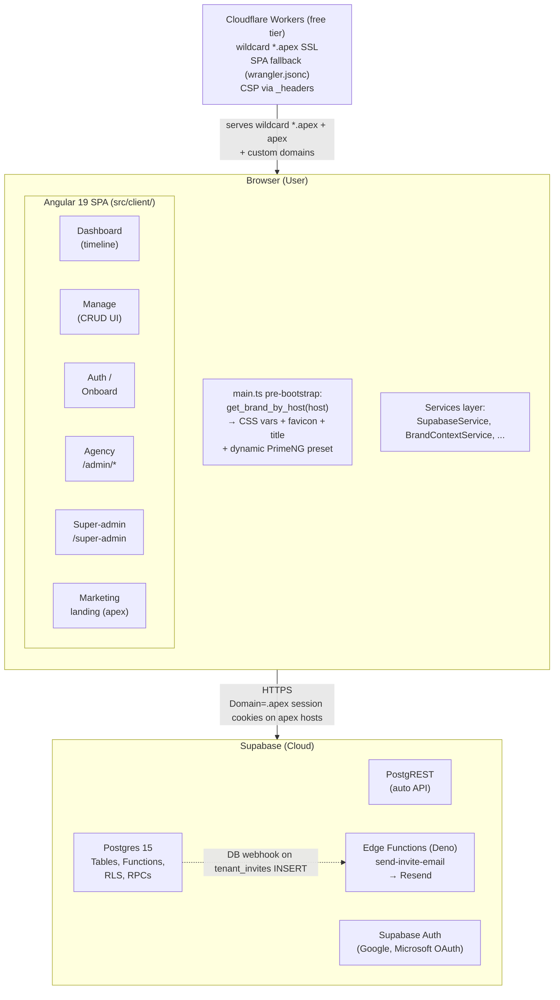
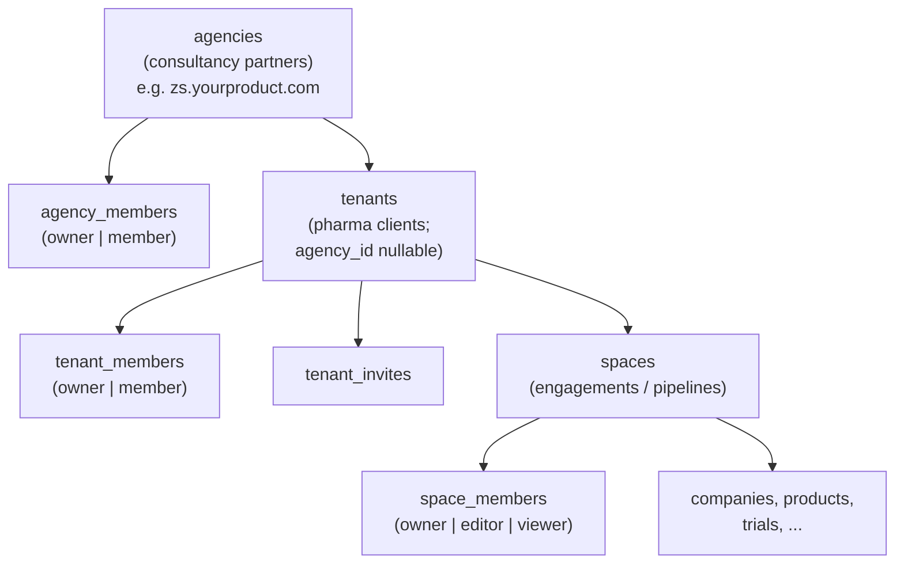

# Architecture Overview

[Back to index](README.md)

---

## System Diagram

## Host-Based Brand Resolution

Every page load runs `get_brand_by_host(p_host text) returns jsonb` (anon-callable, SECURITY DEFINER) before Angular bootstraps. The RPC looks up `p_host` against, in this priority:

1. `tenants.custom_domain` (sales-led upgrade)
2. `agencies.custom_domain`
3. Reserved `admin.<anything>` subdomain → `kind: "super-admin"` (between custom domains and tenant/agency subdomain matches, so a tenant whose `custom_domain` is `admin.somebrand.com` still wins)
4. `tenants.subdomain`
5. `agencies.subdomain`

It returns a small public-safe shape: `kind`, `id`, `app_display_name`, `logo_url`, `favicon_url`, `primary_color`, `auth_providers[]`, `has_self_join`, `suspended`. The full `email_domain_allowlist` is **never** returned to anon (would leak which corporate email domains unlock the workspace) — authenticated tenant owners read it through `get_tenant_access_settings`.

If no match, returns `kind: "default"` with the Clint defaults — the app falls back to the static teal preset and a marketing landing on `/`.

## Three-Tier Hierarchy

Direct customers without an agency (`agency_id IS NULL`) keep working unchanged on the apex. See [Multi-Tenant Model](09-multi-tenant-model.md) for the role-access matrix.

## Cross-Host Trust Boundary

When `environment.apexDomain` is set and the current host is on the apex (e.g. `pfizer.yourproduct.com`), Supabase JS uses cookie-based session storage with `Domain=.<apex>`, `SameSite=Lax`, `Secure`, 30-day max-age. This means a single sign-in carries across `pfizer.yourproduct.com`, `zs.yourproduct.com`, and `auth.yourproduct.com` — no URL token handoff.

**Custom domains (`competitive.pfizer.com`) are a separate trust boundary** — users sign in fresh on each. Acceptable for v1 because custom domains are sales-led one-tenant deployments.

A Content-Security-Policy header from `src/client/public/_headers` (`default-src 'self'`, `frame-ancestors 'none'`, `connect-src 'self' https://*.supabase.co wss://*.supabase.co`) blocks token exfiltration via injected scripts. Cloudflare Workers' static-assets binding honors `_headers` natively.

## Retired-Hostname Holdback

When a tenant or agency is decommissioned, its subdomain or custom domain is inserted into `retired_hostnames` (90-day default hold). `provision_tenant`, `provision_agency`, and `register_custom_domain` reject any hostname whose `released_at > now()`. This prevents re-claim attacks where an attacker re-provisions a freshly-retired hostname to inherit residual trust (cached cookies, bookmarked invite URLs, outbound emails linking to the host).

## Data Flow

1. Browser hits `pfizer.yourproduct.com` -- Cloudflare's edge routes the wildcard `*.<apex>/*` to the `clint` Worker, which serves the static SPA from its assets binding
2. `main.ts` calls `get_brand_by_host('pfizer.yourproduct.com')` (anon RPC) -- gets the brand
3. CSS vars + favicon + title + dynamic PrimeNG preset applied; Angular bootstraps
4. User signs in with Google or Microsoft -- Supabase Auth issues a JWT, stored in a `Domain=.yourproduct.com` cookie
5. All API calls from the Supabase JS client include the JWT automatically
6. Supabase PostgREST validates the JWT and applies Row Level Security
7. RLS policies use `is_tenant_member`, `has_space_access`, `is_agency_member`, `is_platform_admin` helpers (never inline `auth.uid() = ...` against tenancy)
8. Dashboard data is fetched via a single `get_dashboard_data()` RPC that returns nested JSON
9. Angular components consume reactive signals derived from service state

## Key Architectural Decisions

- **No custom backend** -- Supabase provides auth, database, and auto-generated API. The only Edge Function is `send-invite-email` (Deno).
- **Single RPC for dashboard** -- `get_dashboard_data()` returns the entire dashboard payload as nested JSON, eliminating N+1 queries.
- **RLS for security** -- Row Level Security is enforced at the Postgres level. Even if the API layer is bypassed, data isolation holds.
- **Host as identity** -- the user's tenant / agency / role is derived from the host before bootstrap, not from URL params or local state.
- **Brand-as-data** -- per-tenant primary color + logo + favicon flow through CSS vars + a dynamic PrimeNG preset; data colors (slate, red, amber, green, cyan, violet) are never brand-driven.
- **Cookie sessions on apex hosts** -- enables one-sign-in cross-subdomain UX without URL token handoff. Custom domains are intentionally separate trust boundaries.
- **Client-side export** -- PowerPoint generation runs in the browser via `pptxgenjs`. No files are sent to a server.
- **No SSR** -- Pure client-side SPA. Static files served from Cloudflare's global edge via the Worker's assets binding (`wrangler.jsonc`); SPA fallback is `not_found_handling: "single-page-application"`.
- **Signals over Observables** -- Angular signals (`signal()`, `computed()`, `resource()`) are used for reactive state instead of RxJS Observables in services.
