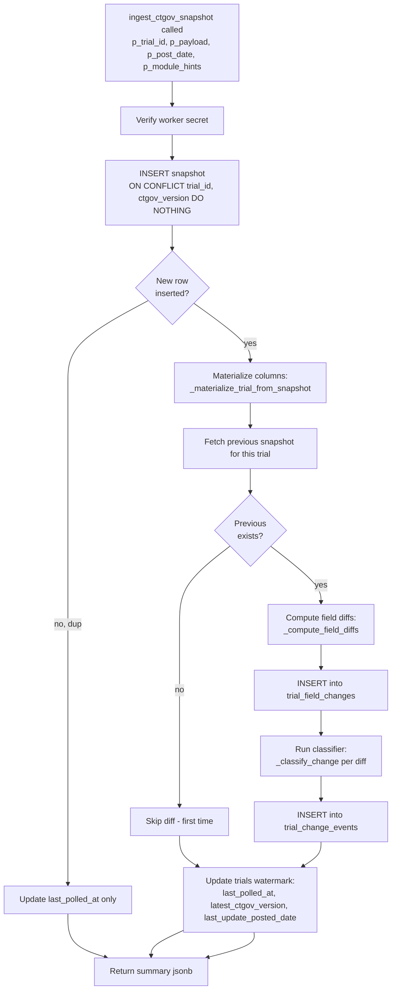

# Backend Architecture

[Back to index](README.md)

---

The backend is managed by Supabase. Non-database server-side code consists of one Supabase Edge Function (`send-invite-email`) and one Cloudflare Worker that handles R2 presigned URL signing for engagement materials.

## Materials Worker

The Worker lives in `src/client/worker/` and is bundled into the same Cloudflare Worker deployment as the Angular SPA (entry point `worker/index.ts`, configured in `src/client/wrangler.jsonc`).

**Routes:**

| Method | Path | Purpose |
|---|---|---|
| `POST` | `/api/materials/sign-upload` | Returns a presigned R2 PUT URL (5-min TTL) for a registered but not-yet-finalized material row |
| `POST` | `/api/materials/sign-download` | Returns a presigned R2 GET URL (60-s TTL) for a finalized material the caller can access |

**Auth and access control:** The Worker extracts the JWT from the `Authorization: Bearer <token>` header and passes it verbatim to the Supabase RPC. All access decisions live in Postgres. `sign-upload` calls `prepare_material_upload(p_material_id)`, which verifies the caller is the uploader and holds an `owner | editor` space role, and that the row is not yet finalized. `sign-download` calls `download_material(p_material_id)`, which verifies the caller has any space access and that the row is finalized. The Worker never makes independent access decisions.

**Rate limiting:** Workers Rate Limiting API. Upload: 30 requests per user per 60 seconds (`UPLOAD_LIMITER`). Download: 120 requests per user per 60 seconds (`DOWNLOAD_LIMITER`). The rate-limit key is the JWT subject; falls back to `CF-Connecting-IP` for anonymous requests. Both limiters are configured as `ratelimits` entries in `wrangler.jsonc` with placeholder namespace IDs that must be replaced before deployment (see [12-deployment.md](12-deployment.md)).

**R2 bucket:** `clint-materials` (set via the `R2_BUCKET` var in `wrangler.jsonc`). Object key scheme: `{space_id}/{material_id}/{file_name}`. The bucket name is stable; the key encodes space isolation.

**TTLs:** PUT presigned URL expires in 5 minutes. GET presigned URL expires in 60 seconds. Both are hardcoded in `worker/r2.ts`.

## RPC -> Table Access Matrix

Auto-generated from `pg_proc` and `information_schema.tables` against the local Supabase database. Run `npm run docs:arch` from `src/client/` to regenerate. The Writes column captures `INSERT/UPDATE/DELETE` against a table; the Reads column captures any other reference. The match is regex-based and may include over-counts when a table name appears in a comment or unused branch — treat as a structural reference, not a precise dataflow trace.

<!-- AUTO-GEN:RPC_TABLE_MATRIX -->
| RPC | Writes | Reads |
|---|---|---|
| `_emit_events_from_marker_change` | trial_change_events | marker_assignments, marker_changes |
| `_log_marker_change` | marker_changes | - |
| `_materialize_trial_from_snapshot` | trials | - |
| `_seed_demo_companies` | companies | - |
| `_seed_demo_events` | events | - |
| `_seed_demo_markers` | marker_assignments, markers | events, materials |
| `_seed_demo_materials` | material_links, materials | - |
| `_seed_demo_moa_roa` | mechanisms_of_action, product_mechanisms_of_action, product_routes_of_administration, routes_of_administration | - |
| `_seed_demo_notifications` | marker_notifications | - |
| `_seed_demo_primary_intelligence` | primary_intelligence, primary_intelligence_links | companies, events, products, trials |
| `_seed_demo_products` | products | - |
| `_seed_demo_therapeutic_areas` | therapeutic_areas | - |
| `_seed_demo_trial_notes` | trial_notes | - |
| `_seed_demo_trials` | trials | - |
| `accept_invite` | tenant_invites, tenant_members | tenants |
| `accept_space_invite` | space_invites, space_members | spaces |
| `add_agency_member` | agency_invites, agency_members | agencies |
| `add_tenant_owner` | tenant_invites, tenant_members | agencies, tenants |
| `backfill_marker_history` | marker_changes | markers |
| `build_intelligence_payload` | - | primary_intelligence, primary_intelligence_links, primary_intelligence_revisions |
| `bulk_update_last_polled` | trials | - |
| `check_subdomain_available` | - | agencies, retired_hostnames, tenants |
| `create_space` | space_members, spaces | tenant_members |
| `delete_agency` | agencies | agency_invites, agency_members, tenants |
| `delete_material` | materials | - |
| `delete_primary_intelligence` | primary_intelligence | - |
| `download_material` | - | materials |
| `enforce_agency_member_guards` | - | agency_members |
| `enforce_custom_domain_unique_across_tables` | - | agencies, tenants |
| `enforce_member_email_domain` | - | agencies, agency_members, tenant_members, tenants |
| `enforce_space_member_guards` | - | space_members |
| `enforce_subdomain_unique_across_tables` | - | agencies, tenants |
| `enforce_tenant_member_guards` | - | agency_members, tenant_members, tenants |
| `finalize_material` | materials | - |
| `get_activity_feed` | - | marker_changes, markers, trial_change_events, trials |
| `get_brand_by_host` | - | agencies, tenants |
| `get_bullseye_by_company` | - | companies, marker_assignments, marker_categories, marker_types, markers, mechanisms_of_action, product_mechanisms_of_action, product_routes_of_administration, products, routes_of_administration, therapeutic_areas, trials |
| `get_bullseye_by_moa` | - | companies, marker_assignments, marker_categories, marker_types, markers, mechanisms_of_action, product_mechanisms_of_action, product_routes_of_administration, products, routes_of_administration, trials |
| `get_bullseye_by_roa` | - | companies, marker_assignments, marker_categories, marker_types, markers, mechanisms_of_action, product_mechanisms_of_action, product_routes_of_administration, products, routes_of_administration, trials |
| `get_bullseye_data` | - | companies, marker_assignments, marker_categories, marker_types, markers, mechanisms_of_action, product_mechanisms_of_action, product_routes_of_administration, products, routes_of_administration, therapeutic_areas, trials |
| `get_catalyst_detail` | - | companies, event_categories, events, marker_assignments, marker_categories, marker_types, markers, products, trials |
| `get_company_detail_with_intelligence` | - | companies |
| `get_dashboard_data` | - | companies, marker_assignments, marker_categories, marker_types, markers, mechanisms_of_action, product_mechanisms_of_action, product_routes_of_administration, products, routes_of_administration, therapeutic_areas, trial_change_events, trial_notes, trials |
| `get_event_detail` | - | companies, event_categories, event_links, event_sources, event_threads, events, products, trials |
| `get_event_thread` | - | event_categories, event_threads, events |
| `get_events_page_data` | - | companies, event_categories, events, marker_assignments, marker_categories, marker_types, markers, products, trials |
| `get_landscape_index` | - | companies, products, therapeutic_areas, trials |
| `get_landscape_index_by_company` | - | companies, products, trials |
| `get_landscape_index_by_moa` | - | companies, mechanisms_of_action, product_mechanisms_of_action, products, trials |
| `get_landscape_index_by_roa` | - | companies, product_routes_of_administration, products, routes_of_administration, trials |
| `get_latest_sync_run` | - | ctgov_sync_runs |
| `get_marker_detail_with_intelligence` | - | markers |
| `get_marker_history` | - | marker_changes |
| `get_notifications` | - | marker_assignments, marker_categories, marker_notifications, marker_types, markers, notification_reads, trials |
| `get_positioning_data` | - | companies, mechanisms_of_action, product_mechanisms_of_action, product_routes_of_administration, products, routes_of_administration, therapeutic_areas, trials |
| `get_product_detail_with_intelligence` | - | products |
| `get_space_landing_stats` | - | companies, markers, products, trials |
| `get_space_tags` | - | events |
| `get_tenant_access_settings` | - | tenants |
| `get_trial_activity` | - | marker_changes, markers, trial_change_events, trials |
| `get_trial_detail_with_intelligence` | - | trials |
| `get_trials_for_polling` | - | trials |
| `get_unread_notification_count` | - | marker_notifications, notification_reads |
| `handle_new_user` | agency_invites, agency_members | - |
| `has_space_access` | - | space_members, spaces, tenants |
| `has_tenant_access` | - | space_members, spaces |
| `ingest_ctgov_snapshot` | trial_change_events, trial_ctgov_snapshots, trial_field_changes, trials | - |
| `invite_to_space` | space_invites, space_members | - |
| `is_agency_member` | - | agency_members |
| `is_agency_member_of_space` | - | spaces, tenants |
| `is_platform_admin` | - | platform_admins |
| `is_tenant_member` | - | agency_members, tenant_members, tenants |
| `list_draft_intelligence_for_space` | - | primary_intelligence, primary_intelligence_revisions |
| `list_materials_for_entity` | - | material_links, materials |
| `list_materials_for_space` | - | material_links, materials |
| `list_primary_intelligence` | - | primary_intelligence, primary_intelligence_links, primary_intelligence_revisions |
| `list_recent_materials_for_space` | - | material_links, materials |
| `lookup_user_by_email` | - | agency_members |
| `palette_empty_state` | - | companies, event_categories, events, marker_assignments, marker_categories, marker_types, markers, palette_pinned, palette_recents, products, trials |
| `palette_set_pinned` | palette_pinned | - |
| `palette_touch_recent` | palette_recents | - |
| `palette_unpin` | palette_pinned | - |
| `prepare_material_upload` | - | materials |
| `provision_agency` | agencies, agency_invites, agency_members | - |
| `provision_tenant` | tenant_members, tenants | agencies |
| `recompute_trial_change_events` | trial_change_events, trial_field_changes | trial_ctgov_snapshots, trials |
| `record_sync_run` | ctgov_sync_runs | - |
| `referenced_in_entity` | - | primary_intelligence, primary_intelligence_links |
| `register_custom_domain` | tenants | agencies, retired_hostnames |
| `register_material` | material_links, materials | spaces, tenants |
| `release_retired_hostname` | retired_hostnames | - |
| `retire_hostname_on_change` | retired_hostnames | agencies, tenants |
| `search_palette` | - | companies, event_categories, events, marker_assignments, marker_categories, marker_types, markers, palette_pinned, palette_recents, products, trials |
| `seed_demo_data` | - | companies, space_members |
| `self_join_tenant` | tenant_members | tenants |
| `trigger_single_trial_sync` | - | trials |
| `update_agency_branding` | agencies | - |
| `update_material` | material_links, materials | - |
| `update_space_field_visibility` | spaces | - |
| `update_tenant_access` | tenants | - |
| `update_tenant_branding` | tenants | - |
| `upsert_primary_intelligence` | primary_intelligence, primary_intelligence_links | - |
| `write_primary_intelligence_revision` | primary_intelligence_revisions | - |
<!-- /AUTO-GEN:RPC_TABLE_MATRIX -->

## Supabase Services Used

| Service | Purpose |
|---|---|
| PostgreSQL 15 | Primary data store for all application data |
| PostgREST | Auto-generated REST API from the Postgres schema; used for CRUD operations |
| Supabase Auth | JWT-based auth with Google + Microsoft (Azure AD) OAuth providers; 1-hour JWT expiry with refresh token rotation |
| Supabase Edge Functions (Deno) | `send-invite-email` only — triggered by a database webhook on `tenant_invites` INSERT; calls Resend |
| Supabase Database Webhooks | Configured in the dashboard (cannot be expressed in `config.toml`); shared-secret `webhook-signature` header gates the function |
| Supabase JS 2.49 | Client library used by Angular to call all backend APIs |

## Database Functions (RPCs)

### get_dashboard_data

```
get_dashboard_data(
  p_space_id uuid,
  p_company_ids uuid[],
  p_product_ids uuid[],
  p_therapeutic_area_ids uuid[],
  p_start_year int,
  p_end_year int,
  p_recruitment_statuses text[],
  p_study_types text[],
  p_phases text[]
)
```

The single most important function. Accepts a space ID and optional filter arrays, and returns a single nested JSON object:

```json
{
  "companies": [
    {
      "id": "...", "name": "...", "color": "...",
      "products": [
        {
          "id": "...", "name": "...",
          "trials": [
            {
              "id": "...", "name": "...",
              "therapeutic_area": { "name": "...", "abbreviation": "..." },
              "recruitment_status": "...", "study_type": "...", "phase": "...",
              "phases": [{ "phase_type": "...", "start_date": "...", "end_date": "..." }],
              "markers": [{ "event_date": "...", "marker_type": { "shape": "...", "color": "..." } }],
              "notes": [{ "content": "..." }]
            }
          ]
        }
      ]
    }
  ]
}
```

This eliminates N+1 query problems. The entire dashboard renders from a single RPC call. Uses `SECURITY INVOKER` so RLS policies apply to the calling user.

### create_tenant

```
create_tenant(p_name text, p_slug text) -> uuid
```

Creates a new tenant record and adds the calling user as the owner in `tenant_members` in a single transaction. Uses `SECURITY DEFINER` to bypass RLS bootstrapping issues.

### create_space

```
create_space(p_tenant_id uuid, p_name text, p_description text) -> uuid
```

Creates a new space and adds the calling user as the space owner. Verifies the caller is a member of the parent tenant before creation. Uses `SECURITY DEFINER`.

### seed_demo_data (restored, gated)

```
seed_demo_data(p_space_id uuid) -> void
```

Populates a space with comprehensive competitor-landscape demo fixture (8 real pharma companies, 20 products across 4 therapeutic areas, 26 trials covering all development phases, 55+ markers, 12 trial notes, 20 events with threads/links/sources, 5 marker notifications, 5 published primary intelligence reads plus 2 drafts, and 3 materials with multi-entity links). Idempotent: returns early if the space already has companies.

Two helpers added on 2026-05-01: `_seed_demo_primary_intelligence` (4 trial-anchored published reads, 1 space-level thematic read, 2 drafts; cross-entity links across products and companies; revisions written by the existing trigger) and `_seed_demo_materials` (briefing PPTX, priority notice PDF, ad hoc DOCX with multi-entity links). Material rows reference plausible storage paths but do not upload files; demo download flows 404 cleanly.

The intelligence helper runs as `security definer` because the `primary_intelligence` write RLS requires `is_agency_member_of_space`, which a typical space-owner test user does not satisfy. The orchestrator's existing space-owner gate is the authoritative permission check, so bypassing the agency-only write RLS for the seed insert path is safe. The materials helper stays `security invoker` because its RLS uses `has_space_access`, which space owners do satisfy.

Dropped briefly on 2026-05-01 (migration 81) when its sole caller, an auto-seed-on-empty-companies heuristic in `landscape-state.service.ts`, was removed. Resurrected the same day in migration 82 with a permission gate that the original version lacked: caller must hold a `space_members` row with `role='owner'` for the target space, OR be a platform admin. Tenant ownership alone is not sufficient (consistent with migration 75's firewall: tenant owners get no implicit space data access).

Invoked only via the explicit URL `/t/:tenantId/s/:spaceId/seed-demo`, which routes to `SeedDemoComponent` and calls `dashboardService.seedDemoData(spaceId)`. There is no auto-trigger; the URL is the entire surface. The component shows a centered spinner while the RPC runs, then redirects to the catalysts page on success or shows the error message with a back link on failure (the most common error being `Insufficient permissions` for non-owners).

### has_space_access

```
has_space_access(p_space_id uuid, p_roles text[]) -> boolean
```

Helper function used in RLS policies. Rewritten in migration 75 to be **explicit-only** -- no implicit cascade from tenant or agency level. Returns true if the calling user is:
- An explicit `space_members` row at one of the given roles, OR
- A platform admin (read-only -- writes still go through write RPCs)

Tenant owners and agency owners get NO implicit space access. To see space data they must be added to that space explicitly. This is the firewall between engagements: a Stout consultant on the Pfizer space does not see Boehringer's data just because Stout owns both tenants.

Short-circuits to `false` for write-role checks when `tenants.suspended_at IS NOT NULL` (suspended-tenant enforcement).

### is_tenant_member

```
is_tenant_member(p_tenant_id uuid, p_roles text[]) -> boolean
```

Helper for tenant-level RLS. Returns true if the calling user has the specified role in the tenant, OR is an agency owner of the parent agency, OR is a platform admin.

### has_tenant_access

```
has_tenant_access(p_tenant_id uuid) -> boolean
```

Route-guard variant of `is_tenant_member`, added 2026-05-01 (migration 84). Returns true if any of:

1. `is_tenant_member(p_tenant_id)` is true (covers explicit `tenant_members` row, agency owner of parent, platform admin), OR
2. The caller holds a `space_members` row for any space whose `tenant_id = p_tenant_id` (covers pure space-only members invited directly via `invite_to_space` without ever joining the tenant proper).

Used by `tenantGuard` and the tenant branch of `marketingLandingGuard` for route activation only. Do not use in RLS policies: broadening `is_tenant_member` to include space-only members would let a Reader enumerate tenant owners via `tenant_members` SELECT, an info leak. Keep RLS strict on `is_tenant_member`; route activation looser via `has_tenant_access`.

The one exception is the `tenants` SELECT policy itself. Since 2026-05-01 (migration `20260501050000_tenants_select_includes_space_only_members`) it includes the same fourth disjunct ("user has a `space_members` row for any space under this tenant") as inlined SQL — *not* a call to `has_tenant_access`. The reason is that the tenants row exposes only brand identity (name, subdomain, custom_domain, app_display_name, primary/brand colors, logo_url, agency_id, suspended_at), all of which is already visible to a space-only member through the brand bootstrap when they enter via the tenant subdomain. Without this, the topbar tenant dropdown rendered empty for space-only members. The disjunct is inlined rather than calling `has_tenant_access` because the function comment explicitly forbids RLS use; inlining keeps any future broadening of `has_tenant_access` from accidentally widening RLS on `tenant_members` or other tenant-internal tables.

### is_agency_member

```
is_agency_member(p_agency_id uuid, p_roles text[] default null) -> boolean
```

Helper for agency-level RLS. Returns true if the calling user is in `agency_members` for `p_agency_id` with one of the given roles (or any role when `p_roles` is null).

### is_platform_admin

```
is_platform_admin() -> boolean
```

Returns true if `auth.uid()` is in `platform_admins`. Used in RLS disjuncts and as a permission gate in super-admin RPCs.

## Whitelabel RPCs

All whitelabel RPCs follow the project's SECURITY DEFINER convention modeled on `accept_invite()` (migration 39): `set search_path = ''`, fully-qualified object references, `if auth.uid() is null then raise exception ... '28000'` first-line auth check, helper-function authorization (no inline `auth.uid() = ...` against tenancy), specific error codes (`28000` auth, `42501` permission, `P0001` state, `23505` uniqueness), `revoke ... from public, anon` + `grant ... to authenticated` (or `to anon` only for `get_brand_by_host` and `check_subdomain_available`).

### get_brand_by_host

```
get_brand_by_host(p_host text) -> jsonb
```

**Anon-callable.** Looks up `p_host` against `tenants.custom_domain`, `agencies.custom_domain`, the reserved `admin.<anything>` subdomain (returns `kind: "super-admin"` — requires the host to have at least two segments so bare `admin` doesn't match), `tenants.subdomain`, `agencies.subdomain` in that order (custom domains take priority over the magic admin subdomain). Returns a public-safe shape: `kind`, `id`, `app_display_name`, `logo_url`, `favicon_url`, `primary_color`, `auth_providers[]`, `has_self_join` (boolean — never the actual allowlist), `suspended`, `agency` (`{name, logo_url} | null`, populated only for tenant brands whose `tenants.agency_id` is set). Returns `kind: "default"` with Clint defaults if no match.

The `agency` field exists so the tenant-host login footer and the in-app topbar can show "Competitive intelligence by {agency}" attribution — the value prop is that the consultancy is the analyst behind the workspace, even though the chrome inside the app stays tenant-branded. Only `name` + `logo_url` are surfaced (no contact_email, no member counts); both are already public on the agency's own subdomain, so no new disclosure.

### check_subdomain_available

```
check_subdomain_available(p_subdomain text) -> boolean
```

Authenticated. Checks `tenants.subdomain`, `agencies.subdomain`, the reserved-subdomain list, and the active-hold portion of `retired_hostnames`. Used by the agency portal's debounced live-availability indicator.

### provision_agency

```
provision_agency(p_name text, p_slug text, p_subdomain text, p_owner_email text, p_contact_email text default null) -> jsonb
```

**Platform admins only.** Creates an `agencies` row. If `p_owner_email` matches an existing `auth.users` row (case-insensitive), the owner is added directly to `agency_members`. Otherwise an `agency_invites` row is held with `role='owner'`; the existing `handle_new_user` trigger consumes it on the owner's first sign-in. `contact_email` defaults to `p_owner_email` when not supplied (the column is `NOT NULL` and an arbitrary placeholder leaks into the branding page). Validates email shape, subdomain regex (`^[a-z][a-z0-9-]{1,62}$`), reserved-list, cross-table uniqueness, retired-hostname holdback. Returns `owner_invited: boolean` so the caller can distinguish the two paths. Callable from `psql` during phase-6 bootstrap and from the super-admin portal.

### delete_agency

```
delete_agency(p_agency_id uuid) -> jsonb
```

**Platform admins only.** Deletes an agency; cascades to `agency_members` and `agency_invites` via existing FK `on delete cascade`. Refuses with `foreign_key_violation` if any `tenants` rows still reference the agency (`tenants.agency_id` is `on delete set null` by design — the RPC blocks rather than silently orphan customer data). **Does not skip the `retired_hostnames` holdback** — the AFTER DELETE trigger on `agencies` runs in the same transaction and inserts the subdomain into the holdback list. To re-use the subdomain immediately, follow up with `release_retired_hostname()`. Returns `members_removed` and `invites_removed` counts.

### release_retired_hostname

```
release_retired_hostname(p_hostname text) -> jsonb
```

**Platform admins only.** Deletes the named hostname from `retired_hostnames` so it can be re-claimed immediately. Override path for super-admin cleanup; raises `P0002` if the hostname isn't in the holdback list (so typos don't silently no-op). Real customer decommissions should leave the 90-day holdback in place to prevent takeover via stale session cookies and bookmarked links.

### provision_tenant

```
provision_tenant(p_agency_id uuid, p_name text, p_subdomain text, p_brand jsonb) -> jsonb
```

Caller must be agency owner of `p_agency_id` or platform admin. Validates `agencies.max_tenants` quota, subdomain regex/reserved/uniqueness/retirement, applies branding fields from `p_brand`. **Auto-adds the calling user as tenant owner** so the agency operator who provisions a tenant can immediately see and manage it. **Does not** create any default space — under the agency-managed model, each space is a real engagement (e.g. "Survodutide Q2 2026 Pipeline") created explicitly via `create_space` by the analyst running the engagement. The spaces-list page renders an empty state with a Create-space CTA when a tenant has zero spaces. (The legacy auto-create of a "Workspace" space was removed on 2026-04-30; existing tenants with auto-created Workspace rows are unaffected.)

### canonicalize_email

```
canonicalize_email(p_email text) -> text
```

Returns the canonical form of an email for lookup and dedup. Lowercases. For `gmail.com` and `googlemail.com`, strips dots from the local part and truncates at the first `+`. Other domains: lowercase only (no safe canonicalization without knowing the provider).

Used at every email-storing and email-looking-up site so user-typed dotted/+tag variants and the canonical form Google returns on OAuth always match. Sites that route through it (since 2026-05-01, migration 20260501060000): `add_tenant_owner`, `invite_to_space`, `add_agency_member`, `lookup_user_by_email`, `provision_agency`, `accept_invite`, `accept_space_invite`, the `handle_new_user` trigger.

Backfill is unnecessary because the function is applied to *both sides* of every comparison: existing invite rows in the user-typed form still match incoming canonicalized lookups (and vice versa). New rows are stored in the canonical form going forward.

Marked `immutable` so Postgres can use it in indexed expressions if a future migration wants to index `canonicalize_email(email)` for performance.

### add_tenant_owner

```
add_tenant_owner(p_tenant_id uuid, p_email text) -> jsonb
```

Adds an existing user as tenant owner, or holds an invite when the email has no `auth.users` row. Caller must be tenant owner, agency owner of the parent agency, or platform admin. When `agencies.email_domain` is set, `p_email`'s domain must match (platform admin bypass). Returns `{ owner_invited: boolean, ... }` so the UI can distinguish "added directly" from "code-based invite held". The invite is consumed via `accept_invite(p_code)` after the recipient signs in. **Idempotent (since 2026-04-30):** if a valid (unaccepted, unexpired) `tenant_invites` row already exists for the same `(tenant_id, email)`, the existing `invite_code` is returned, repeated clicks do not mint new credentials.

### add_agency_member

```
add_agency_member(p_agency_id uuid, p_email text, p_role text) -> jsonb
```

Symmetric with `add_tenant_owner`. Adds an existing user as agency member, or holds an invite when the email has no `auth.users` row. Caller must be an agency owner of `p_agency_id` (or platform admin). When `agencies.email_domain` is set, `p_email`'s domain must match (platform admin bypass). The existing-user branch inserts directly into `agency_members` with `on conflict do nothing`; the unknown-email branch inserts an `agency_invites` row that the `handle_new_user` trigger (migration 69) auto-promotes on first sign-in. Returns `{ member_invited: boolean, ... }`. Idempotent: returns the existing held invite if one already exists for `(agency_id, lower(email), role)`. Note that `agency_invites` does not carry a separate `invite_code` column the way `tenant_invites` and `space_invites` do, because the auto-claim mechanism keys off the user's first sign-in by email rather than a code the inviter shares; the return shape includes `invite_id` only.

The pre-existing `lookup_user_by_email` RPC and the `addAgencyMember(userId, role)` direct-insert service method are kept for other surfaces (notably the agency-tenant-new first-user-email field), but the agency members page itself now goes through `add_agency_member` exclusively.

### invite_to_space

```
invite_to_space(p_space_id uuid, p_email text, p_role text) -> jsonb
```

Adds or invites a user to a space at `owner | editor | viewer` (rendered Owner / Contributor / Reader in the UI). Caller must be a space owner (or platform admin). Existing users get an immediate `space_members` row (or role-update on conflict); unknown emails get a `space_invites` row consumed via `accept_space_invite(p_code)`. **No domain restriction** -- spaces include both agency colleagues and pharma client emails. **Idempotent (since 2026-04-30):** if a valid (unaccepted, unexpired) `space_invites` row already exists for the same `(space_id, email, role)`, the existing `invite_code` is returned.

### accept_space_invite

```
accept_space_invite(p_code text) -> jsonb
```

Atomically validates and consumes a space invite. Validates the code, expiry, unused state, and that the invite email matches the caller's authenticated email. Inserts the `space_members` row and marks the invite consumed. Returns `{ id, name, tenant_id }` so the UI can route to `/t/:tenantId/s/:spaceId`. SECURITY DEFINER so callers don't need direct read access to `space_invites`.

### update_tenant_branding

```
update_tenant_branding(p_tenant_id uuid, p_branding jsonb) -> jsonb
```

Caller must be tenant owner, agency owner of the parent agency, or platform admin. Whitelist of fields: `app_display_name`, `logo_url`, `favicon_url`, `primary_color`, `email_from_name`. Validates color hex shape and URL shape. Other fields (subdomain, custom_domain, agency_id, suspension, allowlist) are managed by separate RPCs and rejected if present.

### update_tenant_access

```
update_tenant_access(p_tenant_id uuid, p_settings jsonb) -> jsonb
```

Caller must be tenant owner, agency owner of the parent agency, or platform admin. Accepts `email_domain_allowlist` and `email_self_join_enabled`. Validates each domain against `^[a-z0-9.-]+\.[a-z]{2,}$`.

### get_tenant_access_settings

```
get_tenant_access_settings(p_tenant_id uuid) -> jsonb
```

Authenticated read of the allowlist for tenant settings UI. Caller must be tenant owner, agency owner, or platform admin. Returns `email_domain_allowlist` + `email_self_join_enabled`. Separate from `get_brand_by_host` because the allowlist must never reach anon.

### update_agency_branding

```
update_agency_branding(p_agency_id uuid, p_branding jsonb) -> jsonb
```

Caller must be agency owner or platform admin. Whitelist of fields: `app_display_name`, `logo_url`, `favicon_url`, `primary_color`, `contact_email`. Subdomain / custom_domain / plan_tier / max_tenants are not editable here.

### register_custom_domain

```
register_custom_domain(p_tenant_id uuid, p_custom_domain text) -> jsonb
```

**Platform admins only.** Sets `tenants.custom_domain`. Validates uniqueness across `tenants.custom_domain` and `agencies.custom_domain`, plus retirement holdback. Manual ops checklist required first (Cloudflare Worker custom-domain registration on the customer's hostname + the customer's CNAME pointing at the Worker).

### self_join_tenant

```
self_join_tenant(p_subdomain text) -> jsonb
```

When the calling user's email domain is in `email_domain_allowlist` for that tenant and `email_self_join_enabled = true`, creates a `tenant_members` row at `member` role. Atomic, idempotent. **Returns the same generic error message for all failure modes** ("self-join not available for this workspace") — distinguishing between "tenant doesn't exist," "self-join is off," "your email domain isn't allowed," and "the tenant is suspended" would let an attacker enumerate which subdomains exist and which corporate emails unlock them. Internally logs the actual reason for support diagnostics via `raise notice`.

### lookup_user_by_email

```
lookup_user_by_email(p_email text) -> jsonb
```

Caller must be a platform admin OR own at least one agency. Returns `{ found: true, user_id, display_name }` if the email matches an `auth.users` row, else `{ found: false }`. Used by the agency portal "Add member" dialog and the super-admin "Provision agency" dialog. Never raises on missing email — returns `found: false` so the UX can show a clean "not found" message.

### is_agency_member, is_platform_admin

See "Helpers" above.

## Views

### space_members_view

Joins `space_members` with `auth.users` metadata to expose display name (from `raw_user_meta_data->full_name` or email) and email alongside membership records. Owner-defined view (`security_invoker = true` was dropped in migration 40 to allow reading `auth.users`); access is gated inside the view body via `has_space_access()`.

### tenant_members_view

Same pattern for tenant membership. Also exposes `is_agency_backed` (boolean): true when the row's user is also an owner of the tenant's parent agency. The tenant-settings UI hides the row-actions menu for these rows and renders a "via agency" tag, since deleting the explicit `tenant_members` row would be cosmetic — `is_tenant_member()` retains them via the agency-owner disjunct. The `enforce_tenant_member_guards` trigger blocks the delete at the database layer regardless of UI state; only platform admins can override.

### agency_members_view

Joins `agency_members` with `auth.users` for the agency portal members table. Mirrors `tenant_members_view` shape but uses `SECURITY INVOKER` — RLS on `agency_members` is the access control. `grant select on public.agency_members_view to authenticated`.

## Edge Functions

### send-invite-email (`supabase/functions/send-invite-email/index.ts`)

Deno-runtime handler triggered by a Supabase database webhook on `INSERT` into `public.tenant_invites`. Delivers branded HTML + plain-text invite emails via Resend.

**Flow:**
1. Reject non-POST with 405
2. Compare the `webhook-signature` header to `EMAIL_WEBHOOK_SECRET` (length-then-equality); missing or wrong → 401 (no detail leak)
3. Parse Supabase webhook payload `{ type: "INSERT", table: "tenant_invites", record: { ... } }`
4. Service-role select on `public.tenants` for the tenant's brand columns (`app_display_name`, `logo_url`, `email_from_name`, `primary_color`, `subdomain`, `custom_domain`)
5. Build accept URL, preferring custom domain over subdomain over apex; always with `?code=<invite_code>`
6. Compose HTML + plain-text bodies (inline styles, brand color for the headline + button)
7. POST to `https://api.resend.com/emails` with `from: "Pfizer Trial Intel" <noreply@yourproduct.com>`, `to`, `subject`, `html`, `text`
8. On success → 200 `{ sent: true, id: <resend-id> }`. Logs minimal trace; never logs the recipient address or invite code (PII minimization)

**Required secrets** (`supabase secrets set`): `RESEND_API_KEY`, `EMAIL_WEBHOOK_SECRET`, `EMAIL_FROM` (defaults to `noreply@yourproduct.com`), `EMAIL_BASE_URL` (defaults to `https://yourproduct.com`). `SUPABASE_URL` and `SUPABASE_SERVICE_ROLE_KEY` are injected by the Supabase runtime.

**Idempotency:** the function accepts duplicate sends on webhook retries; sending an invite twice is acceptable for v1.

**Local emulator:** the Supabase local emulator does not support the dashboard's database-webhook configuration 1:1, so local invite flows continue to surface the invite code in the UI. The email path is exercised in the remote project. See `docs/runbook/12-deployment.md` for the production setup checklist.

## Trial change feed RPCs

The trial change feed has four pipeline pieces: a Cloudflare Worker pulls daily from CT.gov on cron, calls `ingest_ctgov_snapshot` per changed trial which writes to `trial_ctgov_snapshots`, computes diffs into `trial_field_changes`, and classifies them into the typed `trial_change_events` stream the UI reads. Marker edits flow into the same `trial_change_events` table via a BEFORE trigger on `markers` that writes `marker_changes` audit rows.



**Worker-side RPCs** (gated by `_verify_ctgov_worker_secret`; the Worker calls Supabase as anon and presents the secret as an argument):

- `get_trials_for_polling(p_secret, p_batch_size)`: returns the next batch of `(trial_id, nct_id, last_update_posted_date)` rows ordered by stalest watermark.
- `ingest_ctgov_snapshot(p_secret, p_trial_id, p_payload, p_post_date, p_module_hints)`: single-trial insert + diff + classify pipeline above. Single transaction; rolls back on any failure.
- `record_sync_run(p_secret, p_started_at, p_finished_at, p_trials_polled, p_trials_changed, p_status, p_error)`: observability row per cron invocation.
- `bulk_update_last_polled(p_secret, p_trial_ids)`: bumps `trials.last_polled_at` for trials the Worker checked but found unchanged.

**User-facing RPCs** (gated by `has_space_access`; called from the Angular client):

- `get_activity_feed(p_space_id, p_filters, p_limit, p_offset)`: backs the activity page; reads `trial_change_events` joined to trial / marker context.
- `get_trial_activity(p_trial_id, p_limit, p_offset)`: backs the trial-detail Activity section.
- `get_marker_history(p_marker_id)`: backs the marker history panel; reads `marker_changes` joined to `auth.users` for the author email. SECURITY DEFINER (the auth.users join requires elevated perms); access gated on `has_space_access(space_id)` so non-members get errcode 42501 and never see the marker.
- `trigger_single_trial_sync(p_trial_id)`: POSTs to the Worker's `/admin/ctgov-backfill` endpoint scoped to one NCT; the "Sync from CT.gov" button on trial-detail.
- `update_space_field_visibility(p_space_id, p_visibility)`: writes the per-space field-visibility map that drives which CT.gov columns render on trial-detail.
- `recompute_trial_change_events(p_trial_id)`: admin-only; replays the classifier over existing `trial_field_changes` for a trial. Used after classifier rule changes.
- `get_latest_sync_run()`: reads the most recent `ctgov_sync_runs` row for the engagement-landing freshness indicator.

## Documentation Drift

Auto-generated. Lists public functions in `pg_proc` and edge functions in `supabase/functions/` whose name does not appear anywhere in this file. Add a section under Database Functions / Whitelabel RPCs / Edge Functions for each flagged item. Helpers (`is_*`, `has_*`, `enforce_*`) and demo seed helpers (`_seed_demo_*`) are tracked elsewhere and excluded here.

<!-- AUTO-GEN:DRIFT -->
**RPCs in `pg_proc` not documented:**
- `_emit_events_from_marker_change`
- `_log_marker_change`
- `_map_phase_array`
- `_path_in_hinted_modules`
- `backfill_marker_history`
- `build_intelligence_payload`
- `delete_material`
- `delete_primary_intelligence`
- `finalize_material`
- `get_bullseye_by_company`
- `get_bullseye_by_moa`
- `get_bullseye_by_roa`
- `get_bullseye_data`
- `get_catalyst_detail`
- `get_company_detail_with_intelligence`
- `get_event_detail`
- `get_event_thread`
- `get_events_page_data`
- `get_landscape_index`
- `get_landscape_index_by_company`
- `get_landscape_index_by_moa`
- `get_landscape_index_by_roa`
- `get_marker_detail_with_intelligence`
- `get_notifications`
- `get_positioning_data`
- `get_product_detail_with_intelligence`
- `get_space_intelligence`
- `get_space_landing_stats`
- `get_space_tags`
- `get_trial_detail_with_intelligence`
- `get_unread_notification_count`
- `list_draft_intelligence_for_space`
- `list_materials_for_entity`
- `list_materials_for_space`
- `list_primary_intelligence`
- `list_recent_materials_for_space`
- `member_guard_mark_cascade_end`
- `member_guard_mark_cascade_start`
- `palette_empty_state`
- `palette_set_pinned`
- `palette_touch_recent`
- `palette_unpin`
- `referenced_in_entity`
- `register_material`
- `search_palette`
- `update_material`
- `upsert_primary_intelligence`
- `validate_material_links_payload`
- `write_primary_intelligence_revision`

**Edge functions in `supabase/functions/` not documented:**
_All edge functions documented._
<!-- /AUTO-GEN:DRIFT -->
