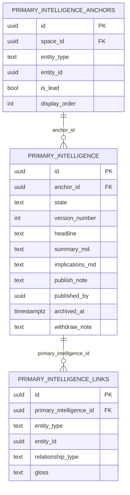

# Database Schema

[Back to index](README.md)

---

All schema changes are in `supabase/migrations/` as timestamped SQL files.

## Trial change feed tables

The trial change feed introduces four new tables that together replace the wide CT.gov column set on `trials`:

- `trial_ctgov_snapshots`: append-only JSONB store of CT.gov payloads, keyed by `(trial_id, ctgov_version)`. Source of truth for everything CT.gov-derived; consulted only for history queries (per-trial change log, "view this field as of date X", column-chooser rendering).
- `trial_field_changes`: raw diff log between consecutive snapshots; one row per changed field path. Cheap to write, easy to replay through the classifier.
- `trial_change_events`: the typed event stream the UI reads. CT.gov-derived change rows carry `derived_from_change_id`; analyst event changes are linked via `event_id` (FK to `events`). Surface code does not branch on origin.
- `ctgov_sync_runs`: one observability row per Cloudflare cron invocation: started/finished timestamps, trials polled, trials changed, status (`success | partial | failed`), and any error message.

`trials` retained 3 materialized CT.gov columns (`phase`, `recruitment_status`, `study_type`) for filter performance, plus the watermark trio (`last_update_posted_date`, `latest_ctgov_version`, `last_polled_at`) the Worker uses to skip unchanged records. 36 orphaned columns were dropped in Phase 7 of the change-feed rollout (eligibility, design, regulatory, sponsor; all readable from the latest snapshot's JSONB on demand).

## Schema Diagram

Auto-generated from `information_schema.tables` and the `FOREIGN KEY` constraints on the local Supabase database. Run `npm run docs:arch` from `src/client/` to regenerate. Tables without any FK relationship render as empty boxes so they remain visible.

```mermaid
erDiagram
  AGENCIES ||--o{ AGENCY_INVITES : "agency_id"
  AGENCIES ||--o{ AGENCY_MEMBERS : "agency_id"
  SOURCE_DOCUMENTS ||--o{ AI_CALLS : "source_doc_id"
  SPACES ||--o{ AI_CALLS : "space_id"
  TENANTS ||--o{ AI_CALLS : "tenant_id"
  TENANTS ||--o{ AI_CONFIG : "tenant_id"
  AI_MODEL_PRICING ||--o{ AI_MODEL_PRICING : "superseded_by"
  ASSETS ||--o{ ASSET_INDICATIONS : "asset_id"
  INDICATIONS ||--o{ ASSET_INDICATIONS : "indication_id"
  SPACES ||--o{ ASSET_INDICATIONS : "space_id"
  ASSETS ||--o{ ASSET_MECHANISMS_OF_ACTION : "asset_id"
  MECHANISMS_OF_ACTION ||--o{ ASSET_MECHANISMS_OF_ACTION : "moa_id"
  ASSETS ||--o{ ASSET_ROUTES_OF_ADMINISTRATION : "asset_id"
  ROUTES_OF_ADMINISTRATION ||--o{ ASSET_ROUTES_OF_ADMINISTRATION : "roa_id"
  COMPANIES ||--o{ ASSETS : "company_id"
  SOURCE_DOCUMENTS ||--o{ ASSETS : "source_doc_id"
  SPACES ||--o{ ASSETS : "space_id"
  TRIAL_CHANGE_EVENTS ||--o{ CHANGE_EVENT_ANNOTATIONS : "change_event_id"
  SPACES ||--o{ CHANGE_EVENT_ANNOTATIONS : "space_id"
  SOURCE_DOCUMENTS ||--o{ COMPANIES : "source_doc_id"
  SPACES ||--o{ COMPANIES : "space_id"
  CONDITIONS ||--o{ CONDITION_INDICATION_MAP : "condition_id"
  INDICATIONS ||--o{ CONDITION_INDICATION_MAP : "indication_id"
  SPACES ||--o{ CONDITIONS : "space_id"
  SPACES ||--o{ EVENT_CHANGES : "space_id"
  EVENTS ||--o{ EVENT_SOURCES : "event_id"
  SPACES ||--o{ EVENT_TYPE_CATEGORIES : "space_id"
  EVENT_TYPE_CATEGORIES ||--o{ EVENT_TYPES : "category_id"
  SPACES ||--o{ EVENT_TYPES : "space_id"
  EVENT_TYPES ||--o{ EVENTS : "event_type_id"
  SOURCE_DOCUMENTS ||--o{ EVENTS : "source_doc_id"
  SPACES ||--o{ EVENTS : "space_id"
  INDICATIONS ||--o{ INDICATIONS : "parent_id"
  SPACES ||--o{ INDICATIONS : "space_id"
  MATERIALS ||--o{ MATERIAL_LINKS : "material_id"
  SPACES ||--o{ MATERIALS : "space_id"
  SPACES ||--o{ MECHANISMS_OF_ACTION : "space_id"
  SPACES ||--o{ PALETTE_PINNED : "space_id"
  SPACES ||--o{ PALETTE_RECENTS : "space_id"
  PRIMARY_INTELLIGENCE_ANCHORS ||--o{ PRIMARY_INTELLIGENCE : "anchor_id"
  SPACES ||--o{ PRIMARY_INTELLIGENCE : "space_id"
  SPACES ||--o{ PRIMARY_INTELLIGENCE_ANCHORS : "space_id"
  PRIMARY_INTELLIGENCE ||--o{ PRIMARY_INTELLIGENCE_LINKS : "primary_intelligence_id"
  SPACES ||--o{ ROUTES_OF_ADMINISTRATION : "space_id"
  SPACES ||--o{ SOURCE_DOCUMENTS : "space_id"
  SPACES ||--o{ SPACE_INVITES : "space_id"
  SPACES ||--o{ SPACE_MEMBERS : "space_id"
  TENANTS ||--o{ SPACES : "tenant_id"
  TENANTS ||--o{ TENANT_INVITES : "tenant_id"
  TENANTS ||--o{ TENANT_MEMBERS : "tenant_id"
  AGENCIES ||--o{ TENANTS : "agency_id"
  ASSETS ||--o{ TRIAL_ASSETS : "asset_id"
  TRIALS ||--o{ TRIAL_ASSETS : "trial_id"
  TRIAL_FIELD_CHANGES ||--o{ TRIAL_CHANGE_EVENTS : "derived_from_change_id"
  EVENTS ||--o{ TRIAL_CHANGE_EVENTS : "event_id"
  SPACES ||--o{ TRIAL_CHANGE_EVENTS : "space_id"
  TRIALS ||--o{ TRIAL_CHANGE_EVENTS : "trial_id"
  CONDITIONS ||--o{ TRIAL_CONDITIONS : "condition_id"
  TRIALS ||--o{ TRIAL_CONDITIONS : "trial_id"
  SPACES ||--o{ TRIAL_CTGOV_SNAPSHOTS : "space_id"
  TRIALS ||--o{ TRIAL_CTGOV_SNAPSHOTS : "trial_id"
  TRIAL_CTGOV_SNAPSHOTS ||--o{ TRIAL_FIELD_CHANGES : "source_snapshot_id"
  SPACES ||--o{ TRIAL_FIELD_CHANGES : "space_id"
  TRIALS ||--o{ TRIAL_FIELD_CHANGES : "trial_id"
  SPACES ||--o{ TRIAL_NOTES : "space_id"
  TRIALS ||--o{ TRIAL_NOTES : "trial_id"
  ASSETS ||--o{ TRIALS : "asset_id"
  SOURCE_DOCUMENTS ||--o{ TRIALS : "source_doc_id"
  SPACES ||--o{ TRIALS : "space_id"
  AUDIT_EVENTS { }
  CTGOV_SYNC_RUNS { }
  PLATFORM_ADMINS { }
  R2_DRAIN_CONTROL { }
  R2_PENDING_DELETES { }
  RETIRED_HOSTNAMES { }
  USER_REDACTIONS { }
```

<!-- AUTO-GEN:ER -->

<!-- /AUTO-GEN:ER -->

### primary_intelligence_anchors and the many-briefs model

An entity (engagement, company, asset, or trial) can own many intelligence briefs. Each brief is a row in `primary_intelligence_anchors`, which records the polymorphic entity binding (`entity_type text`, `entity_id uuid`, no FK enforcement) plus two ordering fields:

- `is_lead bool` -- the one brief surfaced on entity detail pages and the landscape strip. Enforced as a partial unique index (`is_lead = true` per `(space_id, entity_type, entity_id)`); the `set_intelligence_lead` RPC clears all sibling `is_lead` flags atomically.
- `display_order int` -- manual sort position among siblings. Set by `reorder_intelligence`, which rejects partial arrays to prevent accidental omission.



Marker rows are valid link targets in `primary_intelligence_links` but are not anchor owners; the marker description carries the event-level write-up.

### primary_intelligence version columns

The `primary_intelligence` table carries a per-anchor `version_number int` plus four lifecycle columns that drive the linear history timeline:

- `version_number int` -- per-anchor sequence assigned by the `assign_primary_intelligence_version` BEFORE trigger on entry into `state='published'`. Null for drafts. Preserved through archive and withdraw transitions, so each version row keeps the same number for its lifetime.
- `publish_note text` -- optional change note typed at publish time. Captured directly on the row by `upsert_primary_intelligence` when the new state is `published`. Null for drafts.
- `published_by uuid` -- who pressed publish. Stamped on the same call as `publish_note`. Null for drafts.
- `archived_at timestamptz` -- when this version was superseded. Stamped on the prior published row by `upsert_primary_intelligence` in the same transaction as the new publish. Null until then.
- `withdraw_note text` -- change note captured by `withdraw_primary_intelligence` when a published row is explicitly retracted without replacement. Null otherwise.

The CHECK constraint allows `state in ('draft','published','archived','withdrawn')`. Archived means superseded by a later publish; withdrawn means explicitly retracted without replacement. A second BEFORE UPDATE trigger (`guard_primary_intelligence_state`) rejects illegal transitions out of the terminal states and back from `published -> draft`.

The unique partial index `primary_intelligence_one_published` (one published row per anchor) continues to be the concurrency control around republish.

## Migration History

| # | File | Purpose |
|---|---|---|
| 1 | `20260315120000_create_core_tables.sql` | Core domain tables: companies, products (now assets), therapeutic_areas (now indications) |
| 2 | `20260315120100_create_trial_tables.sql` | Trial tables: trials, trial_phases, marker_types, trial_markers, trial_notes |
| 3 | `20260315120200_create_rls_policies.sql` | Initial user_id-based RLS policies |
| 4 | `20260315120300_create_dashboard_function.sql` | `get_dashboard_data()` RPC with JSON aggregation |
| 5 | `20260315163507_seed_system_marker_types.sql` | 10 system marker types with fixed UUIDs |
| 6 | `20260315163538_seed_demo_data_function.sql` | `seed_demo_data()` function for testing |
| 7 | `20260315170000_create_tenant_space_tables.sql` | Multi-tenant tables + helper functions |
| 8 | `20260315170100_add_space_id_to_data_tables.sql` | Migrates from user_id to space_id model (destructive) |
| 9 | `20260315170200_update_seed_demo_data_for_spaces.sql` | Updates seed function for space model |
| 10 | `20260315181748_fix_tenant_creation_rls.sql` | Fixes RLS bootstrapping for tenant/space creation |
| 11 | `20260315191402_create_tenant_function.sql` | `create_tenant()` and `create_space()` RPCs |
| 12 | `20260315192926_seed_pharma_demo_data.sql` | Realistic pharma demo data (BI, Azurity, multi-tenant) |
| 13 | `20260315194716_add_member_views.sql` | `tenant_members_view` and `space_members_view` |
| 14 | `20260315200000_add_ctgov_dimensions.sql` | 35+ CT.gov metadata columns on trials |
| 15 | `20260315200100_update_dashboard_function_filters.sql` | Filter params for CT.gov fields in RPC |
| 16 | `20260315200200_enrich_demo_trials.sql` | CT.gov metadata for demo trials |
| 17-28 | `20260411*`--`20260412*` | Landscape RPCs, MOA/ROA, positioning, marker system redesign |
| 29 | `20260413120000_events_system.sql` | Events tables: event_categories, event_threads, events, event_sources, event_links |
| 30 | `20260413120100_events_rpc_functions.sql` | Events RPCs: get_events_page_data, get_event_detail, get_event_thread, get_space_tags |
| 31 | `20260413120200_seed_events_demo_data.sql` | Updates seed_demo_data() with 20 events, threads, links, sources |
| 32 | `20260414023709_marker_visual_redesign.sql` | Adds inner_mark to marker_types, consolidates 21 types to 12 active, adds no_longer_expected to markers |
| 33 | `20260414120000_key_catalysts_rpc.sql` | Key Catalysts RPCs: get_key_catalysts (forward-looking marker feed), get_catalyst_detail (enriched single-marker view with trial context + related events) |
| 34 | `20260414210000_add_tenant_logo_url.sql` | Adds logo_url column to tenants, creates tenant-logos storage bucket with owner/member RLS policies |
| 35 | `20260415120000_seed_pharma_tenants.sql` | Updates `handle_new_user` trigger to create pharma-themed tenants (Boehringer Ingelheim, Azurity Pharmaceuticals) with pipeline-named spaces; back-fills existing users |
| 36 | `20260415180000_catalyst_detail_add_projection_logo.sql` | Updates `get_catalyst_detail` RPC to return `projection`, `no_longer_expected`, `company_logo_url`, and `marker_type_inner_mark` fields from markers/companies/marker_types |
| 37 | `20260415190000_unified_landscape_data_layer.sql` | Adds `category_id` to `get_dashboard_data` marker_type jsonb output; drops `get_key_catalysts` RPC (catalysts now derived client-side from dashboard data) |
| 38 | `20260416120000_fix_positioning_trial_phases.sql` | Fixes `get_positioning_data` to use `trials.phase_type` instead of dropped `trial_phases` table |
| 39 | `20260428021559_security_fixes_invites_and_tenant_quota.sql` | Security audit fixes: drops permissive `using (true)` SELECT on `tenant_invites`; adds owner-only UPDATE policy; new `accept_invite(p_code)` SECURITY DEFINER RPC validates code+email and consumes invite atomically; drops direct `tenants` INSERT policy and adds 25-tenant per-user quota inside `create_tenant` |
| 40 | `20260428030352_fix_member_views_auth_users_access.sql` | Fixes `tenant_members_view` / `space_members_view` failing with `42501 permission denied for table users`. Drops `security_invoker = true` so the views can read `auth.users` as owner, and moves the access check into the view body via `is_tenant_member()` / `has_space_access()` (both SECURITY DEFINER helpers that key off `auth.uid()`) |
| 41 | `20260428031938_disable_auto_provision_add_demo_rpc.sql` | Replaces `handle_new_user()` trigger body with a no-op so signups no longer auto-create Boehringer Ingelheim + Azurity tenants. New `provision_demo_workspace()` SECURITY DEFINER RPC creates the same demo orgs on demand for the calling user (idempotent). Frontend exposes this via the new `/provision-demo` route |
| 42 | `20260428033206_tenant_members_implicit_space_access.sql` | Extends `has_space_access()` so tenant members get implicit access to all spaces in their tenant. Tenant `owner` satisfies any role check (unchanged); tenant `member` satisfies `editor`/`viewer` checks (so they can read + write data but not admin the space). Explicit `space_members` rows still take precedence |
| 43-66 | `20260428040000`-`20260428042300_whitelabel_*.sql` | Whitelabel foundation schema (24 migrations). New tables: `agencies`, `agency_members`, `platform_admins`, `retired_hostnames`. Brand + access columns on `tenants`. Cross-table host uniqueness triggers, hostname retirement triggers. Helpers: `is_agency_member`, `is_platform_admin`. Extended `is_tenant_member` and `has_space_access` with agency / platform-admin disjuncts and tenant-suspension short-circuit. RLS on new tables; `tenants` policies extended for agency owner/member + platform admin; direct `tenants` INSERT denied. RPCs: `get_brand_by_host`, `check_subdomain_available`, `provision_agency`, `provision_tenant`, `update_tenant_branding`, `update_tenant_access`, `get_tenant_access_settings`, `update_agency_branding`, `register_custom_domain`, `self_join_tenant`. Backfill of legacy tenants (`subdomain = slug`, `app_display_name = name`, `primary_color = '#0d9488'`). Cross-tenant isolation smoke-test migration |
| 67 | `20260428060000_agency_members_view.sql` | `agency_members_view` joining `agency_members` + `auth.users` (mirrors `tenant_members_view` pattern; SECURITY INVOKER) |
| 68 | `20260428200000_lookup_user_by_email.sql` | `lookup_user_by_email(p_email)` SECURITY DEFINER RPC for agency add-member and super-admin provision-agency UX. Caller must be a platform admin or own at least one agency. Returns `found: true` + user_id + display_name, or `found: false`; never raises on missing email |
| 69 | `20260428193905_agency_owner_invite_flow.sql` | Lets super-admins provision an agency for an owner who has not yet signed in. New `agency_invites` table (id, agency_id, email, role, invited_by, expires_at, accepted_at/by) with a partial unique index on `(agency_id, lower(email)) where accepted_at is null` and an email-lookup index used by the trigger. RLS: platform admins read all, agency owners read their own; writes only via SECURITY DEFINER. `provision_agency` signature changes from `p_owner_user_id uuid` to `p_owner_email text` — if the email matches an existing user, inserts `agency_members` directly; otherwise inserts `agency_invites` and returns `owner_invited: true`. `handle_new_user` body changes from no-op to a small consumer that scans `agency_invites` matching the new user's lower(email) and promotes any non-expired pending rows to `agency_members`. Tenant invites still go through the explicit code-based `accept_invite()` flow |
| 70 | `20260428202453_delete_agency_rpc.sql` | `delete_agency(p_agency_id uuid)` SECURITY DEFINER RPC for the super-admin trash action. Cascades to `agency_members` and `agency_invites` via existing FKs; refuses with `foreign_key_violation` if any `tenants` row still references the agency (tenants are `on delete set null` and we don't want silent orphaning). Returns counts of removed members and invites. NOTE: original commit comment claimed to skip `retired_hostnames` holdback — that was wrong (the AFTER DELETE trigger on agencies still fires); migration 71 corrects the function comment and adds the explicit release path |
| 71 | `20260428203608_release_retired_hostname_rpc.sql` | `release_retired_hostname(p_hostname text)` SECURITY DEFINER RPC for super-admin override of the 90-day holdback. Deletes the row from `retired_hostnames` so the hostname is immediately re-claimable. Raises `P0002` on unknown hostname (no silent no-op on typos). Use after a deliberate super-admin `delete_agency` / `delete_tenant` when you need to reuse the subdomain. Customer decommissions should keep the holdback (prevents takeover via stale session cookies, bookmarked links). Also corrects the misleading doc comment on `delete_agency` |
| 72 | `20260428215813_fix_agency_members_view_and_contact_email.sql` | Recreates `agency_members_view` without `security_invoker = true`, with an inline `is_agency_member()` / `is_platform_admin()` WHERE clause — same fix migration 40 applied to `tenant_members_view` and `space_members_view`. Previously the view tried to read `auth.users` as the calling `authenticated` role, failed with 42501, and the agency service silently fell back to raw `agency_members` so the Members table rendered "--" for name and the user_id under email. `provision_agency` now defaults `contact_email` to `p_owner_email` when not supplied, instead of writing the literal placeholder `unknown@unknown.invalid` (which surfaced verbatim on the branding page). Backfills any existing agencies still holding the placeholder using the owner row from `agency_members` |
| 73 | `20260428220000_member_self_protection_guards.sql` | Defense-in-depth row triggers on `tenant_members`, `space_members`, and `agency_members` that block (a) deletes targeting `auth.uid()`'s own membership row -- another member must remove you -- and (b) any DELETE or role UPDATE that would leave the parent entity with zero owners. Errors raise as `42501` with a user-readable message. Cascading deletes from `tenants`, `spaces`, `agencies`, and `auth.users` still work via statement-level BEFORE/AFTER DELETE triggers on each parent that flip a transaction-local `clint.member_guard_cascade` flag; the row-level guard short-circuits when that flag is `'on'`. The agency-members UI already hid these controls for self -- this migration extends the same protection to tenant and space members and makes the rule authoritative regardless of client. |
| 74 | `20260429000000_remove_accent_color.sql` | Drops the unused `accent_color` column from `tenants` and `agencies`. Was plumbed end-to-end (validation, RPC whitelists, brand projection, BrandContextService signal, branding form inputs) but never consumed at render -- no CSS variable was set from it. Recreates `update_tenant_branding`, `update_agency_branding`, `provision_tenant`, and `get_brand_by_host` without the column references first, then drops the column from both tables. Easy to re-introduce when a specific surface needs a second brand color. |
| 75 | `20260429010000_owner_only_explicit_space_access.sql` | Collapses the access model to match how the platform is actually used. **Schema:** `agency_members.role` and `tenant_members.role` constrained to `owner` only; `tenant_invites.role` same; new `agencies.email_domain` (optional lock) with regex check; new `space_invites` table (mirrors tenant_invites). **Triggers:** `enforce_member_email_domain` BEFORE INSERT/UPDATE on agency_members and tenant_members rejects users whose email domain doesn't match `agencies.email_domain` (when set; platform admin bypass). **Functions:** `has_space_access` rewritten -- only explicit `space_members` rows grant data access; tenant/agency owners get NO implicit cascade. `provision_tenant` auto-adds the calling user as tenant owner + space owner of the default Workspace. New RPCs: `add_tenant_owner(uuid, text)`, `invite_to_space(uuid, text, text)`, `accept_space_invite(text)`. `update_agency_branding` whitelist gains `email_domain`. **Data:** wipes existing non-owner rows from agency_members + tenant_members, backfills agency-owner -> tenant-owner -> space-owner across existing data so prior visibility is preserved, backfills `agencies.email_domain` from each agency owner's email when null. |
| 76 | `20260429230652_brand_include_agency_for_tenants.sql` | Extends `get_brand_by_host` so tenant brands also surface a small public-safe `agency: { name, logo_url } \| null` descriptor (drives the "intelligence delivered by {agency}" framing on login + app shell). Null for non-tenant kinds and for tenants with no `agency_id`. **Latent bug:** the rewrite reintroduced `t.accent_color` / `a.accent_color` references in the SELECT lists even though migration 74 dropped those columns; plpgsql doesn't resolve column refs at function-creation time, so the migration applied cleanly but every runtime call returned `column does not exist` → PostgREST 400. Fixed in migration 77. |
| 77 | `20260430032945_fix_get_brand_by_host_drop_accent_color.sql` | Recreates `get_brand_by_host` without the broken `accent_color` references reintroduced by migration 76. Preserves the agency-attribution payload from migration 76 and the magic `admin.<apex>` super-admin branch from `20260428124819_whitelabel_rpc_get_brand_by_host_super_admin`. Same return contract as migration 76 minus the `accent_color` field (which migration 74 had already removed from the contract). Unblocked an authenticated agency-host redirect loop: 400 on the RPC collapsed every host to `kind='default'`, `agencyGuard` redirected `/admin` → `/`, `marketingLandingGuard` saw the user had agencies and did `window.location.href = <agency>.<apex>/admin`, full reload, repeat. |
| 78 | `20260430120000_drop_self_provision_paths.sql` | Drops the legacy self-provisioning RPCs `create_tenant(text, text)` and `provision_demo_workspace()`. Both let any authenticated user spawn an agency-less ("orphan") tenant from `/onboarding` or `/provision-demo`, which broke the whitelabel hierarchy and produced the `-4fd31044`-suffixed orphans cleaned up on 2026-04-30. All tenant creation now goes through `provision_tenant` (agency owner or platform admin). The frontend onboarding page collapsed to a single "Join with Code" form; `/provision-demo` route + component deleted. Direct-customer (no-agency) provisioning, if needed later, can be added as a platform-admin-only branch on `provision_tenant`. |
| 79 | `20260430210000_idempotent_invite_creation.sql` | Makes `add_tenant_owner` and `invite_to_space` idempotent for held-invite branches. Prior behavior INSERTed a fresh `tenant_invites` / `space_invites` row on every call, leaving N valid 32-char codes for one intended invitee — three clicks during the test pass minted three live codes for the same email. Both RPCs now look up an existing unaccepted, unexpired invite for the dedup key (`(tenant_id/space_id, email, role)`) and return its `invite_code` if found; else INSERT new. Existing-user branches (`auth.users` row already present) were already correct via `ON CONFLICT DO NOTHING / DO UPDATE` on the members tables and weren't affected. Cleanup section in the migration drops the two stale `aadimadala@gmail.com` rows from prod (kept the one referenced in the access-model test plan). |
| 80 | `20260430230000_provision_tenant_no_default_space.sql` | `provision_tenant` no longer auto-creates a default "Workspace" space. Under the agency-managed model each space is a real engagement (e.g. "Survodutide Q2 Pipeline"), named by the analyst running the work; the generic auto-Workspace carried no information, locked the caller as space owner regardless of who runs the engagement, and leaked an "I see Workspace but can't open it" UX puzzle to tenant owners added later. RPC now creates tenant + adds caller as `tenant_members.role='owner'` only. The spaces-list page already renders an empty state with a Create-space CTA, so the UX degrades gracefully. Existing tenants with auto-Workspace rows are unaffected by this migration. |
| 81 | `20260501000000_drop_seed_demo_data.sql` | Drops `seed_demo_data(uuid)` and its nine `_seed_demo_*(uuid, uuid)` helpers. Last caller was the auto-seed-on-empty-companies path in `landscape-state.service.ts`, removed in the same change set. The auto-seed conflated two cases that the migration-75 firewall split: "empty because the analyst hasn't populated yet" vs "empty because the user is on the wrong side of the firewall and RLS hid every row." Auto-seed in case 1 would dump Boehringer demo data into a real engagement; in case 2 the INSERTs failed (RLS blocked writes) and surfaced as a "Failed to load data" toast. RPC also had no space-membership gate beyond `auth.uid() is not null`, a tenant-scope leak. If demo data is needed later it should be an explicit flow with `is_space_owner` gating. |
| 82 | `20260501020000_seed_demo_data_gated.sql` | Resurrects `seed_demo_data(uuid)` and its nine `_seed_demo_*(uuid, uuid)` helpers (dropped a day earlier in migration 81), with the missing space-owner permission gate that motivated the original drop. Helper bodies are the latest authoritative versions from migration 50 (`20260414200000_seed_data_redesign`) and migration 51 (`20260415160000_seed_real_companies`). Orchestrator is unchanged from those migrations except for the new gate at the top: caller must hold a `space_members` row with `role='owner'` for `p_space_id`, OR be a platform admin. Tenant ownership alone is not sufficient (consistent with migration 75's firewall). The function is now invoked only via the explicit URL `/t/:tenantId/s/:spaceId/seed-demo`, not from any auto-load path. Idempotency check unchanged (returns early if the space already has companies). |
| 83 | `20260501030000_add_agency_member_held_invite.sql` | New `add_agency_member(p_agency_id, p_email, p_role)` SECURITY DEFINER RPC, symmetric with `add_tenant_owner` and `invite_to_space`. Existing-user branch inserts directly into `agency_members` with `on conflict do nothing`. Unknown-email branch inserts a held `agency_invites` row that the existing `handle_new_user` trigger (migration 69) auto-promotes on first sign-in. Idempotent: returns the existing held invite if one already exists for `(agency_id, lower(email), role)` instead of raising the partial-unique-index violation. Closes the asymmetry where the agency members page forced would-be members to sign in out of band before they could be added, while tenant and space invite paths handled the unknown-email case gracefully. The original `addAgencyMember(userId, role)` direct-insert service method is preserved; `lookup_user_by_email` likewise stays available for other surfaces. |
| 84 | `20260501040000_has_tenant_access_function.sql` | New `has_tenant_access(p_tenant_id uuid) returns boolean` SECURITY DEFINER helper for route guards. Returns true if `is_tenant_member(p_tenant_id)` is true OR the caller holds a `space_members` row for any space whose `tenant_id = p_tenant_id`. The fourth disjunct (space-only membership) is what the old `is_tenant_member` lacked, which made `tenantGuard` block pure space-only members from reaching `/t/:tenantId/s/:spaceId/*` for spaces they belonged to. Surfaced 2026-05-01 when `madala.dodbele` (pure `space_members.viewer` of one space, no `tenant_members` row anywhere) was bounced from her own space to `/onboarding?tab=join`. Used only for route activation in `tenantGuard` and the tenant branch of `marketingLandingGuard`; not used in RLS, since broadening the tenant-membership predicate there would let space-only readers enumerate tenant owners, an info leak. `is_tenant_member` is unchanged. |
| 85 | `20260501080000_block_remove_agency_owner_from_tenant_members.sql` | Blocks tenant clients from evicting agency owners from their own tenant. `tenant_members_view` recreated to add `is_agency_backed` boolean (true when the row's user is also an `agency_members` owner of the tenant's parent agency). `enforce_tenant_member_guards` gains a third DELETE clause: when the target row is agency-backed and the caller is not a platform admin, raise `42501`. Without this guard, the existing trigger only blocked self-removal and last-owner removal; deleting an agency-backed row succeeded but `is_tenant_member()` retained access via the agency-owner disjunct, so the tenant client believed they had fired the agency while access was still in place. Closes follow-up #10 from the access-model retest. The agency-tenant boundary is now enforced at the DB layer regardless of UI state; only platform admins can detach a tenant from its parent agency. |
| 86 | `20260501160000_materials_r2_cutover.sql` | Cuts over engagement materials storage from Supabase Storage to Cloudflare R2. Deletes existing test materials rows and drops the `materials` Supabase Storage bucket and its RLS policies. Adds `finalized_at timestamptz` to `materials` (NULL until the file is confirmed in R2; all list/download RPCs filter on `finalized_at IS NOT NULL`) and `idx_materials_finalized` partial index. New RPCs: `prepare_material_upload(p_material_id)` (SECURITY DEFINER; verifies uploader ownership, editor space access, and non-finalized state; returns metadata for the Worker to sign a presigned PUT URL) and `finalize_material(p_material_id)` (SECURITY DEFINER; idempotent; sets `finalized_at = now()`). Recreates `list_materials_for_space`, `list_materials_for_entity`, `list_recent_materials_for_space`, and `download_material` with `finalized_at IS NOT NULL` filter. Updates `_seed_demo_materials` helper to set `finalized_at` so demo rows are visible in the landing feed. Includes an inline assertion test that verifies the register-prepare-finalize-list-download invariant. |
| 87+ | `20260502*`--`20260521*` | Change feed tables, CT.gov polling/ingest RPCs, marker audit triggers, surface RPCs, intelligence history, audit log system, events hierarchical scope, cascade safety (FK flips, preview delete, orphan marker cleanup, space archive lifecycle), R2 drain RPCs, user redaction, trial phase CT.gov truth |
| 112 | `20260523120000_entity_name_uniqueness.sql` | Adds `unique(space_id, name)` constraints to `therapeutic_areas` (now indications), `marker_types`, and `event_categories`. Includes dedup safety net (keeps oldest row per group, reassigns FK references) and partial unique indexes for system rows (`space_id IS NULL, is_system = true`) on `marker_types` and `event_categories`, since PostgreSQL treats NULLs as distinct in table-level unique constraints. `mechanisms_of_action` and `routes_of_administration` already had these constraints since migration 17. |
| -- | `20260523120000_add_updated_by_columns.sql` | Adds `updated_by uuid references auth.users(id)` to companies, assets, trials, markers, events, trial_notes. Server-side BEFORE triggers enforce all audit columns from JWT |
| 113-124 | `20260524120000`--`20260524121100` | Indication model redesign. New tables: `indications`, `conditions`, `condition_indication_map`, `asset_indications`, `trial_conditions`. Renames `products` to `assets`, `trials.product_id` to `trials.asset_id`. Narrows `trial_phases.phase_type` constraint (removes APPROVED/LAUNCHED, now development statuses on `asset_indications`). Adds auto-derive trigger `_recompute_asset_indication_status` to compute `asset_indications.development_status` from trial phase data. Migrates data from `therapeutic_areas` to `indications`. Updates all RPCs: `get_dashboard_data` returns companies > assets > indications > trials hierarchy; `get_bullseye_data` scoped by indication_id; `get_positioning_data` grouping 'indication' replaces 'therapeutic-area'; `get_landscape_index` groups by indications; `preview_product_delete` renamed to `preview_asset_delete`; `get_product_detail_with_intelligence` renamed to `get_asset_detail_with_intelligence`. Drops `therapeutic_areas` table after data migration. |
| -- | `20260605215948_replace_member_views_with_rpcs.sql` | Drops `space_members_view`, `tenant_members_view`, `agency_members_view` and replaces each with a `list_space_members` / `list_tenant_members` / `list_agency_members` SECURITY DEFINER function of identical shape, keeping the same per-caller `has_space_access` / `is_tenant_member` / `is_agency_member` gate. Clears two advisor ERROR classes that fire only against the linked project: `security_definer_view` (the views ran as owner to read `auth.users`) and `auth_users_exposed` (the views exposed `auth.users` columns in `public`). Set-returning definer functions are subject to neither lint, matching the existing `lookup_user_by_email` pattern. Tenant/space/agency services switch `.from('..._view')` to `.rpc('list_..._members', ...)`. |

## Core Data Tables

```sql
-- Organizations that own pharma pipelines
companies (
  id            uuid PRIMARY KEY,
  space_id      uuid REFERENCES spaces(id) NOT NULL,
  created_by    uuid NOT NULL,
  name          text NOT NULL,
  logo_url      text,
  display_order integer,
  created_at    timestamptz,
  updated_at    timestamptz,
  updated_by    uuid                       -- set by Angular service on update
)

-- Drug/therapy assets belonging to a company (renamed from products)
assets (
  id            uuid PRIMARY KEY,
  space_id      uuid REFERENCES spaces(id) NOT NULL,
  created_by    uuid NOT NULL,
  company_id    uuid REFERENCES companies(id),
  name          text NOT NULL,
  generic_name  text,
  logo_url      text,
  display_order integer,
  created_at    timestamptz,
  updated_at    timestamptz,
  updated_by    uuid                       -- set by Angular service on update
)

-- Disease indications (replaces therapeutic_areas)
indications (
  id            uuid PRIMARY KEY,
  space_id      uuid REFERENCES spaces(id) NOT NULL,
  created_by    uuid NOT NULL,
  name          text NOT NULL,
  abbreviation  text,
  parent_id     uuid REFERENCES indications(id),  -- hierarchical grouping
  created_at    timestamptz,
  updated_at    timestamptz
)

-- Granular disease conditions within an indication
conditions (
  id            uuid PRIMARY KEY,
  space_id      uuid REFERENCES spaces(id) NOT NULL,
  created_by    uuid NOT NULL,
  name          text NOT NULL,
  created_at    timestamptz,
  updated_at    timestamptz
)

-- Many-to-many: conditions mapped to indications
condition_indication_map (
  id            uuid PRIMARY KEY,
  condition_id  uuid REFERENCES conditions(id) ON DELETE CASCADE NOT NULL,
  indication_id uuid REFERENCES indications(id) ON DELETE CASCADE NOT NULL,
  UNIQUE (condition_id, indication_id)
)

-- Asset-indication relationship with auto-derived development status
asset_indications (
  id                uuid PRIMARY KEY,
  asset_id          uuid REFERENCES assets(id) ON DELETE CASCADE NOT NULL,
  indication_id     uuid REFERENCES indications(id) ON DELETE CASCADE NOT NULL,
  space_id          uuid REFERENCES spaces(id) NOT NULL,
  development_status text,  -- PRECLIN|P1|P2|P3|P4|APPROVED|LAUNCHED (auto-derived from trial phases)
  created_at        timestamptz,
  updated_at        timestamptz,
  UNIQUE (asset_id, indication_id)
)

-- Trial-condition mapping (links trials to conditions for indication derivation)
trial_conditions (
  id            uuid PRIMARY KEY,
  trial_id      uuid REFERENCES trials(id) ON DELETE CASCADE NOT NULL,
  condition_id  uuid REFERENCES conditions(id) ON DELETE CASCADE NOT NULL,
  UNIQUE (trial_id, condition_id)
)

-- Clinical trial entries
trials (
  id                          uuid PRIMARY KEY,
  space_id                    uuid NOT NULL,
  created_by                  uuid NOT NULL,
  asset_id                    uuid REFERENCES assets(id),
  name                        text NOT NULL,
  identifier                  text,
  sample_size                 integer,
  status                      text,
  notes                       text,
  display_order               integer,
  -- CT.gov dimensions (35+ fields):
  recruitment_status          text,
  study_type                  text,
  phase                       text,
  sponsor_type                text,
  lead_sponsor                text,
  collaborators               text[],
  study_countries             text[],
  study_regions               text[],
  design_allocation           text,
  design_intervention_model   text,
  design_masking              text,
  design_primary_purpose      text,
  enrollment_type             text,
  conditions                  text[],
  intervention_type           text,
  intervention_name           text,
  primary_outcome_measures    jsonb,
  secondary_outcome_measures  jsonb,
  is_rare_disease             boolean,
  eligibility_sex             text,
  eligibility_min_age         text,
  eligibility_max_age         text,
  accepts_healthy_volunteers  boolean,
  eligibility_criteria        text,
  sampling_method             text,
  start_date                  date,
  start_date_type             text,
  primary_completion_date     date,
  primary_completion_date_type text,
  study_completion_date       date,
  study_completion_date_type  text,
  study_first_posted_date     date,
  results_first_posted_date   date,
  last_update_posted_date     date,
  has_dmc                     boolean,
  is_fda_regulated_drug       boolean,
  is_fda_regulated_device     boolean,
  fda_designations            text[],
  submission_type             text,
  ctgov_last_synced_at        timestamptz,
  ctgov_raw_json              jsonb,
  created_at                  timestamptz,
  updated_at                  timestamptz,
  updated_by                  uuid        -- set by Angular service on update
)

-- Individual phases within a trial
trial_phases (
  id            uuid PRIMARY KEY,
  space_id      uuid NOT NULL,
  created_by    uuid NOT NULL,
  trial_id      uuid REFERENCES trials(id),
  phase_type    text NOT NULL,    -- 'P1'|'P2'|'P3'|'P4'|'OBS' (APPROVED/LAUNCHED removed; those are development statuses on asset_indications)
  start_date    date,
  end_date      date,
  color         text,             -- hex color override
  label         text,             -- custom label
  created_at    timestamptz,
  updated_at    timestamptz
)

-- Event markers placed on the timeline
trial_markers (
  id                uuid PRIMARY KEY,
  space_id          uuid NOT NULL,
  created_by        uuid NOT NULL,
  trial_id          uuid REFERENCES trials(id),
  marker_type_id    uuid REFERENCES marker_types(id),
  event_date        date NOT NULL,
  end_date          date,            -- for range markers (bar type)
  tooltip_text      text,
  tooltip_image_url text,
  is_projected      boolean,
  created_at        timestamptz,
  updated_at        timestamptz
)

-- Free-text notes on trials
trial_notes (
  id          uuid PRIMARY KEY,
  space_id    uuid NOT NULL,
  created_by  uuid NOT NULL,
  trial_id    uuid REFERENCES trials(id),
  content     text NOT NULL,
  created_at  timestamptz,
  updated_at  timestamptz,
  updated_by  uuid           -- set by Angular service on update
)

-- Marker type definitions (12 active system types + custom user types)
marker_types (
  id            uuid PRIMARY KEY,
  space_id      uuid,              -- null for system types
  created_by    uuid,              -- null for system types
  category_id   uuid REFERENCES marker_categories(id),
  name          text NOT NULL,     -- unique(space_id, name); partial index on (name) where space_id is null and is_system
  shape         text,              -- 'circle'|'diamond'|'flag'|'triangle'|'square'|'dashed-line'
  fill_style    text,              -- 'filled'|'outline'|'striped'|'gradient'
  color         text,              -- hex color
  inner_mark    text DEFAULT 'none', -- 'dot'|'dash'|'check'|'x'|'none'
  is_system     boolean,
  display_order integer,           -- -1 for archived types
  created_at    timestamptz,
  updated_at    timestamptz
)

-- Note: therapeutic_areas table has been dropped and replaced by the indications table (see above)
```

## Multi-Tenant Tables

```sql
-- Consultancy partners (optional parent of tenants)
agencies (
  id                uuid PRIMARY KEY,
  name              varchar(255) NOT NULL,
  slug              varchar(100) UNIQUE NOT NULL,
  subdomain         varchar(63)  UNIQUE NOT NULL,    -- DNS-safe ^[a-z][a-z0-9-]{1,62}$
  logo_url          text,
  favicon_url       text,
  app_display_name  varchar(100) NOT NULL,
  primary_color     varchar(7)   NOT NULL DEFAULT '#0d9488',
  contact_email     varchar(255) NOT NULL,
  email_domain      varchar(253),                              -- optional lock; gates agency + tenant owner adds. Null = no enforcement
  plan_tier         varchar(50)  NOT NULL DEFAULT 'starter',  -- 'starter'|'growth'|'enterprise'
  max_tenants       int          NOT NULL DEFAULT 5,           -- 0 = unlimited
  custom_domain     varchar(255) UNIQUE,
  created_at        timestamptz NOT NULL DEFAULT now(),
  updated_at        timestamptz NOT NULL DEFAULT now()
)

-- Users acting on behalf of an agency. Owner-only after migration 75.
agency_members (
  id          uuid PRIMARY KEY,
  agency_id   uuid REFERENCES agencies(id) ON DELETE CASCADE NOT NULL,
  user_id     uuid REFERENCES auth.users(id) ON DELETE CASCADE NOT NULL,
  role        varchar(20) NOT NULL CHECK (role = 'owner'),
  created_at  timestamptz NOT NULL DEFAULT now(),
  UNIQUE (agency_id, user_id)
)
-- BEFORE INSERT/UPDATE trigger enforce_member_email_domain rejects users
-- whose email domain doesn't match agencies.email_domain when set.

-- Platform owner's super-admin role; bootstrapped via SQL only
platform_admins (
  user_id    uuid PRIMARY KEY REFERENCES auth.users(id) ON DELETE CASCADE,
  created_at timestamptz NOT NULL DEFAULT now()
)
-- Not exposed via PostgREST: revoke all on public.platform_admins from anon, authenticated;

-- Holdback list of recently-decommissioned subdomains and custom domains
retired_hostnames (
  hostname       varchar(255) PRIMARY KEY,
  retired_at     timestamptz NOT NULL DEFAULT now(),
  released_at    timestamptz NOT NULL DEFAULT now() + interval '90 days',
  previous_kind  varchar(20) NOT NULL CHECK (previous_kind IN ('tenant','agency')),
  previous_id    uuid                                             -- soft reference; original row may be gone
)

-- Top-level pharma client organizations (whitelabel-extended)
tenants (
  id                       uuid PRIMARY KEY,
  name                     text NOT NULL,
  slug                     text UNIQUE,
  logo_url                 text,
  -- whitelabel: optional agency parent
  agency_id                uuid REFERENCES agencies(id),       -- null = direct customer
  -- whitelabel: host identity
  subdomain                varchar(63)  UNIQUE,                 -- required for live tenants; null for legacy apex customers
  custom_domain            varchar(255) UNIQUE,                 -- set by super-admin (sales-led upgrade)
  -- whitelabel: brand fields
  app_display_name         varchar(100),                        -- defaults to name
  primary_color            varchar(7)   DEFAULT '#0d9488',
  favicon_url              text,
  email_from_name          varchar(100),                        -- defaults to app_display_name
  -- whitelabel: access control
  email_domain_allowlist   text[],                              -- when set, only these email domains can self-join
  email_self_join_enabled  boolean DEFAULT false,
  -- whitelabel: lifecycle
  suspended_at             timestamptz,                         -- read-only mode for non-payment / abuse
  created_by               uuid,
  created_at               timestamptz,
  updated_at               timestamptz
)

-- Tenant owners. Owner-only after migration 75; emails must match the
-- parent agency's email_domain when set (BEFORE INSERT/UPDATE trigger).
tenant_members (
  tenant_id   uuid REFERENCES tenants(id),
  user_id     uuid REFERENCES auth.users(id),
  role        text,           -- 'owner' (constrained)
  joined_at   timestamptz,
  PRIMARY KEY (tenant_id, user_id)
)

-- Invite codes for adding tenant owners. Role constrained to 'owner'.
tenant_invites (
  id          uuid PRIMARY KEY,
  tenant_id   uuid REFERENCES tenants(id),
  email       text,
  role        text,           -- 'owner' (constrained)
  invite_code text UNIQUE,
  created_by  uuid,
  accepted_at timestamptz,
  expires_at  timestamptz     -- default: 7 days from creation
)
-- Database webhook on INSERT triggers send-invite-email Edge Function (configured in Supabase Dashboard)

-- Project workspaces within a tenant
spaces (
  id          uuid PRIMARY KEY,
  tenant_id   uuid REFERENCES tenants(id),
  name        text NOT NULL,
  description text,
  created_by  uuid,
  created_at  timestamptz,
  updated_at  timestamptz
)

-- Space membership with roles (rendered as Owner / Contributor / Reader in UI)
space_members (
  space_id    uuid REFERENCES spaces(id),
  user_id     uuid REFERENCES auth.users(id),
  role        text,           -- 'owner' | 'editor' | 'viewer'
  joined_at   timestamptz,
  PRIMARY KEY (space_id, user_id)
)

-- Pending space-level invites. Email + role + unique code. Code-based
-- acceptance via accept_space_invite(p_code). No domain restriction --
-- spaces include both agency colleagues and pharma client emails.
space_invites (
  id          uuid PRIMARY KEY,
  space_id    uuid REFERENCES spaces(id) ON DELETE CASCADE,
  email       text NOT NULL,
  role        varchar(20) NOT NULL CHECK (role IN ('owner','editor','viewer')),
  invite_code text NOT NULL UNIQUE,
  created_by  uuid,
  accepted_at timestamptz,
  accepted_by uuid,
  expires_at  timestamptz NOT NULL DEFAULT now() + interval '7 days',
  created_at  timestamptz NOT NULL DEFAULT now()
)
```

### Whitelabel Indexes

- `tenants(subdomain)` unique partial where `subdomain is not null`
- `tenants(custom_domain)` unique partial where `custom_domain is not null`
- `agencies(subdomain)` unique
- `agencies(custom_domain)` unique partial where `custom_domain is not null`
- `tenants(agency_id)` btree
- `agency_members(user_id)` btree
- `agencies_subdomain_idx`, `agencies_custom_domain_idx` for host-resolution lookups

### Cross-Table Host Uniqueness Triggers

Per-table unique constraints don't prevent a `tenants.subdomain` colliding with an `agencies.subdomain` (or any subdomain colliding with a custom domain across tables). Two `BEFORE INSERT OR UPDATE` triggers enforce this:

- `enforce_subdomain_unique_across_tables` — on both `tenants` and `agencies`. Raises if `NEW.subdomain` exists in the *other* table.
- `enforce_custom_domain_unique_across_tables` — on both `tenants` and `agencies`. Raises if `NEW.custom_domain` exists in the *other* table.

The reserved-list check stays in the RPCs (`provision_tenant`, `provision_agency`, `register_custom_domain`).

### Hostname Retirement Triggers

When a tenant or agency is decommissioned, its old hostnames are inserted into `retired_hostnames` with a 90-day default hold:

- `AFTER UPDATE OF subdomain` — when `OLD.subdomain IS NOT NULL` and changed, insert old value
- `AFTER UPDATE OF custom_domain` — same shape for custom domains
- `AFTER DELETE` — insert both subdomain and custom_domain (if present) on tenant or agency deletion

`provision_tenant`, `provision_agency`, and `register_custom_domain` reject any hostname present in `retired_hostnames` where `released_at > now()`. Entries age out automatically — no nightly job required.

### Reserved Subdomain List

Hardcoded in `provision_tenant` / `provision_agency` validation. Subdomains rejected at provisioning time:

```
www app api admin auth mail support status docs blog help
cdn static assets noreply email smtp
```

This list is a **security control**, not just UX. With cookie-based session storage scoped to `Domain=.<apex>`, all subdomains share the session. Allowing a tenant to register `auth` or `admin` would let them host a phishing page that has access to authenticated cookies.

## System Marker Types

10 marker types are pre-seeded with fixed UUIDs (`a0000000-0000-0000-0000-00000000000X`) and available in all spaces:

| # | Name | Shape | Fill | Color | Category |
|---|---|---|---|---|---|
| 1 | Projected Data Reported | Circle | Outline | Green | Data |
| 2 | Data Reported | Circle | Filled | Green | Data |
| 3 | Projected Regulatory Filing | Diamond | Outline | Red | Regulatory |
| 4 | Submitted Regulatory Filing | Diamond | Filled | Red | Regulatory |
| 5 | Label Projected Approval/Launch | Flag | Outline | Blue | Approval |
| 6 | Label Update | Flag | Striped | Blue | Approval |
| 7 | Est. Range of Potential Launch | Bar | Gradient | Blue | Approval |
| 8 | Primary Completion Date (PCD) | Circle | Filled | Gray | Other |
| 9 | Change from Prior Update | Arrow | Filled | Orange | Change |
| 10 | Event No Longer Expected | X | Filled | Red | Change |

## Materials Tables

```sql
-- Engagement materials registered against a space (files live in R2)
materials (
  id               uuid PRIMARY KEY,
  space_id         uuid REFERENCES spaces(id) ON DELETE CASCADE NOT NULL,
  uploaded_by      uuid REFERENCES auth.users(id) NOT NULL,
  file_path        text NOT NULL,   -- R2 key: {space_id}/{material_id}/{file_name}
  file_name        text NOT NULL,
  file_size_bytes  bigint NOT NULL,
  mime_type        text NOT NULL,
  material_type    text NOT NULL    -- 'briefing' | 'priority_notice' | 'ad_hoc'
    CHECK (material_type IN ('briefing', 'priority_notice', 'ad_hoc')),
  title            text NOT NULL,
  uploaded_at      timestamptz NOT NULL DEFAULT now(),
  finalized_at     timestamptz       -- NULL until the file is confirmed uploaded to R2
)

-- Polymorphic links from a material to entities in the same space
material_links (
  id            uuid PRIMARY KEY,
  material_id   uuid REFERENCES materials(id) ON DELETE CASCADE NOT NULL,
  entity_type   text NOT NULL       -- 'trial' | 'marker' | 'company' | 'asset' | 'space'
    CHECK (entity_type IN ('trial', 'marker', 'company', 'asset', 'space')),
  entity_id     uuid NOT NULL,
  display_order int NOT NULL DEFAULT 0,
  created_at    timestamptz NOT NULL DEFAULT now(),
  UNIQUE (material_id, entity_type, entity_id)
)
```

### finalized_at and the register-first upload flow

`finalized_at` is `NULL` until the browser calls `finalize_material()` after successfully PUTting the file to R2. All list and download RPCs filter on `finalized_at IS NOT NULL`, so a registered but not-yet-uploaded row is invisible to readers. This prevents half-uploaded files from appearing in the UI if an upload is abandoned.

The upload flow is:

1. Client calls `register_material` (inserts the row, `finalized_at = NULL`).
2. Client calls `POST /api/materials/sign-upload` on the Worker; Worker calls `prepare_material_upload(p_material_id)` to verify ownership and non-finalized state, then returns a presigned R2 PUT URL (5-min TTL).
3. Client PUTs the file directly to R2 using the presigned URL.
4. Client calls `finalize_material(p_material_id)` via Supabase; the row becomes visible.

`idx_materials_finalized` is a partial index on `(space_id, finalized_at) WHERE finalized_at IS NOT NULL` to serve the list queries efficiently without scanning unfinalized rows.

### Materials RPCs

#### prepare_material_upload

```
prepare_material_upload(p_material_id uuid) -> jsonb
```

SECURITY DEFINER. Called by the Materials Worker, not directly by the client. Access checks (in order):

1. Row must exist for `p_material_id`.
2. Caller (`auth.uid()`) must be the `uploaded_by` user.
3. Caller must have `owner | editor` space access via `has_space_access()`.
4. `finalized_at` must be `NULL` (row must not already be finalized).

Returns `{ space_id, material_id, file_name, mime_type }` for the Worker to construct the R2 object key and sign the PUT URL.

#### finalize_material

```
finalize_material(p_material_id uuid) -> void
```

SECURITY DEFINER. Called by the client after a successful R2 PUT. Access checks:

1. Row must exist for `p_material_id`.
2. Caller must be the `uploaded_by` user.
3. Caller must have `owner | editor` space access via `has_space_access()`.

Idempotent: if `finalized_at` is already set, returns without error (safe for retry on transient failure). Sets `finalized_at = now()` on success.

## Indexes

Indexes on frequently filtered/joined columns:
- `companies.space_id`, `assets.space_id`, `trials.space_id`
- `assets.company_id`, `trials.asset_id`
- `asset_indications(asset_id)`, `asset_indications(indication_id)`, `trial_conditions(trial_id)`, `trial_conditions(condition_id)`
- `trial_phases.trial_id`, `trial_markers.trial_id`, `trial_markers.marker_type_id`
- `trial_notes.trial_id`
- CT.gov filter columns: `trials.recruitment_status`, `trials.study_type`, `trials.phase`, `trials.intervention_type`
- `idx_materials_finalized`: partial index on `materials(space_id, finalized_at) WHERE finalized_at IS NOT NULL` for list/download queries

## Documentation Drift

Auto-generated. Lists tables in `information_schema` not mentioned anywhere in this file, and migration files in `supabase/migrations/` whose filename does not appear in the Migration History table. Add the missing prose entries before merging.

<!-- AUTO-GEN:DRIFT -->
**Tables in `public` schema not mentioned:**
- `ai_calls`
- `ai_config`
- `ai_model_pricing`
- `asset_mechanisms_of_action`
- `asset_routes_of_administration`
- `audit_events`
- `change_event_annotations`
- `event_changes`
- `event_type_categories`
- `event_types`
- `palette_pinned`
- `palette_recents`
- `r2_drain_control`
- `r2_pending_deletes`
- `source_documents`
- `trial_assets`
- `user_redactions`

**Migration files not in history table:**
- `20260411120000_extend_phase_types.sql`
- `20260411120100_add_trial_phase_rollup_index.sql`
- `20260411120200_create_landscape_index_function.sql`
- `20260411120300_create_bullseye_data_function.sql`
- `20260411120400_extend_seed_demo_with_landscape.sql`
- `20260411120500_auto_provision_user_workspace.sql`
- `20260411130000_create_mechanisms_and_routes.sql`
- `20260411130100_create_product_moa_roa_join_tables.sql`
- `20260411130200_update_dashboard_and_bullseye_functions.sql`
- `20260411130300_seed_demo_with_moa_roa.sql`
- `20260412120000_update_landscape_rpcs_generalized.sql`
- `20260412120100_create_landscape_index_by_dimension.sql`
- `20260412120200_create_bullseye_by_company.sql`
- `20260412120300_create_bullseye_by_moa.sql`
- `20260412120400_create_bullseye_by_roa.sql`
- `20260412130000_create_positioning_data_function.sql`
- `20260412130100_marker_system_redesign.sql`
- `20260412130200_update_rpcs_for_marker_redesign.sql`
- `20260412130300_update_seed_demo_for_marker_redesign.sql`
- `20260412130400_add_moa_abbreviation.sql`
- `20260412130500_update_rpcs_moa_abbreviation.sql`
- `20260414024141_marker_visual_redesign.sql`
- `20260414120200_fix_seed_future_catalysts.sql`
- `20260414200000_seed_data_redesign.sql`
- `20260415120100_clear_old_seed_data.sql`
- `20260415150000_fix_phase_filter_column.sql`
- `20260415160000_seed_real_companies.sql`
- `20260415170000_positioning_add_generic_name.sql`
- `20260428040000_whitelabel_create_agency_tables.sql`
- `20260428040100_whitelabel_add_brand_columns_to_tenants.sql`
- `20260428040200_whitelabel_cross_table_host_uniqueness.sql`
- `20260428040300_whitelabel_hostname_retirement_triggers.sql`
- `20260428040400_whitelabel_helper_is_agency_member.sql`
- `20260428040500_whitelabel_helper_is_platform_admin.sql`
- `20260428040600_whitelabel_update_is_tenant_member.sql`
- `20260428040700_whitelabel_update_has_space_access.sql`
- `20260428040800_whitelabel_rls_agencies.sql`
- `20260428040900_whitelabel_rls_agency_members.sql`
- `20260428041000_whitelabel_rls_retired_hostnames.sql`
- `20260428041100_whitelabel_rls_tenants_extend.sql`
- `20260428041200_whitelabel_rpc_get_brand_by_host.sql`
- `20260428041300_whitelabel_rpc_check_subdomain_available.sql`
- `20260428041400_whitelabel_rpc_provision_agency.sql`
- `20260428041500_whitelabel_rpc_provision_tenant.sql`
- `20260428041600_whitelabel_rpc_update_tenant_branding.sql`
- `20260428041700_whitelabel_rpc_update_tenant_access.sql`
- `20260428041800_whitelabel_rpc_get_tenant_access_settings.sql`
- `20260428041900_whitelabel_rpc_update_agency_branding.sql`
- `20260428042000_whitelabel_rpc_register_custom_domain.sql`
- `20260428042100_whitelabel_rpc_self_join_tenant.sql`
- `20260428042200_whitelabel_backfill_existing_tenants.sql`
- `20260428042300_whitelabel_isolation_smoke_tests.sql`
- `20260428124819_whitelabel_rpc_get_brand_by_host_super_admin.sql`
- `20260501050000_tenants_select_includes_space_only_members.sql`
- `20260501060000_canonicalize_email.sql`
- `20260501113857_primary_intelligence.sql`
- `20260501113858_primary_intelligence_rpcs.sql`
- `20260501115539_materials.sql`
- `20260501115540_tenant_material_settings.sql`
- `20260501115541_material_rpcs.sql`
- `20260501120000_palette_tables_and_indexes.sql`
- `20260501120100_palette_rpc_functions.sql`
- `20260501123148_engagement_landing_phase_2.sql`
- `20260501130000_palette_empty_state_enrich.sql`
- `20260501130349_extend_seed_demo_intelligence_and_materials.sql`
- `20260501132002_seed_demo_intelligence_security_definer.sql`
- `20260501152530_add_space_landing_stats.sql`
- `20260502120000_trial_change_feed_tables.sql`
- `20260502120100_trials_polling_columns.sql`
- `20260502120200_spaces_field_visibility.sql`
- `20260502120300_ctgov_worker_secret.sql`
- `20260502120400_ctgov_helper_functions.sql`
- `20260502120500_ctgov_ingest_rpc.sql`
- `20260502120600_ctgov_polling_rpcs.sql`
- `20260502120700_marker_changes_trigger.sql`
- `20260502120800_change_feed_surface_rpcs.sql`
- `20260502120900_dashboard_data_change_counts.sql`
- `20260502121200_get_latest_sync_run.sql`
- `20260502122000_drop_orphaned_trial_columns.sql`
- `20260502130000_seed_demo_realistic_cardiometabolic.sql`
- `20260503000000_fix_seed_demo_post_drop.sql`
- `20260503010000_drop_orphaned_column_refs_in_rpcs.sql`
- `20260503020000_get_marker_history_security_definer.sql`
- `20260503030000_list_latest_snapshots_for_space.sql`
- `20260503040000_get_marker_history_runtime_smoke.sql`
- `20260503050000_derive_phase_type_from_ctgov.sql`
- `20260503060000_seed_ctgov_markers_on_sync.sql`
- `20260503070000_catalyst_detail_with_provenance.sql`
- `20260503080000_drop_marker_notifications.sql`
- `20260503090000_delete_space_rpc.sql`
- `20260504000000_seed_demo_helpers_security_definer.sql`
- `20260505200109_intel_link_names.sql`
- `20260505201000_seed_demo_recent_activity.sql`
- `20260505201132_intel_revision_changed_fields.sql`
- `20260505220000_intel_payload_resolve_names_for_agency.sql`
- `20260507000000_change_feed_marker_color.sql`
- `20260509120000_advisor_sweep_auth_uid_initplan.sql`
- `20260509120100_advisor_sweep_function_search_path.sql`
- `20260509120200_advisor_sweep_multiple_permissive_policies.sql`
- `20260509120300_advisor_sweep_pg_trgm_to_extensions.sql`
- `20260509130000_intelligence_history_schema.sql`
- `20260509130050_intelligence_history_rls.sql`
- `20260509130100_intelligence_history_rpcs.sql`
- `20260509131000_intelligence_history_restore_changed_fields.sql`
- `20260510000100_audit_events_table.sql`
- `20260510000200_is_tenant_owner_strict.sql`
- `20260510000300_audit_events_rls.sql`
- `20260510000400_record_audit_event.sql`
- `20260510000500_redact_user_pii.sql`
- `20260510000600_list_audit_events.sql`
- `20260510000700_audit_safety_net_triggers.sql`
- `20260510001000_audit_instrument_provision.sql`
- `20260510001100_audit_instrument_branding.sql`
- `20260510001200_audit_instrument_access.sql`
- `20260510001300_audit_instrument_invites.sql`
- `20260510001400_audit_instrument_spaces.sql`
- `20260510001500_audit_instrument_domains.sql`
- `20260510002000_audit_coverage_smoke.sql`
- `20260510002100_audit_isolation_smoke.sql`
- `20260510002200_audit_locked_write_smoke.sql`
- `20260510002300_audit_redaction_smoke.sql`
- `20260510002400_audit_safety_net_smoke.sql`
- `20260510002500_audit_drop_scope_fks.sql`
- `20260510120000_events_rpc_hierarchical_scope.sql`
- `20260510120100_change_feed_product_company_marker_type.sql`
- `20260510120200_seed_demo_activity_variety.sql`
- `20260510120300_change_feed_company_logo_url.sql`
- `20260510130000_intelligence_history_simplify.sql`
- `20260511120000_landing_stats_motion_signals.sql`
- `20260511232400_intelligence_history_links.sql`
- `20260512000000_intelligence_thesis_to_summary.sql`
- `20260521120000_r2_pending_deletes_queue.sql`
- `20260521120100_user_redaction_rpc.sql`
- `20260521120200_polymorphic_cleanup_triggers.sql`
- `20260521120300_orphan_marker_cleanup.sql`
- `20260521120400_space_archive_lifecycle.sql`
- `20260521120500_cascade_fk_flips.sql`
- `20260521120600_preview_delete_rpcs.sql`
- `20260521121000_drop_legacy_delete_space.sql`
- `20260521121500_r2_drain_rpcs.sql`
- `20260521122000_r2_drain_rpcs_anon_grants.sql`
- `20260521123000_mark_r2_delete_succeeded_clears_error.sql`
- `20260521195224_trial_phase_source_columns.sql`
- `20260521200200_trial_phase_ctgov_truth.sql`
- `20260521200900_seed_demo_data_phase_sources.sql`
- `20260523140000_add_updated_by_columns.sql`
- `20260523150000_audit_columns_server_side.sql`
- `20260524120000_create_indication_condition_tables.sql`
- `20260524120100_migrate_ta_to_indications.sql`
- `20260524120200_rename_products_to_assets.sql`
- `20260524120300_narrow_trial_phase_constraint.sql`
- `20260524120400_asset_indication_auto_derive.sql`
- `20260524120500_rpcs_dashboard_entity_crud.sql`
- `20260524120600_rpcs_bullseye_landscape_index.sql`
- `20260524120700_rpcs_positioning.sql`
- `20260524120800_drop_therapeutic_areas.sql`
- `20260524120900_seed_demo_indication_model.sql`
- `20260524121000_fix_remaining_product_refs.sql`
- `20260524121100_fix_events_rpc_structure.sql`
- `20260525120000_create_bullseye_assets_rpc.sql`
- `20260525140000_get_intelligence_notes_for_asset.sql`
- `20260526100000_create_ai_config.sql`
- `20260526100100_create_source_documents.sql`
- `20260526100200_create_ai_calls.sql`
- `20260526100300_add_source_doc_provenance.sql`
- `20260526100400_extract_source_worker_secret.sql`
- `20260526100500_rpc_ai_call_open.sql`
- `20260526100600_rpc_ai_call_preflight.sql`
- `20260526100700_rpc_ai_call_close.sql`
- `20260526100800_rpc_commit_source_import.sql`
- `20260526100900_rpc_platform_admin_set_ai_enabled.sql`
- `20260526101000_rpc_get_ai_usage_rollup.sql`
- `20260526120100_shared_entity_create_rpcs.sql`
- `20260527100000_rpc_tenant_owner_update_ai_config.sql`
- `20260527120000_change_event_annotations.sql`
- `20260527120100_events_rpc_unified_feed.sql`
- `20260527130000_add_nct_source_kind.sql`
- `20260527140000_positioning_phase_counts.sql`
- `20260527225705_fix_phase_end_date_coalesce_order.sql`
- `20260528003300_trial_acronym.sql`
- `20260528010000_fix_event_detail_product_refs.sql`
- `20260528012544_event_detail_add_entity_ids.sql`
- `20260528020000_inventory_snapshot_add_moa_roa.sql`
- `20260528021842_fix_brandfetch_logo_urls.sql`
- `20260528030000_commit_source_import_link_moa_roa_existing.sql`
- `20260528040000_fix_commit_source_import_trial_name.sql`
- `20260528050000_feed_rpcs_prefer_trial_acronym.sql`
- `20260528060000_commit_source_import_redelegate_and_backfill.sql`
- `20260528100000_update_marker_assignments_rpc.sql`
- `20260528120000_marker_change_payload_event_date.sql`
- `20260528120100_events_feed_sort_by_feed_ts.sql`
- `20260528120200_idx_events_markers_created_at.sql`
- `20260528130000_dashboard_rpcs_emit_trial_acronym.sql`
- `20260528130001_update_event_sources_rpc.sql`
- `20260528130100_update_event_links_rpc.sql`
- `20260528130200_update_asset_mechanisms_rpc.sql`
- `20260528130300_update_asset_routes_rpc.sql`
- `20260528130400_marker_change_payload_full_context.sql`
- `20260530131948_unified_recent_change_indicator.sql`
- `20260530140000_drop_marker_type_icon.sql`
- `20260530210311_add_change_event_navigation.sql`
- `20260603120000_space_show_preclinical_setting.sql`
- `20260603120100_guard_preclinical_in_analytic_rpcs.sql`
- `20260604120000_events_feed_scope_rollup_search_sort.sql`
- `20260604224257_create_trial_assets.sql`
- `20260604225708_trial_assets_triggers.sql`
- `20260604230014_backfill_trial_assets.sql`
- `20260604230309_set_trial_assets_rpc.sql`
- `20260604230810_commit_source_import_multi_asset.sql`
- `20260605013416_trial_multi_asset_delete_semantics.sql`
- `20260605030242_asset_indications_multi_asset_derive.sql`
- `20260605030919_dashboard_data_multi_asset.sql`
- `20260605042514_positioning_multi_asset_trial_count.sql`
- `20260605042723_preview_asset_delete_multi_asset.sql`
- `20260605043037_landscape_bullseye_multi_asset.sql`
- `20260605050638_events_feed_multi_asset_scope.sql`
- `20260605120000_fix_search_palette_trgm_schema_qualify.sql`
- `20260605130000_content_create_authz_and_marker_trial_space.sql`
- `20260605140000_restore_preclinical_guard_bullseye_assets.sql`
- `20260606120000_set_trial_indications_rpc.sql`
- `20260607120000_lock_down_function_execute_grants.sql`
- `20260607130000_lock_down_read_rpc_and_helper_grants.sql`
- `20260607140000_multi_indication_on_import.sql`
- `20260608120000_add_total_trials_to_landing_stats.sql`
- `20260611120000_restore_data_api_table_grants.sql`
- `20260612021320_data_api_least_privilege.sql`
- `20260612190000_fix_search_palette_phase_label.sql`
- `20260615120000_intelligence_author_display_names.sql`
- `20260615130000_marker_date_precision.sql`
- `20260615131000_dashboard_data_marker_precision.sql`
- `20260616120000_marker_ranges.sql`
- `20260616120100_dashboard_data_marker_range_fields.sql`
- `20260618120000_material_links_entity_name.sql`
- `20260618130000_catalyst_detail_upcoming_marker_glyph.sql`
- `20260618140000_events_feed_status_glyph.sql`
- `20260618150000_backfill_active_trial_phase_end.sql`
- `20260618160000_seed_completed_trial_readouts_confirmed.sql`
- `20260618170000_landscape_rpcs_company_logo_url.sql`
- `20260618180000_bullseye_assets_trial_filter.sql`
- `20260618190000_restore_preclinical_guard_bullseye_assets.sql`
- `20260623120000_seed_demo_event_thread.sql`
- `20260623130000_fix_detected_date_moved_title.sql`
- `20260623173536_r2_drain_volume_guard.sql`
- `20260624100000_rpc_tenant_owner_update_ai_config_enabled_only.sql`
- `20260624100100_rpc_platform_admin_update_ai_config.sql`
- `20260624100200_rpc_get_tenant_ai_status.sql`
- `20260624100300_ai_config_platform_admin_only_rls.sql`
- `20260624120000_remove_detected_event_priority.sql`
- `20260624140000_discard_pending_material.sql`
- `20260624140100_material_delete_editor_audit.sql`
- `20260624140200_intelligence_author_editor_owner.sql`
- `20260624150000_create_ai_model_pricing.sql`
- `20260624150050_ai_config_token_cap.sql`
- `20260624150100_ai_call_server_side_cost_and_model.sql`
- `20260624150200_backfill_ai_call_cost.sql`
- `20260624150300_rollup_failure_log.sql`
- `20260624150400_rpc_platform_admin_upsert_ai_model_pricing.sql`
- `20260624160000_drop_ai_import_status.sql`
- `20260624170000_material_links_marker_trial_id.sql`
- `20260624180000_rollup_imports_detail.sql`
- `20260625100000_ai_call_request_capture.sql`
- `20260625110000_ai_call_detail_created_entities.sql`
- `20260625120000_material_links_support_events.sql`
- `20260625130000_get_source_document_rpc.sql`
- `20260625160000_detail_rpcs_source_doc_provenance.sql`
- `20260625170000_fix_get_catalyst_detail_icon_and_upcoming_glyph.sql`
- `20260625180000_classify_change_safe_partial_dates.sql`
- `20260625190000_restore_phase_materialization_with_acronym.sql`
- `20260625200000_ctgov_withdrawn_trials.sql`
- `20260626120000_seed_demo_redefine2_trial_events_and_reference.sql`
- `20260626120050_ctgov_restore_path.sql`
- `20260626120100_dashboard_data_ctgov_withdrawn.sql`
- `20260626140000_ctgov_secret_health_rpc.sql`
- `20260626150000_ai_model_pricing_updated_by_set_null.sql`
- `20260626160000_drop_ctgov_secret_health_rpc.sql`
- `20260626170000_landscape_primary_intelligence_presence.sql`
- `20260626180000_positioning_intelligence_includes_trials.sql`
- `20260627032406_marker_categories_unique_name.sql`
- `20260627044328_grant_marker_categories_writes.sql`
- `20260627120000_dashboard_data_drop_notes.sql`
- `20260627130000_ctgov_trial_dates_markers.sql`
- `20260627130050_intelligence_anchors_schema.sql`
- `20260627130100_intelligence_upsert_anchor_aware.sql`
- `20260627130200_intelligence_lead_and_order_rpcs.sql`
- `20260627130300_list_intelligence_for_entity.sql`
- `20260627130350_intelligence_payload_for_row_definer.sql`
- `20260627130400_intelligence_detail_bundles_multi.sql`
- `20260627130500_intelligence_history_and_lifecycle_multi.sql`
- `20260627130600_intelligence_feed_and_landscape_multi.sql`
- `20260627130700_intelligence_seed_multi.sql`
- `20260627130800_drop_dead_build_intelligence_payload.sql`
- `20260627130900_fix_asset_entity_type_anchors.sql`
- `20260627140000_ctgov_marker_robustness.sql`
- `20260627150000_dashboard_unspecified_indication_node.sql`
- `20260627160000_commit_source_import_skip_existing.sql`
- `20260627161000_dashboard_data_intelligence_presence_anchors.sql`
- `20260627170000_inventory_snapshot_marker_event_instances.sql`
- `20260627180000_fix_get_dashboard_data_unspecified_clobber.sql`
- `20260627190000_rpc_source_duplicate_check.sql`
- `20260627200000_events_rpc_category_name_filter.sql`
- `20260627210000_landscape_multilevel_intelligence.sql`
- `20260627220000_events_overview_full_set_aggregates.sql`
- `20260628070739_drop_marker_event_tables.sql`
- `20260628070943_event_type_categories.sql`
- `20260628071012_event_types.sql`
- `20260628071042_events_table.sql`
- `20260628071101_event_changes.sql`
- `20260628071121_create_event_rpc.sql`
- `20260628071141_update_event_rpc.sql`
- `20260628071155_event_grants.sql`
- `20260628071742_drop_legacy_create_event.sql`
- `20260628074529_dashboard_trial_obj_reads_events.sql`
- `20260628075551_get_catalyst_detail_reads_events.sql`
- `20260628090000_dashboard_data_asset_company_events.sql`
- `20260628100000_materials_is_sample.sql`
- `20260628100001_event_cutover_schema_prereqs.sql`
- `20260628110000_materials_list_rpcs_is_sample.sql`
- `20260628110001_events_model_qa_fixture.sql`
- `20260628120000_activity_feed_reads_events.sql`
- `20260628130000_events_page_data_reads_events.sql`
- `20260628140000_landing_stats_reads_events.sql`
- `20260628150000_bullseye_reads_events.sql`
- `20260628160000_palette_reads_events.sql`
- `20260628170000_inventory_ai_counts_read_events.sql`
- `20260628180000_link_targets_read_events.sql`
- `20260628190000_delete_previews_count_events.sql`
- `20260628200000_recent_materials_reads_events.sql`
- `20260628210000_retire_marker_triggers.sql`
- `20260628220000_event_anchor_crud.sql`
- `20260628240000_event_sources_table.sql`
- `20260628250000_event_sources_rpc_writes.sql`
- `20260628260000_read_rpcs_emit_sources.sql`
- `20260628270000_ctgov_sync_emits_events.sql`
- `20260628280000_commit_source_import_emits_events.sql`
- `20260628290000_seed_demo_emits_events.sql`
- `20260628300000_activity_wiring.sql`
- `20260628310000_qa_fixture_sources.sql`
- `20260628320000_drop_events_source_url.sql`
- `20260628330000_cleanup_trigger_deletes_anchored_events.sql`
- `20260628340000_admin_cleanup_drops_markers.sql`
- `20260629000000_restore_event_cleanup_trigger.sql`
- `20260629010000_projection_estimate_to_forecasted.sql`
- `20260629020000_drop_dead_event_feed_fns.sql`
- `20260629030000_update_event_reanchor.sql`
- `20260629040000_event_write_metadata.sql`
- `20260629040100_get_event_detail.sql`
- `20260629040200_get_event_detail_audit_fields.sql`
- `20260629040300_event_taxonomy_name_uniqueness.sql`
- `20260629050100_commit_source_import_unified_events.sql`
- `20260629060000_seed_demo_feature_coverage.sql`
- `20260629070000_create_trial_backfill_phase.sql`
<!-- /AUTO-GEN:DRIFT -->
