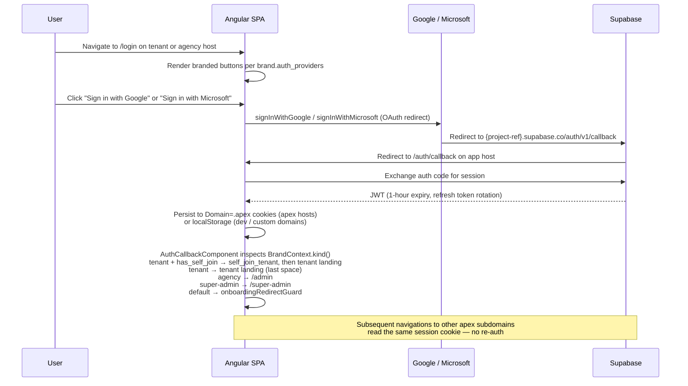

# Authentication & Security

[Back to index](README.md)

---

## Auth Flow



## Auth Providers

### Google

Existing provider, kept unchanged. Single canonical Supabase callback per project.

### Microsoft (Azure AD)

Added during the whitelabel rollout. Configured in `supabase/config.toml` under `[auth.external.azure]` with env-var-driven client id, secret, and tenant URL (`MICROSOFT_OAUTH_CLIENT_ID`, `MICROSOFT_OAUTH_CLIENT_SECRET`, `MICROSOFT_OAUTH_TENANT_URL` — typically `https://login.microsoftonline.com/<tenant-id>/v2.0` or `common` for multi-tenant). One Azure app registration with one redirect URI (the Supabase callback). The login button only renders when `microsoft` is in `brand.auth_providers`.

## Cross-Subdomain Session Storage

When `environment.apexDomain` is set and the current host is on the apex (e.g. `pfizer.yourproduct.com` matches apex `yourproduct.com`), Supabase JS uses a custom cookie storage adapter (`createCookieStorage` in `core/util/cookie-session-storage.ts`) instead of localStorage:

```
domain    = .yourproduct.com
sameSite  = Lax
secure    = true   (https only)
path      = /
maxAge    = 60 * 60 * 24 * 30   // 30 days, refresh-token-bound
storageKey = sb-auth
```

This means a single sign-in is shared across all `*.yourproduct.com` subdomains — tenant, agency, and the auth callback — without URL-token handoff. The tenant switcher just `location.assign('https://gsk.yourproduct.com/')`; the destination subdomain reads the same cookie and is already authenticated.

**Chunking.** Browsers cap a single cookie's `Set-Cookie` header at ~4096 bytes. A typical Supabase session JSON (access_token JWT + user object + provider tokens) is 3-5KB and exceeded that limit on real Google sign-ins, silently failing the cookie write. The storage adapter splits values >3000 raw bytes into `${key}.0`, `${key}.1`, ... chunks and writes a meta cookie `${key}=__chunked:N` carrying the chunk count. `getItem` reassembles them; missing chunks return `null` (forces a fresh sign-in rather than corrupting state). `setItem` always clears stragglers from a previous larger session before writing.

**Custom domains are a separate trust boundary.** A tenant on `competitive.acme.com` does not share the apex cookie domain — users sign in fresh. Acceptable for v1 because custom domains are sales-led one-tenant deployments.

**Why not localStorage + URL-hash handoff:** localStorage is per-origin and would require passing tokens through the URL fragment (browser history retains them, extensions can read them, OAuth 2.0 deprecated implicit grant for these reasons). Cookies cleanly handle the cross-subdomain boundary that's the whole point of this architecture.

## Content-Security-Policy

Shipped from `src/client/public/_headers` (honored by Cloudflare Workers' static-assets binding) on every response:

```
default-src 'self';
connect-src 'self' https://*.supabase.co wss://*.supabase.co https://cloudflareinsights.com https://clinicaltrials.gov;   /* clinicaltrials.gov for trial-form NCT sync */
script-src 'self' 'unsafe-inline' https://static.cloudflareinsights.com;   /* Angular bootstrap + CF Web Analytics beacon */
style-src 'self' 'unsafe-inline' https://fonts.googleapis.com;
font-src 'self' data: https://fonts.gstatic.com;
img-src 'self' data: https: blob:;   /* tenant logos on Supabase Storage public URLs */
frame-ancestors 'none';
base-uri 'self';
form-action 'self';
```

Conservative starting policy. Loosen if a specific integration breaks. `'unsafe-inline'` for `script-src` is required by Angular's bootstrap inline scripts; `'unsafe-inline'` for `style-src` covers PrimeNG runtime styles.

## Row Level Security (RLS)

Every data table has RLS enabled. Policies are enforced at the Postgres level — bypassing the API layer is not possible.

### Data Tables

`companies`, `products`, `trials`, `trial_phases`, `trial_markers`, `trial_notes`, `therapeutic_areas` use:

```sql
-- SELECT: user has any access to the space
has_space_access(space_id, ARRAY['owner', 'editor', 'viewer'])

-- INSERT/UPDATE/DELETE: user has write access to the space
has_space_access(space_id, ARRAY['owner', 'editor'])
```

`has_space_access` was extended during the whitelabel rollout with disjuncts for tenant ownership, tenant membership (implicit editor/viewer), agency ownership (write-eligible), agency membership (read-only), and platform admin (read-only). It also short-circuits to `false` for write-role checks when `tenants.suspended_at IS NOT NULL`.

### Marker Types

- System types (`is_system = true`) are readable by all authenticated users
- User-created types are scoped to their space with standard space access checks

### Tenant Tables

Use `is_tenant_member()` checks for membership-based access. Extended with agency-owner and platform-admin disjuncts.

### Whitelabel Tables

- `agencies` SELECT: `is_agency_member(id) OR is_platform_admin()`
- `agencies` UPDATE: `is_agency_member(id, ['owner']) OR is_platform_admin()`
- `agencies` INSERT: denied directly; only via `provision_agency()` RPC
- `agency_members` SELECT: `is_agency_member(agency_id) OR is_platform_admin()`
- `agency_members` INSERT/UPDATE/DELETE: `is_agency_member(agency_id, ['owner']) OR is_platform_admin()`
- `platform_admins`: not exposed via PostgREST; SELECT for platform admins only
- `retired_hostnames`: SELECT for platform admins only
- `tenants` SELECT: existing extended with `is_agency_member(agency_id) OR is_platform_admin()` (any agency member can see all tenants in their agency)
- `tenants` UPDATE: existing extended with `is_agency_member(agency_id, ['owner']) OR is_platform_admin()` (only agency owners can mutate tenants — including branding)
- `tenants` INSERT: denied directly; only via `provision_tenant()` RPC

### Bootstrapping

Special RLS policies allow users to add themselves as the first member when creating a tenant or space. The `handle_new_user` trigger was retired in migration 41 (no-op body) and re-extended in migration 69 with a single responsibility: scan `agency_invites` for rows matching the new user's email and promote any non-expired pending invites into `agency_members` rows. It does not provision tenants or spaces. New users land on the marketing landing or login screen and either accept a tenant invite (code-based, see `accept_invite()`), self-join, get provisioned by an agency, or — if a super-admin provisioned an agency to their email — silently get the agency-owner role on first sign-in. Self-serve tenant creation (`create_tenant`, `provision_demo_workspace`) was removed on 2026-04-30; all tenant creation now goes through `provision_tenant` (agency owner or platform admin only).

## Authorization Model Summary

| Actor | Tenant data SELECT | Tenant data WRITE | Tenant settings | Agency portal | Platform admin |
|---|---|---|---|---|---|
| Pharma user (tenant viewer/editor via space) | own space | scoped by space role | none | none | none |
| Pharma user (tenant owner) | own tenant | own tenant | own tenant | none | none |
| Agency member | all tenants in agency | none | none | view-only | none |
| Agency owner | all tenants in agency | all tenants in agency | all tenants in agency | full | none |
| Platform admin | all (read) | only via write RPCs | all (via super-admin) | all (read) | all |

Write access on tenant child tables (companies, products, trials, etc.) goes through `has_space_access(space_id, ['owner', 'editor'])` — agency *members* are not implicitly editors of child data, only agency *owners* are.

## OAuth Callback (state-based bounce-back)

The single canonical OAuth callback is at `auth.<apex>/callback` (or, more directly, the Supabase project callback at `https://<project-ref>.supabase.co/auth/v1/callback` which then redirects to the app). The callback accepts a `state` parameter containing the originating host. The callback validates that `state` is a known subdomain in `tenants.subdomain` or `agencies.subdomain` — never blindly redirects to an attacker-supplied URL (open-redirect class). If `state` doesn't match a known host, the callback redirects to the apex login.

This is what allows one Azure AD app registration with one redirect URI to serve every tenant + agency host without per-host config.

## Edge Function Authentication

`send-invite-email` is invoked by a Supabase database webhook on `INSERT` into `tenant_invites`. The webhook is configured with a shared secret in the `webhook-signature` HTTP header; the function rejects any request lacking the correct signature (length-then-equality compare against `EMAIL_WEBHOOK_SECRET`). Without this, anyone who knows the function URL could forge invite emails to any address.

The function uses the Supabase service-role key (in function secrets, never on the client) to read tenant brand fields. The function logs the message ID; never logs the email body, recipient address, or invite code (PII minimization).

## Security Audit Decisions

The whitelabel rollout went through a security audit; six hardening choices were locked in during that review:

1. **Cookie-based session storage with `Domain=.<apex>`, not URL-hash handoff.** localStorage + URL fragment leaks tokens through browser history, extensions, and `Referer`. Cookies are `Secure` + `SameSite=Lax`, and the apex-scoped domain is explicit about which trust boundary they cross.
2. **`get_brand_by_host` redacts `email_domain_allowlist`.** The anon RPC returns only a `has_self_join` boolean — never the actual list of allowlisted domains. Exposing the list to anyone hitting a tenant subdomain would leak intelligence about which corporate emails unlock that workspace. Authenticated tenant settings UIs read the list through the separate `get_tenant_access_settings` RPC, gated by tenant ownership.
3. **`self_join_tenant` returns a generic error for every failure mode.** "Self-join not available for this workspace" — same message whether the tenant doesn't exist, self-join is off, the email domain is wrong, or the tenant is suspended. Differential errors would let an attacker enumerate which subdomains exist and which corporate emails unlock them. Actual reasons are logged server-side via `raise notice` for support diagnostics.
4. **Retired-hostname holdback prevents subdomain takeover.** Decommissioned subdomains and custom domains are inserted into `retired_hostnames` with a 90-day hold (`released_at > now()`). Without this, an attacker could re-provision a freshly-retired hostname and inherit residual trust — bookmarked invite codes, cached browser auth state, outbound emails linking back to the host.
5. **Tenant suspension is enforced, not informational.** `has_space_access` short-circuits write checks to `false` when `tenants.suspended_at IS NOT NULL`. Read access stays open so users can export their data and see a "suspended" banner. Without enforcement, suspension is a setting with no effect.
6. **`send-invite-email` Edge Function verifies a webhook signature.** The DB webhook ships a `webhook-signature` header that matches `EMAIL_WEBHOOK_SECRET` in function secrets. Forged calls to the function URL without the header are rejected. Without this, anyone who knows the function URL could spam-send invite emails to any address.

## Reserved Subdomain List as a Security Control

`www app api admin auth mail support status docs blog help cdn static assets noreply email smtp` — hardcoded in `provision_tenant` / `provision_agency`. Because all `*.<apex>` subdomains share session cookies, allowing a tenant to register `auth` or `admin` would let them host a phishing page that has access to authenticated cookies. The reserved list MUST include every subdomain we use operationally.

## Platform Admin Bootstrap

`platform_admins` is not exposed via PostgREST. There is no UI to add platform admins. The bootstrap is:

```sql
INSERT INTO public.platform_admins (user_id) VALUES ('<your-uuid>');
```

Run via psql against the Supabase database. Deliberately auditable — every promotion is a discrete SQL row insert with a `created_at`.

## Domain Allowlist Hygiene

When a tenant owner enters `email_domain_allowlist`, the UI soft-validates each entry against `^[a-z0-9.-]+\.[a-z]{2,}$` and (separately) warns when a consumer-domain blocklist matches (`gmail.com`, `yahoo.com`, `outlook.com`, `hotmail.com`, `icloud.com`). Not enforced — some legitimate customers might want it — but warned, because allowing a consumer email domain on a corporate self-join allowlist would let any user with that mail provider sign up.

## Threat Scenarios Out of Scope (v1)

- Compromised platform admin account (mitigated by deliberate manual provisioning + 2FA on the admin's Google account)
- Insider threat (a malicious agency owner exfiltrating their pharma clients' data) — mitigated by contracts, not technically prevented
- Supply-chain attack on Supabase or Cloudflare — accepted vendor risk
- Per-tenant SAML/SSO — deferred to enterprise tier

## Route Guards

### authGuard

Async guard that calls `waitForSession()` and redirects to `/login` if no session exists.

### agencyGuard

Async guard. Verifies (1) `BrandContextService.kind() === 'agency'`, (2) session exists (`waitForSession()` + `session()`), (3) the signed-in user is either a platform admin (`is_platform_admin()`) or a member of the agency identified by `brand.brand().id` (`is_agency_member(p_agency_id)`). Non-matching host redirects to `/`; missing session redirects to `/login`; lacking role redirects to `/` (where `marketingLandingGuard` resolves the user's real home — see below). Combined with `authGuard` on `/admin/*`. Server-side enforcement remains the authoritative gate; this guard prevents the empty agency-portal chrome from rendering for non-members.

### superAdminGuard

Async guard. Verifies (1) `BrandContextService.kind() === 'super-admin'`, (2) session exists, (3) the signed-in user is a platform admin (`is_platform_admin()`). Non-matching host or missing role redirects to `/`; missing session redirects to `/login`. Combined with `authGuard` on `/super-admin/*`. Without the role check the super-admin chrome would render for any signed-in user who navigated to `admin.{apex}`; mutations would still fail at the RPC layer, but the empty shell leaked the surface's existence.

### marketingLandingGuard

Sole guard on the root path `/`. Routes by host brand kind, auth state, AND (for branded hosts) whether the user has the role that host requires:

| Brand kind | Unauthenticated | Authenticated + has role | Authenticated + lacks role |
|---|---|---|---|
| `default` | render marketing landing | agency membership → cross-host redirect to `https://{agency.subdomain}.{apex}/admin`; else last-used tenant; else `/onboarding` | n/a (no role gate on default host) |
| `agency` | `/login` | `/admin` | falls through to the default-host resolution path below |
| `super-admin` | `/login` | `/super-admin` | falls through |
| `tenant` | `/login` | `/t/{brand.id}/spaces` (gated by `has_tenant_access`, which includes pure space-only members so they reach their space) | `/onboarding?tab=join` (signed-in but no tenant access at all, the dominant flow for invitees redeeming a code) |

The "lacks role" fallthrough is what breaks the loop where a hardened `superAdminGuard` / `agencyGuard` / `tenantGuard` would redirect a non-member to `/`, and `marketingLandingGuard` would in turn redirect them back to the same privileged route. Instead, when a signed-in user lands on a branded host they don't belong to, the guard resolves their actual home: it checks `is_platform_admin()`, `is_agency_member()`, or `has_tenant_access()` (whichever is relevant for the host kind) and only redirects to the privileged route when role is confirmed. For the agency case, non-members fall through to the same agency-membership/last-tenant/onboarding resolution used for the default host, including the cross-host `window.location.href = ...` redirect. For the tenant case, non-members go straight to `/onboarding?tab=join` since the dominant flow is invitees signing in for the first time to redeem a code.

The per-kind routing for authenticated users mirrors `auth-callback.component.ts:redirectAfterSignIn`, which only fires on fresh sign-in. Without this duplication, an apex-cookie session that lands on a branded host without going through the callback would fall through to the apex onboarding/last-tenant path. Historically that bug also produced agency-less tenants because `/onboarding` exposed a `create_tenant` form (now removed); today the onboarding page only accepts an invite code, so a stray redirect there at worst leaves the user without a tenant — never with an orphan one.

The default-host authenticated branch checks agency memberships before tenant memberships and does a cross-host redirect (`window.location.href = ...`) when the user owns or belongs to an agency. This handles the common case where OAuth callback lands on the apex (Supabase's `redirectTo` is `${window.location.origin}/auth/callback`, so the host the user signs in from determines where the callback runs) but the user actually belongs on an agency's portal. Falls back to the tenant-lookup behavior when no agency memberships exist.

### tenantGuard

Async guard. Verifies (1) the route has a `tenantId` param, (2) session exists, (3) the signed-in user has tenant access via `has_tenant_access(p_tenant_id)`. That function returns true if the user is a tenant member (explicit row, agency owner of parent, or platform admin) OR holds a `space_members` row for any space under the tenant. The fourth disjunct is what lets pure space-only members reach `/t/:tenantId/s/:spaceId/*` for spaces they belong to. Missing tenantId or no access redirects to `/`; missing session redirects to `/login`. Combined with `authGuard` on `/t/:tenantId/*`. The `marketingLandingGuard` tenant branch was extended to call the same `has_tenant_access` check before redirecting to `/t/{id}/spaces` (and to fall through to `/onboarding?tab=join` when the user has no access, which is the dominant flow for invitees redeeming a code). Note: `has_tenant_access` is for route activation only, not RLS; tenant-level RLS still uses the stricter `is_tenant_member` so a space-only Reader cannot enumerate tenant owners.

### spaceGuard

Async guard on `/t/:tenantId/s/:spaceId/*`. Walks the route tree to read both `:spaceId` and parent `:tenantId`, waits for session, calls `has_space_access(p_space_id)` RPC. On success returns true; on failure redirects to `/t/:tenantId/spaces` (preserves the user's tenant context for a clearer next step than dropping them at `/`). Defense in depth on top of `has_space_access()` and per-table RLS in the data layer; eliminates the empty-chrome leak when a tenant member navigates to a space they don't belong to.

### tenantSettingsGuard

Strict child guard on `/t/:tenantId/settings`. The parent `tenantGuard` uses `has_tenant_access` (loose; lets space-only members reach their space), which previously also let a space-only Reader reach the tenant settings page where RLS hid every row and every mutation got rejected at the RPC layer — a confusing empty/inert surface. This guard runs in addition to `tenantGuard`, requires explicit tenant membership via `is_tenant_member` RPC, and redirects non-members to `/t/:tenantId/spaces`. Loose parent activation still lets space-only members reach the space; the strict child blocks them only at the tenant-management surface.

## Worker secret model

The trial change feed's daily polling Worker runs as anonymous on Supabase but authenticates each cron-RPC call with a shared secret. The Worker's invocation pattern is: anon JWT in the `Authorization` header, secret as a function argument; every cron-RPC body verifies it via `_verify_ctgov_worker_secret(p_secret)` (SECURITY DEFINER) before doing anything else.

**Blast radius.** Leaking `CTGOV_WORKER_SECRET` only exposes the four cron RPCs (`get_trials_for_polling`, `ingest_ctgov_snapshot`, `record_sync_run`, `bulk_update_last_polled`). The secret grants no RLS bypass and no arbitrary DB access; an attacker holding the secret can poison `trial_ctgov_snapshots` and `ctgov_sync_runs` rows, but cannot read or write any tenant data outside that scope. The Worker reads no rows back to the client either.

**Rotation playbook.** No downtime required:

1. Insert a new row into `vault.secrets` (or update the existing one) named `ctgov_worker_secret` with the new value.
2. `wrangler secret put CTGOV_WORKER_SECRET` with the same new value.
3. The Worker uses the new secret on its next cron fire; in-flight calls finish against whichever value Postgres holds when they execute. No coordination needed because both sides are read in the same transaction.

**User-facing manual sync is gated separately.** The `POST /admin/ctgov-backfill` endpoint on the Worker (used by the platform-admin "Backfill NCTs" UI and by `trigger_single_trial_sync`) is gated by `is_platform_admin()` over the user's JWT, NOT by the worker secret. The two gates are independent: the cron path uses the secret because there is no user JWT; the admin path uses the JWT because there is no need to ship a secret to the browser.

## Audit Logging

Tier 1 admin/security/governance actions are captured in `audit_events`. The DB is system of record; writes go through `record_audit_event()` (SECURITY DEFINER); direct INSERT/UPDATE/DELETE on the table is revoked from `authenticated` and `service_role`. Safety-net `AFTER` triggers on `platform_admins`, `tenant_members`, `agency_members`, `space_members`, `tenants.suspended_at`, `tenant_invites`, `space_invites`, and `retired_hostnames` backstop the RPC path.

Visibility is **strict-scope owner-only**: agency owners see agency-scoped events; strict tenant owners (explicit `tenant_members.role = 'owner'`) see tenant-scoped events; space owners see space-scoped events. Editors and viewers see nothing. Platform admins see all. No cascade from a higher scope to a lower one: a tenant owner does not see space-scoped events for spaces in their tenant unless they are also a space owner of that space.

UI surfaces: `/admin/audit-log` (agency portal), `/t/:tenantId/settings/audit-log` (tenant settings tab), `/t/:tenantId/s/:spaceId/settings/audit-log` (space settings tab), `/super-admin/audit-log` (platform-admin only). Each page supports actor/action/date-range filtering and CSV export.

**GDPR right-to-erasure: always call `redact_user_pii(p_user_id)` BEFORE deleting the user from `auth.users`.** Deletion triggers `on delete set null` on `actor_user_id`, which makes scoped redaction impossible after the fact. The redact RPC scrubs `actor_email`, `actor_ip`, `actor_user_agent`, and PII keys in `metadata` while preserving the action record under legitimate-interest legal basis.

**Function ownership deviation from spec:** `record_audit_event()` and `redact_user_pii()` are owned by the default `postgres` role rather than the `audit_writer` role described in the original spec. Transferring ownership to `audit_writer` breaks the SECURITY DEFINER call into the `auth` schema on Supabase Local (the `auth` schema grants are reset by `supabase_auth_admin`/GoTrue on container init). The locked write path is enforced by the table-level GRANT/REVOKE pattern from migration `20260510000100`, not by function ownership.

Spec: `docs/superpowers/specs/2026-05-10-audit-log-design.md`.

## RLS Coverage

Auto-generated from `pg_class` and `pg_policy`. Every public table should have RLS enabled with at least one policy. A row marked **no** under "RLS enabled" is a security smell — investigate before merging.

<!-- AUTO-GEN:RLS_COVERAGE -->
| Table | RLS enabled | Policies |
|---|---|---|
| `agencies` | yes | 3 |
| `agency_invites` | yes | 1 |
| `agency_members` | yes | 4 |
| `audit_events` | yes | 1 |
| `companies` | yes | 4 |
| `ctgov_sync_runs` | yes | 1 |
| `event_categories` | yes | 4 |
| `event_links` | yes | 3 |
| `event_sources` | yes | 4 |
| `event_threads` | yes | 4 |
| `events` | yes | 4 |
| `marker_assignments` | yes | 4 |
| `marker_categories` | yes | 4 |
| `marker_changes` | yes | 1 |
| `marker_types` | yes | 4 |
| `markers` | yes | 4 |
| `material_links` | yes | 4 |
| `materials` | yes | 4 |
| `mechanisms_of_action` | yes | 4 |
| `palette_pinned` | yes | 1 |
| `palette_recents` | yes | 1 |
| `platform_admins` | yes | 0 |
| `primary_intelligence` | yes | 4 |
| `primary_intelligence_links` | yes | 4 |
| `product_mechanisms_of_action` | yes | 3 |
| `product_routes_of_administration` | yes | 3 |
| `products` | yes | 4 |
| `retired_hostnames` | yes | 1 |
| `routes_of_administration` | yes | 4 |
| `space_invites` | yes | 1 |
| `space_members` | yes | 4 |
| `spaces` | yes | 4 |
| `tenant_invites` | yes | 4 |
| `tenant_members` | yes | 4 |
| `tenants` | yes | 3 |
| `therapeutic_areas` | yes | 4 |
| `trial_change_events` | yes | 1 |
| `trial_ctgov_snapshots` | yes | 1 |
| `trial_field_changes` | yes | 1 |
| `trial_notes` | yes | 4 |
| `trials` | yes | 4 |
<!-- /AUTO-GEN:RLS_COVERAGE -->

## Documentation Drift

Auto-generated. Lists Angular route guards in `src/client/src/app/core/guards/` whose conventional name does not appear anywhere in this file.

<!-- AUTO-GEN:DRIFT -->
- `auditAgencyGuard`
- `auditSpaceGuard`
- `auditTenantGuard`
<!-- /AUTO-GEN:DRIFT -->
