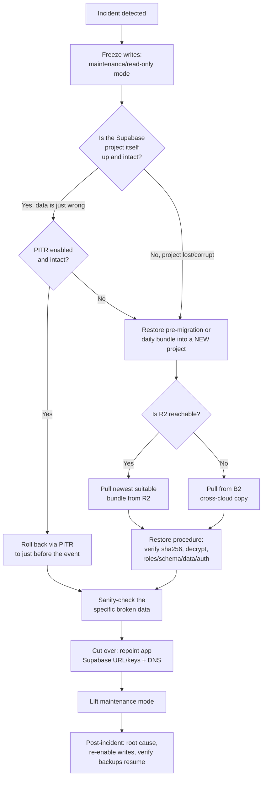

# Backup and Restore

This document owns the Postgres database specifics. For project-wide disaster
recovery beyond the database (files, secrets, DNS, auth, vendors), see
[14-disaster-recovery.md](14-disaster-recovery.md).

## What is backed up
Per backup (per environment) the bundle holds four SQL artifacts:
- `roles.sql` - database roles and grants.
- `schema.sql` - the full `public` schema DDL.
- `data.sql` - all `public` schema data.
- `auth_storage.sql` - data for the platform-managed identity and file-pointer
  tables: `auth.users`, `auth.identities`, `storage.buckets`, `storage.objects`.

Plus a `manifest.json` (env, tier, timestamp, sha256 of the encrypted bundle,
and the captured auth/storage row counts).

Not in scope: the materials file blobs already live in Cloudflare R2 (materials
cutover); this policy backs up only the Postgres pointers to them. Give that
bucket its own Bucket Lock + lifecycle separately.

## Restore target (important)
Restores target a **Supabase project (new or self-hosted)**, not a bare vanilla
Postgres. The `auth`, `storage`, and `extensions` schemas (and extensions such as
`pg_net` and `pg_trgm`) are provisioned by the Supabase platform; the `public`
schema DDL depends on them. The backup artifacts are intentionally clean (no
stubbed auth schema), so they restore onto a target that already provides that
environment.

## Where backups live
- Primary: Cloudflare R2 bucket `clint-db-backups`, prefixes
  `clint/<env>/{daily,weekly,monthly,pre-migration}/`.
- Secondary (cross-cloud): Backblaze B2 bucket `clint-db-backups`, same prefixes.
- Immutability: R2 uses Cloudflare **Bucket Lock** (R2 has no S3 versioning);
  B2 uses Object Lock + versioning. The backup job holds write-only credentials
  (no delete). Retention is enforced by lifecycle rules, not the job. On R2 the
  lock window is <= the shortest tier (7 days) so lifecycle can still reclaim
  space (Bucket Lock takes precedence over lifecycle).
- As code: both backup buckets are codified in OpenTofu (WS3) -- the R2 bucket in
  `infra/tofu/shared/r2.tf`, the B2 bucket with its compliance-mode Object Lock
  (7-day) and lifecycle rules in `infra/tofu/shared/b2.tf` (Scalr `clint-shared`).
  A `tofu apply` rebuilds the buckets and their immutability rules from config. The
  application keys themselves remain managed outside IaC until WS4 (Infisical).

## Schedule and retention (GFS)
- Daily 09:00 UTC (`backup-db.yml`); kept 7 days.
- Weekly (Sundays); kept 28 days.
- Monthly (1st); kept 365 days.
- Pre-migration snapshot before every prod deploy (`deploy-prod.yml`); kept 30 days.

## Encryption / key custody
- Bundles are `age`-encrypted. Public key: `BACKUP_AGE_PUBLIC_KEY` (CI secret).
- PRIVATE key (`clint-backup-age.key`) is held offline in <password manager /
  vault>. Custodians: <NAME 1>, <NAME 2>. It is also stored as the
  `backup-verify`-environment secret `BACKUP_AGE_PRIVATE_KEY` (no reviewers, so
  the weekly verify runs unattended) for the verification workflow only.

## Verification
- Weekly `backup-verify.yml`: for BOTH object stores (R2 and B2, in separate
  steps), pulls the newest bundle and checks freshness (newest daily <= 26h) +
  capture integrity (checksum matches manifest; all five artifacts present; core
  public DDL present; auth/storage dump row counts match the manifest). The shared
  per-store logic lives in `scripts/backup/verify-remote.sh`. It does NOT run a
  live restore (a generic runner lacks the Supabase environment).
- Quarterly manual drill (below): the true end-to-end restore into a real
  Supabase project.

## RPO / RTO
- RPO: ~24h off-site; last-deploy via pre-migration snapshot; seconds via
  Supabase PITR where enabled and intact.
- RTO: ~30-60 min for a full restore (procedure below).

## Restore procedure
1. Identify the bundle: `aws s3 ls s3://clint-db-backups/clint/prod/daily/ --endpoint-url https://<acct>.r2.cloudflarestorage.com`
2. Download it and its `.manifest.json`; verify `sha256` against the manifest.
3. Decrypt: `age -d -i clint-backup-age.key -o bundle.tar.zst bundle.tar.zst.age`
4. Unpack: `zstd -d bundle.tar.zst -o bundle.tar && tar -xf bundle.tar`
5. Provision the target: a fresh Supabase project (or self-hosted Supabase). Note
   its session-mode connection string as `$URL`.
6. Restore in order with `-v ON_ERROR_STOP=1`:
   - `psql "$URL" -f roles.sql` (skip or expect benign "role exists" notices if
     the target manages its own roles)
   - `psql "$URL" -f schema.sql` (public schema DDL)
   - Restore the data with FK checks deferred. `data.sql` and `auth_storage.sql`
     are `--data-only` (COPY) dumps and some tables have circular foreign keys
     (e.g. `indications`), so the load order can violate constraints. Wrap them in
     `session_replication_role = replica` (Supabase's `postgres` role may set it;
     otherwise use pg_dump's `--disable-triggers` or temporarily drop the
     constraints):
     ```
     psql "$URL" -v ON_ERROR_STOP=1 <<'SQL'
     set session_replication_role = replica;
     \i data.sql
     \i auth_storage.sql
     set session_replication_role = default;
     SQL
     ```
7. Sanity-check: `select count(*) from public.marker_types;` (> 0) and
   `select count(*) from auth.users;` (matches the manifest's recorded count).
8. Repoint the app's Supabase connection / DNS to the restored instance.

## Disaster scenarios and response

The procedure above is the *how*. This section is the *which and when*: in a real
incident the hard part is the decision, not the keystrokes. We have three restore
sources, freshest first; always prefer the one that loses the least data and is
actually intact:

1. **Supabase PITR** (where enabled): rolls the live project to a specific second.
   RPO ~seconds. First choice when the project itself is healthy.
2. **Pre-migration snapshot** (`pre-migration` tier, taken before every prod
   deploy): the prod state seconds before a deploy ran. The off-site system's
   answer to "a migration broke prod."
3. **Daily off-site bundle** in R2, or B2 if R2 is the thing that is down. RPO
   ~24h. Last resort, and the only source if the project is gone.



### Scenario A - bad migration corrupts prod data (most common)
Symptom: the project is healthy but a deploy wrote wrong values (e.g. a bad
backfill nulls a column). Customers see garbage.
1. Freeze writes (pause the writing worker / maintenance mode) so you restore to a
   stable point.
2. **Prefer PITR** to the second before the migration; if PITR is off, use the
   **pre-migration snapshot** from that deploy (same effect, ~seconds of loss).
3. If restoring a bundle, follow the Restore procedure into a fresh project, then
   verify the *specific* broken thing, not just generic counts (e.g.
   `select count(*) from markers where end_date is not null` is healthy again).
4. Cut over and lift maintenance.

### Scenario B - whole Supabase project lost or corrupt (the dramatic case)
PITR and the pre-migration snapshot may be gone with the project. The off-site
**daily** bundle is now the only source (RPO ~24h).
1. Provision a brand-new Supabase project.
2. Pull the newest daily bundle. If the outage *is* Cloudflare R2, pull the
   identical copy from **B2** instead (this is the exact path the quarterly drill
   exercises).
3. Full Restore procedure, then repoint app + DNS.
4. Remember the materials blobs (below) are a separate recovery.

### Scenario C - accidental delete of a few rows/tables, caught fast
Do not cut over the whole DB. Restore the bundle into a *throwaway* project,
extract just the affected rows, and copy them back into live prod. Far less
disruptive than a full cutover.

#### Worked example: recover a single hard-deleted space (no PITR)
Deleting a space cascades `ON DELETE CASCADE` into ~29 `space_id`-scoped tables
(companies, assets, trials, markers, marker_changes, materials, members, invites,
...), so a hard delete wipes the whole subtree in one transaction. We do not have
PITR, so the side copy comes from the freshest off-site bundle, not a
second-precise clone. Steps:

1. **Confirm it was a hard delete, not an archive.** The app has both
   `archive_space()` (soft: sets a flag, rows still present) and `delete_space()`
   (hard: cascades). Check `audit_events` for the space. If it was archived,
   STOP - just clear the archive flag in live prod; no restore needed.
2. **Pin the space id and timing** from `audit_events` (space lifecycle is
   Tier-1 audited). Note this restores the space as of the **bundle's**
   timestamp, so any edits to it after the last backup are not recoverable. If
   the delete coincided with a prod deploy, prefer that deploy's
   **pre-migration** snapshot (fresher than the daily).
3. **Restore the bundle into a throwaway target** (the standard Restore
   procedure). Call its connection string `$CLONE`.
4. **Extract just that space's subtree** from the clone. Most child tables carry
   `space_id` directly, so filter on it rather than walking the FK tree by hand:
   ```bash
   SPACE='00000000-0000-0000-0000-000000000000'   # the deleted space id
   # one COPY per space_id-scoped table, plus the spaces row itself
   psql "$CLONE" -tAc "select table_name from information_schema.columns
       where table_schema='public' and column_name='space_id' order by 1" \
   | while read t; do
       psql "$CLONE" -c "\copy (select * from public.$t where space_id='$SPACE')
                         to 'space_$t.csv' csv header"
     done
   psql "$CLONE" -c "\copy (select * from public.spaces where id='$SPACE')
                     to 'space_spaces.csv' csv header"
   ```
   A few tables hang off a parent rather than the space directly (e.g.
   `marker_changes` via its marker); extract those filtered on the parent ids you
   just pulled.
5. **Re-insert into live prod with checks deferred and triggers off** so circular
   FKs load, original UUIDs are preserved, and audit columns keep their historical
   values (do NOT route this through the `create_*` RPCs - load rows raw):
   ```
   psql "$PROD" -v ON_ERROR_STOP=1 <<'SQL'
   set session_replication_role = replica;
   -- \copy each space_*.csv back into its table, parents before children
   set session_replication_role = default;
   SQL
   ```
   Load `spaces` first, then the `space_id`-scoped tables. If a user recreated the
   same space id in the interim you will hit PK conflicts - decide per row whether
   to skip or overwrite.
6. **Materials blobs are separate.** This restores the `materials` /
   `storage.objects` *pointers*; if the underlying files were also purged, restore
   them from the materials R2 bucket's own versioning.
7. **Verify** the space is back (visible, members present, per-table row counts
   match the clone), then **tear down the throwaway.**

### Scenario D - malicious actor / ransomware with DB access
This is why the backup job holds **write-only** credentials and the buckets use
Object Lock / Bucket Lock: an attacker who compromises the pipeline still cannot
delete or overwrite existing backups. Restore from the immutable copy into a new,
clean project; rotate all credentials and the `age` keypair afterward.

### What the DB backup does NOT cover
Uploaded **materials file blobs** live in Cloudflare R2 separately; this backup
restores only the Postgres *pointers* (`storage.objects` rows). A whole-project
loss needs both this restore and a materials-bucket restore. Data-corruption
scenarios (A, C) leave the blobs untouched.

### Critical dependencies to internalize before an incident
- **The `age` private key is the single point of failure.** No key, no restore,
  for any scenario. Both custodians must be able to produce it from the vault; the
  drill checklist re-confirms this quarterly.
- **Use the session-mode pooler URL**, not the direct `db.<ref>` host: GitHub
  runners and some networks cannot reach the IPv6-only direct endpoint.
- **Readiness gap (as of the 2026-06-10 drill):** the bundle restore is proven
  against a *local* Supabase stack, not a live *cloud* project. The mechanics
  (decrypt, schema build, data load, FK handling, count match) hold; the untested
  cloud specifics are project provisioning, the pooler under load, and DNS
  repoint. Close this with one cloud-target drill when a project slot is free.

## Quarterly restore drill (checklist)
- [ ] Pull the latest prod bundle and run the full restore procedure into a fresh
      throwaway Supabase project (including `auth_storage.sql`).
- [ ] Confirm `public` row counts on key tables and `auth.users` count match the
      manifest.
- [ ] Time the restore; record against the RTO target.
- [ ] Confirm the offline private key is still accessible to both custodians.
- [ ] Tear down the throwaway project.

## Drill log

### 2026-06-10 - full restore from the R2 copy into a CLOUD project (PASS)
Closes the cloud-target gap left open by the local drill below.
- **Source:** newest prod daily bundle in **Cloudflare R2** (primary),
  `clint/prod/daily/clint-prod-daily-20260610T122205Z.tar.zst.age`. `sha256`
  matched the manifest; `age`-decrypted and unpacked cleanly. Download + verify +
  decrypt took ~2s over the network.
- **Target:** a **fresh throwaway Supabase cloud project** (free-tier second slot,
  freed by pausing the dev project). PostgreSQL 17.6, reached over the
  **session-mode pooler** (`...pooler.supabase.com:5432`), confirming the IPv4
  pooler path works from outside the GH runners too.
- **Procedure:** `roles.sql` -> `schema.sql` -> (`data.sql` + `auth_storage.sql`
  under `session_replication_role = replica`), `ON_ERROR_STOP=1`. All phases
  exited 0.
- **Timing:** roles + schema 26s (cloud round-trip latency on the DDL), data 3s,
  **total ~29s** - still far under the 30-60 min RTO.
- **Sanity:** `public.marker_types` = 13; `auth.users` = 14, `auth.identities`
  = 14, `storage.buckets` = 1, `storage.objects` = 1, all matching the manifest.
  51 public tables, 4808 rows.
- **New vs the local drill:** a real Supabase platform **provisioned all nine
  extensions** from `schema.sql` on its own (`hypopg`, `index_advisor`,
  `pg_graphql`, `pg_stat_statements`, `pg_trgm`, `pgcrypto`, `supabase_vault`,
  `uuid-ossp`, plus `plpgsql`), platform roles lined up, and the pooler handled
  the bulk restore. The cloud-specifics readiness gap is now closed; DNS repoint
  was out of scope (throwaway project, torn down after).
- **Teardown:** decrypted artifacts scrubbed locally; operator deletes the
  throwaway project and resumes the dev project as the closing step.

### 2026-06-10 - full restore from the B2 copy (PASS)
- **Source:** newest prod daily bundle in **Backblaze B2** (secondary cloud),
  `clint/prod/daily/clint-prod-daily-20260610T122205Z.tar.zst.age` (1.26 MB
  encrypted; ~6h old at drill time). Downloaded via the B2 S3 endpoint with the
  backup key id / app key.
- **Integrity:** `sha256` matched the sibling manifest; `age`-decrypted and
  unpacked all five artifacts cleanly.
- **Target:** an **isolated local Supabase stack** (separate `supabase start`
  instance on a +100 port range), not a cloud project - the free-tier project
  quota was exhausted. This validates the restore mechanics, ordering, and
  capture completeness against a real Supabase environment (auth/storage/
  extensions schemas present); it does not exercise cloud-platform specifics
  (PITR, platform role provisioning). Substitute a fresh cloud project when a
  slot is available.
- **Procedure:** `roles.sql` -> `schema.sql` -> (`data.sql` + `auth_storage.sql`
  wrapped in `session_replication_role = replica`), each with `ON_ERROR_STOP=1`.
  All phases exited 0 on a pristine target.
- **Sanity:** `public.marker_types` = 13 (> 0); `auth.users` = 14, matching the
  manifest. `auth.identities` = 14, `storage.buckets` = 1, `storage.objects` = 1
  all matched the manifest. 51 public tables, 4808 live rows restored (markers
  708, trials 144, materials 304, ...).
- **Timing:** download + verify + decrypt + unpack and the full restore each
  completed in seconds (well under the 30-60 min RTO target; the prod dataset is
  small).
- **Findings:**
  - `roles.sql` uses `CREATE ROLE "audit_writer"` without `IF NOT EXISTS`, so it
    is not idempotent: clean on a truly fresh target, but errors `role
    "audit_writer" already exists` on a re-run against the same target. Expected
    per the restore procedure's "benign role exists" note; only matters if you
    re-restore into a non-pristine target.
  - A fresh `supabase start` provisions `pg_net`/`pgcrypto`/`uuid-ossp` but not
    `pg_trgm`; `schema.sql` self-creates all required extensions with `CREATE
    EXTENSION IF NOT EXISTS ... WITH SCHEMA "extensions"`, so no manual
    pre-provisioning was needed.
