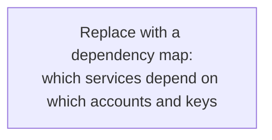

# Disaster Recovery Plan

> STATUS: SKELETON. This is a fill-in template. Sections are scaffolded with
> `<PLACEHOLDER>` and `TODO:` markers; populate each with repo-grounded content.
> The database domain is owned by [13-backup-and-restore.md](13-backup-and-restore.md);
> this document covers everything else and cross-links rather than duplicating it.

## Purpose and scope
<One paragraph: what this covers, what it deliberately does not, and how it
relates to 13-backup-and-restore.md (which owns the Postgres specifics).>

## Severity levels
| Level | Definition | Example | Response time |
|-------|-----------|---------|---------------|
| SEV1  | Full outage or data loss | TODO | TODO |
| SEV2  | Major feature down or tenant-scoped | TODO | TODO |
| SEV3  | Degraded, workaround exists | TODO | TODO |

## Roles and key custody
- Incident lead: `<NAME>`
- age private key custodians: `<NAME 1>`, `<NAME 2>`
- Cloudflare account owner: `<NAME>`
- Supabase org owner: `<NAME>`
- Registrar / DNS owner: `<NAME>`
- TODO: where this runbook lives so it is reachable during an outage.

## Failure-domain register (summary)
Keep this table in sync with the detailed sections below (one row per domain).

| # | Domain | What fails | Blast radius | Detection | RPO / RTO | Current mitigation | Top gap |
|---|--------|-----------|--------------|-----------|-----------|--------------------|---------|
| 1 | Database (Postgres) | data loss / corruption | prod data | weekly verify | ~24h / 30-60m | see 13-backup-and-restore.md | TODO |
| 2 | Materials / object storage (R2) | TODO | TODO | TODO | TODO | TODO | TODO |
| 3 | Secrets and encryption keys | TODO | TODO | TODO | TODO | TODO | TODO |
| 4 | DNS and domains | TODO | TODO | TODO | TODO | TODO | TODO |
| 5 | Identity and auth | TODO | TODO | TODO | TODO | TODO | TODO |
| 6 | Supabase project (config, not data) | TODO | TODO | TODO | TODO | TODO | TODO |
| 7 | Cloudflare account and Workers | TODO | TODO | TODO | TODO | TODO | TODO |
| 8 | CI/CD and source (GitHub) | TODO | TODO | TODO | TODO | TODO | TODO |
| 9 | Third-party vendors and billing | TODO | TODO | TODO | TODO | TODO | TODO |
| 10| Detection and monitoring | TODO | TODO | TODO | TODO | TODO | TODO |
| 11| People and process | TODO | TODO | TODO | TODO | TODO | TODO |
| 12| Security incident | TODO | TODO | TODO | TODO | TODO | TODO |

## Concentration risks
<Single dependencies that span multiple domains and would turn a recoverable
incident into an unrecoverable one. Known candidates to assess: the Cloudflare
account (Workers + R2 + DNS in one blast radius) and the age private key (no key,
no DB restore). TODO: confirm and add others.>

## Recovery procedures by domain

### 1. Database (Postgres)
Owned by [13-backup-and-restore.md](13-backup-and-restore.md). Summary only here.
<1-2 lines: daily off-site R2 + B2, pre-migration snapshot, weekly verify, no PITR.>

### 2. Materials / object storage (R2 user files)
- What can fail: <bucket deleted, object corruption, account loss, accidental
  purge via the r2_pending_deletes drain>
- Blast radius: <which tenants / spaces lose which files>
- Detection: TODO
- Current mitigation: TODO (is the materials bucket versioned? Object Lock?
  cross-cloud copy like the DB? Today the DB backup stores only the POINTERS.)
- RPO / RTO target vs actual: TODO
- Recovery procedure:
  1. TODO
- Known gaps: TODO

### 3. Secrets and encryption keys
- Inventory: age private key; Cloudflare Worker runtime secrets
  (`ANTHROPIC_API_KEY`, `EXTRACT_SOURCE_WORKER_SECRET`, ...); Supabase
  service-role and anon keys; Google OAuth client secret; R2/B2 credentials;
  GitHub Actions secrets.
- For each: where it lives, who can recover it, rotation procedure, blast radius
  if leaked.
- Recovery procedure (lost age key): TODO
- Recovery procedure (leaked credential): TODO

### 4. DNS and domains
- What can fail: registrar lapse, Cloudflare zone change, tenant subdomain or
  custom-domain misconfig, TLS cert failure. Host-based brand resolution means
  DNS breakage can silently break tenant theming or logins.
- Recovery procedure: TODO

### 5. Identity and auth (Google OAuth + Supabase Auth)
- What can fail: OAuth client deleted or expired, redirect URL drift, Supabase
  Auth config loss. Blast radius: nobody can log in.
- Recovery procedure: TODO

### 6. Supabase project (configuration, not data)
- The DB restore recovers DATA. This recovers the PROJECT: Auth providers and
  redirects, Storage config, RLS, extensions, edge functions, OAuth setup, pooler
  settings.
- Is this captured as code / migrations or only in the dashboard? TODO
- Recovery procedure (re-provision from scratch): TODO

### 7. Cloudflare account and Workers
- What can fail: account compromise or suspension, bad Worker deploy, wrangler
  config loss.
- Recovery procedure (deploy rollback, account recovery contacts): TODO

### 8. CI/CD and source (GitHub)
- What can fail: repo or account loss, GHA secrets loss, inability to deploy.
- Can we deploy without GitHub? Where do deploy secrets live? TODO

### 9. Third-party vendors and billing
- Per vendor (Anthropic, Cloudflare, Supabase, Backblaze, data sources): outage
  behavior (degrade vs hard-down), account-termination plan, billing-lapse and
  free-tier auto-pause as failure modes. TODO

### 10. Detection and monitoring
- For every domain above: how do we KNOW it failed? Backup-failure alerts, uptime
  checks, cert-expiry alerts, error monitoring. List what exists vs what is missing.

### 11. People and process
- Bus factor, contact tree, escalation, how this runbook is reached during an
  outage, customer / status communication plan.

### 12. Security incident
- Credential leak, RLS bypass / data exfiltration, ransomware. Containment,
  rotation, forensics, disclosure. Cross-ref the immutable-backup posture in
  13-backup-and-restore.md.

## Drill log
<Same pattern as 13-backup-and-restore.md: date, scenario, result, timing,
findings. Schedule periodic tests of the non-DB procedures too, not just the DB.>

## Action register (prioritized)
| Priority | Gap | Domain | Likelihood x impact | Effort / cost | Free-tier constrained? | Owner | Status |
|----------|-----|--------|---------------------|---------------|------------------------|-------|--------|
| 1 | TODO | TODO | TODO | TODO | TODO | TODO | open |
