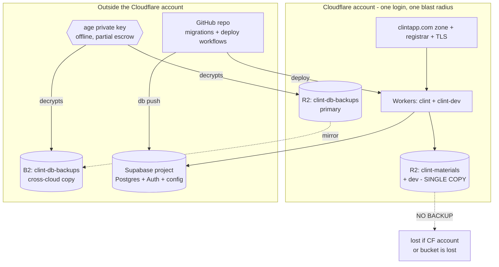

# Disaster Recovery Plan

## Purpose and scope
This runbook enumerates every way Clint can lose data or go down, and the
procedure to recover from each. It is the index and decision layer across all
failure domains: database, object storage, secrets, DNS, identity, the Supabase
project, the Cloudflare account, CI/CD, vendors, monitoring, people, and security
incidents. It deliberately does **not** restate the Postgres backup and restore
mechanics: those live in `13-backup-and-restore.md`, which owns the bundle format,
the GFS schedule, the encryption keys, the restore keystrokes, and the
DB-specific drill log. This file links out to it for domain 1 and otherwise covers
the domains that document does not. Where a fact could not be confirmed from the
codebase or config it is tagged `UNKNOWN - needs owner confirmation` rather than
guessed.

## Severity levels
| Level | Definition | Example | Response time |
|-------|-----------|---------|---------------|
| SEV1  | Full outage or unrecoverable data loss. All tenants blocked, or data lost beyond its RPO. | Supabase prod project deleted; materials bucket purged (currently unrecoverable, see domain 2); Cloudflare account suspended (app + DNS + materials + primary DB backups in one blast radius). | Acknowledge < 15 min; incident lead engaged immediately; customer/status comms within 1h. |
| SEV2  | Major feature down or scoped to one tenant. Product still usable for most. | A bad migration wrote wrong values to prod (recoverable via restore); one tenant custom domain TLS broken; login via one OAuth provider down; CT.gov ingest failing for days; AI extraction down. | Acknowledge < 2h; same-day mitigation. |
| SEV3  | Degraded, a workaround exists. | Brandfetch down (manual logo entry); CT.gov snapshot stale for a day; invite email delayed; slow queries. | Next business day. |

## Roles and key custody
- Incident lead: UNKNOWN - needs owner confirmation: who owns an active incident.
- age private key custodians: <NAME 1>, <NAME 2> (same custodians as `13-backup-and-restore.md`).
- Cloudflare account owner: UNKNOWN - needs owner confirmation. Note: a single Cloudflare account holds prod and dev Workers, both materials buckets, the primary DB backup bucket, and the `clintapp.com` zone/registrar (confirmed concentration risk, see below).
- Supabase org owner: UNKNOWN - needs owner confirmation.
- Registrar / DNS owner: UNKNOWN - needs owner confirmation. Per the account topology above, DNS and the registrar sit inside the same Cloudflare account.
- Where this runbook lives during an outage: it is in the repo at `docs/runbook/`, served from GitHub. A GitHub or Cloudflare outage makes it unreachable through the normal path. Keep an exported copy (this file plus `13-backup-and-restore.md`) in the same offline vault that holds the age key and the secrets inventory, so the recovery steps and the keys to execute them live together. UNKNOWN - needs owner confirmation: that an offline copy exists and where.

## Failure-domain register (summary)
One row per detailed section below. RPO/RTO are stated per domain; "target" is the
goal, "actual" is what evidence supports today.

| # | Domain | What fails | Blast radius | Detection | RPO / RTO | Current mitigation | Top gap |
|---|--------|-----------|--------------|-----------|-----------|--------------------|---------|
| 1 | Database (Postgres) | data loss or corruption | all prod data | weekly `backup-verify` (no failure alert); no live uptime check | ~24h / ~1h (drill: seconds) | off-site R2 + B2, pre-migration snapshot, proven restore. See `13-backup-and-restore.md` | no live cloud-target restore drill yet; verify failures are silent |
| 2 | Materials / object storage (R2) | bucket delete, object corruption, account loss, bad `r2_pending_deletes` drain | every tenant's uploaded files | none | unrecoverable today / unrecoverable today | none. DB backup stores only the pointers | single copy: no versioning, no Object Lock, no off-cloud copy |
| 3 | Secrets and encryption keys | key lost or leaked | varies by secret; age key loss blocks all DB restores | none | n/a / hours to rotate | partial inventory in a password manager; age key offline | escrow is partial and unaudited; only the age key is confirmed offline |
| 4 | DNS and domains | registrar lapse, zone change, custom-domain or TLS misconfig | one tenant (custom domain) up to all tenants (apex zone) | none (no cert-expiry or uptime alert) | n/a / minutes to days | Cloudflare-managed certs; brand resolution by host | DNS sits in the same single Cloudflare account; manual, no IaC |
| 5 | Identity and auth | OAuth client deleted/expired, redirect drift, Auth config loss | nobody can log in (provider-scoped or total) | user reports / login failures | n/a / ~1h | Google + Microsoft providers; config in `supabase/config.toml` | cloud provider secrets and redirect URLs live only in the dashboard |
| 6 | Supabase project (config, not data) | project deleted; dashboard config lost | all auth, RLS, storage, pooler, edge function config | none | n/a / hours | schema/RLS/extensions in migrations; auth shape in `config.toml` | cloud-only settings (provider secrets, redirect URLs, pooler, edge secrets) not captured as code |
| 7 | Cloudflare account and Workers | bad deploy, wrangler config loss, account compromise/suspension | bad deploy: all tenants briefly. Account loss: app + DNS + materials + primary DB backups | none (no uptime check) | n/a / minutes (deploy) to days (account) | GHA deploy with prod approval gate; rollback via redeploy | account is the largest single blast radius; B2 is the only DB backup outside it |
| 8 | CI/CD and source (GitHub) | repo/account loss, GHA secrets loss | cannot deploy via the normal path | push failures, workflow errors | n/a / minutes to hours | local `wrangler deploy` + `supabase db push` work without GitHub | deploy secrets live in GHA; partial offline copy only |
| 9 | Third-party vendors and billing | vendor outage, account termination, billing lapse, free-tier auto-pause | degrade (most) to hard-down (Supabase, Cloudflare) | in-app `/api/ai/health` for Anthropic only | varies | feature gates; non-blocking design for Brandfetch/Resend/CT.gov | Supabase free-tier auto-pause and project quota are live failure modes |
| 10| Detection and monitoring | a failure goes unnoticed | every domain above | this is the gap | n/a | weekly `backup-verify`; in-app AI health poll | no alerting on backup failure, uptime, or cert expiry; you learn of disasters late |
| 11| People and process | bus factor, no reachable runbook, no comms plan | recovery stalls regardless of tooling | n/a | n/a | runbook in repo | single-operator risk; no confirmed contact tree or status page |
| 12| Security incident | credential leak, RLS bypass / exfiltration, ransomware | data breach or destructive action | none active | n/a / hours | write-only backup creds; Object Lock on backups; Tier-1 audit log | no intrusion detection; materials bucket has no immutable copy to restore from |

## Concentration risks
Two dependencies turn an otherwise recoverable incident into an unrecoverable one.

1. **The single Cloudflare account.** Confirmed: prod and dev Workers, both
   materials buckets (`clint-materials`, `clint-materials-dev`), the primary DB
   backup bucket (`clint-db-backups`), the rate limiters, and the `clintapp.com`
   zone and registrar all live in one Cloudflare account. A compromise, suspension,
   or billing lockout of that one account simultaneously takes down the app, makes
   every uploaded file inaccessible, removes DNS for every tenant, and removes the
   primary copy of the database backups. The only things outside it are the
   Backblaze B2 copy of the DB backups, the Supabase project (the data itself),
   and the GitHub repo (the code). So a total Cloudflare loss is survivable for the
   *database* (restore from B2 into a new Supabase project, repoint DNS once a new
   zone exists) but is currently **unsurvivable for materials**, which have no copy
   anywhere else.

2. **The single age private key.** No key, no DB restore, for any scenario.
   `13-backup-and-restore.md` already names this as its single point of failure.
   It spans every database-recovery path in this document. Escrow is currently
   partial (a password manager) with only the key itself confirmed offline.

Other dependencies to assess: the single Supabase project per environment (no read
replica, no warm standby), and the single GitHub repository (sole home of
migrations and deploy workflows).

## Recovery procedures by domain

### 1. Database (Postgres)
Owns: `docs/runbook/13-backup-and-restore.md`. That file holds the bundle format,
GFS schedule, encryption, the full restore procedure, the scenario decision tree
(A bad migration, B whole-project loss, C scoped row recovery, D ransomware), and
the DB drill log. Summary only here: three restore sources freshest-first are
Supabase PITR (not enabled on free tier), the pre-migration snapshot (taken before
every prod deploy), and the daily off-site bundle in R2 or B2. RPO ~24h, RTO ~1h
(drill restored the full prod dataset in seconds).

### 2. Materials / object storage (R2 user files)
- What can fail: the `clint-materials` bucket is deleted; objects are corrupted or
  overwritten; the Cloudflare account is lost (domain 7); or a faulty or malicious
  enqueue into `r2_pending_deletes` causes the daily 07:00 UTC drain
  (`worker/r2-drain/queue.ts`) to delete live objects. Files are keyed
  `{space_id}/{material_id}/{file_name}`; the DB row in `public.materials`
  (`file_path`, `file_name`, `finalized_at`) is only the pointer.
- Blast radius: every tenant and space that has uploaded materials. Loss is total
  and customer-visible (briefings, decks, PDFs). The DB still lists the files, so
  the app shows download links that 404, which is worse than an honest empty state.
- Detection: none today. There is no integrity check, no object-count reconciliation
  against `public.materials`, and no alert on the drain deleting more than expected.
- Current mitigation: **none.** Confirmed: the bucket has no versioning, no Object
  Lock, and no cross-cloud copy. The DB backup explicitly stores only the pointers
  (`13-backup-and-restore.md`, "What the DB backup does NOT cover"). This is the
  single largest data-loss gap in the system.
- RPO / RTO: target RPO 24h / RTO 4h once protection exists. Actual today:
  **unrecoverable.** A delete or account loss is permanent.
- Recovery procedure (today, honest):
  1. There is no restore source for the blobs. If only the DB was lost, restore it
     (domain 1); the pointers return but the files they point to are intact only if
     the bucket itself survived.
  2. If the bucket or its objects were lost, recovery is not possible. Identify the
     affected `space_id`s from `public.materials`, mark those materials as missing
     in-app, and notify the affected tenants. Treat as SEV1.
- Recovery procedure (target state, after the action-register items land):
  1. Enable R2 versioning and Object Lock on `clint-materials`, plus a scheduled
     cross-cloud copy to B2 (mirror the DB backup posture).
  2. On accidental delete or overwrite within the lock window, restore the prior
     object version.
  3. On bucket or account loss, rehydrate from the B2 copy into a fresh bucket and
     repoint `R2_BUCKET` / `MATERIALS_BUCKET`.
- Known gaps: no backup, no versioning, no Object Lock, no off-cloud copy, no
  drain guardrail, no pointer/object reconciliation. See action register P1 and P3.

### 3. Secrets and encryption keys
Inventory by where it lives:

| Secret | Lives in | Recover by | Blast radius if leaked |
|--------|----------|-----------|------------------------|
| age private key (`clint-backup-age.key`) | offline vault (custodians) + `backup-verify` env | cannot reissue; restore from custodian copy | attacker can decrypt every backup bundle |
| `BACKUP_AGE_PUBLIC_KEY` | GHA secret | re-derive from private key | none (public) |
| `R2_BACKUP_*`, `B2_BACKUP_*` | GHA secrets | reissue tokens in R2 / B2 dashboards | write-only by design; cannot delete backups |
| `SUPABASE_*_DB_PASSWORD`, `_POOLER_URL`, `_PROJECT_REF`, `SUPABASE_ACCESS_TOKEN` | GHA secrets | rotate in Supabase dashboard | full DB and management-API access |
| `CLOUDFLARE_API_TOKEN`, `CLOUDFLARE_ACCOUNT_ID` | GHA secrets | reissue token in Cloudflare | deploy and account-scoped access |
| `ANTHROPIC_API_KEY` | Worker runtime secret | reissue in Anthropic console | billable API use; exposure of extracted text |
| `EXTRACT_SOURCE_WORKER_SECRET`, `CTGOV_WORKER_SECRET`, `R2_WORKER_SECRET` | Worker runtime secrets | regenerate and `wrangler secret put` | call internal RPC endpoints |
| `BRANDFETCH_API_KEY` | Worker runtime secret | reissue in Brandfetch | billable lookups |
| `GOOGLE_OAUTH_*`, `MICROSOFT_OAUTH_*` | Supabase project secrets | reissue in Google/Azure consoles | impersonate the OAuth app |
| `RESEND_API_KEY`, `EMAIL_WEBHOOK_SECRET` | Supabase project secrets | reissue in Resend / regenerate | send mail as the app; forge webhooks |

- Escrow status: partial, in a password manager (confirmed). Only the age key is
  confirmed held offline. This is the gap: re-provisioning the project config after
  an account loss means re-issuing each secret from its provider, which is slow and
  error-prone without a complete inventory.
- Recovery procedure (lost age key): if both custodians and the `backup-verify`
  env copy are gone, every existing backup bundle is permanently undecryptable.
  There is no workaround. Generate a new keypair, re-encrypt going forward, and
  treat all prior bundles as lost. This is why the quarterly drill re-confirms
  custodian access.
- Recovery procedure (leaked credential): rotate the specific secret at its
  provider, update the GHA / Worker / Supabase secret store, redeploy if it is a
  Worker secret, and review audit/access logs for misuse. If the leak is broad
  (for example a repo or CI compromise), rotate every secret in the table and the
  age keypair, per scenario D in `13-backup-and-restore.md`.

### 4. DNS and domains
- What can fail: registrar lapse (domain expiry), an accidental zone or record
  change, a tenant subdomain or custom-domain misconfiguration, or a TLS cert
  failure. Brand resolution is host-based: `get_brand_by_host(p_host)` matches the
  request host against `tenants.custom_domain`, `agencies.custom_domain`,
  `admin.<apex>`, `tenants.subdomain`, `agencies.subdomain`, then `default`. So a
  DNS break does not just drop traffic, it can silently fall a tenant back to the
  default brand or break logins on a custom domain (a separate auth trust boundary).
- Source of truth for which domains exist: the database. `tenants.custom_domain`
  and `agencies.custom_domain` (unique, validated), with a 30-day reuse holdback in
  `public.retired_hostnames`. The matching Cloudflare side (Custom Domain on the
  Worker, custom hostname, TLS cert) is configured manually in the dashboard, with
  no IaC. The two must agree: a row in the DB with no Cloudflare custom domain does
  not resolve, and vice versa.
- Blast radius: a single custom domain (one tenant) up to the whole `clintapp.com`
  zone (all tenants and the apex marketing site).
- Detection: none. No cert-expiry alert, no synthetic check that each tenant host
  resolves and serves the right brand.
- Recovery procedure:
  1. Registrar lapse: renew immediately; the registrar is in the same Cloudflare
     account, so account access is a prerequisite (domain 7).
  2. Bad zone/record change: revert the record in the Cloudflare dashboard; certs
     are Cloudflare-managed and reissue automatically.
  3. Tenant custom-domain break: confirm the DB row exists
     (`select custom_domain from tenants where id = ...`), confirm the Cloudflare
     Custom Domain and cert are present and active, and that the customer's CNAME
     still points at the Worker. Re-add the Cloudflare custom domain if missing
     (see `12-deployment.md`).
  4. Full zone rebuild after account loss: recreate the `clintapp.com` zone in the
     recovered or new Cloudflare account, re-add the apex and wildcard routes to the
     Workers, then walk every `custom_domain` in `tenants` and `agencies` and
     re-add each as a Cloudflare Custom Domain.
- Known gap: the Cloudflare-side domain config is not captured as code, so a full
  rebuild is a manual walk of the DB domain list. No cert-expiry monitoring.

### 5. Identity and auth (Google + Microsoft OAuth via Supabase Auth)
- What can fail: an OAuth client is deleted or its secret expires (Google or Azure),
  redirect URLs drift from the configured allow-list, or Supabase Auth config is
  lost with the project. Providers configured in `supabase/config.toml`:
  `[auth.external.google]` and `[auth.external.azure]` enabled; Apple stubbed but
  off. Cross-subdomain sessions use a cookie scoped to `Domain=.clintapp.com`;
  custom domains require a fresh sign-in (separate trust boundary).
- Blast radius: provider-scoped (one provider down, the other still works) up to
  total (Auth config lost, nobody can log in). Existing sessions survive a provider
  outage until they expire.
- Detection: user reports and login-failure spikes. No active check.
- Recovery procedure:
  1. Provider client lost/expired: recreate the OAuth client in the Google Cloud
     or Azure AD console, set the redirect URL to the Supabase callback, and update
     `GOOGLE_OAUTH_*` / `MICROSOFT_OAUTH_*` in the Supabase project secrets.
  2. Redirect drift: align the provider console redirect URLs and the Supabase Auth
     redirect allow-list (`additional_redirect_urls` in `config.toml` documents the
     intended set; the cloud project's list is the live source of truth).
  3. Auth config lost with the project: see domain 6; the provider shape is in
     `config.toml`, the secrets are not.
- Known gap: the cloud provider secrets and the live redirect allow-list exist only
  in the Supabase dashboard, not in version control.

### 6. Supabase project (configuration, not data)
The DB restore (domain 1) recovers DATA. This domain recovers the PROJECT around
it: Auth providers and redirect URLs, Storage config, RLS, extensions, the pooler,
the edge function and its secrets, and OAuth setup.
- Captured as code: the `public` schema, all RLS policies, all RPCs, and the
  required extensions are in `supabase/migrations/`. The intended Auth shape, the
  redirect allow-list, and the edge runtime config are in `supabase/config.toml`.
  The one edge function, `send-invite-email`, is in `supabase/functions/`.
- Not captured as code (dashboard only): which providers are toggled on in the
  cloud project, the live OAuth client secrets, the live redirect allow-list, the
  pooler connection settings, the edge function secrets (`RESEND_API_KEY`,
  `EMAIL_WEBHOOK_SECRET`, `EMAIL_FROM`, `EMAIL_BASE_URL`,
  `MICROSOFT_OAUTH_*`), and the DB webhook that triggers the invite email.
- Recovery procedure (re-provision from scratch):
  1. Create a fresh Supabase project. Record its session-mode pooler URL.
  2. `supabase db push` (or restore a bundle per domain 1) to rebuild the schema,
     RLS, RPCs, and extensions.
  3. Restore the data (domain 1) including `auth_storage.sql`.
  4. Recreate Auth providers (Google, Azure) from `config.toml`, pasting the
     reissued client secrets (domain 5). Set the redirect allow-list to match.
  5. Deploy the edge function and set its secrets.
  6. Recreate the DB webhook that fires `send-invite-email` on insert into the
     invites table (shared secret `EMAIL_WEBHOOK_SECRET`).
  7. Update `SUPABASE_*` GHA secrets and the app's environment config to the new
     project ref, pooler URL, and keys; repoint DNS (domain 4).
- Known gap: steps 4 to 6 depend on dashboard-only config that is not version
  controlled. Consider `supabase config push` and documenting the webhook so this
  becomes reproducible. UNKNOWN - needs owner confirmation: whether the DB webhook
  definition is recorded anywhere outside the live project.

### 7. Cloudflare account and Workers
- What can fail: a bad Worker deploy; loss of `wrangler.jsonc`; or
  compromise/suspension/billing-lockout of the whole account.
- Blast radius: a bad deploy briefly affects all tenants (one prod Worker serves
  every host). Account loss is the worst case in this document: app, DNS,
  materials, and the primary DB backup bucket all go at once (see Concentration
  risks). Only the B2 DB copy, the Supabase project, and the GitHub repo survive.
- Detection: none. No uptime check on `clintapp.com` or a tenant host.
- Recovery procedure (bad deploy): redeploy the prior known-good build. Prod
  deploys run through `deploy-prod.yml` behind the `production` environment approval
  gate; roll back by deploying the previous commit, or run `wrangler deploy` locally
  from a clean checkout. `wrangler.jsonc` is the source of truth for routes,
  bindings, R2 buckets, rate limiters, and the cron, so it rebuilds the Worker shape
  exactly.
- Recovery procedure (account loss): this is a multi-day rebuild. Stand up a new
  Cloudflare account, recreate the `clintapp.com` zone and the apex+wildcard routes,
  recreate both materials buckets and the backup bucket, re-add every tenant custom
  domain (domain 4), reissue `CLOUDFLARE_API_TOKEN` and re-deploy both Workers,
  re-add Worker runtime secrets via `wrangler secret put`, and restore the DB from
  B2. Materials are not recoverable in this path under the current single-copy
  posture. Engage Cloudflare support for account recovery in parallel.
- Known gap: the account is the largest single blast radius; account-recovery
  contacts, MFA/hardware-key enrollment, and a break-glass second-admin are
  UNKNOWN - needs owner confirmation.

### 8. CI/CD and source (GitHub)
- What can fail: the repo or GitHub account is lost; GHA secrets are lost; or
  deploys cannot run.
- Can we deploy without GitHub: yes. Deploys are `wrangler deploy` plus
  `supabase db push`, both runnable from a local clean checkout given the secrets.
  GitHub is the convenient path (and the only one with the prod approval gate and
  the automatic pre-migration snapshot), not a hard dependency for emergency deploys.
- Where deploy secrets live: GitHub Actions secrets (Supabase refs/passwords/pooler
  URLs, Cloudflare token/account, backup R2/B2 creds, age public key). These are
  partially mirrored in the password manager (domain 3), so a GitHub loss does not
  by itself lose the secrets, but the inventory is incomplete.
- Recovery procedure: clone from any local checkout or fork to a new remote, restore
  GHA secrets from the password-manager inventory, and re-point the deploy workflows.
  For an urgent fix during a GitHub outage, deploy locally with the env/secrets in
  hand, then reconcile back through GitHub once it returns. Note that a local deploy
  skips the prod approval gate and the automatic pre-migration snapshot, so take a
  manual snapshot first (`13-backup-and-restore.md`).
- Known gap: the secrets inventory is partial; without GitHub the prod safety rails
  (approval gate, pre-migration snapshot) are bypassed.

### 9. Third-party vendors and billing
Behavior per vendor when it degrades or goes hard-down, and the billing failure mode.

| Vendor | Used for | Outage behavior | Billing / termination mode |
|--------|----------|-----------------|----------------------------|
| Supabase | DB, Auth, Storage config, edge fn | hard-down: app unusable | free-tier project auto-pause after inactivity; project quota exhausted (blocks the cloud restore drill); plan lapse risks the project |
| Cloudflare | Workers, R2, DNS, TLS | hard-down: app + materials + DNS unreachable | account suspension is the SEV1 concentration case (domain 7) |
| Anthropic | AI source extraction | degrade: extraction errors, rest of app fine; `/api/ai/health` polls `status.claude.com` (60s cache) | key disabled stops AI only; feature-gated by `ai_extraction_enabled` |
| Backblaze B2 | cross-cloud DB backup copy | degrade: primary R2 copy still works | account lapse loses the off-Cloudflare backup copy, collapsing two stores into one |
| ClinicalTrials.gov | daily trial ingest | degrade: daily 07:00 cron no-ops, snapshots in `trial_ctgov_snapshots` go stale; app serves last-known | public API, no account; no fallback beyond stale data |
| Brandfetch | logo/brand lookup during provisioning | degrade: lookup returns 502, user enters logo/colors manually | non-blocking |
| Resend | invite emails (edge fn) | degrade: invite email fails, invite code still generated in-app | non-blocking; deliver code out-of-band |
| Google / Azure AD | OAuth login | degrade: one provider down, the other still works | client deletion = provider-scoped login outage (domain 5) |

- Known gap: Supabase free-tier auto-pause and exhausted project quota are live
  failure modes, not hypotheticals (the quota already forced the last restore drill
  onto a local stack). UNKNOWN - needs owner confirmation: whether prod Supabase is
  on a paid plan; if it stays free-tier, RPO is floored at ~24h (no PITR) and the
  project can auto-pause.

### 10. Detection and monitoring
How would we know each domain failed? Today, mostly we would not. This is the
highest-leverage cross-cutting gap.
- Exists: the weekly `backup-verify.yml` checks both R2 and B2 bundles (freshness,
  checksum, artifact presence, row-count match); the in-app `/api/ai/health`
  endpoint polls Anthropic status.
- Missing: there is no alert when `backup-verify` or `backup-db` fails (a failed
  run is silent unless someone reads the Actions tab); no uptime check on
  `clintapp.com` or a representative tenant host; no TLS cert-expiry alert; no error
  monitoring (no Sentry or equivalent) in the Worker or the Angular app; no
  reconciliation of `public.materials` rows against R2 objects; no alarm on the
  `r2_pending_deletes` drain removing more than a threshold.
- Consequence: a disaster in domains 2, 4, 7, or 12 would likely be discovered by a
  customer report, not by us. Closing this (action register P1) is cheap relative to
  its value: it is the difference between an RTO clock that starts at failure and one
  that starts hours later.

### 11. People and process
- Bus factor: roles in this document are largely UNKNOWN - needs owner confirmation,
  which implies a single-operator risk. A DR plan only works if more than one person
  can execute it.
- Contact tree and escalation: UNKNOWN - needs owner confirmation. Define who is
  paged for SEV1, who is the backup, and how they are reached.
- Runbook reachability: covered under Roles and key custody. The plan must be
  readable when GitHub or Cloudflare is the thing that is down.
- Customer / status communication: UNKNOWN - needs owner confirmation. There is no
  status page or comms template. For a SEV1 (app down, or data loss), tenants need a
  channel that does not depend on the same infrastructure.

### 12. Security incident
- Credential leak: rotate per domain 3; if broad, rotate everything plus the age
  keypair.
- RLS bypass / data exfiltration: the Tier-1 audit log (`record_audit_event`,
  enforced by the audit-coverage smoke migration) records governance actions, so
  scope the blast radius from `audit_events`. Contain by revoking the leaked
  credential or disabling the affected RPC, then assess what was read or changed.
- Ransomware / destructive actor with DB access: this is why the backup job holds
  write-only credentials and the backup buckets use Object Lock / Bucket Lock, so an
  attacker cannot delete or overwrite existing DB backups (scenario D in
  `13-backup-and-restore.md`). Restore from the immutable copy into a clean project,
  then rotate all credentials and the age keypair.
- The materials gap also applies here: because `clint-materials` has no immutable
  copy, an attacker who reaches the bucket (or the account) can destroy every
  uploaded file with no restore source. Materials Object Lock (action register P1)
  closes the destructive-actor case for files, not just the accidental one.
- Known gap: no intrusion detection and no anomaly alerting on auth or data access.

## Drill log
Same pattern as `13-backup-and-restore.md`: date, scenario, result, timing,
findings. The DB restore drills live in that file. This log is for the **non-DB**
procedures (materials restore, DNS/zone rebuild, project re-provision, account-loss
walkthrough), which are not yet exercised. Schedule at least one tabletop or live
drill of a non-DB domain per quarter.

UNKNOWN - needs owner confirmation: no non-DB drill has been run yet. First
candidates, cheapest first: (1) a project re-provision dry run into a throwaway
Supabase project, timing steps 1 to 7 of domain 6; (2) a materials restore drill,
which is currently blocked because there is no backup to restore from (it becomes
possible once P1 lands).

## Action register (prioritized)
Likelihood x impact, with effort and free-tier constraints flagged.

| Priority | Gap | Domain | Likelihood x impact | Effort / cost | Free-tier constrained? | Owner | Status |
|----------|-----|--------|---------------------|---------------|------------------------|-------|--------|
| 1 | Materials bucket has no backup, versioning, or Object Lock; single copy in one account. Permanent customer data loss on delete or account loss. | 2 | medium x catastrophic | low for versioning + Object Lock; medium for B2 cross-cloud copy | no (R2 feature) | UNKNOWN | open |
| 1 | No alerting on `backup-verify`/`backup-db` failure, no uptime check, no cert-expiry alert. Disasters discovered late, RTO clock starts hours after failure. | 10 | high x high | low | no | UNKNOWN | open |
| 2 | Cloudflare account is one blast radius (app + materials + DNS + primary DB backups). | 7 | low x catastrophic | medium: enforce hardware-key MFA, add a break-glass second admin, confirm account-recovery contacts; consider moving backup R2 or DNS out of the account | no | UNKNOWN | open |
| 2 | Secrets escrow is partial and unaudited (password manager); only the age key is confirmed offline. Slow, error-prone re-provision after account loss. | 3 | medium x high | low | no | UNKNOWN | open |
| 2 | Supabase project config (provider secrets, live redirect allow-list, pooler, edge secrets, invite webhook) is dashboard-only, not version controlled. | 6 | medium x medium | medium: `supabase config push`, document the webhook and edge secrets | no | UNKNOWN | open |
| 2 | No live cloud-target restore drill (carried from `13-backup-and-restore.md`); cloud provisioning + DNS repoint untimed, so DB RTO is partly unproven. | 1 | medium x medium | low, but needs a free Supabase project slot | yes: project quota exhausted blocks it | UNKNOWN | open |
| 3 | `r2_pending_deletes` drain has no guardrail or alert; a bad enqueue deletes live materials with no backup to recover from. | 2 | low x high | low: add a per-run delete cap and an alert | no | UNKNOWN | open |
| 3 | Single age key, custodians unconfirmed. | 3 | low x catastrophic | low: confirm both custodians can retrieve it; consider a second recipient key | no | UNKNOWN | open |
| 3 | Tenant DNS / Cloudflare custom-domain config is manual with no IaC; full zone rebuild is a hand walk of the DB domain list. | 4 | low x medium | medium: script the rebuild from `tenants`/`agencies` rows | no | UNKNOWN | open |
| 3 | No defined incident roles, contact tree, or status-comms channel; likely single-operator. | 11 | medium x high | low: name roles, write a contact tree, pick an out-of-band status channel | no | UNKNOWN | open |
| 3 | `roles.sql` is not idempotent (`CREATE ROLE` without `IF NOT EXISTS`); benign on a fresh target, errors on re-run (carried from `13-backup-and-restore.md`). | 1 | low x low | low | no | UNKNOWN | open |
