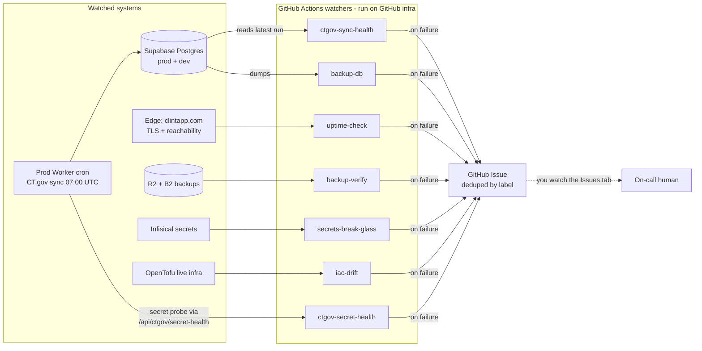
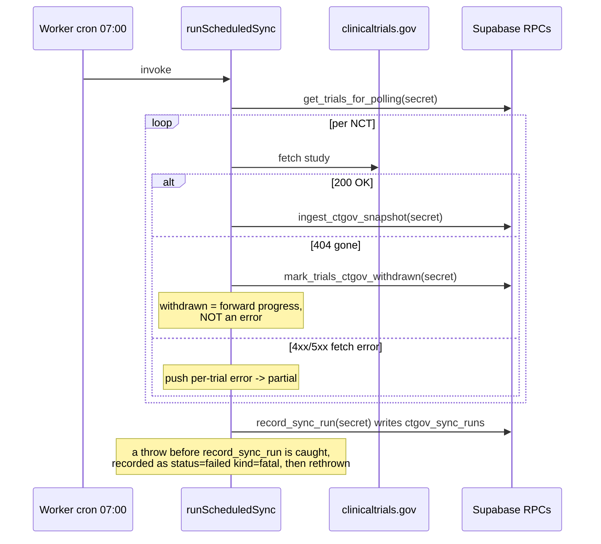
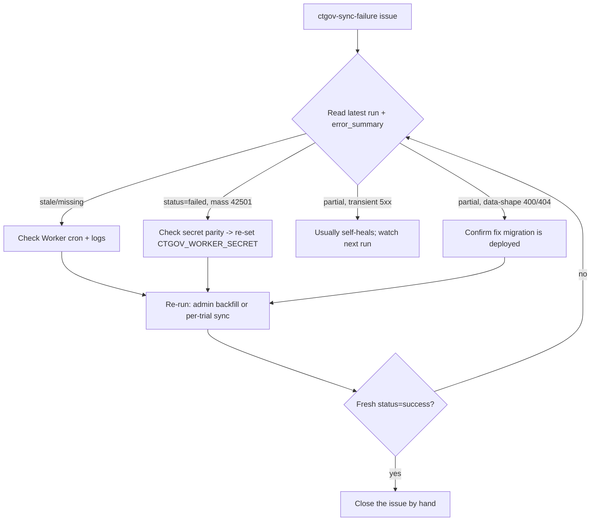

# Observability and Alerting

How the platform tells you something broke, where each failure is recorded, where
you get paged, and exactly how to reconcile and close it. This page is the single
operational reference for monitoring. The CT.gov daily sync is used throughout as
the worked example because it is the most failure-prone moving part, but the alert
model, the channel, and the remediation discipline are platform-wide.

Related: [Disaster Recovery](14-disaster-recovery.md) domain 10 (Detection and
monitoring) is the summary register; this page is the detail. [Backup and
Restore](13-backup-and-restore.md) covers the backup alerts in depth.

## The alert model today

There is one notification channel: **GitHub Issues**. Roughly seven scheduled
GitHub Actions workflows run on GitHub's infrastructure (not inside the app), each
checks one health property, and on failure each opens or updates a deduplicated
issue carrying a distinct label. There is no Slack, email, or PagerDuty wiring
yet, so "getting notified" means watching the repository's Issues tab (filter by
label) or subscribing to issue notifications for the labels below.

Because the checks run on GitHub's infrastructure rather than inside the Cloudflare
Worker or Supabase, they keep working even when the thing they watch is completely
down. That is the point: they are external dead-man's-switches.



## Alert source matrix (platform-wide)

Every row is a scheduled GitHub Actions workflow under `.github/workflows/`. All
alerts land as GitHub Issues; the **label** is how you find and dedupe them.

| Workflow | Schedule (UTC) | Watches | Fails when | Issue label | Where to look first |
|---|---|---|---|---|---|
| `ctgov-sync-health.yml` | `0 9 * * *` | Latest `public.ctgov_sync_runs` row on prod | No rows, or latest is `>26h` old, or status is not `success` | `ctgov-sync-failure` | `ctgov_sync_runs.error_summary`, then Worker logs around 07:00 |
| `ctgov-secret-health.yml` | `0 8 * * *` | `CTGOV_WORKER_SECRET` vs vault `ctgov_worker_secret` on each host (probes `GET /api/ctgov/secret-health`) | A host returns `ok:false` (drift / 42501) or the probe is unreachable | `ctgov-secret-drift` | Re-set the Worker secret to match the vault, then re-dispatch |
| `uptime-check.yml` | `0 */6 * * *` | `clintapp.com`, `dev.clintapp.com` reachability + TLS expiry | HTTP 000/5xx, or cert expires in `<21d` | `uptime-failure` | Cloudflare Worker status, DNS, cert |
| `backup-db.yml` | `0 9 * * *` | Daily prod + dev Postgres dump to R2 + B2 | Any dump/encrypt/upload step fails | `backup-failure` | The failed run log; [13](13-backup-and-restore.md) |
| `backup-verify.yml` | `0 10 * * 1` | Freshness + integrity of newest R2 + B2 bundles | Backup missing, stale, or fails decrypt/row-count | `backup-verify-failure` | The failed run log; [13](13-backup-and-restore.md) |
| `secrets-break-glass.yml` | `0 8 * * 1` | Weekly age-encrypted secrets export to R2 + B2 | Infisical auth/export/upload fails | `secrets-break-glass-failure` | Infisical status; run log |
| `iac-drift.yml` | `30 6 * * *` | OpenTofu live infra vs `infra/tofu/`, Supabase auth-policy parity | Drift detected (exit 2) or check errored (exit 1) | `iac-drift` | `tofu plan` in the run log; [DR program](../superpowers/specs/2026-06-10-dr-program-design.md) |

Two structural facts about all of these, important for triage:

1. **Dedup is by open issue with the label.** On failure the workflow lists open
   issues carrying its label; if one exists it adds a comment, otherwise it creates
   a new issue. So one incident is one issue with a growing comment trail, not a
   flood. (`secrets-break-glass.yml` is the one exception: it creates only if none
   is open and does not comment on an existing one.)
2. **Nothing closes on recovery.** No workflow re-opens or closes its issue when the
   underlying check passes again. A green run is silent. You must close the issue
   by hand after you confirm recovery. This is a known gap (see Recommendations).

## The watcher must live on the default branch

A scheduled workflow (`on: schedule`) and `workflow_dispatch` only run from the
repository's **default branch** (`main`). A watcher merged only to `develop` is
inert: its cron never fires and `gh workflow run` cannot find it. This is not a
hypothetical. As of 2026-06-26, `ctgov-sync-health.yml` had been merged to develop
(PR #88) and was believed live, but it had never reached `main`, so the CT.gov
dead-man's-switch had never actually run while prod sync was failing daily. Any new
watcher must be promoted to `main` to be real. Verify with:

```bash
git cat-file -e origin/main:.github/workflows/<watcher>.yml && echo "active on main"
gh workflow list   # only lists workflows present on the default branch
```

## CT.gov sync: the worked example

### What the pipeline does

The prod Cloudflare Worker `clint` runs a cron `0 7 * * *` that calls
`runScheduledSync`. Dev has `crons: []` (see `wrangler.jsonc`), so **dev never
auto-syncs**; dev runs happen only through the manual triggers below. Each run
writes exactly one row to `public.ctgov_sync_runs`.

Per trial, the run calls `ingest_ctgov_snapshot`, which materializes phase columns,
seeds Trial Start / PCD / Trial End markers, and classifies changes into
`trial_change_events`. A CT.gov 404 routes to `mark_trials_ctgov_withdrawn` (stamps
`ctgov_withdrawn_at`, emits a one-time `trial_withdrawn` event, and excludes the
trial from future polling).



### The durable record: `ctgov_sync_runs`

One row per run. Columns: `started_at`, `ended_at`, `status`
(`success | partial | failed`), `trials_checked`, `ncts_with_changes`,
`snapshots_written`, `events_emitted`, `errors_count`, `error_summary` (jsonb).

Status semantics (`buildSummary` / `buildFatalSummary` in
`src/client/worker/ctgov-sync/poller.ts`):

- **success** when `errors_count = 0`. A 404 withdrawal is success, not an error.
- **failed** when every attempted NCT failed (`successfulNcts = 0` with at least one
  attempted), or when the run threw before recording (a fatal). A fatal records one
  row with `error_summary.errors[0].kind = 'fatal'` and the throw message, then
  rethrows so the Worker log also captures it.
- **partial** when some per-trial errors occurred but at least one NCT succeeded.

`error_summary` is `null` when `errors_count = 0`, otherwise `{ "errors": [...] }`.
Each entry is one of:

| `kind` | Shape | Meaning |
|---|---|---|
| (none) | `{nct_id, trial_id, status, message}` | Per-trial ingest/fetch error. `status` is the HTTP code. |
| `bulk_update_last_polled` | `{kind, status, message}` | The batch watermark update RPC failed. |
| `unknown_nct` | `{kind, nct_id, message}` | Manual backfill requested an NCT with no trial row. |
| `mark_withdrawn` | `{kind, status, message}` | The withdrawn-marking RPC itself failed (not the 404). |
| `fatal` | `{kind, message}` | The run threw before completing; only this row is recorded. |

### Manual triggers

- **POST `/api/ctgov/sync-trial`** ("Sync from CT.gov" button). User JWT; gated by
  `trigger_single_trial_sync()` which requires space `owner` or `editor`. Syncs the
  one resolved NCT.
- **POST `/admin/ctgov-backfill`**. Platform-admin JWT; gated by
  `is_platform_admin()`. Syncs a supplied NCT list.

Both call `runManualBackfill` and write a `ctgov_sync_runs` row exactly like the
cron, so a manual re-run is also the remediation path (below).

### Where each CT.gov failure surfaces

| Failure mode | Durable surface | Proactive notification | Notes |
|---|---|---|---|
| One trial 4xx/5xx on ingest | `status=partial`, entry in `error_summary` | `ctgov-sync-failure` (status not success) | Transient 5xx usually self-heals next run |
| All trials fail (e.g. secret mismatch) | `status=failed`, errors per NCT | `ctgov-sync-failure` | See secret-drift remediation |
| Run throws before recording | one `status=failed` `kind=fatal` row + Worker log | `ctgov-sync-failure` | Pre-fix, this left no row at all |
| Trial removed from CT.gov (404) | `ctgov_withdrawn_at` set, `trial_withdrawn` event; status stays `success` | none (by design) | Excluded from future polling |
| Cron never fires | no new row; latest goes stale | `ctgov-sync-failure` (`>26h` stale) | Only the external watcher catches this |
| Manual NCT not in DB | `unknown_nct` entry | `ctgov-sync-failure` if it dominates | Surfaced, not silently dropped |

There is **no in-app surface**. `get_latest_sync_run()` exists (SECURITY INVOKER,
returns the latest row as jsonb without `error_summary`) but is not wired into any
component; `/activity` just redirects to the events feed. So today the only way to
read sync health is the watchdog issue or a direct DB query.

## Reconciliation and remediation playbook

All queries are read-only and safe. The local Supabase CLI links to **dev**, so use
the Infisical wrapper to reach prod or dev explicitly.

### 1. Read the latest runs and per-trial errors

```bash
# PROD
infisical run --projectId 7c227e8b-b355-46cb-8912-701104e2415b --env prod \
  --recursive --path / -- bash -c \
  'psql "$SUPABASE_PROD_DB_POOLER_URL" -P pager=off -c \
   "select started_at, status, errors_count, jsonb_pretty(error_summary) \
    from public.ctgov_sync_runs order by started_at desc limit 5;"'

# DEV: swap --env dev and $SUPABASE_DEV_DB_POOLER_URL
```

### 2. Classify each error

- **5xx** on a trial: transient CT.gov outage. Retries next run; usually ignore a
  single occurrence. Repeated across days: investigate CT.gov API status.
- **400 invalid date** / **404**: data-shape issues now handled in code (safe
  partial-date parsing; 404 routes to withdrawal). If you still see these on prod,
  the fix has not been deployed (check whether the relevant migration is live).
- **`kind=fatal`**: the run threw early. Read `.message` and the `clint` Worker logs
  for the `{route:'scheduled.ctgov'}` line around 07:00 UTC.
- **Stale / missing**: the cron did not fire or threw before recording. Check the
  Cloudflare Worker (cron trigger present, recent invocations) and the Worker logs.

### 3. Check secret parity (catastrophic failure class)

Every CT.gov RPC calls `_verify_ctgov_worker_secret(p_secret)` as its first
statement; on mismatch it raises `42501` (unauthorized), which fails **every**
ingest and drives the whole run to `failed`. The Worker's runtime secret
`CTGOV_WORKER_SECRET` (set via `wrangler secret put`, not in `wrangler.jsonc`) must
equal the vault secret `ctgov_worker_secret`. The `ctgov-secret-health.yml` watcher
now detects this drift directly (it probes `GET /api/ctgov/secret-health`, which
round-trips the Worker's secret through the `ctgov_secret_health` RPC) and opens a
`ctgov-secret-drift` issue, so you should hear about drift before a sync mass-fails.
To confirm the vault side by hand:

```bash
infisical run --projectId 7c227e8b-b355-46cb-8912-701104e2415b --env prod \
  --recursive --path / -- bash -c \
  'psql "$SUPABASE_PROD_DB_POOLER_URL" -P pager=off -t -c \
   "select left(decrypted_secret,4) from vault.decrypted_secrets where name=\"ctgov_worker_secret\";"'
```

Then compare against the Worker secret (re-set it if they differ):
`cd src/client && npx wrangler secret put CTGOV_WORKER_SECRET` (prod Worker).

### 4. Re-run and close

- Whole queue: **POST `/admin/ctgov-backfill`** (platform admin) with the affected
  NCTs, or run the daily backfill.
- One trial: the **"Sync from CT.gov"** button on the trial (space owner/editor).
- Confirm a fresh `status=success` row, then **manually close the GitHub issue**
  (no workflow closes it for you).



## Known gaps and recommendations (prioritized)

1. **Watcher-on-default-branch promotion lag (process).** Observability and fixes
   merged to `develop` are not live until promoted to `main`. The CT.gov watcher and
   its correctness fixes sat undeployed on prod for days. Recommendation: treat any
   observability/watcher change as needing a prompt `develop -> main` promotion, and
   keep a short list of "watchers that must be on main" with the `git cat-file`
   check above.
2. **Secret drift (addressed).** A `CTGOV_WORKER_SECRET` vs `ctgov_worker_secret`
   mismatch fails every ingest. Now detected by `ctgov-secret-health.yml`, which
   probes `GET /api/ctgov/secret-health` on each host (the Worker round-trips its
   secret through the `ctgov_secret_health` RPC) and opens a `ctgov-secret-drift`
   issue, separate from the staleness check so the cause is named. Caveat: like any
   watcher it only runs on schedule once on `main` (gap 1), and it needs the route
   deployed on each host first.
3. **No in-app status surface.** `get_latest_sync_run()` is unwired and
   `error_summary` has no UI. Recommendation: a small platform-admin "Sync status"
   panel (last run, status, error count, top errors) so health is visible without a
   DB query. Wire the existing RPC; add an `error_summary`-returning variant.
4. **Watchdog latency and scope.** The check runs once daily and only against prod,
   with a 26h staleness window, and its unhealthy path is not exercisable on demand
   (no `target`/`simulate` dispatch input). Recommendation: add `workflow_dispatch`
   inputs to point at dev and to simulate stale/bad-status/no-rows, so the alert path
   is provable without breaking prod; consider a tighter cadence.
5. **No close-on-recovery anywhere.** Resolved incidents stay open and look active.
   Recommendation: add a recovery job to each watcher that closes (or comments
   "recovered" and closes) the labeled issue when the check passes.
6. **Alert tiering / fatigue.** `ctgov-sync-failure` fires on `partial` as loudly as
   on `failed`. A chronically-partial sync (one stuck trial) pages every day.
   Recommendation: distinguish `failed`/stale (page) from `partial` (digest or
   threshold), or auto-resolve a partial whose only errors are known-benign.

## Verification log

Each surface below was exercised against real systems on 2026-06-26. Evidence is
recorded so the alerting is proven, not assumed.

| Surface | How exercised | Result | Evidence |
|---|---|---|---|
| Partial (per-trial error) | Observed live on prod cron runs | `status=partial`, 3 errors (the `2026-04` date-400 on NCT05929066 x2 + NCT04882961 404) | `ctgov_sync_runs` 2026-06-23 07:00 |
| Fatal (throw before record) | Worker unit test | `status=failed`, `errors[0].kind=fatal`, then rethrows | `worker/test/ctgov-sync/poller.spec.ts:586` (11/11 pass) |
| Missed / stale + watchdog | Dispatched `ctgov-sync-health` on `main` vs real prod (latest row 63h old) | `check` job failed: "latest CT.gov sync run is 63h old (> 26h)"; `notify-failure` opened issue | GitHub issue #100, label `ctgov-sync-failure` |
| Dedup (no duplicate issue) | Second dispatch of the same watchdog | Commented on #100; still exactly one open issue | #100 comment trail |
| Happy path (success) | Manual "Sync from CT.gov" on prod after the fix | `status=success`, `errors_count=0` (4 trials, no errors) | prod `ctgov_sync_runs` 2026-06-26 14:48 |
| Withdrawn (404) | Same prod run, NCT04882961 (404 on CT.gov) | `ctgov_withdrawn_at` set + one `trial_withdrawn` event; not an error; excluded from queue | prod `trials` + `trial_change_events` (NCT04882961, withdrawn=t, events=1) |
| Recovery + no auto-close | Re-dispatched `ctgov-sync-health` after the fresh success row | `check` passed (green); issue #100 stayed open and was closed by hand | watchdog run 28245654307; #100 closed 2026-06-26 14:49 (confirms gap 5) |

### Worked incident (2026-06-26): observability caught a real failure

This release exercised the whole chain end to end against production, not a drill:

1. The CT.gov watcher and the `buildFatalSummary` fix were merged to `develop` (PR
   #88) but never promoted to `main`, so the watcher's cron never ran (gap 1). Live
   prod was chronically `partial` and 63h stale, unmonitored.
2. Promoting `develop` to `main` (PR #99) activated the watcher. Dispatching it
   against real prod immediately opened issue #100 on the genuine staleness, then
   deduped on a second run.
3. The same promotion's prod deploy then failed at `db push` on
   `20260625200000` (a `create or replace` that omitted the `drop function` the
   original `20260502120600` used, hitting `42P13` against prod's drifted 4-column
   `get_trials_for_polling`). The Worker/SPA deploy was skipped, leaving prod schema
   ahead of app code. Fix: PR #102 restored the drop + grants, verified against a
   real 4-column base; the re-deploy applied cleanly and brought prod consistent.

Takeaways now folded into the gaps above: watchers must be on `main` to run (gap 1),
and a failed `db push` mid-release leaves a schema/app skew that needs an immediate
roll-forward or restore.

---

*Last updated: 2026-06-26*
