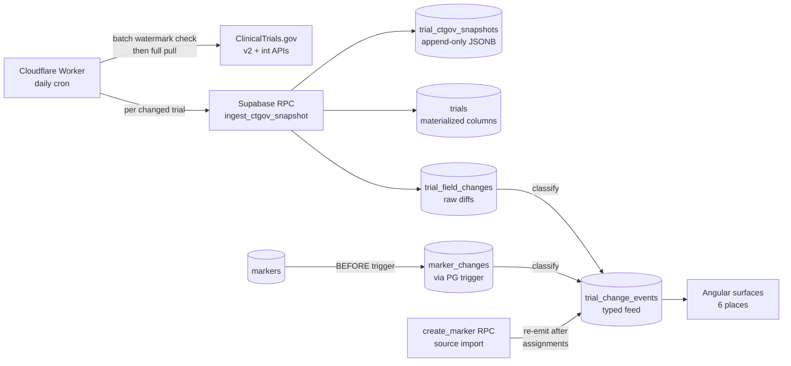

# Trial change feed

A unified, typed event stream that captures every meaningful update to a trial: both CT.gov-derived (overall recruitment status, primary completion date, design fields, etc.) and analyst-derived (marker added, edited, deleted). A daily Cloudflare Worker pulls fresh CT.gov payloads and a BEFORE trigger on `markers` writes audit rows; both feed a single `trial_change_events` table that the UI reads from in six places. See [docs/superpowers/specs/2026-05-02-trial-change-feed-design.md](../superpowers/specs/2026-05-02-trial-change-feed-design.md).

Four-stage pipeline: observe, store, classify, surface. Three sources feed the event stream: `ctgov` (automated CT.gov polling), `analyst` (manual marker edits via the UI), and `source_import` (AI-extracted markers committed via source import). The activity page exposes all three as filter chips.



**Surfaces.** The same `trial_change_events` rows render in:

- **Unified Events page** at `/t/:tenantId/s/:spaceId/events?source=detected`: detected change events appear as a third source type alongside analyst events and markers. The standalone `/activity` route has been retired and redirects to `/events?source=detected` via `activityRedirectGuard`.
- **What-changed widget** on the engagement landing: top recent events at a glance, with entity context labels per row and an asset count summary. The widget links to `/events?source=detected` (previously linked to `/activity`).
- **Trial row badges** on the timeline and tables: small change-count dots per trial. When the most-recent change is a detected/analyst event (not an intel note), the dot is a button that deep-links to that exact event in the Events page via `?detectedId=<changeEventId>`; the dashboard and bullseye RPCs surface `most_recent_change_event_id` for this, and `get_events_page_data` resolves a single detected row via `p_change_event_id`. Intel-only dots are non-interactive.
- **Marker history panel** on the marker detail panel: analyst-side audit trail per marker.
- **Intel feed mixing** in the existing intelligence feed: change events interleave with primary intelligence rows.
- **Trial-detail Activity section**: per-trial change log on the trial detail page.

**Annotations.** Analysts can attach notes to detected change events via `AnnotationService` (CRUD backed by `upsert_change_event_annotation` / `delete_change_event_annotation`). One annotation per change event (upsert semantics). The annotation body is the deliverable for the advisory use case: analysts attach context to detected CT.gov changes. The detail panel for detected events shows structured change detail plus annotation CRUD (create, edit, delete). Annotations are stored in the `change_event_annotations` table with a UNIQUE constraint on `change_event_id`.

**Row treatment.** Every surface above renders rows through the shared `app-change-event-row` component. The row is **summary-led**: the structured change text reads first in slate-900, with a quieter identity sub-line beneath. The sub-line is a 16px company logo tile (real `companies.logo_url` joined into `get_activity_feed` and `get_trial_activity`, with a deterministic slate-tinted monogram fallback keyed off the company name hash so the same sponsor always renders the same tile), the product or trial name, a relative time (`Nm ago` / `Nh ago` / `Nd ago`, with the absolute timestamp surfaced on `pTooltip` hover), and the source chip pushed right. The event-type icon stays on the left for categorical recognition only -- it is painted slate-400 and no longer accent-coloured. NCT and the full timestamp are not shown in the row; the trial identifier lives on the link target and the timestamp lives on the tooltip.

The summary text is structured via `summarySegmentsFor()` in `shared/utils/change-event-summary.ts` (`plain` / `old` / `new` / `arrow` / `muted`). The template renders `old` with strikethrough + slate-300 line color and `new` bold + tinted. **Color is inherited from existing taxonomies, not invented**: `phase_transitioned` events take the destination phase color from `PHASE_COLORS` (so a P2 → P3 transition reads in the same teal as the P3 phase bar); `marker_*` events take the marker's category color via `marker_color` (joined from `marker_types.color`, with a `marker_changes` fallback for deleted markers); every other event type stays slate-700. The colored new-value is the single carrier of color meaning in the row -- the icon does not double the encoding.

## Capabilities

```yaml
- id: trial-change-feed-pipeline
  summary: Four-stage observe-store-classify-surface pipeline ingesting CT.gov snapshots and analyst marker changes into typed trial_change_events.
  routes: []
  rpcs:
    - ingest_ctgov_snapshot
    - _log_event_change
    - _classify_change
    - _compute_field_diffs
    - recompute_trial_change_events
  tables:
    - trial_change_events
    - trial_field_changes
    - trial_ctgov_snapshots
    - event_changes
    - events
    - trials
  related:
    - ctgov-snapshot-ingest
  user_facing: false
  role: viewer
  status: active
- id: trial-change-feed-unified-events
  summary: Detected change events surfaced via get_events_page_data as source_type='detected', with amber badge, rich summary rendering, signal bar, and annotation indicator. The events-feed page UI is de-routed pending the Stage 3 Events->Activity rework; the read RPC remains live.
  routes: []
  rpcs:
    - get_events_page_data
    - upsert_change_event_annotation
    - delete_change_event_annotation
  tables:
    - trial_change_events
    - change_event_annotations
    - companies
    - assets
    - trials
  related:
    - trial-change-feed-pipeline
    - event-feed
  user_facing: true
  role: viewer
  status: active
- id: trial-change-feed-what-changed-widget
  summary: Engagement-landing widget showing top recent change events at a glance, with entity context labels per row and asset count summary. Links to /events?source=detected.
  routes:
    - /t/:tenantId/s/:spaceId
  rpcs:
    - get_activity_feed
  tables:
    - trial_change_events
  related:
    - engagement-landing-what-changed
  user_facing: true
  role: viewer
  status: active
- id: trial-change-feed-row-badges
  summary: Small change-count chips per trial rendered on the timeline and tables.
  routes:
    - /t/:tenantId/s/:spaceId/timeline
  rpcs:
    - get_dashboard_data
    - recent_change_window
  tables:
    - trial_change_events
  related:
    - timeline-grid
  user_facing: true
  role: viewer
  status: active
- id: trial-change-feed-marker-history
  summary: Analyst-side audit trail of event edits surfaced on the event detail panel.
  routes:
    - /t/:tenantId/s/:spaceId/catalysts
  rpcs: []
  tables:
    - event_changes
    - events
  related:
    - event-detail
  user_facing: true
  role: viewer
  status: active
- id: trial-change-feed-intel-mixing
  summary: Change events interleave with primary intelligence rows in the existing intelligence feed.
  routes:
    - /t/:tenantId/s/:spaceId/intelligence
  rpcs:
    - list_primary_intelligence
    - get_activity_feed
  tables:
    - primary_intelligence
    - trial_change_events
  related:
    - primary-intelligence-feed
  user_facing: true
  role: viewer
  status: active
- id: trial-change-feed-trial-detail
  summary: Per-trial change log section on the trial detail page.
  routes:
    - /t/:tenantId/s/:spaceId/profiles/trials/:id
  rpcs:
    - get_trial_activity
  tables:
    - trial_change_events
  related:
    - manage-trials
  user_facing: true
  role: viewer
  status: active
- id: trial-change-feed-row-component
  summary: Shared summary-led row component with logo tile, relative time, source chip, and inherited-taxonomy color rules for phase and marker events.
  routes: []
  rpcs: []
  tables:
    - trial_change_events
    - companies
    - event_types
  related:
    - trial-change-feed-unified-events
    - trial-change-feed-what-changed-widget
    - trial-change-feed-marker-history
  user_facing: true
  role: viewer
  status: active
```
