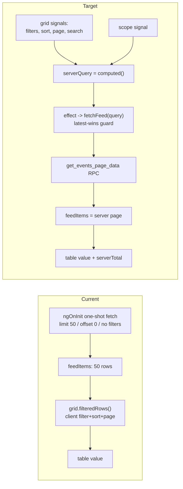

# Events Feed: Hierarchical Scope + Server-Driven Rewrite

## Summary

This spec combines two overlapping bodies of work on the Events page
(`/t/:tenantId/s/:spaceId/events`), both of which rewrite the same RPC
(`get_events_page_data`) and the same component, so they are specified and
shipped as one change:

1. **Hierarchical scope (the CagriSema defect).** Clicking an asset's
   "Marker removed (+N more)" pill on the landscape detail panel should land on
   the events page showing *that asset's* recent changes. Today it does not,
   for two reasons: the pill carries no entity scope, and even with a scope the
   RPC's marker and detected-change legs only honor a `trial` scope -- they do
   not roll up to `product`/`asset` or `company`, so an asset-scoped feed is
   silently empty of markers and detected changes. The analyst-event leg
   already rolls up; markers and detected do not.

2. **Server-driven feed (the 50-row defect).** The page fetches only the 50
   most-recent rows once, then filters/sorts/paginates client-side, so any row
   outside that window is unreachable and filtering on a source type silently
   hides real data. Search, sort, and pagination move into the RPC.

It also normalizes the **Entity column** so every row consistently states what
it belongs to (a level badge + the most-specific entity name + the parent
path), since the legs currently emit the hierarchy inconsistently (markers emit
the trial, detected emit the asset, events vary).

This builds on the already-committed entity-scope work (`8cc91267`:
`features/events/entity-scope.ts`, the `scope` signal, `buildFilters()`,
`clearScope()`, the scope banner, `shared/pipes/entity-noun.pipe.ts`). That work
stays; this spec extends it. It supersedes the draft `events-server-driven-feed`
spec, which is folded in here (its directory may be removed).

## Motivation

### Markers and detected changes do not roll up to asset/company scope

`get_events_page_data` is a three-leg union. Leg 1 (analyst events) scopes
`product`/`asset` and `company` by rolling trial-level rows up to their asset
and company (`a_via_trial.id = p_entity_id`, etc.). Leg 2 (markers) and leg 3
(detected `trial_change_events`) gate on `p_entity_level is null or
p_entity_level = 'trial'`, and leg 3's id filter is only `ce.trial_id =
p_entity_id`. So scoping the feed to an asset returns analyst events but drops
every marker and detected change beneath it. This is why the scope banner copy
"scoped to this asset **and everything beneath it**" (shipped with `8cc91267`)
is only half true, and why a CagriSema-scoped feed would show none of the
"Marker removed" changes the pill counts.

### The pill carries no scope

`bullseye-detail-panel.component.ts#openChangeEvent` navigates to
`/events?detectedId=<id>` -- it opens one change in the detail panel on top of
the global, unscoped feed. The grid's client-side state then rewrites the URL to
`?sort=-feed_ts`, leaving the list unscoped. The user sees one event opened over
"all events," not the asset's change list.

### The page can only ever see 50 rows

`events-page.component.ts` calls `getEventsPageData(spaceId, buildFilters(),
PAGE_SIZE=50, 0)` once and binds `[value]="visibleRows()"` where `visibleRows =
grid.filteredRows(feedItems)` filters/sorts/pages **client-side** over those 50
rows. `grid.onLazyLoad` only mutates local grid signals; it never re-queries.
The 50 rows are the 50 most-recent across all three source types, so detected
CT.gov changes crowd out analyst events: filtering Source=Event surfaces a
handful and cannot reach an event older than the cutoff. The top-bar
`serverTotal` and the paginator's `grid.totalRecords()` also diverge once a
space exceeds 50 feed items.

### The Entity column reports the hierarchy inconsistently

Leg 2 sets `entity_name` to the trial, leg 3 sets it to the asset, leg 1 varies
by level. There is no consistent "what is this row about" cell and no way to see
that a detected change sits under a given asset.

## Goals

- An asset's "Marker removed (+N more)" pill lands on the events page scoped to
  that asset and filtered to detected changes, with the most-recent change open
  in the detail panel.
- `get_events_page_data` rolls **all three legs** up consistently for `trial`,
  `product`/`asset`, and `company` scope (space-level scope still excludes
  markers/detected, which always belong to a trial).
- The events page is fully server-driven: filters, free-text search, sort, and
  pagination all execute in the RPC; the paginator total equals the true total.
- The Entity column renders consistently: a level badge (Company / Asset /
  Trial / Industry, using the existing `entityNoun` mapping), the most-specific
  entity name, and the parent path trailing muted (design option C).
- Preserve the committed entity-scope behavior (`scope` signal, banner,
  `clearScope()`, "See all" deep-link). With the rollup fix, "See all" now
  correctly shows markers and detected changes beneath the entity.

## Non-Goals

- **A dedicated toolbar company -> asset -> trial filter control.** Deferred.
  Server-side global search (covering entity/company) plus the existing scope
  mechanism (set by pill / "See all", cleared by the banner) cover the need;
  revisit only if hand-driven hierarchy filtering is still wanted after this
  ships.
- Multi-entity scope (comparing two assets at once); scope stays single-path.
- Migrating the other `createGridState` grids (trials, assets, companies,
  catalysts, marker-types) to server-side -- they stay client-side.
- Infinite scroll / cursor pagination -- offset/limit is retained.
- Changing the detail panel internals, event create/edit form, threads, or
  annotations (beyond the Entity-cell rendering).

## Design

### Current vs. target component architecture



### RPC changes (`get_events_page_data`) -- one migration

Base the new migration on the canonical body in
`supabase/migrations/20260530210311_add_change_event_navigation.sql` (12 params
incl. `p_change_event_id`; emits `feed_ts`; date filters on `feed_ts::date`;
ordered `feed_ts desc, id desc`). `drop function` the current 12-arg signature
and recreate it with the changes below, then re-issue
`revoke` / `grant execute` (anon, authenticated) / `comment on function` for the
new signature.

**(a) Hierarchical scope rollup for markers + detected.** Bring legs 2 and 3 in
line with leg 1:

- Leg 2 (markers): change the level gate from `(p_entity_level is null or
  p_entity_level = 'trial')` to `(p_entity_level is null or p_entity_level in
  ('trial','product','asset','company'))`. The id filter already rolls up
  (`t.id = p_entity_id or a.id = p_entity_id or co.id = p_entity_id`).
- Leg 3 (detected): same level-gate change, and extend the id filter from only
  `ce.trial_id = p_entity_id` to also `a.id = p_entity_id or co.id =
  p_entity_id` (the joins to `assets a` and `companies co` already exist).
- Space-level scope (`p_entity_level = 'space'`) continues to exclude markers
  and detected, which always belong to a trial.

**(b) Normalized hierarchy output for the Entity cell.** All three legs return a
consistent set so the column can render option C and so scope/links work:
`entity_level` (the row's own level), `entity_name` (the row's own-level name),
`entity_id` (own-level id), `company_id`, `company_name`, `asset_id`,
`asset_name`, `trial_id`, `trial_name`. Concretely:

- Leg 3 (detected) currently sets `entity_name` to the asset (`a.name`); change
  it to the **trial** name (`coalesce(t.acronym, t.name)`) with
  `entity_level = 'trial'`, and surface `asset_id`/`asset_name` as the parent.
- Leg 2 (markers): keep `entity_name` = trial; add `asset_id`/`asset_name`.
- Leg 1 (events): ensure `company_name`/`asset_name` are populated as parents
  regardless of the row's own level.
- `asset_name`, `trial_name`, `trial_id` are new output keys (additive).

**(c) Search + sort (from the folded server-driven spec).** Add three trailing
params: `p_search text default null`, `p_sort_field text default 'feed_ts'`,
`p_sort_dir text default 'desc'`.

- **Search.** Wrap `unified_feed` in a `filtered` CTE so the predicate applies to
  all three legs: `p_search is null or (title ilike '%'||p_search||'%' or
  category_name ilike ... or entity_name ilike ... or coalesce(company_name,'')
  ilike ... or coalesce(asset_name,'') ilike ... or
  coalesce(change_event_type,'') ilike ...)`. Including `asset_name` means a
  search for an asset surfaces its trial-level rows too (covers the
  discovery case the dropped toolbar filter would have served).
- **Sort.** Replace the fixed `order by` with a whitelisted case-based ORDER BY:
  `feed_ts | title | category_name | entity_name | priority | source_type` (the
  grid's `entity_display` column maps to `entity_name`); anything else falls
  back to `feed_ts`. Honor `asc|desc`, `nulls last`, tiebreak `id desc`. Apply
  the same ordering in both the `counted` CTE and the final
  `jsonb_agg(... order by ...)` so item order matches page order.

**(d) Category across legs.** Verify `p_category_ids` filters the markers leg
(`mc.id`) as well as events (`ec.id`); fix it here if it does not, so the
Category select does not silently drop markers.

**(e) Smoke block.** Add a `do $$ ... raise exception` block (repo convention,
see `20260530210311`) asserting: an asset-scoped call returns a marker and a
detected change from a child trial (rollup); `p_search` narrows; `p_sort_field
=> 'title'` reorders vs default.

**(f) Backward compatibility.** `entity-events-panel.service.ts` and
`EventService.getDetectedEvent` call the RPC without the new params; defaults
preserve their behavior. Run `supabase db advisors --local --type all` after.

### Model + service

- `core/models/event.model.ts`:
  - extend `EventsPageFilters` with `search: string | null`, `sortField: string
    | null`, `sortDir: 'asc' | 'desc' | null`;
  - extend `FeedItem` with `asset_name: string | null`, `trial_id: string |
    null`, `trial_name: string | null` (additive; existing fields unchanged).
- `core/services/event.service.ts` `getEventsPageData`: pass `p_search`,
  `p_sort_field (?? 'feed_ts')`, `p_sort_dir (?? 'desc')`. The `RpcCache` key
  already includes the full `filters` object plus `limit`/`offset`; the
  `space:${spaceId}:events` tag still invalidates on create/delete.

### Component: reactive server fetch (`events-page.component.ts`)

- New pure, unit-testable mapper `features/events/server-query.ts` (mirrors
  `entity-scope.ts`): `buildServerQuery(gridFilters, gridSort, gridPage, search,
  scope, spaceId) -> { filters: EventsPageFilters, limit, offset }`. Mapping:
  - `sourceType` <- `filters['source_type'].values[0] ?? null`
  - `priority` <- `filters['priority'].values[0] ?? null`
  - `categoryIds` <- `filters['category_name'].values ?? []`
  - `dateFrom`/`dateTo` <- `filters['feed_ts'].{from,to}` as `yyyy-MM-dd`
  - `search` <- debounced global search (empty -> null)
  - `entityLevel`/`entityId` <- `scope`
  - `sortField` <- `sort.field`; `sortDir` <- `sort.order === -1 ? 'desc' : 'asc'`
  - `limit` <- `page.rows`; `offset` <- `page.first`
- Make `spaceId` a `signal<string>` so its first value kicks off the initial
  fetch. Replace the one-shot `loadInitialData`/`loadFeed` with:
  - `serverQuery = computed(() => buildServerQuery(grid.filters(), grid.sort(),
    grid.page(), grid.debouncedGlobalSearch(), scope(), spaceId()))`;
  - an `effect` that fetches on `serverQuery()` change, guarded by `if
    (!q.spaceId) return`, with a monotonic request id (latest-wins) and a
    skip-if-identical-query check;
  - on success `feedItems.set(items)`, `serverTotal.set(total)`.
- Category options still load once in `ngOnInit`.
- `clearScope()` keeps its URL/banner logic but drops the explicit `loadFeed()`
  (clearing `scope` changes `serverQuery`, so the effect refetches).
- `onSaved`/`onDeleteEvent`/`onAnnotationChanged`: replace `loadFeed()` with a
  `reloadTick` signal bump that `serverQuery` depends on, after the mutating
  service call invalidates the cache tag.
- Remove `visibleRows = grid.filteredRows(...)` and `PAGE_SIZE`.

### Entity cell (option C)

A small presentational piece (inline in the events row template, or a tiny
`entity-cell` component reused by the row) renders, per row:

- a level **badge** = `entity_level | entityNoun` (Asset / Trial / Company; map
  `space` -> "Industry"), styled like the existing teal data-tag;
- the most-specific **value** = `entity_name`;
- the **parent path** trailing muted: join the non-null parents above the row's
  level -- for a trial row, `company_name / asset_name`; for an asset row,
  `company_name`; for a company/industry row, nothing.

It uses the normalized RPC fields; no client-side level inference.

### Template (`events-page.component.html`)

- Bind `[value]="feedItems()"` and `[totalRecords]="serverTotal()"`. Keep
  `[lazy]`, `(onLazyLoad)="grid.onLazyLoad($event)"`,
  `[filters]="grid.primengFilters()"`, the toolbar, active-filter chips, and the
  scope banner.
- Source and Priority columns: unchanged (selects).
- Title column: remove the `type="text"` column filter; keep `pSortableColumn`.
- Entity column: remove the `type="text"` column filter; keep `pSortableColumn`;
  render the Entity cell (option C) instead of `getEntityDisplay`.
- Category column: replace the `type="text"` filter with a `p-select` from
  `allCategoryOptions()`, `matchMode="in"` (mirror Source).
- Empty-state copy (driven by `grid.isFiltered()`) unchanged.

### Pill + badge scoping (landscape)

- `bullseye-detail-panel.component.ts#openChangeEvent`: navigate to the events
  page with `queryParams: { entityLevel: 'product', entityId:
  selectedAsset()?.id, source: 'detected', detectedId: changeEventId }`. Result:
  the feed is scoped to the asset (now including its trials' detected changes
  via the rollup), filtered to detected, with the most-recent change open.
- `change-badge.component.ts` (the trial-row recent-change dot): add optional
  `entityLevel` / `entityId` inputs; when present, include `entityLevel` /
  `entityId` / `source=detected` alongside `detectedId` so the trial dot scopes
  to its trial. Callers that omit the inputs keep today's single-event
  deep-link. The asset trial-list rows pass the trial id.

## Related capabilities

- **Unified Feed Merge** (`docs/specs/unified-feed-merge/`): defined the
  three-source feed and the `get_events_page_data` shape.
- **Events System** (`docs/specs/events-system/`): the originating model.
- **Entity scope (committed `8cc91267`)**: `features/events/entity-scope.ts` +
  banner; this spec depends on it and must not regress `clearScope()` or the
  "See all" deep-link.
- Supersedes the draft `events-server-driven-feed` spec.

## Tasks

```yaml
tasks:
  - id: rpc
    title: Rework get_events_page_data (rollup + normalized output + search/sort)
    domain: database
    description: |
      New migration based on the canonical body in
      20260530210311_add_change_event_navigation.sql. Drop the 12-arg
      signature; recreate with p_search, p_sort_field ('feed_ts'),
      p_sort_dir ('desc').
      (a) Roll up legs 2 (markers) and 3 (detected) to trial/product/asset/
      company scope: widen the level gate to
      (p_entity_level is null or p_entity_level in
      ('trial','product','asset','company')); extend leg 3's id filter to also
      match a.id and co.id. Space-level still excludes markers/detected.
      (b) Normalize output across legs: entity_level/entity_name = the row's own
      level + name; add company_id/name, asset_id/asset_name, trial_id/
      trial_name. Detected leg: entity_name -> trial (coalesce(t.acronym,
      t.name)), entity_level 'trial', asset as parent. Markers leg: add
      asset_id/asset_name.
      (c) Add a `filtered` CTE applying p_search ILIKE across title/
      category_name/entity_name/company_name/asset_name/change_event_type.
      (d) Replace fixed ORDER BY with a whitelisted case-based sort
      (feed_ts|title|category_name|entity_name|priority|source_type), nulls
      last, tiebreak id desc, in both `counted` and the jsonb_agg.
      (e) Verify/fix p_category_ids on the markers leg.
      Re-issue revoke/grant/comment for the new signature. Add a smoke do-block
      asserting an asset scope returns a child-trial marker + detected change,
      p_search narrows, and p_sort_field='title' reorders.
      Verify: supabase db reset && supabase db advisors --local --type all
    estimate: large
    depends_on: []

  - id: model-service
    title: Extend EventsPageFilters + FeedItem + getEventsPageData
    domain: frontend
    description: |
      Add search/sortField/sortDir to EventsPageFilters and asset_name/
      trial_id/trial_name to FeedItem in core/models/event.model.ts. Pass
      p_search, p_sort_field (?? 'feed_ts'), p_sort_dir (?? 'desc') in
      EventService.getEventsPageData. No change to the RpcCache key shape.
      Verify: cd src/client && ng lint && ng build
    estimate: small
    depends_on: [rpc]

  - id: server-query
    title: Add buildServerQuery mapper + unit spec
    domain: frontend
    description: |
      New pure helper features/events/server-query.ts mapping grid filters/
      sort/page + debounced search + scope + spaceId to { filters, limit,
      offset } per the Design mapping. Paired server-query.spec.ts covering
      every filter kind, scope present/absent, sort asc/desc, empty search,
      page->limit/offset.
      Verify: cd src/client && npm run test:units
    estimate: small
    depends_on: [model-service]

  - id: component
    title: Rewire events page to reactive server fetch
    domain: frontend
    description: |
      In events-page.component.ts: make spaceId a signal; add serverQuery =
      computed(buildServerQuery(...)); add an effect that fetches on change with
      a latest-wins request-id guard and identical-query dedupe; set feedItems +
      serverTotal. Load category options once in ngOnInit. Update clearScope()
      and onSaved/onDeleteEvent/onAnnotationChanged to refetch via the reactive
      path (reloadTick) instead of loadFeed(). Remove visibleRows and PAGE_SIZE.
      Preserve scope wiring.
      Verify: cd src/client && ng lint && ng build
    estimate: medium
    depends_on: [server-query]

  - id: entity-cell
    title: Render the Entity column as level badge + name + parent path (option C)
    domain: frontend
    description: |
      Add the Entity cell rendering (inline or a small entity-cell component):
      badge = entity_level | entityNoun (space -> "Industry"); value =
      entity_name; muted trailing parents (company_name / asset_name as
      applicable to the row's level). Uses the normalized RPC fields. Add a
      unit spec for the parent-path logic if extracted to a pure function.
      Verify: cd src/client && ng lint && ng build && npm run test:units
    estimate: small
    depends_on: [model-service]

  - id: template
    title: Bind table to server rows; adjust column filters; mount Entity cell
    domain: frontend
    description: |
      In events-page.component.html: [value]="feedItems()",
      [totalRecords]="serverTotal()". Remove the Title and Entity type="text"
      column filters (keep pSortableColumn). Convert the Category column filter
      to a p-select from allCategoryOptions() with matchMode="in". Render the
      Entity cell (option C) in the Entity column. Keep lazy/onLazyLoad/
      primengFilters, toolbar, chips, scope banner.
      Verify: cd src/client && ng lint && ng build
    estimate: small
    depends_on: [component, entity-cell]

  - id: pill-scope
    title: Scope the landscape change pill + trial badge to the entity
    domain: frontend
    description: |
      bullseye-detail-panel.component.ts#openChangeEvent: navigate with
      queryParams { entityLevel: 'product', entityId: selectedAsset()?.id,
      source: 'detected', detectedId }. change-badge.component.ts: add optional
      entityLevel/entityId inputs; when present include them + source=detected
      with detectedId; asset trial-list rows pass the trial id. Omitting inputs
      preserves the existing single-event deep-link for other callers.
      Verify: cd src/client && ng lint && ng build
    estimate: small
    depends_on: [component]

  - id: verify
    title: End-to-end verification on local Supabase
    domain: frontend
    description: |
      With a space whose feed exceeds one page and has detected/marker rows
      pushing an analyst event past row 50: clicking an asset's
      "Marker removed (+N more)" lands scoped to the asset, list shows its
      markers + detected (rollup) with the most-recent open; Source=Event
      surfaces an off-page event; paginating changes rows (server offset);
      global-searching a term only in an off-page event surfaces it; sorting by
      Title/Category is correct across pages; Entity column shows badge + name +
      parent path consistently across all three source types; "See all" from a
      detail Events panel scopes the feed (now incl. markers/detected) and
      "View all events" clears it; top-bar count equals paginator total.
      Verify: supabase db advisors --local --type all && cd src/client && ng lint && ng build && npm run test:units
    estimate: small
    depends_on: [template, pill-scope]
```
