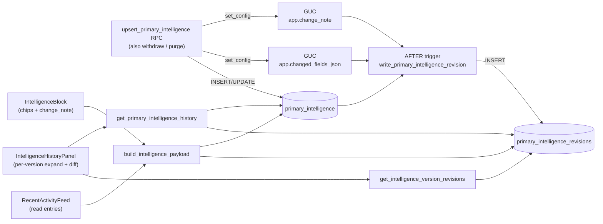
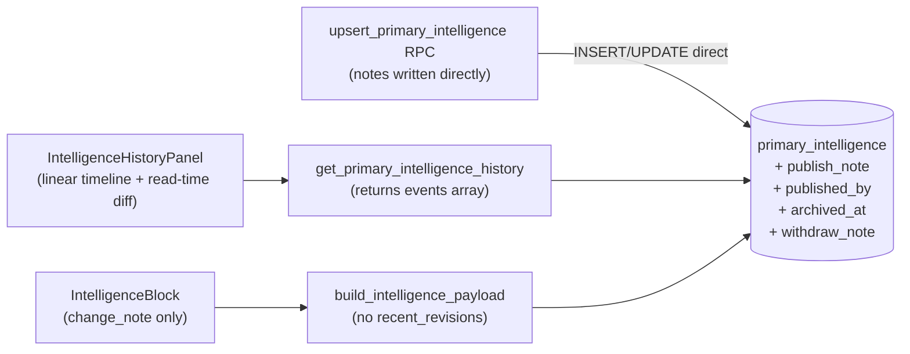

# Intelligence history simplification

## Summary

Replace the snapshot-revisions audit log that backs the primary intelligence history panel with a single linear timeline derived from version rows. Each version's lifecycle event (draft started, published, archived, withdrawn) becomes a column on the version row itself, not a row in a separate log table. The per-version revision diff toggle (`Show edits within this version`) is replaced with an always-on word-level inline diff between each published version and the most recent prior non-withdrawn published version.

The current design has three concrete pain points this fixes:

1. **GUC bleed-through.** `app.change_note` is set on the session before `upsert_primary_intelligence` runs both an archive UPDATE on the prior published row and an UPDATE/INSERT on the new version. The trigger that writes the revision log captures the same note on both writes, so a withdrawn or archived version's history surfaces the *next* version's change_note. Confusing in UI, technically incorrect.
2. **State-flip noise.** The revision log records every write to a version row, including state flips caused by neighboring versions publishing. The diff panel walks those revisions pairwise and renders an entry for each, producing empty "May 10 -> May 10" rows whenever the only thing that changed was state.
3. **Conceptual overhead.** The "history of this version" conflates content edits, lifecycle events, and side effects from other versions. Reasoning about what a revision row means requires knowing the GUC plumbing, the trigger, and the RPC's sequencing.

The new design treats each version as a frozen snapshot. The timeline is a flat list of events sorted by time, and the diff is computed at read time from two version rows. No GUC, no trigger, no log table.

## Goals

- Replace the per-version expand-diff panel with a single linear event timeline per anchor.
- Show a word-level inline diff (additions in `<ins>`, removals in `<del>`) between each published version and its diff base.
- Define the diff base as the most recent prior published version that is *not* withdrawn. Withdrawn versions are skipped when picking the diff base.
- Drop `primary_intelligence_revisions`, its trigger `write_primary_intelligence_revision`, and both session GUCs (`app.change_note`, `app.changed_fields_json`).
- Store change notes directly on the version row they describe (`publish_note`, `withdraw_note`) so notes can never bleed across versions.
- Backfill the new columns from the soon-to-be-dropped revision log, then drop the log in the same migration.
- Update the `IntelligenceBlock` change-note display to source from `publish_note`; drop its "Updated [Thesis | Implications]" chip row.
- Delete `RecentActivityFeedComponent` (the now-redundant per-detail-page activity feed).

## Non-Goals

- Changes to how draft autosaves work in `IntelligenceDrawerComponent`. The drawer continues to update the in-progress draft row in place; we just stop snapshotting each save into a revisions log. Intermediate draft state is not recoverable after publish.
- A redesigned activity feed at the engagement-landing level. The "Latest from Stout" feed (`IntelligenceFeedComponent`) and engagement-landing widgets are out of scope; only the per-entity `RecentActivityFeedComponent` is being deleted.
- Withdraw/purge dialog behavior, RLS scope, or anchor-purge semantics. The `withdraw_primary_intelligence` and `purge_primary_intelligence` RPCs keep their existing signatures and authorization rules; only the GUC plumbing is removed.
- Multi-author collaborative drafting, AI-assisted drafting, inline material references — all still v2 concerns.
- History/diff for any other entity (markers, materials, etc.). Primary intelligence is the only consumer of this pattern today.

---

## Architecture Overview

### Before (current state)



### After (proposed)



The dropped boxes (`primary_intelligence_revisions`, the trigger, both GUCs, `get_intelligence_version_revisions`, `RecentActivityFeedComponent`) are gone entirely in the new architecture.

---

## Data Model

### `primary_intelligence` (modified)

Four new columns. No new constraints beyond what's stated. All RLS policies stay unchanged.

```sql
alter table public.primary_intelligence
  add column publish_note  text,
  add column published_by  uuid references auth.users (id),
  add column archived_at   timestamptz,
  add column withdraw_note text;

comment on column public.primary_intelligence.publish_note is
  'Change note typed at publish time, stored on the row that transitioned into state=published. Never written by archive or withdraw flows. Null for drafts and for the first publish on a brand-new anchor.';

comment on column public.primary_intelligence.published_by is
  'auth.users id of the agency member who published this version. Null for drafts. Persists through archive/withdraw transitions.';

comment on column public.primary_intelligence.archived_at is
  'Timestamp of the published -> archived transition. Set by upsert_primary_intelligence when a new version publishes over this one. Null for rows that are still published, were withdrawn directly, or never reached published.';

comment on column public.primary_intelligence.withdraw_note is
  'Change note typed at withdraw time, stored on the row that transitioned from published to withdrawn. Distinct column from publish_note so a withdrawn version retains both: why it was published originally and why it was withdrawn.';
```

Existing columns retained as-is: `state`, `version_number`, `published_at`, `withdrawn_at`, `withdrawn_by`, `headline`, `thesis_md`, `watch_md`, `implications_md`, `last_edited_by`, `created_at`, `updated_at`.

### `primary_intelligence_revisions` (dropped)

Dropped entirely after backfill, along with:

- Trigger `primary_intelligence_revision_trigger` on `primary_intelligence`.
- Trigger function `public.write_primary_intelligence_revision()`.
- RLS policies on `primary_intelligence_revisions`.
- Both session GUCs (`app.change_note`, `app.changed_fields_json`) — these are session-scoped settings, no DDL to drop, but no callers will set them anymore after this migration.

### Lifecycle invariants (preserved)

The existing triggers `assign_primary_intelligence_version` and `guard_primary_intelligence_state` stay. The state machine is unchanged:

- `draft -> published` allowed (stamps `version_number` and `published_at`).
- `published -> archived` allowed (must set `archived_at` in same UPDATE).
- `published -> withdrawn` allowed (must set `withdrawn_at`, `withdrawn_by`, `withdraw_note`).
- `archived`, `withdrawn` are terminal except for DELETE via purge.
- `published -> draft` blocked.

### Backfill rules

Inside the new migration, before dropping the revisions table:

```sql
-- publish_note + published_by: the earliest state='published' revision row
-- per version row. Bled-through state='archived' revisions are ignored.
update public.primary_intelligence p
   set publish_note  = r.change_note,
       published_by  = r.edited_by
  from (
    select distinct on (primary_intelligence_id)
           primary_intelligence_id,
           change_note,
           edited_by
      from public.primary_intelligence_revisions
     where state = 'published'
     order by primary_intelligence_id, edited_at asc
  ) r
 where r.primary_intelligence_id = p.id;

-- withdraw_note: the most recent state='withdrawn' revision per row.
update public.primary_intelligence p
   set withdraw_note = r.change_note
  from (
    select distinct on (primary_intelligence_id)
           primary_intelligence_id,
           change_note
      from public.primary_intelligence_revisions
     where state = 'withdrawn'
     order by primary_intelligence_id, edited_at desc
  ) r
 where r.primary_intelligence_id = p.id
   and p.state = 'withdrawn';

-- archived_at: the edited_at of the earliest state='archived' revision per
-- row; fall back to updated_at if no archived revision exists (shouldn't
-- happen but guards against orphaned state).
update public.primary_intelligence p
   set archived_at = coalesce(
     (select min(edited_at)
        from public.primary_intelligence_revisions r
       where r.primary_intelligence_id = p.id
         and r.state = 'archived'),
     p.updated_at
   )
 where p.state = 'archived';
```

---

## RPC Contracts

### `upsert_primary_intelligence` (rewritten)

Same signature; same authorization; same archive-on-publish + change-note-required semantics. Internals change:

- Drop both `set_config` calls (`app.change_note`, `app.changed_fields_json`).
- Drop the `v_changed` computation and link-diff symmetric-difference query.
- When archiving the prior published row, write `state='archived', archived_at=now()` (not `updated_at=now()`).
- When inserting/updating the new published row, write `publish_note=p_change_note, published_by=auth.uid()` along with the existing state/content fields.
- For draft saves (`p_state='draft'`), `publish_note` and `published_by` stay null.

### `withdraw_primary_intelligence` (rewritten)

Same signature. Drop the `set_config('app.change_note', …)` call. Add `withdraw_note=p_change_note` to the UPDATE that sets `state='withdrawn', withdrawn_at=now(), withdrawn_by=auth.uid()`.

### `get_primary_intelligence_history` (rewritten)

Same signature: `(p_space_id uuid, p_entity_type text, p_entity_id uuid) -> jsonb`.

Returns a different shape:

```jsonc
{
  "current": { ...published row... } | null,
  "draft":   { ...draft row... }     | null,
  "versions": [
    {
      "id": "uuid",
      "version_number": 3,
      "state": "published",
      "headline": "...",
      "thesis_md": "...",
      "watch_md": "...",
      "implications_md": "...",
      "publish_note": "rewritten",
      "published_at": "2026-05-10T13:00:00Z",
      "published_by": "uuid",
      "archived_at": null,
      "withdrawn_at": null,
      "withdrawn_by": null,
      "withdraw_note": null,
      "diff_base_id": "uuid-of-v1"  // the version this one diffs against, or null
    },
    // ...ordered version_number desc
  ],
  "events": [
    { "at": "2026-05-10T10:00:00Z", "kind": "draft_started", "row_id": "D1", "version_number": null, "by": "uuid", "note": null },
    { "at": "2026-05-10T10:15:00Z", "kind": "published",     "row_id": "D1", "version_number": 1, "by": "uuid", "note": "initial release" },
    { "at": "2026-05-10T11:00:00Z", "kind": "draft_started", "row_id": "D2", "version_number": null, "by": "uuid", "note": null },
    { "at": "2026-05-10T11:30:00Z", "kind": "published",     "row_id": "D2", "version_number": 2, "by": "uuid", "note": "expanded thesis" },
    { "at": "2026-05-10T11:30:00Z", "kind": "archived",      "row_id": "D1", "version_number": 1, "by": null, "note": null },
    { "at": "2026-05-10T12:00:00Z", "kind": "withdrawn",     "row_id": "D2", "version_number": 2, "by": "uuid", "note": "data redacted" },
    { "at": "2026-05-10T13:00:00Z", "kind": "published",     "row_id": "D3", "version_number": 3, "by": "uuid", "note": "rewritten" }
  ]
}
```

Event derivation rules (one UNION'd SELECT per kind, sorted by `at`):

| event kind     | source columns                                       | emitted for                                              |
|----------------|------------------------------------------------------|----------------------------------------------------------|
| draft_started  | `created_at`, `last_edited_by`                       | every row for the anchor (one per row)                   |
| published      | `published_at`, `published_by`, `publish_note`       | every row where `published_at is not null`               |
| archived       | `archived_at`                                        | every row where `archived_at is not null`                |
| withdrawn      | `withdrawn_at`, `withdrawn_by`, `withdraw_note`      | every row where `withdrawn_at is not null`               |

`diff_base_id` per version is computed in SQL:
- For a published or archived row: the row with the same anchor, lower `version_number`, `published_at` not null, **`withdrawn_at` is null** (skip withdrawn versions), ordered by `version_number` desc, limit 1.
- For a withdrawn row: same rule (treat it like a published row for diff-base computation — when v3 publishes after withdrawn v2, v3's base is v1; v2 itself diffs against v1).
- Null when no such predecessor exists (v1 has no diff base).

### `get_intelligence_version_revisions` (dropped)

Function dropped along with its grants and revokes.

### `build_intelligence_payload` (rewritten)

Same signature. Returns `{ record, links, contributors }` only. The `recent_revisions` key is removed from the payload.

Consumers that previously read `recent_revisions[0].change_note` now read `record.publish_note`. Consumers that read `recent_revisions[0].changed_fields` are removed (the chips are dropped from `IntelligenceBlock`).

### `delete_primary_intelligence` (unchanged)

Same code. Still restricted to drafts.

### `purge_primary_intelligence` (unchanged)

Same code. Cascade deletes will be one fewer table (no revisions to cascade).

---

## Frontend Design

### `IntelligenceHistoryPanelComponent` (rewritten)

New shape:

- Input: `payload` is now `{ current, draft, versions, events }` (matching the new RPC shape).
- Renders a single ordered list of events. No per-version cards.
- Each event row carries: timestamp, kind pill, version chip (where applicable), author initials, optional note.
- `published` event rows are expandable. Expanding renders the version's frozen content (headline + three markdown blocks) with `<ins>`/`<del>` marks computed from `diffWords` against the version's `diff_base_id` row from the same payload. v1 publishes (or any publish with `diff_base_id === null`) expand to plain content.
- `withdrawn` event rows are expandable to plain content of the withdrawn version (no diff).
- `archived` event rows render nested under their causing publish event (matching timestamp; an `archived` event is co-emitted with a sibling `published` event whenever an archive happened). Visual: indented sub-line under the publish row.
- `draft_started` event rows are non-expandable; one-line metadata.
- The working-draft card stays at the top of the list when `payload.draft` is non-null and `currentUserCanEdit()` — same behavior as today.

Component file changes:

| file                                                                                  | change                              |
|---------------------------------------------------------------------------------------|-------------------------------------|
| `intelligence-history-panel.component.ts`                                             | Full rewrite                        |
| `intelligence-history-panel.component.html`                                           | Full rewrite                        |
| `history-panel-host.ts`                                                               | Drop `loadVersionRevisions` method  |
| `purge-dialog.component.ts`                                                           | No change (no copy mentions diffs)  |
| `withdraw-dialog.component.ts`                                                        | No change                           |

The new diff renderer can be a small private helper inside the panel component that mirrors today's `renderWordDiff` (the `diff` npm dep stays). Keep the helper local to the component — it doesn't need to be reused.

### `IntelligenceBlockComponent` (simplified)

- Remove the `<div class="...flex flex-wrap items-center gap-2 border-l-2 border-slate-200...">` block that renders the chips and inline change note (the `@if (latestRevisionNote() || latestChangedFields().length)` block in the template).
- Replace with a single-line muted change-note row sourced from `c.record.publish_note` when present and non-empty.
- Remove `latestRevisionNote()` and `latestChangedFields()` computed properties.
- Remove `FIELD_LABELS` static and `IntelligenceRevisionField` import.

### `RecentActivityFeedComponent` (deleted)

Delete the entire component (`recent-activity-feed/` directory). Remove its only usage in `trial-detail.component.html` and its imports in `trial-detail.component.ts`. The History panel covers the same surface now.

### `PrimaryIntelligenceService` (trimmed)

Drop the `loadVersionRevisions` method. Keep everything else.

### Detail components (5 pages)

For each of `trial-detail`, `marker-detail`, `company-detail`, `product-detail`, `engagement-detail`:

- Remove the `loadHistoryVersionRevisions(versionId)` method on the component class.
- Remove the `(versionRevisionsRequested)="loadHistoryVersionRevisions($event)"` binding on `<app-intelligence-history-panel>`.

### Model file (`primary-intelligence.model.ts`)

- Drop `PrimaryIntelligenceRevision`, `IntelligenceRevisionField`, `IntelligenceVersionRevision` interfaces.
- Drop `recent_revisions` from `IntelligencePayload`.
- Rewrite `IntelligenceVersionRow` to add `publish_note`, `published_by`, `archived_at`, `withdraw_note`, `diff_base_id` and drop `change_note` (renamed to `publish_note`), `edited_by` (renamed to `published_by`).
- Add a new `IntelligenceHistoryEvent` interface (kind, at, row_id, version_number, by, note) and add `events: IntelligenceHistoryEvent[]` to `IntelligenceHistoryPayload`.

---

## Test Impact

### `e2e/tests/intelligence-history.spec.ts` (rewritten)

The existing tests assert on per-version cards and the Withdraw/Purge dialog flow. After the rewrite:

- "renders 'No prior versions' for a brand-new company" — keep, same assertion (the panel still shows that copy when there are zero events from prior versions).
- "history panel shows seeded versions; Withdraw flow soft-deletes the current row" — rewrite to assert against timeline events:
  - After seeding v1 archived + v2 published, assert two `published` events visible in the panel, plus one `archived` event nested under v2's publish.
  - After withdrawing v2, assert one `withdrawn` event added, current published view falls back to empty (current behavior preserved).
  - Verify expand-on-click of v2's `published` event row reveals diff marks against v1.
- "Purge dialog: typed-confirmation gate" — keep, dialog behavior is unchanged.

New assertion to add: that withdrawn versions are skipped as diff bases. Seed v1 published + v2 published+withdrawn + v3 published, then verify v3's expanded diff renders ins/del against v1's content, not v2's.

### `integration/tests/rpc-content-write.spec.ts` (rewritten)

Tests that currently assert `payload.recent_revisions[0].changed_fields` need to be rewritten. The new payload has no `recent_revisions` key.

Three options for each test:
1. **Drop assertion** when it's specifically about `changed_fields` semantics — those semantics are gone.
2. **Re-target assertion** when it's about content persistence (e.g., "create persists links with entity_name resolved") — rewrite to check the payload's `record` and `links` directly.
3. **Add new assertion** for the new contract (`record.publish_note` matches, `record.published_by = auth.uid()`).

Specific rewrites (referencing existing tests):

- "create: persists links with entity_name resolved; creation revision has empty changed_fields" — drop the changed_fields half; keep links assertions.
- "update headline only: changed_fields = {headline: true}; links untouched" — convert to "update headline only: publish_note recorded; record.headline updated".
- All other tests asserting `changed_fields` get the same treatment.

### Unit tests

No vitest suite covers the panel today. No new unit tests required; the e2e + integration coverage above is sufficient.

---

## Migration Plan

Single PR. Single migration file. Single Cloudflare auto-deploy on push to main.

The migration runs in this order, all in one transaction:

1. Add the four columns to `primary_intelligence`.
2. Run the three backfill UPDATEs (publish_note + published_by; withdraw_note; archived_at).
3. Drop `get_intelligence_version_revisions` function.
4. Drop the `primary_intelligence_revision_trigger` trigger.
5. Drop the `public.write_primary_intelligence_revision()` function.
6. Drop RLS policies on `primary_intelligence_revisions`.
7. Drop the `primary_intelligence_revisions` table.
8. Replace `upsert_primary_intelligence` function body with the new GUC-free implementation.
9. Replace `withdraw_primary_intelligence` function body.
10. Replace `get_primary_intelligence_history` function body to return the new shape (versions + events).
11. Replace `build_intelligence_payload` function body to drop `recent_revisions`.

Frontend ships in the same PR. The model interface changes (e.g., `recent_revisions` removed) are caught at compile time by `ng build` — any missed consumer fails to compile, ensuring no runtime "undefined" errors slip through.

Rollback story: if a critical bug is discovered post-deploy, the rollback is to revert the merge commit (which rolls the schema migration forward to a new revert-migration — Supabase migrations don't roll backwards). Acceptable because the GUC-based system is broken enough that going back to it would be worse than fixing forward.

---

## Documentation Updates

After the migration is applied locally, the runbook regen picks up most schema/RLS changes automatically. Hand-edit changes:

- `docs/runbook/03-features.md` (Primary intelligence section) — rewrite the `Data model` paragraph to drop `primary_intelligence_revisions`; rewrite the `Components` paragraph to drop `app-recent-activity-feed` and rewrite the `app-intelligence-history-panel` description; update the RPC list to drop `get_intelligence_version_revisions`.
- `docs/runbook/07-database-schema.md` — the auto-gen ER block will refresh automatically. The surrounding prose mentions `primary_intelligence_revisions` and the GUC plumbing; rewrite to describe the new column-based events model.
- `docs/runbook/08-authentication-security.md` — the RLS coverage table will refresh automatically (one fewer row).

Run `npm run docs:arch` from `src/client/` after the migration applies locally; commit the regen in the same PR.

---

## Open Questions

None. All design decisions captured.

---

## Tasks

```yaml
tasks:
  - id: T1
    title: "Database migration - simplify intelligence history schema and RPCs"
    description: |
      Single Supabase migration that performs the full schema swap:

      1. Add four columns to public.primary_intelligence:
         - publish_note text
         - published_by uuid references auth.users (id)
         - archived_at timestamptz
         - withdraw_note text
         Add table comments per the spec.

      2. Backfill the new columns from primary_intelligence_revisions:
         - publish_note + published_by from the earliest state='published'
           revision per version row.
         - withdraw_note from the most recent state='withdrawn' revision
           per withdrawn row.
         - archived_at from the earliest state='archived' revision per
           archived row, falling back to updated_at.

      3. Drop the function get_intelligence_version_revisions(uuid).

      4. Drop the trigger primary_intelligence_revision_trigger on
         public.primary_intelligence.

      5. Drop the function public.write_primary_intelligence_revision().

      6. Drop all RLS policies on public.primary_intelligence_revisions.

      7. Drop the table public.primary_intelligence_revisions.

      8. Replace upsert_primary_intelligence: drop the set_config calls
         for app.change_note and app.changed_fields_json; drop the
         v_changed computation and link-diff query; on publish, write
         publish_note=p_change_note and published_by=auth.uid() on the
         new published row; on archiving a prior published row, write
         archived_at=now() (not updated_at).

      9. Replace withdraw_primary_intelligence: drop the set_config
         call; add withdraw_note=p_change_note to the UPDATE.

      10. Replace get_primary_intelligence_history: return the new
          shape { current, draft, versions[], events[] }. versions[]
          carries publish_note, published_by, archived_at, withdraw_note,
          and a computed diff_base_id (most recent prior published row
          with withdrawn_at IS NULL, lower version_number). events[] is
          a sorted union over (created_at, published_at, archived_at,
          withdrawn_at) keyed by kind.

      11. Replace build_intelligence_payload: drop the recent_revisions
          key from the returned jsonb. Other keys unchanged.

      Follow docs/supabase-guides/sql-style-guide.md and
      docs/supabase-guides/database-functions.md. All SQL lowercase
      snake_case. Use security definer / security invoker as the
      existing functions do.
    files:
      - create: supabase/migrations/20260510130000_intelligence_history_simplify.sql
    dependencies: []
    verification: "supabase db reset && supabase db advisors --local --type all"

  - id: T2
    title: "Frontend models - update IntelligencePayload and history types"
    description: |
      Update src/client/src/app/core/models/primary-intelligence.model.ts:

      - Remove interface PrimaryIntelligenceRevision.
      - Remove type IntelligenceRevisionField.
      - Remove interface IntelligenceVersionRevision.
      - Remove recent_revisions field from IntelligencePayload.
      - Rewrite IntelligenceVersionRow to add publish_note (string|null),
        published_by (string), archived_at (string|null), withdraw_note
        (string|null), diff_base_id (string|null); rename change_note
        to publish_note; rename edited_by to published_by; keep state,
        version_number, headline, thesis_md, watch_md, implications_md,
        published_at, withdrawn_at, withdrawn_by.
      - Add interface IntelligenceHistoryEvent with fields:
          at: string
          kind: 'draft_started' | 'published' | 'archived' | 'withdrawn'
          row_id: string
          version_number: number | null
          by: string | null
          note: string | null
      - Add events: IntelligenceHistoryEvent[] to IntelligenceHistoryPayload.
      - Add publish_note to PrimaryIntelligence interface.
    files:
      - modify: src/client/src/app/core/models/primary-intelligence.model.ts
    dependencies: [T1]
    verification: "cd src/client && ng build"

  - id: T3
    title: "Frontend service + host - drop revision-loading methods"
    description: |
      Update src/client/src/app/core/services/primary-intelligence.service.ts:
      - Remove the loadVersionRevisions(versionId) method and its
        IntelligenceVersionRevision import.

      Update src/client/src/app/shared/components/intelligence-history-panel/history-panel-host.ts:
      - Remove the loadVersionRevisions(versionId) method.
      - Remove the IntelligenceVersionRevision import.
    files:
      - modify: src/client/src/app/core/services/primary-intelligence.service.ts
      - modify: src/client/src/app/shared/components/intelligence-history-panel/history-panel-host.ts
    dependencies: [T2]
    verification: "cd src/client && ng build"

  - id: T4
    title: "Frontend - rewrite IntelligenceHistoryPanelComponent as linear timeline"
    description: |
      Rewrite both files in src/client/src/app/shared/components/intelligence-history-panel/:

      - intelligence-history-panel.component.ts:
        - Drop versionRevisionsRequested output, versionRevisions signal,
          diffShownIds signal, isDiffShown, toggleDiff,
          setVersionRevisions method, diffPairsFor method, renderWordDiff
          private method, expandedVersionIds signal, isVersionExpanded,
          toggleVersion, priorOf, summaryFor.
        - Replace with: a computed events() pulling from payload().events,
          a expandedEventIds signal for which published/withdrawn events
          are currently expanded, an isEventExpanded method, a
          toggleEvent method, a versionById map computed from
          payload().versions for quick lookup, and a diff renderer that
          takes (versionRow, baseRowOrNull) and returns a record of
          { headline_html, thesis_html, watch_html, implications_html }
          using diffWords from 'diff'. The base row is looked up via
          version.diff_base_id from the versionById map.
        - Keep input payload, currentUserCanEdit, authorMap; keep outputs
          withdraw, purgeVersion, purgeAnchor, draftClicked; keep the
          collapsed/expanded outer toggle.

      - intelligence-history-panel.component.html:
        - Replace the @for over versions() with a @for over events().
        - Render each event as a row with timestamp + kind pill +
          version chip + author initials + optional note.
        - For event.kind === 'published': render the row as a button
          that toggles expandedEventIds; when expanded, render
          headline + three markdown sections with diff marks (innerHTML).
        - For event.kind === 'archived': render as an indented sub-line
          below the same-timestamp 'published' event (use a nested @for
          or a flat list with visual indent class).
        - For event.kind === 'withdrawn': render as expandable; expanded
          state shows plain content of the withdrawn version (no diff).
        - For event.kind === 'draft_started': one-line metadata row,
          non-expandable.
        - Keep the working-draft card at the top when payload.draft
          exists and currentUserCanEdit() is true.
        - Card chrome: outer wrapper matches the bg-white +
          border-slate-200 + bg-slate-50/60 header pattern already in
          the panel after the recent fix.

      Use diffWords from the 'diff' npm package. Wrap added segments in
      <ins class="bg-brand-100 text-slate-900 no-underline"> and removed
      segments in <del class="text-slate-500 line-through">. Sanitize
      via the same escapeHtml helper. Bind via [innerHTML].

      Update detail components (5 pages) that mount the panel to remove
      the (versionRevisionsRequested)="..." binding and the
      loadHistoryVersionRevisions method on each component class.
    files:
      - modify: src/client/src/app/shared/components/intelligence-history-panel/intelligence-history-panel.component.ts
      - modify: src/client/src/app/shared/components/intelligence-history-panel/intelligence-history-panel.component.html
      - modify: src/client/src/app/features/manage/trials/trial-detail.component.ts
      - modify: src/client/src/app/features/manage/trials/trial-detail.component.html
      - modify: src/client/src/app/features/manage/markers/marker-detail.component.ts
      - modify: src/client/src/app/features/manage/markers/marker-detail.component.html
      - modify: src/client/src/app/features/manage/companies/company-detail.component.ts
      - modify: src/client/src/app/features/manage/companies/company-detail.component.html
      - modify: src/client/src/app/features/manage/products/product-detail.component.ts
      - modify: src/client/src/app/features/manage/products/product-detail.component.html
      - modify: src/client/src/app/features/manage/engagement/engagement-detail.component.ts
      - modify: src/client/src/app/features/manage/engagement/engagement-detail.component.html
    dependencies: [T3]
    verification: "cd src/client && ng lint && ng build"

  - id: T5
    title: "Frontend - simplify IntelligenceBlock change-note display"
    description: |
      Update src/client/src/app/shared/components/intelligence-block/:

      - intelligence-block.component.ts:
        - Remove the latestRevisionNote() computed property.
        - Remove the latestChangedFields() computed property.
        - Remove the FIELD_LABELS static array.
        - Remove the IntelligenceRevisionField import.
        - Add a computed publishNote() returning
          this.current()?.record.publish_note ?? null.

      - intelligence-block.component.html:
        - Replace the @if (latestRevisionNote() || latestChangedFields().length)
          block with @if (publishNote(); as note) and render only a
          single italic muted line containing the change note. Drop the
          'Updated' chip rendering entirely.
    files:
      - modify: src/client/src/app/shared/components/intelligence-block/intelligence-block.component.ts
      - modify: src/client/src/app/shared/components/intelligence-block/intelligence-block.component.html
    dependencies: [T2]
    verification: "cd src/client && ng lint && ng build"

  - id: T6
    title: "Frontend - delete RecentActivityFeedComponent and its trial-detail usage"
    description: |
      Delete the directory
      src/client/src/app/shared/components/recent-activity-feed/
      and its single file recent-activity-feed.component.ts.

      Update src/client/src/app/features/manage/trials/trial-detail.component.html:
      - Remove the entire <app-recent-activity-feed ... /> element and
        its surrounding section if it has no other content.

      Update src/client/src/app/features/manage/trials/trial-detail.component.ts:
      - Remove the RecentActivityFeedComponent import.
      - Remove it from the @Component imports array.
    files:
      - delete: src/client/src/app/shared/components/recent-activity-feed/recent-activity-feed.component.ts
      - modify: src/client/src/app/features/manage/trials/trial-detail.component.html
      - modify: src/client/src/app/features/manage/trials/trial-detail.component.ts
    dependencies: [T2]
    verification: "cd src/client && ng lint && ng build"

  - id: T7
    title: "e2e - rewrite intelligence-history.spec.ts for the new timeline"
    description: |
      Rewrite src/client/e2e/tests/intelligence-history.spec.ts:

      - Keep the "No prior versions" test as-is (same copy on the
        collapsed panel).
      - Rewrite the seeded-versions + withdraw test to:
        * Seed v1 (archived) + v2 (published) via admin client. The
          seed helpers need updating: publish_note must be set on each
          inserted row so the new schema is respected; archived_at must
          be set on the archived v1.
        * Open the panel and assert two 'published' events visible,
          plus one 'archived' event nested under v2's publish.
        * Click Withdraw on the current view; assert a 'withdrawn'
          event appears for v2.
        * Reload and assert v1's published event expands to plain
          content (it's v1, no diff base) and v2's expands to a diff
          against v1.
      - Keep the Purge dialog test unchanged.

      Add a new test: 'diff base skips withdrawn versions':
        * Seed v1 (archived) with distinct content, v2 (withdrawn)
          with different content, v3 (published) with different content.
        * Expand v3's published event; assert the rendered diff
          contains ins/del marks against v1's content (not v2's).
    files:
      - modify: src/client/e2e/tests/intelligence-history.spec.ts
    dependencies: [T4]
    verification: "cd src/client && npm run test:e2e -- intelligence-history"

  - id: T8
    title: "Integration - update rpc-content-write for new payload shape"
    description: |
      Update src/client/integration/tests/rpc-content-write.spec.ts:

      - Drop all references to recent_revisions and changed_fields from
        the payload type definition and from assertions.
      - For each test that previously asserted on
        recent_revisions[0].changed_fields, rewrite to assert on the
        new contract: payload.record.publish_note matches the supplied
        change_note; payload.record contains the expected scalar values;
        links assertions stay unchanged.
      - For the 'create' test, drop the assertion that the creation
        revision has empty changed_fields; keep the link-name resolution
        assertion.
    files:
      - modify: src/client/integration/tests/rpc-content-write.spec.ts
    dependencies: [T1, T2]
    verification: "cd src/client && npm run test:integration -- rpc-content-write"

  - id: T9
    title: "Runbook - update primary intelligence docs"
    description: |
      Update docs/runbook/03-features.md (Primary intelligence section):
      - Rewrite the 'Data model' paragraph: single primary_intelligence
        table with publish_note/published_by/archived_at/withdraw_note
        columns; describe the four lifecycle states inline.
      - Drop the mention of primary_intelligence_revisions and
        changed_fields jsonb.
      - Drop the mention of session GUCs app.change_note and
        app.changed_fields_json.
      - Drop the entire app-recent-activity-feed bullet.
      - Rewrite the app-intelligence-history-panel description: linear
        timeline of events per anchor, expand a published event to see
        word-level diff against the prior non-withdrawn published
        version.
      - Drop get_intelligence_version_revisions from the RPC list.
      - Update build_intelligence_payload description: now returns
        { record, links, contributors } only.
      - Update the IntelligenceBlock description: change-note line
        only, no chip row.

      Update docs/runbook/07-database-schema.md prose: drop the
      primary_intelligence_revisions paragraph; describe the new event
      columns on primary_intelligence.

      Update docs/runbook/08-authentication-security.md prose: drop
      mentions of primary_intelligence_revisions RLS coverage.

      Run npm run docs:arch from src/client/ to regenerate the auto-gen
      blocks (ER diagram, RLS coverage table, etc.). Commit the regen
      output in the same PR.
    files:
      - modify: docs/runbook/03-features.md
      - modify: docs/runbook/07-database-schema.md
      - modify: docs/runbook/08-authentication-security.md
    dependencies: [T1]
    verification: "cd src/client && npm run docs:arch"
```
