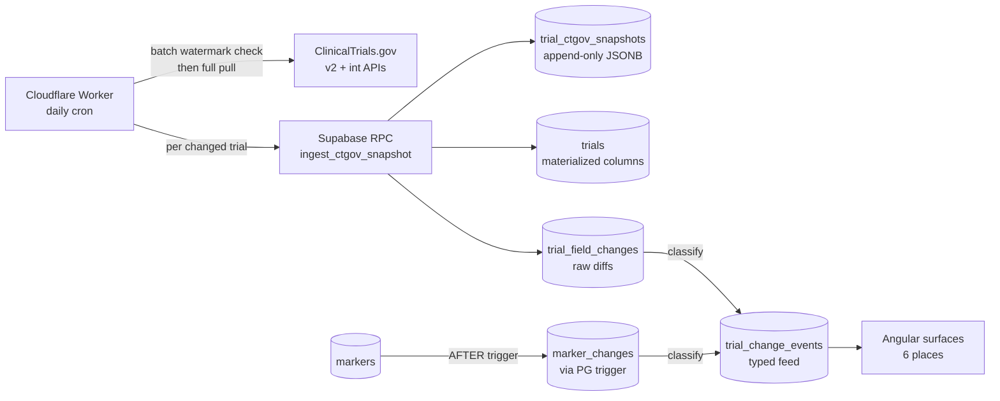
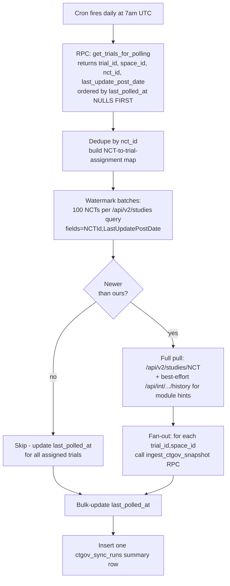
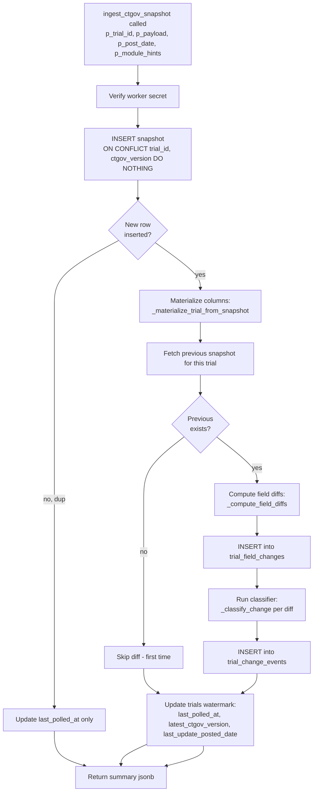
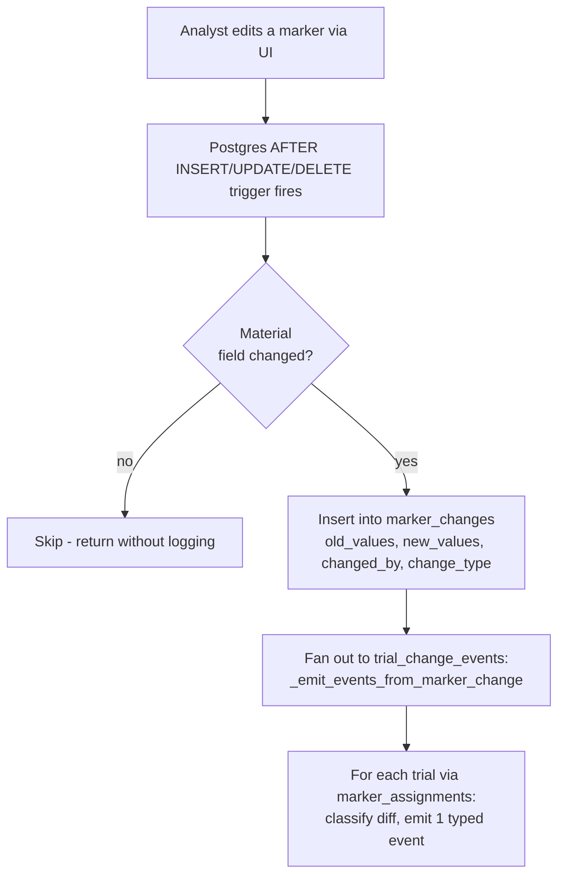
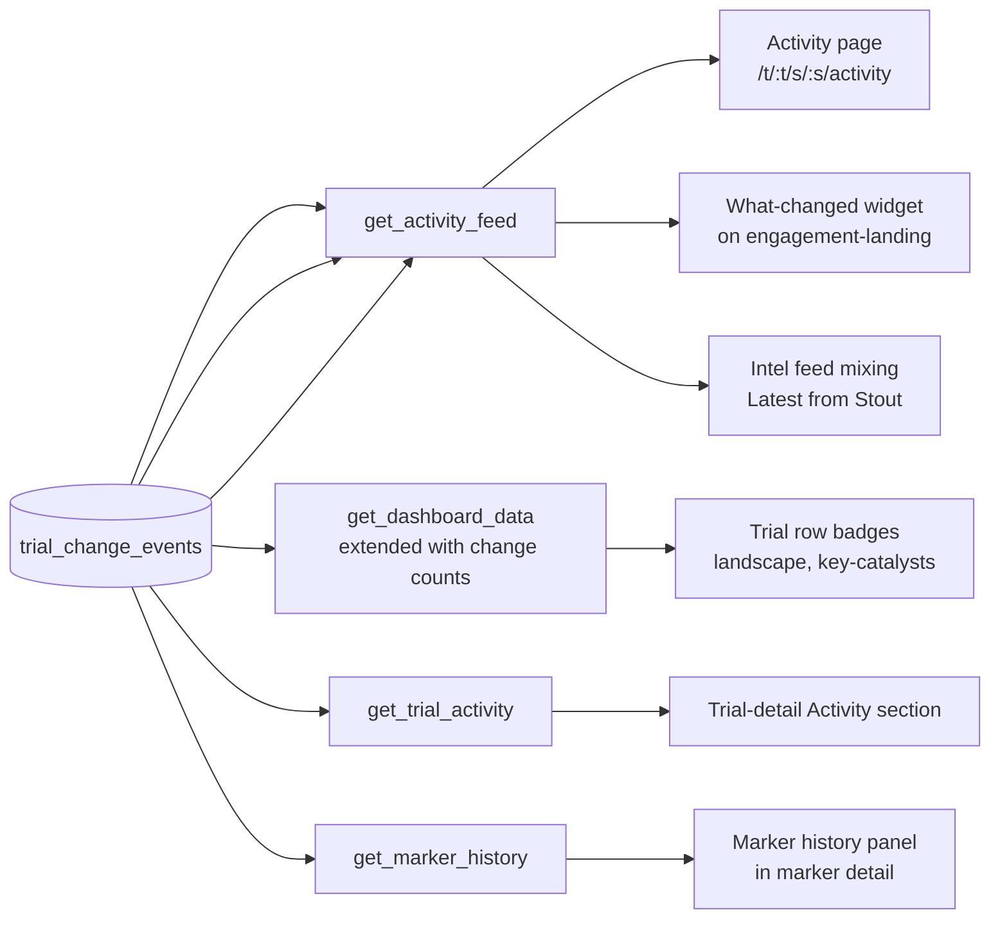

# Trial Change Feed: Design

**Date:** 2026-05-02
**Status:** Ready for review
**Scope:** v1 of the always-on clinical trial change-tracking system: background CT.gov polling, snapshot history, analyst-edit audit, derived typed event feed, surfacing across the app, and the cleanup that becomes possible once JSON snapshots are the source of truth.

## Motivation

Pharma CI analysts triage many trials per week against tight deadlines. The most actionable signals are *what changed*: PDUFA dates slipping, phases advancing, new arms appearing, sponsors changing. Today the app captures CT.gov data via a manual sync from the trial form, with no history and no notification of changes. Analysts have to remember to sync, then notice differences themselves.

This design moves that work into the background, captures full history (so adding a new tracked field later doesn't require re-polling CT.gov), and surfaces changes throughout the existing app so analysts see what moved without going looking for it.

## Goals

1. **Background sync.** Daily Cloudflare Worker pulls CT.gov for every NCT-linked trial. No analyst action required.
2. **Full history capture.** Store raw CT.gov JSON snapshots indefinitely. Materialized columns become a projection of the snapshot, not the source of truth.
3. **Unified change feed.** CT.gov-driven changes and analyst-edited marker (catalyst) changes both flow into a single typed event stream.
4. **In-place surfacing.** Activity page, engagement landing widget, trial-row badges, marker history, and intel feed mixing — all reading the same feed.
5. **Cleanup of dead schema.** Drop 36 orphaned CT.gov columns that have no live consumer; data stays available via JSON snapshots and a per-space field-visibility config.
6. **Replace the trial form** with inline editing on the trial-detail page (CT.gov fields are read-only; analyst-owned fields stay editable).

## Non-goals (v1)

- Real-time push (Supabase Realtime).
- Per-user unread-state tracking. Date-range filters cover the use case.
- Per-user field visibility overrides. Field config is per-space.
- Notification surfaces (email digests, Slack). The data model supports this later.
- Cross-engagement activity views. v1 is per-space.
- Marker assignment changes (re-pointing a marker to a different trial). Audit captured for marker fields, not for the assignment table.
- A separate `materiality` column. Importance is derived dynamically from `event_type` + `payload`.

## Architecture

Four-stage pipeline: observe → store → classify → surface.



**Three deployable units, one new external dependency:**

1. **Cloudflare Worker** (existing `src/client/worker/index.ts` gains a `scheduled()` export). Owns all CT.gov interaction.
2. **Supabase migrations** (new tables, RPCs, trigger, classifier). All database-side; no Edge Functions.
3. **Angular client** (modifications + new surfaces). Activity page, landing widget, badges, marker history panel, intel feed mixing, trial-detail rework.

**Data ownership boundary:**
- `trial_ctgov_snapshots` is per-space (trial-keyed). Worker dedupes by NCT before fetching from CT.gov, then fans out the write per `(trial_id, space_id)`.
- `trials` row stays the read path for current state.
- Snapshots are consulted only for history queries (per-trial change log, "view this field as of date X", column chooser rendering).

**Failure model:** the Worker is the only thing that talks to CT.gov. If CT.gov is down or `/api/int/` shape-shifts, the Worker logs and exits. The next day's run picks up via the watermark column. No partial writes, no corruption. CF cron alerting catches sustained failures.

## Schema

### New tables

#### `trial_ctgov_snapshots` (per-space, trial-keyed, append-only)

```sql
create table public.trial_ctgov_snapshots (
  id                    uuid primary key default gen_random_uuid(),
  trial_id              uuid not null references public.trials (id) on delete cascade,
  space_id              uuid not null references public.spaces (id) on delete cascade,
  nct_id                varchar(20) not null,
  ctgov_version         int not null,
  last_update_post_date date not null,
  payload               jsonb not null,
  fetched_via           varchar(20) not null,    -- 'v2_poll' | 'int_backfill' | 'manual_sync'
  fetched_at            timestamptz not null default now(),
  unique (trial_id, ctgov_version)
);
create index idx_snapshots_trial_version on public.trial_ctgov_snapshots (trial_id, ctgov_version desc);
create index idx_snapshots_nct on public.trial_ctgov_snapshots (nct_id);
create index idx_snapshots_space_post_date on public.trial_ctgov_snapshots (space_id, last_update_post_date desc);
```

RLS: standard `has_space_access(space_id)`. Writes via the Worker pipeline only; users do not insert directly.

#### `trial_field_changes` (per-trial, raw diff log)

```sql
create table public.trial_field_changes (
  id                       uuid primary key default gen_random_uuid(),
  trial_id                 uuid not null references public.trials (id) on delete cascade,
  space_id                 uuid not null references public.spaces (id) on delete cascade,
  source_snapshot_id       uuid not null references public.trial_ctgov_snapshots (id),
  field_path               text not null,            -- e.g. 'protocolSection.statusModule.primaryCompletionDateStruct.date'
  old_value                jsonb,
  new_value                jsonb,
  observed_at              timestamptz not null default now()
);
create index idx_field_changes_trial_observed on public.trial_field_changes (trial_id, observed_at desc);
create index idx_field_changes_space_observed on public.trial_field_changes (space_id, observed_at desc);
create index idx_field_changes_field_path on public.trial_field_changes (trial_id, field_path);
```

Pure CT.gov diff capture, no interpretation. Analyst-source events are derived directly from `marker_changes` and bypass this table (the marker audit log is itself the raw layer for that source). RLS: `has_space_access(space_id)`.

#### `trial_change_events` (per-trial, typed feed; what UI reads)

```sql
create table public.trial_change_events (
  id                              uuid primary key default gen_random_uuid(),
  trial_id                        uuid not null references public.trials (id) on delete cascade,
  space_id                        uuid not null references public.spaces (id) on delete cascade,
  event_type                      varchar(40) not null,
  source                          varchar(20) not null,    -- 'ctgov' | 'analyst'
  payload                         jsonb not null,
  occurred_at                     timestamptz not null,    -- when CT.gov says it happened, OR when the analyst saved
  observed_at                     timestamptz not null default now(),
  derived_from_change_id          uuid references public.trial_field_changes (id),
  derived_from_marker_change_id   uuid references public.marker_changes (id),
  marker_id                       uuid references public.markers (id) on delete set null
);
create index idx_change_events_space_observed on public.trial_change_events (space_id, observed_at desc);
create index idx_change_events_trial_observed on public.trial_change_events (trial_id, observed_at desc);
create index idx_change_events_type on public.trial_change_events (space_id, event_type, observed_at desc);
create index idx_change_events_marker on public.trial_change_events (marker_id) where marker_id is not null;
```

No `materiality` column. Importance is derived dynamically by `event_type` + `payload` shape at the UI/RPC layer. RLS: `has_space_access(space_id)`.

#### `marker_changes` (per-marker audit; fanned out at derivation time)

```sql
create table public.marker_changes (
  id           uuid primary key default gen_random_uuid(),
  marker_id    uuid not null,                          -- not FK; survives marker deletion
  space_id     uuid not null references public.spaces (id) on delete cascade,
  change_type  varchar(20) not null,                   -- 'created' | 'updated' | 'deleted'
  old_values   jsonb,
  new_values   jsonb,
  changed_by   uuid references auth.users (id),
  changed_at   timestamptz not null default now()
);
create index idx_marker_changes_marker_changed on public.marker_changes (marker_id, changed_at desc);
create index idx_marker_changes_space_changed on public.marker_changes (space_id, changed_at desc);
```

Populated by trigger (see Markers Audit section). RLS: `has_space_access(space_id)`.

#### `ctgov_sync_runs` (one row per cron invocation; observability)

```sql
create table public.ctgov_sync_runs (
  id                    uuid primary key default gen_random_uuid(),
  started_at            timestamptz not null,
  ended_at              timestamptz not null,
  trials_checked        int not null default 0,
  ncts_with_changes     int not null default 0,
  snapshots_written     int not null default 0,
  events_emitted        int not null default 0,
  errors_count          int not null default 0,
  error_summary         jsonb,
  status                varchar(20) not null   -- 'success' | 'partial' | 'failed'
);
```

### Modifications to `trials`

```sql
alter table public.trials
  add column latest_ctgov_version int,
  add column last_polled_at       timestamptz;

create index idx_trials_polling_queue on public.trials (last_polled_at nulls first)
  where identifier is not null;
```

`last_update_posted_date` (existing CT.gov column) is **reused** as the per-trial CT.gov-side watermark. The Worker compares `lastUpdatePostDate` from CT.gov against this column to decide whether to fetch the full payload.

`ctgov_last_synced_at` (existing) stays as our local "when did sync last run" stamp, distinct from CT.gov's own timestamp. Updated at the end of each successful trial ingest.

### Modifications to `spaces`

```sql
alter table public.spaces
  add column ctgov_field_visibility jsonb not null default '{}';

comment on column public.spaces.ctgov_field_visibility is
  'Per-surface CT.gov field display config. Shape: { surface_key: [field_path, ...] }';
```

Single jsonb column per space. Surfaces and defaults documented in the UI Surfaces section.

### Materialized CT.gov columns (final set)

After cleanup, only **3 CT.gov columns** stay materialized on `trials`:

| Column | Why it has to be a column |
|---|---|
| `phase` | RPC filter param `p_phases` + materiality classifier |
| `recruitment_status` | RPC filter param `p_recruitment_statuses` + bullseye-detail display |
| `study_type` | RPC filter param `p_study_types` |

Plus the watermark / sync columns:
- `last_update_posted_date` (reused)
- `latest_ctgov_version` (new)
- `last_polled_at` (new)

### Columns dropped (36 CT.gov columns)

All have no live frontend consumer and no RPC filter parameter. Data remains in JSON snapshots and is renderable via the per-space field chooser.

| Bucket | Columns |
|---|---|
| Sponsorship | `lead_sponsor`, `sponsor_type`, `collaborators` |
| Geography | `study_countries`, `study_regions` |
| Design | `design_allocation`, `design_intervention_model`, `design_masking`, `design_primary_purpose`, `enrollment_type` |
| Clinical | `conditions`, `intervention_type`, `intervention_name`, `primary_outcome_measures`, `secondary_outcome_measures`, `is_rare_disease` |
| Eligibility | `eligibility_sex`, `eligibility_min_age`, `eligibility_max_age`, `accepts_healthy_volunteers`, `eligibility_criteria`, `sampling_method` |
| Timeline | `start_date`, `start_date_type`, `primary_completion_date`, `primary_completion_date_type`, `study_completion_date`, `study_completion_date_type`, `first_posted_date`, `results_first_posted_date` |
| Regulatory | `has_dmc`, `is_fda_regulated_drug`, `is_fda_regulated_device`, `fda_designations`, `submission_type` |
| Misc | `sample_size` (also stripped from trial-detail and bullseye-detail display) |

The `jsonb_build_object(...)` projections in `get_dashboard_data` and `get_landscape_data` get the corresponding keys removed.

## Cloudflare Worker poller

### File layout

```
src/client/worker/
  index.ts                     # existing; gains a scheduled() export alongside fetch()
  supabase.ts                  # existing; reused for callRpc()
  ctgov-sync/
    poller.ts                  # the scheduled() handler entry point
    ctgov-client.ts            # /api/v2 + /api/int adapter (the only file that knows CT.gov URL shapes)
    batch.ts                   # chunking + dedupe by NCT
    watermark.ts               # the lightweight LastUpdatePostDate check
    types.ts                   # shared types for the sync pipeline
```

Adapter isolation: if `/api/int/` shape-shifts, change is one file. If CT.gov ships a v3 API, change is one file.

### CT.gov API access (hybrid)

CT.gov's documented `/api/v2/` does not expose history. Only the internal `/api/int/studies/{nct}/history` endpoint returns version metadata, and `/api/int/studies/{nct}/history/{version}` returns historical full payloads.

- **Primary:** `/api/v2/studies/{nctId}` for current full payload, `/api/v2/studies?query.term=(NCT01 OR NCT02 ...)&fields=NCTId,LastUpdatePostDate&pageSize=100` for batched watermark checks.
- **Opportunistic:** `/api/int/studies/{nctId}/history` for `moduleLabels` hints (which CT.gov modules changed in this version) to narrow the diff scope. If the int endpoint fails, the v2 path keeps working.
- **Backfill:** `/api/int/studies/{nctId}/history/{version}` lets us populate snapshots earlier than when we started polling.

### Per-invocation flow



### Concurrency and CPU budget

CT.gov fetches are I/O — they don't count against the Worker's 30s CPU budget per invocation. Run with a fixed pool of `CTGOV_PARALLEL_FETCHES=10`. Steady-state load at 5,000 NCT-linked trials: ~10-20s CPU per run, ~6-10s wall-clock for the fetch portion. Comfortable headroom.

If trial counts ever scale past ~50k, the mitigation is changing the cron from `0 7 * * *` to `0 */6 * * *` and adding a `WHERE last_polled_at < now() - interval '24 hours'` filter so each invocation processes a quarter of the population. No re-architecture; same Worker, same code.

### Error handling

| Failure | Response |
|---|---|
| CT.gov 404 for an NCT | Trial was withdrawn from CT.gov. Update `last_polled_at`, emit a `trial_withdrawn` event once, don't retry. |
| CT.gov 5xx or timeout | Transient. Skip this NCT, leave `last_polled_at` unchanged, retry next run. |
| `/api/int/` parse failure | Swallow + log. v2 path keeps working. |
| Supabase RPC error on one trial | Log the trial_id, continue. One bad trial doesn't stop the run. |
| CPU budget approaching 25s | Exit gracefully. Un-polled trials sort first via the partial index, get priority next run. |

### Idempotency

1. **Snapshot dedup at the unique constraint** `(trial_id, ctgov_version)`. Re-ingesting the same version is a no-op via `ON CONFLICT DO NOTHING`. Diff/event derivation only runs if a new row was actually inserted (detected via `xmax = 0`).
2. **`last_polled_at` updated only after success.** A crash mid-trial leaves `last_polled_at` stale, so the next run picks it up. No partial state to clean up.

### Auth model

No service role key. The Worker holds `CTGOV_WORKER_SECRET` (a wrangler secret). All RPCs the cron calls accept the secret as their first parameter, validated against `vault.decrypted_secrets` inside a `SECURITY DEFINER` function. Anon key + worker secret only.

```sql
create or replace function public._verify_ctgov_worker_secret(p_secret text)
returns void
language plpgsql
security definer
set search_path = public, vault
as $$
declare v_expected text;
begin
  select decrypted_secret into v_expected
  from vault.decrypted_secrets where name = 'ctgov_worker_secret';
  if v_expected is null or p_secret <> v_expected then
    raise exception 'unauthorized' using errcode = '42501';
  end if;
end;
$$;
```

Three RPCs the Worker calls, each gated this way: `get_trials_for_polling`, `ingest_ctgov_snapshot`, `record_sync_run`. If the secret leaks, blast radius is contained to those three RPCs (no arbitrary DB access).

### Wrangler config additions

```jsonc
{
  "triggers": { "crons": ["0 7 * * *"] },
  "vars": {
    "CTGOV_BASE_URL": "https://clinicaltrials.gov",
    "CTGOV_BATCH_SIZE": "100",
    "CTGOV_PARALLEL_FETCHES": "10"
  }
}
```

Plus one new wrangler secret: `CTGOV_WORKER_SECRET` (set once via `wrangler secret put`).

### Manual backfill path

`poller.ts` accepts a query-param-triggered manual mode via the existing `fetch()` handler: `POST /admin/ctgov-backfill` with body `{nct_ids: [...]}`. Same code path as scheduled mode. Gated to platform admins only. Used for initial rollout and ad-hoc "fill in the missing history" needs.

The "Sync from CT.gov" button on trial-detail calls a thin RPC `trigger_single_trial_sync(p_trial_id)` that posts to this endpoint scoped to one NCT.

## Ingest pipeline (`ingest_ctgov_snapshot`)



Wrapped in a single transaction. Any failure rolls back; the Worker sees the error and continues with the next trial.

### Helper functions

**`_materialize_trial_from_snapshot(p_trial_id uuid, p_payload jsonb)`**

Partial UPDATE on the trials row. Maps JSON paths to the 3 materialized CT.gov columns. Only touches CT.gov-owned columns; never `notes`, `display_order`, `name`, etc. Ports the `mapStudy()` logic from the deleted `ctgov-sync.service.ts` to plpgsql.

**`_compute_field_diffs(p_old jsonb, p_new jsonb) returns table(field_path text, old_value jsonb, new_value jsonb)`**

Iterates a hardcoded watch list of ~15 field paths. Generic deep-diff produces noise; the watch list is curated to the paths we care about.

| Path | Maps to event type |
|---|---|
| `protocolSection.statusModule.overallStatus` | `status_changed` |
| `protocolSection.statusModule.startDateStruct.date` | `date_moved` (start) |
| `protocolSection.statusModule.primaryCompletionDateStruct.date` | `date_moved` (primary completion) |
| `protocolSection.statusModule.completionDateStruct.date` | `date_moved` (study completion) |
| `protocolSection.designModule.phases` | `phase_transitioned` |
| `protocolSection.designModule.enrollmentInfo.count` | `enrollment_target_changed` |
| `protocolSection.armsInterventionsModule.armGroups` | `arm_added` / `arm_removed` (compare lengths + label sets) |
| `protocolSection.armsInterventionsModule.interventions` | `intervention_changed` |
| `protocolSection.outcomesModule.primaryOutcomes` | `outcome_measure_changed` (primary) |
| `protocolSection.outcomesModule.secondaryOutcomes` | `outcome_measure_changed` (secondary) |
| `protocolSection.sponsorCollaboratorsModule.leadSponsor.name` | `sponsor_changed` |
| `protocolSection.eligibilityModule.eligibilityCriteria` | `eligibility_criteria_changed` |
| `protocolSection.eligibilityModule.sex` | `eligibility_changed` |
| `protocolSection.eligibilityModule.minimumAge` | `eligibility_changed` |
| `protocolSection.eligibilityModule.maximumAge` | `eligibility_changed` |

If `p_module_hints` is non-null (we got `/api/int/` data), only diff paths whose containing module appears in the hints. Small CPU savings on big payloads.

**`_classify_change(p_field_path text, p_old jsonb, p_new jsonb) returns table(event_type text, payload jsonb, occurred_at timestamptz)`**

Implements the path-to-event-type rules from the watch list above. Returns one or more event rows per diff (e.g., `armGroups` with two new arms emits two `arm_added` events).

### Backfill path (free, from snapshots)

Because the snapshot is the source of truth, we can rebuild `trial_field_changes` and `trial_change_events` from existing snapshots whenever the watch list or classifier changes. New event type? Run a one-time `select recompute_trial_change_events(trial_id) from trials` and the history catches up. No CT.gov re-poll needed.

Same logic applies to materializing new columns later: add a column, add the path mapping, run `UPDATE trials SET new_col = _materialize(...) FROM snapshots WHERE ...`. No re-poll.

## Markers audit log and classifier

Mirror of the CT.gov ingest pipeline; source is the analyst editing markers via the existing UI.

### Trigger flow



The trigger is `AFTER INSERT OR UPDATE OR DELETE ON markers FOR EACH ROW` and `SECURITY DEFINER` so it can write to `marker_changes` regardless of which user initiated the edit.

### Material fields (only these trigger the audit)

| Field | Logged? |
|---|---|
| `event_date`, `end_date`, `title`, `projection`, `marker_type_id`, `description` | yes |
| `source_url`, `metadata`, `created_by`, `created_at`, `updated_at`, `is_projected` (generated) | no |

### Classifier (`_emit_events_from_marker_change`)

Walks `marker_assignments` to fan out one event per trial the marker is assigned to.

| `change_type` | Diff condition | event_type |
|---|---|---|
| `created` | — | `marker_added` |
| `updated` | `event_date` changed | `date_moved` |
| `updated` | `projection` changed (`projected` → `actual`) | `projection_finalized` |
| `updated` | `marker_type_id` changed | `marker_reclassified` |
| `updated` | only `title` / `description` changed | `marker_updated` |
| `deleted` | — | `marker_removed` |

**Tie-breaker:** if multiple material fields change in one UPDATE, `date_moved` wins. Other simultaneous changes ride in the same event's payload as `secondary_changes`. Avoids emitting 3 events for one save action.

### Edge cases

| Case | v1 behavior |
|---|---|
| Marker with zero assignments | Trigger writes audit row, classifier loops zero times. Audit preserved, no orphan events. |
| Re-assigning a marker (changing trials) | Not captured in v1. Deferred. |
| Bulk insert of N markers | N trigger fires + N audit rows + N×assignments events. Acceptable for admin ops. |
| User edits then immediately undoes | Two events: change and change-back. Acceptable. |

### Initial deploy backfill

One-shot function `backfill_marker_history()` synthesizes `created` rows for all existing markers and runs the classifier. Activity page is non-empty on day 1.

## Event taxonomy

Two sources, 12 event types. No materiality column.

### CT.gov-sourced events

| `event_type` | Trigger | Payload shape |
|---|---|---|
| `status_changed` | `overallStatus` changed | `{from, to}` |
| `date_moved` | start / primary completion / study completion date changed | `{which_date, from, to, days_diff, direction}` (`which_date` ∈ `{start, primary_completion, study_completion}`; `direction` ∈ `{slip, accelerate}`) |
| `phase_transitioned` | `designModule.phases` changed | `{from: [...], to: [...]}` |
| `enrollment_target_changed` | `enrollmentInfo.count` changed | `{from, to, percent_change}` |
| `arm_added` | New entry in `armGroups` | `{arm_label, arm_type, description}` (one per added arm) |
| `arm_removed` | Entry removed from `armGroups` | `{arm_label, arm_type}` |
| `intervention_changed` | `interventions` changed | `{added: [{name, type}], removed: [{name, type}]}` |
| `outcome_measure_changed` | primary or secondary outcomes changed | `{outcome_kind: 'primary' \| 'secondary', added, removed, modified}` |
| `sponsor_changed` | `leadSponsor.name` changed | `{from, to}` |
| `eligibility_criteria_changed` | `eligibilityCriteria` text changed | `{old_length, new_length, diff_summary}` |
| `eligibility_changed` | `sex` / `minimumAge` / `maximumAge` changed | `{which_field, from, to}` |
| `trial_withdrawn` | CT.gov 404 for an NCT we previously ingested | `{nct_id, last_seen_version, last_seen_post_date}` (emitted once per trial) |

### Analyst-sourced events

| `event_type` | Trigger | Payload shape |
|---|---|---|
| `marker_added` | INSERT on `markers` | `{event_date, marker_type_id, projection}` |
| `date_moved` | UPDATE: `event_date` changed | `{which_date: "event_date", from, to, days_diff, direction}` |
| `projection_finalized` | UPDATE: `projection` `'projected'` → `'actual'` | `{from, to, event_date}` |
| `marker_reclassified` | UPDATE: `marker_type_id` changed | `{from_type_id, to_type_id}` |
| `marker_updated` | UPDATE: only `title`/`description` changed | `{changed_fields: [...]}` |
| `marker_removed` | DELETE on `markers` | `{event_date, marker_type_id, projection}` (from `old_values`) |

### Shared event types

`date_moved` is the only event type produced by both sources. Same name is intentional — a date moving is a date moving regardless of who reported it. The `source` column and `payload.which_date` together tell the full story.

### Title and other denormalized fields

Payloads do **not** carry `title`. Frontend joins through `marker_id` for active markers, or reads `marker_changes.old_values->>'title'` (via `derived_from_marker_change_id`) for deleted markers. Same pattern for trial name (joined from `trials`).

### Adding a new event type later

Pure code change:
1. Add the path to `_compute_field_diffs` watch list, or extend `_emit_events_from_marker_change`.
2. Add the case to `_classify_change` with the new event_type and payload builder.
3. Run the recompute function over existing snapshots / `marker_changes`. History fills in.

No migration. `event_type` is `varchar(40)`; new values just insert.

## UI surfaces

### Surface map



### Surface 1: Activity page

**Route:** `/t/:tenantId/s/:spaceId/activity` (lazy-loaded standalone component `app-engagement-activity-page`).

**Filters:**
- Date range pill group: `Last 7 days` / `Last 30 days` / `All time` (default 30 days)
- Event type multi-select
- Source pill group: `All` / `CT.gov` / `Analyst`
- Trial multi-select (typeahead over the space's trials)

**Row template:** `@switch (event.event_type)` per-type rendering. Each row: relative timestamp, source badge (CT.GOV / ANALYST), event-type icon, formatted summary, link to underlying trial/marker. Click to expand into full payload diff.

**RPC:** `get_activity_feed(p_space_id uuid, p_filters jsonb, p_cursor_observed_at timestamptz, p_limit int)`. Cursor pagination, not offset.

**Footer:** `Last sync: 14h ago • 1,247 trials checked • 23 changes detected` from the most recent `ctgov_sync_runs` row.

### Surface 2: "What changed" widget on engagement landing

**Component:** new `app-what-changed-widget` placed above `app-intelligence-feed`.

**Content:** top 5 events from last 7 days, filtered to a curated high-signal whitelist:
- `date_moved` where `(payload->>'days_diff')::int > 90`
- `phase_transitioned`
- `status_changed` to terminal states (`COMPLETED`, `TERMINATED`, `WITHDRAWN`, `SUSPENDED`)
- `sponsor_changed`
- `trial_withdrawn`

The whitelist is an RPC argument, not a DB column. Different surfaces can use different whitelists; rules can be tweaked without a deploy.

### Surface 3: Trial row badges

**Where:** trial rows in bullseye-detail-panel, landscape company-product trees, key-catalysts list, and (eventually) a trial-list view.

**Visual:** small badge to the right of trial name. Three states:
- No badge: zero changes in last 7 days
- Slate dot: any change in last 7 days
- Red dot: a `date_moved` / `phase_transitioned` / `trial_withdrawn` in last 7 days

**Computation:** extend `get_dashboard_data` (and the unified landscape RPC) to include `recent_changes_count int` and `most_recent_change_type text` per trial via `LEFT JOIN LATERAL`. Cheap given the `(trial_id, observed_at desc)` index.

### Surface 4: Marker history panel

**Where:** existing marker detail surface (catalysts page).

**Section:** "History" — chronological list of `marker_changes` for this marker, formatted via the same `@switch` template as the Activity page. Click to expand and see old/new values side-by-side.

**RPC:** `get_marker_history(p_marker_id uuid)`. No pagination; markers don't accumulate enough edits to need it.

### Surface 5: Intel feed mixing

**Where:** existing `app-intelligence-feed` on engagement landing.

**Change:** RPC merges agency-published `primary_intelligence` rows with the same high-signal whitelist of `trial_change_events` (CT.gov-source only — analyst-source marker edits don't surface here, they're already in marker history and Activity). System-generated rows get distinct visual treatment (smaller font, slate accent bar, "System update" label). Sort merged by `observed_at` / `published_at` desc.

### Surface 6: Trial-detail rework (replaces trial-form)

**Existing route reused:** `/t/:tenantId/s/:spaceId/trials/:trialId`.

**New layout:**

```
Trial Name (inline editable)                          [Sync from CT.gov]
NCT12345 • LinkedProduct • TherapeuticArea
─────────────────────────────────────────────────────────────────
IDENTITY (analyst-owned, click to edit)
  name, notes, display_order, product, therapeutic_area,
  phase override (type, start, end)
─────────────────────────────────────────────────────────────────
CT.GOV DATA                                           [Show all CT.gov data]
  phase: 3
  recruitment status: Recruiting
  study type: Interventional
  last synced: 2h ago
  [+ space-configured extra fields per trial_detail surface_key]
─────────────────────────────────────────────────────────────────
MARKERS / CATALYSTS (existing section)
─────────────────────────────────────────────────────────────────
ACTIVITY (Last 7d / 30d / All)
  Reverse-chron list of trial_change_events for this trial
```

- **Sync from CT.gov** button calls `trigger_single_trial_sync(p_trial_id)` RPC, which posts to the Worker's manual backfill endpoint scoped to one NCT.
- **CT.gov data block** renders fields from `space.ctgov_field_visibility['trial_detail']`. The 3 materialized columns are always shown; additional fields configured by the space owner come from the latest snapshot's payload.
- **Show all CT.gov data button** opens a modal with the full catalogue rendered from the snapshot. Read-only, no save.
- **Activity section** uses `get_trial_activity(p_trial_id uuid, p_limit int)`.

### New RPC family

| RPC | Returns | Used by |
|---|---|---|
| `get_activity_feed(p_space_id, p_filters, p_cursor, p_limit)` | Page of events with joined trial/marker context | Activity page, landing widget, intel feed mixer |
| `get_trial_activity(p_trial_id, p_limit)` | Recent events for one trial | Trial-detail Activity section |
| `get_marker_history(p_marker_id)` | Full audit for one marker | Marker history panel |
| `get_dashboard_data` (extended) | Existing payload + `recent_changes_count`, `most_recent_change_type` per trial | Trial row badges everywhere |
| `trigger_single_trial_sync(p_trial_id)` | `{ok: bool, sync_run_id}` | "Sync from CT.gov" button |
| `update_space_field_visibility(p_space_id, p_visibility)` | void | Settings UI |

All gated by `has_space_access()` (with `array['owner']` for `update_space_field_visibility`).

## Trial form retirement

The whole `trial-form` route and component go away.

### Edit path → trial-detail page

- `trial-form.component.ts/.html` deleted.
- Route entry removed from `app.routes.ts`.
- Redirect `old URL → /trials/:trialId` for bookmarks/deep links.
- Inline editing on trial-detail covers all analyst-owned fields. PrimeNG `p-inplace` per field, or whatever click-to-edit pattern is already used elsewhere.

### Create path → small dialog

- New `app-trial-create-dialog` component opened from the trial-list "New trial" action.
- Fields: `name` (required), `identifier` (NCT, optional but recommended), `product_id` (required), `therapeutic_area_id` (required).
- Submit: insert trial, kick off `trigger_single_trial_sync(trial_id)` if NCT provided, redirect to `/trials/:trialId`.

### Client-side `ctgov-sync.service.ts` retirement

Whole file deleted. Responsibilities split:
- **Background sync** → Worker pipeline.
- **Manual on-demand sync** → `trigger_single_trial_sync(p_trial_id)` RPC, called by the trial-detail header button.
- **CT.gov mapping logic** → ported to `_materialize_trial_from_snapshot` plpgsql function. Mapping lives in one place (Postgres) after this ships.

## Per-space field visibility

### Surface keys and defaults

| `surface_key` | Controls | Default extra fields (in addition to always-visible materialized columns) |
|---|---|---|
| `trial_detail` | CT.gov data block on trial-detail | Lead sponsor, Primary completion date |
| `bullseye_detail_panel` | Right-side panel on landscape bullseye | Lead sponsor |
| `timeline_detail` | Trial detail popout in timeline view | (none) |
| `key_catalysts_panel` | Catalyst expanded detail | Lead sponsor |
| `trial_list_columns` | Reserved for the eventual trial list view | NCT identifier |

Each surface's value in `ctgov_field_visibility` is an array of `path` strings from `CTGOV_FIELD_CATALOGUE` (e.g. `"protocolSection.sponsorCollaboratorsModule.leadSponsor.name"`). `display_order` is array index. v1 supports ordering only (no per-field label overrides).

The defaults above are catalogue entries, not references to dropped columns. The Worker-derived JSON snapshot is what these paths resolve against.

### Settings UI

New section in space-settings (sibling of `space-general.component`, `space-members.component`).

**Component:** `app-space-field-visibility-settings`

**Layout:** tabs per `surface_key`. Each tab: two columns (available fields / visible fields), drag to reorder. Save persists via `update_space_field_visibility` RPC.

**Permissions:** `has_space_access(space_id, array['owner'])` for write; all members read.

### Field catalogue

Bundled in the frontend as a TypeScript constant (`CTGOV_FIELD_CATALOGUE`):

```ts
export interface CtgovField {
  path: string;
  label: string;
  kind: 'string' | 'longtext' | 'date' | 'number' | 'array';
  itemPath?: string;   // for arrays: which sub-path to extract per item
  summary?: 'count';   // for arrays: render as count when collapsed
}

export const CTGOV_FIELD_CATALOGUE: CtgovField[] = [
  { path: 'protocolSection.sponsorCollaboratorsModule.leadSponsor.name',
    label: 'Lead sponsor', kind: 'string' },
  { path: 'protocolSection.eligibilityModule.eligibilityCriteria',
    label: 'Eligibility criteria', kind: 'longtext' },
  { path: 'protocolSection.contactsLocationsModule.locations',
    label: 'Locations', kind: 'array', summary: 'count' },
  // ... ~60-80 entries total
];
```

### Renderer

Each render surface reads the space's `ctgov_field_visibility[surface_key]` array, iterates the paths, resolves each via `CTGOV_FIELD_CATALOGUE` for label/kind, and walks the JSON snapshot for the value. One renderer regardless of surface.

### Escape hatch

Trial-detail keeps a "Show all CT.gov data" button next to the configured block. Opens a modal with the full catalogue rendered from the latest snapshot. Read-only, no save. Preserves "data is there if you need it" without polluting the curated view.

## Migration sequencing

All in one PR (or one tight series). The pieces are interlocked enough that staging would create awkward intermediate states.

Order within the PR:
1. New tables + Worker module + RPCs (additive).
2. Trigger on `markers` + classifier (additive).
3. Backfill markers + initial CT.gov backfill via Worker manual mode.
4. New trial-detail sections (Activity, CT.gov data, column chooser).
5. New `app-trial-create-dialog`.
6. New `app-space-field-visibility-settings`.
7. Drop trial-form route + component + `ctgov-sync.service.ts`.
8. Drop the 36 orphaned trial columns + RPC projection cleanup.
9. Drop `sample_size` displays.
10. Update `Trial` model.

Smoke test after each stage during local development; CI catches consumers expecting a dropped field.

## Open questions and risks

### `/api/int/` stability
Undocumented endpoint. Powers their own website so stable in practice. Mitigation: isolated in `ctgov-client.ts`, opportunistic-only (v2 path keeps working without it), shape-failure swallowed with a log.

### Initial backfill volume
Backfilling history for existing trials requires hitting CT.gov heavily on first run. Approach: run the manual backfill mode in chunks of ~500 trials per invocation, spread over a few hours. Once baseline established, daily cron is steady-state.

### Bulk marker imports trigger many events
A single bulk-import script could fire thousands of trigger invocations. v1 accepts this; if it ever becomes painful, swap to a STATEMENT-level trigger with a deferred classifier.

### Redirecting deep links from trial-form route
Need to preserve any bookmarks pointing at the old `/trials/:id/edit` URL. Add a redirect entry in `app.routes.ts`.

### Worker secret rotation playbook
Documented in the runbook deployment section: change `vault.secrets` row, then `wrangler secret put CTGOV_WORKER_SECRET`. Worker uses the new secret on next cron fire. No downtime.

## Out of scope (deferred)

- Real-time push via Supabase Realtime
- Per-user unread-state tracking
- Per-user / per-trial field visibility overlays
- Custom field aliases / renames
- Email digests / Slack notifications
- Cross-engagement activity views
- Marker assignment changes (re-pointing markers between trials)
- Compound event grouping (UI-side grouping is fine)
- Per-event localization strings
