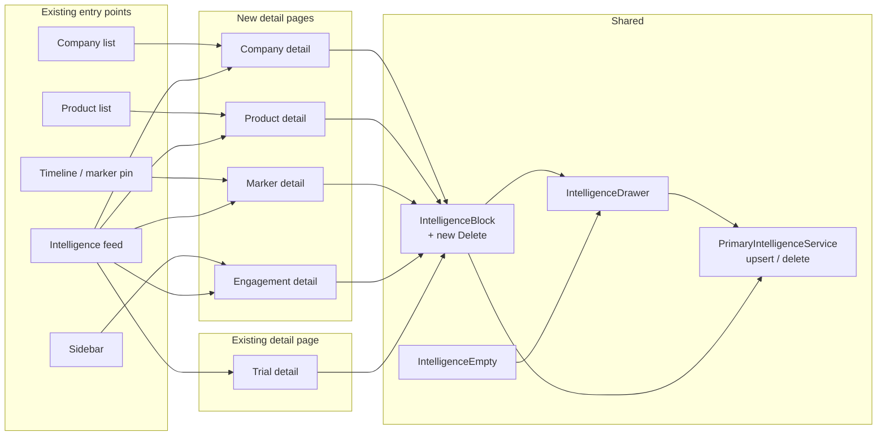

# Intelligence CRUD at All Layers: Design

**Date:** 2026-05-05
**Status:** Ready for review
**Scope:** Add detail pages and add / edit / delete affordances for primary intelligence on the four entity layers that don't have them today (company, product, marker, engagement). Wire the intelligence feed and existing list pages to the new detail routes. Add a delete control that also closes the gap on trial intelligence.

## Motivation

The `primary_intelligence` table is polymorphic on `(entity_type, entity_id)` and supports five entity types: trial, company, product, marker, and the engagement (space) itself. The service layer (`PrimaryIntelligenceService.upsert` / `delete`) and the editor (`IntelligenceDrawer`) are already entity-type-agnostic. RPCs exist for fetching detail bundles for every type.

The gap is purely UI. Only trials have a detail page that hosts the intelligence block and drawer. For the other four layers, intelligence is invisible and uneditable: clicking a non-trial row in the global feed routes back to `/intelligence`, and there is no per-entity surface where an analyst can author a read. There is also no delete affordance anywhere, even on trials.

Closing this gap unlocks the product's stated coverage (engagement, company, product, marker, trial) and lets analysts author and maintain reads at every level.

## Goals

1. **Per-entity detail pages** for company, product, marker, and engagement, each hosting intelligence read + edit + delete using the existing components.
2. **Routing**: clicking any non-trial row in the intelligence feed lands on the right detail page; the company list, product list, and timeline marker views link into their detail pages.
3. **Delete control**: explicit delete button on `IntelligenceBlock` with a confirmation step, available to agency members. Applies to all five types including trial.
4. **Preserve the trial detail experience** unchanged for now. The new pages keep the genuinely shared sections (intelligence, cross-references, activity, materials, basic info) and skip trial-specific sections (CT.gov, phase bar, markers list).
5. **Tests for the parts that are pure logic.** Match the existing repo convention (no new component-testing harness).

## Non-goals (this spec)

- UI-based creation, edit, or delete of the underlying entities (companies, products, markers). They continue to come from import / seed. Intelligence attaches to entities that already exist.
- Richer per-entity content beyond the shared sections (no per-company "trials by this sponsor" view, no per-product "linked markers" rollup). That is a separate design when the need arises.
- Changes to the trial detail page beyond adding the delete control.
- Changes to the schema, RPCs, or service layer. Everything is already in place.
- Per-entity activity feeds backed by new event types. Activity uses what's already wired.

## Architecture

Four new detail components, four new routes, one updated link resolver, one new control on an existing component.



## Detail page shape

All four new pages share the same skeleton and reuse the existing trial-detail building blocks. They live under `src/client/src/app/features/manage/{companies,products,markers,engagement}/`.

```
<app-manage-page-shell [narrow]="true">
  Header (entity name, identifying facts, status if applicable)

  IntelligenceBlock (or IntelligenceEmpty) + drawer mount
  Cross-references ("referenced in")
  Recent activity feed (filtered to this entity)
  Materials section (file uploads scoped to entity)
  Basic info (entity-specific identifying fields, read-only for now)
</app-manage-page-shell>
```

Per-entity headers and "basic info" panels:

| Layer | Header fields | Basic info |
|---|---|---|
| Company | name (uppercase tracked), country, kind | website, ticker, parent, notes |
| Product | name, owning company, mechanism | INN, modality, MoA, RoA, notes |
| Marker | label, kind, projection | trial, date, source, notes |
| Engagement | space name, tenant | description, owner, member count |

Marker detail is the odd one. A marker belongs to a trial, so the header includes a back-link to the parent trial, and the "basic info" reflects the marker's row. Intelligence is still attached to the marker, not the trial.

Engagement detail is a singleton per space. There is no list and no `:id` segment in the route. It is the home page for space-level reads.

## Routes

Added to `app.routes.ts` under `t/:tenantId/s/:spaceId/manage/`:

```
manage/companies/:companyId        -> CompanyDetailComponent
manage/products/:productId         -> ProductDetailComponent
manage/markers/:markerId           -> MarkerDetailComponent
manage/engagement                  -> EngagementDetailComponent
```

All four are lazy-loaded via `loadComponent`. Each is gated by the existing space membership guard. Engagement detail does not need an id segment; the space is implicit from the parent route.

## Intelligence feed link resolver

`intelligence-feed.component.ts:128-136` currently routes only trials and falls back to `/intelligence` for everything else. Replace with a full mapping:

```ts
switch (row.entity_type) {
  case 'trial':   return ['/t', t, 's', s, 'manage', 'trials', row.entity_id];
  case 'company': return ['/t', t, 's', s, 'manage', 'companies', row.entity_id];
  case 'product': return ['/t', t, 's', s, 'manage', 'products', row.entity_id];
  case 'marker':  return ['/t', t, 's', s, 'manage', 'markers', row.entity_id];
  case 'space':   return ['/t', t, 's', s, 'manage', 'engagement'];
}
```

Extract this into a small pure helper (`buildEntityRouterLink(t, s, entityType, entityId)`) so it is unit-testable and reusable. The companies list, products list, and timeline marker pin all link to the same helper.

## Delete control

A new "Delete" button is added to `IntelligenceBlock`, visible to agency members alongside "Edit". Clicking it opens a `p-confirmDialog` with copy along the lines of:

> Delete this primary intelligence? This cannot be undone.

On confirm, the component calls `PrimaryIntelligenceService.delete(id)`, then emits a `deleted` output. The hosting detail page reacts by re-rendering the empty state. This applies to trial detail too (closing the existing gap there).

Drafts and published rows are deletable. The RPC already enforces agency-member permissions; the UI defers to `spaceRole.canEdit()` for visibility, matching how Edit is gated today.

## Existing list page integration

- **Company list** (`company-list.component.html`): wrap company name in a router link to the new detail route. No other changes.
- **Product list** (`product-list.component.html`): same treatment for product name.
- **Trial detail Markers table** (`trial-detail.component.html:400-429`): the marker title cell is currently plain text. Wrap it in a router link to `MarkerDetailComponent`. The row-actions menu (Edit / Delete the marker row itself) stays unchanged. This is the primary entry point for marker intelligence: analysts find markers through their parent trial.
- **Timeline marker pin**: clicking a marker pin currently opens an inline detail panel in the timeline. Add a "View detail" link inside that panel that navigates to `MarkerDetailComponent`. Secondary entry, used when an analyst is working in timeline mode.
- **Engagement**: add a sidebar entry under the space's primary nav linking to the engagement detail page.

Discoverability of marker intelligence specifically rests on the trial-detail link being unmistakable. The marker title should render as a link (underlined on hover, brand-tinted) so it reads as navigation, not as a label.

## Testing

Match the existing repo convention: pure-function unit tests via the existing Playwright unit runner (`npm run test:unit`), and targeted e2e for the full loop.

**Unit (new specs):**
- `intelligence-router-link.spec.ts`: covers `buildEntityRouterLink` for all five entity types, including engagement (no id segment) and unknown / null inputs.
- `primary-intelligence.service.spec.ts` (light): contract-shape assertions for `upsert` and `delete` payloads. Mock the Supabase client at the boundary; verify the RPC name and params, not the network layer.

**Component-level:** No new component DOM tests. The detail pages are thin compositions of existing tested components and the drawer; behavior worth covering lives in the link resolver and service contract above. Calling this out so the gap is intentional rather than incidental.

**E2E (extend the existing Playwright e2e suite):**
- One new spec, `intelligence-crud.e2e.ts`, that drives the full add -> edit -> delete loop on a non-trial layer (company is the simplest, since seed data already has companies). One layer is enough; the other three pages are structurally identical.

**Existing tests:** the e2e suite was hardened recently (commit `01751af`). Adding the new routes should not affect existing flows; if anything regresses, fix it in the same change set.

## Implementation order

The four detail pages can be built in parallel after the shared groundwork is in place. Suggested sequencing for a clean review:

1. **Groundwork**: extract `buildEntityRouterLink` helper + spec; add the Delete control to `IntelligenceBlock` + confirmation dialog. These are independent of the new pages and unblock them.
2. **Routes + page scaffolds**: register the four routes; stub each detail component with header + intelligence block + drawer, no other sections yet. Wire the intelligence feed resolver.
3. **Per-page sections**: add cross-references, activity feed, materials, basic info to each detail page in turn. Reuse trial-detail's section components; do not fork.
4. **List page links**: link company list and product list rows to the new detail routes; add timeline marker pin "View detail" link; add sidebar engagement entry.
5. **E2E**: add the company-layer add / edit / delete spec.

Each step is independently verifiable (`ng lint && ng build` plus the relevant tests).

## Risks and trade-offs

- **Section reuse vs. duplication.** Trial detail's section markup (cross-refs, activity, materials, basic info) is currently inline in the trial template. To reuse it cleanly, those sections may need to be promoted to small shared components. The risk is doing more refactoring than the user asked for. Mitigation: only promote a section when copying it would create the second occurrence; otherwise leave trial detail alone and lift on the third use.
- **Marker detail navigation.** Markers are currently surfaced as inline panels on the timeline. Adding a separate detail route means two ways to view a marker. We accept the duplication because the inline panel is for quick triage and the detail page is for authoring intelligence; the affordance is different.
- **Engagement-level intelligence discoverability.** Engagement is a singleton with no list to drive discovery. Mitigation: a permanent sidebar link makes it a first-class destination, the same way the timeline and intelligence pages are.
- **Off-pattern testing scope.** The repo has minimal unit-test coverage today. Resisting the urge to add a new component-testing harness keeps this spec focused; the cost is that detail-page bugs would surface only via e2e or manual QA.

## Out of scope (deferred)

- Rich per-entity rollups (company -> trials list, product -> markers list, etc).
- Bulk operations on intelligence (multi-select delete, status change).
- Versioning / revision history beyond what `updated_at` already records.
- Cross-engagement views.
- Notification surfaces (email, Slack) when intelligence is published.
