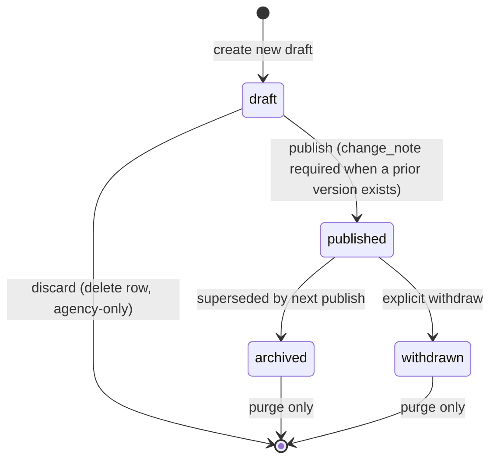

# Intelligence Version History: Design

**Date:** 2026-05-09
**Status:** Ready for review
**Scope:** Make published primary intelligence versioned and surface the version history on each entity detail page. Layered audience: clients see published versions with change notes; agency members see the full edit trail per version with word-level diffs. Replace the destructive "delete on republish" behavior so prior versions persist. Add explicit Withdraw (soft retract) and Purge (hard delete with typed confirmation) controls.

## Motivation

`primary_intelligence` already snapshots every save into `primary_intelligence_revisions` via trigger, but the trail is destroyed at every publish: `upsert_primary_intelligence` deletes the prior published row when a draft is promoted, and `primary_intelligence_revisions` cascades on that delete. The result is that "history" today reaches back only as far as the current published row's edit churn, not across publish events.

Pharma CI clients need the inverse. The published reads they consume are the artefact of record. When a thesis shifts, they want to see what it used to say, what changed, and why. Agency analysts need that same view plus the underlying audit trail to verify nothing slipped through. Both audiences are served by a single, layered surface.

The previous spec (`2026-05-05-intelligence-crud-all-layers-design.md`) explicitly deferred "versioning / revision history beyond what `updated_at` already records." This spec closes that gap.

## Goals

1. **Versions persist across republish.** Every published read becomes a stable, numbered version (v1, v2, v3, ...) that survives subsequent publishes and withdrawals. Only an explicit purge removes them.
2. **Layered surface.** Inline history panel on every entity detail page (company, product, marker, engagement, trial). Clients see published versions and change notes; agency members additionally see drafts and word-level diffs of intermediate saves.
3. **Soft delete is the default.** "Delete" becomes "Withdraw" on a published row, transitioning it to a `withdrawn` state that stays in history with a badge. The destructive form is "Purge", behind a typed-phrase confirmation.
4. **Required change note on republish.** Once a prior version exists, publishing requires a change_note. The note is the public-facing label for that version.
5. **No new tables.** Versions are first-class rows in `primary_intelligence`; the existing `primary_intelligence_revisions` table keeps its single, focused purpose as the agency-only audit log per version.

## Non-goals (this spec)

- Restore-as-draft from an archived version. A "Copy to new draft" affordance can be added later; not required for parity.
- Engagement-wide change feed entries for intelligence revisions. The inline panel is the only surface in this pass.
- Notifications (email, Slack) on publish or withdraw.
- Versioned URL deeplinks (`?v=2`). Listed in the UI section but explicitly soft, droppable if implementation proves disproportionate.
- Schema-level enforcement of role transitions beyond what a state-machine trigger gives us. Authorization stays in the RPC layer via `is_agency_member_of_space()`.
- Cross-engagement aggregation of versions.

## State machine



`primary_intelligence.state` allowed values become `draft | published | archived | withdrawn`.

- **draft** -- WIP rows, separate from the live published row, can co-exist with one published row per anchor as today.
- **published** -- live to clients. One per anchor (existing unique partial index).
- **archived** -- prior published, superseded by a newer publish. Visible in the history panel as Version N.
- **withdrawn** -- prior published, retracted without replacement. Same history slot as archived, rendered with a "Withdrawn" badge.

A BEFORE UPDATE trigger rejects illegal transitions (`published -> draft`, `archived -> *`, `withdrawn -> *`). Purge bypasses the trigger because it issues `DELETE`, not `UPDATE`.

## Schema delta

```sql
-- expand the state CHECK
alter table public.primary_intelligence
  drop constraint primary_intelligence_state_check,
  add  constraint primary_intelligence_state_check
       check (state in ('draft','published','archived','withdrawn'));

-- per-anchor version sequence; null for drafts
alter table public.primary_intelligence
  add column version_number int;

-- explicit publish/withdraw timestamps (updated_at gets overwritten on archive/withdraw transitions, so we cannot recover the publish moment from it)
alter table public.primary_intelligence
  add column published_at timestamptz,
  add column withdrawn_at timestamptz,
  add column withdrawn_by uuid references auth.users(id);

-- query support for the history panel
create index idx_primary_intelligence_anchor_versions
  on public.primary_intelligence (space_id, entity_type, entity_id, version_number desc)
  where state in ('published','archived','withdrawn');

-- backfill: stamp every currently-published row as v1, with published_at falling back to updated_at
update public.primary_intelligence
   set version_number = 1,
       published_at  = updated_at
 where state = 'published'
   and version_number is null;
```

`primary_intelligence_revisions` is unchanged. Its FK to `primary_intelligence(id)` stays with `on delete cascade`; cascade only fires on purge, which is the intended semantic.

## Triggers

Two new BEFORE triggers, plus the existing AFTER snapshot trigger continues to fire on every save.

**Version stamp.** Assigns `version_number` on entry into `published`. Idempotent: only fires when the column is null.

```sql
create or replace function public.assign_primary_intelligence_version()
returns trigger language plpgsql security invoker set search_path = '' as $$
begin
  if new.state = 'published' and new.version_number is null then
    new.version_number := coalesce((
      select max(version_number) + 1
        from public.primary_intelligence
       where space_id    = new.space_id
         and entity_type = new.entity_type
         and entity_id   = new.entity_id
         and (TG_OP = 'INSERT' or id <> new.id)
         and version_number is not null
    ), 1);
    new.published_at := now();
  end if;
  return new;
end;
$$;

create trigger primary_intelligence_assign_version_trigger
  before insert or update on public.primary_intelligence
  for each row execute function public.assign_primary_intelligence_version();
```

**State-machine guard.** Rejects illegal UPDATE transitions.

```sql
create or replace function public.guard_primary_intelligence_state()
returns trigger language plpgsql security invoker set search_path = '' as $$
begin
  if TG_OP = 'UPDATE' and old.state is distinct from new.state then
    if old.state = 'archived' or old.state = 'withdrawn' then
      raise exception 'cannot transition % from terminal state %', new.id, old.state
        using errcode = '22023';
    end if;
    if old.state = 'published' and new.state = 'draft' then
      raise exception 'cannot move published row back to draft (use withdraw or republish a new draft)'
        using errcode = '22023';
    end if;
  end if;
  return new;
end;
$$;

create trigger primary_intelligence_guard_state_trigger
  before update on public.primary_intelligence
  for each row execute function public.guard_primary_intelligence_state();
```

## RPC changes

### `upsert_primary_intelligence` (modify)

Two changes inside the existing function. Replace the "delete prior published" block with archive-instead-of-delete and add a change_note enforcement gate.

```sql
if p_state = 'published' then
  -- enforce change_note when a prior version (any non-draft state) exists
  if exists (
    select 1 from public.primary_intelligence
     where space_id    = p_space_id
       and entity_type = p_entity_type
       and entity_id   = p_entity_id
       and state in ('published','archived','withdrawn')
       and id is distinct from p_id
  ) and (p_change_note is null or length(trim(p_change_note)) = 0) then
    raise exception 'change_note required when republishing'
      using errcode = '22023';
  end if;

  -- archive any prior published row for the same anchor
  update public.primary_intelligence
     set state = 'archived', updated_at = now()
   where space_id    = p_space_id
     and entity_type = p_entity_type
     and entity_id   = p_entity_id
     and state       = 'published'
     and id is distinct from p_id;
end if;
```

`version_number` is not assigned here; the BEFORE trigger handles it.

### `withdraw_primary_intelligence(p_id, p_change_note)` (new)

Agency-only. Operates only on rows currently in `state='published'`. Sets `state='withdrawn'`, `withdrawn_at=now()`, `withdrawn_by=auth.uid()`. Requires `p_change_note` (non-empty). The trigger fires; the revision row captures the note.

```sql
create or replace function public.withdraw_primary_intelligence(
  p_id uuid,
  p_change_note text
) returns void
language plpgsql security definer set search_path = '' as $$
declare v_row public.primary_intelligence%rowtype;
begin
  select * into v_row from public.primary_intelligence where id = p_id;
  if v_row.id is null then
    raise exception 'primary_intelligence % not found' using errcode = 'P0002';
  end if;
  if not public.is_agency_member_of_space(v_row.space_id) then
    raise exception 'forbidden' using errcode = '42501';
  end if;
  if v_row.state <> 'published' then
    raise exception 'only published versions can be withdrawn (state=%)', v_row.state
      using errcode = '22023';
  end if;
  if p_change_note is null or length(trim(p_change_note)) = 0 then
    raise exception 'change_note required for withdraw' using errcode = '22023';
  end if;

  perform set_config('app.change_note', p_change_note, true);
  update public.primary_intelligence
     set state = 'withdrawn',
         withdrawn_at = now(),
         withdrawn_by = auth.uid(),
         last_edited_by = auth.uid(),
         updated_at = now()
   where id = p_id;
end;
$$;
```

### `purge_primary_intelligence(p_id, p_confirmation, p_purge_anchor)` (new)

Agency-only. Destructive. `p_confirmation` must exactly match the row's current `headline` (case sensitive). On match, the row is hard-deleted and revisions cascade. When `p_purge_anchor=true`, deletes every row (drafts, published, archived, withdrawn) for the same anchor.

```sql
create or replace function public.purge_primary_intelligence(
  p_id uuid,
  p_confirmation text,
  p_purge_anchor boolean default false
) returns void
language plpgsql security definer set search_path = '' as $$
declare v_row public.primary_intelligence%rowtype;
begin
  select * into v_row from public.primary_intelligence where id = p_id;
  if v_row.id is null then
    raise exception 'primary_intelligence % not found' using errcode = 'P0002';
  end if;
  if not public.is_agency_member_of_space(v_row.space_id) then
    raise exception 'forbidden' using errcode = '42501';
  end if;
  if p_confirmation is null or p_confirmation <> v_row.headline then
    raise exception 'confirmation does not match headline' using errcode = '22023';
  end if;

  if p_purge_anchor then
    delete from public.primary_intelligence
     where space_id    = v_row.space_id
       and entity_type = v_row.entity_type
       and entity_id   = v_row.entity_id;
  else
    delete from public.primary_intelligence where id = p_id;
  end if;
end;
$$;
```

### `delete_primary_intelligence` (narrow)

Keep the existing function but tighten its semantics: it now only deletes rows in `state='draft'`. Calling it on a non-draft row raises with a message pointing the caller at withdraw or purge.

### `get_primary_intelligence_history(p_space_id, p_entity_type, p_entity_id)` (new)

Backs the inline panel. Returns:

```jsonc
{
  "current": { /* live published row, or null if withdrawn or never published */ },
  "draft":   { /* draft row, agency-only via existing RLS */ },
  "versions": [
    {
      "id": "...",
      "version_number": 3,
      "state": "published" | "archived" | "withdrawn",
      "headline": "...",
      "thesis_md": "...",
      "watch_md": "...",
      "implications_md": "...",
      "change_note": "...",
      "edited_by": "...",
      "published_at": "...",        // stamped on entry into published; preserved through archive/withdraw
      "withdrawn_at": "..."         // null unless state='withdrawn'
    }
  ]
}
```

`versions` is ordered `version_number desc` and includes the live published row so the UI consumes one array. RLS gates draft visibility automatically.

### `get_intelligence_version_revisions(p_version_id)` (new, agency-only)

Backs the agency "show edits within this version" disclosure. Returns the per-version edit history from `primary_intelligence_revisions` for one version row, ordered `edited_at asc`. RLS already restricts revisions to agency members; this RPC adds nothing on top of that.

### `build_intelligence_payload` (light touch)

Behavior unchanged. `recent_revisions` continues to return the current row's edit churn for the agency drawer. Cross-version history flows through `get_primary_intelligence_history` instead.

## UI

One new presenter component plus surgical changes to `IntelligenceBlock`.

### `IntelligenceHistoryPanel`

Lives at `src/client/src/app/features/manage/intelligence/history-panel/`.

Inputs:

```ts
interface IntelligenceHistoryPanelInputs {
  payload: HistoryPayload;          // from get_primary_intelligence_history
  currentUserCanEdit: boolean;      // from spaceRole.canEdit()
}
```

Outputs: `withdraw`, `purgeVersion(versionId)`, `purgeAnchor`, `versionRevisionsRequested(versionId)`.

**Collapsed shape (default).** A header strip below `IntelligenceBlock` showing "HISTORY  /  N versions  /  most recent version label and date". Clickable to expand. Empty state: when `payload.versions.length <= 1`, render "No prior versions" and disable expand.

**Expanded shape.** Newest-first list of version cards. Each card shows:

- Version label (`v3`, uppercase tabular).
- State badge: none for the live published row, slate "archived", amber-tinted "withdrawn".
- Publish date and author display name.
- `change_note` rendered as a quoted line. First-publish cards say "Initial publication" instead.
- Sectional change summary computed against the immediately-prior version (`headline`, `thesis_md`, `watch_md`, `implications_md` compared by string equality).
- Disclosure caret to expand the version inline.

Above the version list, when the agency view sees a draft, a pinned "Working draft" card with last-edited time and sectional-change summary against the current published. Clicking it opens the existing `IntelligenceDrawer`.

**Expanding a version row.**

- Client view: full prior snapshot rendered in the same typography as `IntelligenceBlock` (headline + thesis + watch + implications). No diff. A "View this version" anchor in the corner sets a `?v=N` query param so the version is shareable. (The deeplink piece is the soft yes/no item in the rollout section.)
- Agency view: the same expansion plus a "Show edits within this version" disclosure that lazy-fetches `get_intelligence_version_revisions(versionId)` and renders a stacked timeline of intermediate saves with **word-level inline diff** between adjacent saves. Additions on a teal-tinted background; deletions in slate-500 with strikethrough. Diff implementation adds `diff` (the `jsdiff` package) to `src/client/package.json` and uses `diffWords`. Confirmed not currently a dependency.

### Sectional change summary helper

Pure function alongside the existing `buildEntityRouterLink`. Trivial to unit-test.

```ts
type Section = 'headline' | 'thesis' | 'watch' | 'implications';

interface SectionSummary {
  changedSections: Section[];
  isFirst: boolean;
}

export function summarizeVersionChange(
  thisVersion: VersionRow,
  priorVersion: VersionRow | null
): SectionSummary;
```

### `IntelligenceBlock` changes

The existing Delete control becomes state-aware:

| Live row state | Primary action button | Overflow menu |
|---|---|---|
| Draft (no published exists) | Discard draft | -- |
| Published | Withdraw | Purge this version, Purge entire history |
| Withdrawn (no live read) | -- | Purge this version, Purge entire history |

`Edit` stays unchanged in all cases. Visibility of all destructive controls remains gated on `spaceRole.canEdit()`.

### Withdraw dialog

`p-confirmDialog` with a required textarea: "Reason for withdrawal (visible to clients in the history panel)". On confirm, calls `withdraw_primary_intelligence`. On success, the live-read area shows an `IntelligenceEmpty` variant: "This read was withdrawn on May 9. See history for the full version trail."

### Purge dialog

`p-dialog` (not confirmDialog -- needs a real text input). Modal copy:

> Type the version headline to confirm purge.
> "Cidiruginib PFS thesis (v3)"
> [ text input ]
> [ Cancel ] [ Purge -- disabled until input matches headline exactly ]

Two entry points: per-version overflow ("Purge this version", `p_purge_anchor=false`) and a top-level "Purge entire history" action that requires typing the most recent version's headline and sets `p_purge_anchor=true`.

### Service layer

`PrimaryIntelligenceService` gains:

- `loadHistory(spaceId, entityType, entityId): Observable<HistoryPayload>` -- calls `get_primary_intelligence_history`.
- `loadVersionRevisions(versionId): Observable<VersionRevision[]>` -- calls `get_intelligence_version_revisions`.
- `withdraw(id, changeNote): Observable<void>` -- calls `withdraw_primary_intelligence`.
- `purge(id, confirmation, purgeAnchor): Observable<void>` -- calls `purge_primary_intelligence`.

### Detail page wiring

Each detail page (company, product, marker, engagement, trial) imports `IntelligenceHistoryPanel` and mounts it directly below `IntelligenceBlock`. The page already calls `get_*_detail_with_intelligence` for the live read; it makes a separate `loadHistory` call lazily on first expand, not eagerly on page load (the panel is collapsed by default).

### Accessibility

- Collapsed history header is a `<button aria-expanded>`.
- Each version row uses a `<details>` / `<summary>` pattern with keyboard expand on Enter / Space.
- Diff renders in semantic `<ins>` / `<del>` with the visual treatment layered on.
- Withdraw and purge dialogs trap focus and Escape-close (matches existing modal conventions).

### Anti-pattern guardrails

- No new color tokens. Withdrawal badge uses the existing amber marker tint; archived uses slate-300 / slate-600.
- No animation beyond the standard caret rotation (~150ms) and the existing accordion expand. No height-spring, no fade.
- No version number bigger than the existing section label type scale.

## Testing

*Unit (Playwright unit runner, matching repo convention):*

- `version-summary.spec.ts` -- `summarizeVersionChange` covers all-equal (no change), one section, multiple sections, headline-only, first publish.
- `primary-intelligence-history.service.spec.ts` -- payload shape contract for `loadHistory` and `loadVersionRevisions`; mock the Supabase client at the boundary.

*Integration (SQL tests under `supabase/tests/intelligence-history/`, following the `supabase/tests/palette/` convention with `NN_thing.sql` files and a `run.sh` driver):*

- Republish flow stamps `v1, v2, v3`.
- Republish without `change_note` raises when a prior version exists.
- Withdraw transitions only `published -> withdrawn` and rejects others.
- State-machine guard rejects `published -> draft`, `archived -> anything`, `withdrawn -> anything`.
- Purge requires exact headline match.
- Purge with `p_purge_anchor=true` cascades all rows for the anchor.

*E2E (extend `intelligence-crud.e2e.ts`):*

One company-layer end-to-end: publish v1 -> edit-as-draft -> publish v2 with change_note -> expand v1 in history (snapshot visible) -> withdraw v2 (live area shows withdrawn empty state, history shows both) -> publish v3 (numbering continues) -> purge with wrong phrase rejected -> purge with correct phrase clears history.

## Implementation order

1. **Schema + triggers + backfill.** Single migration. Verify with manual SQL: insert published, update content, republish, archive, withdraw, purge. `supabase db reset` rebuilds cleanly.
2. **RPC modifications.** Modify `upsert_primary_intelligence`, narrow `delete_primary_intelligence`, add `withdraw_primary_intelligence`, `purge_primary_intelligence`, `get_primary_intelligence_history`, `get_intelligence_version_revisions`.
3. **Service layer.** Add the four new methods to `PrimaryIntelligenceService` with typed payloads.
4. **`IntelligenceHistoryPanel`.** Build the component with collapsed + expanded states, version cards, sectional summary, draft subsection. Wire empty state.
5. **Inline diff (agency).** Add `jsdiff` (or confirm transitive) and the per-version revisions disclosure.
6. **`IntelligenceBlock` controls.** State-aware primary action; withdraw and purge dialogs.
7. **Detail page mounting.** Import the panel into all five detail pages. Lazy load on first expand.
8. **Tests.** Unit + integration + extend the existing E2E.
9. **Runbook regen.** Run `npm run docs:arch` after migrations land. Verify `runbook-review-guard.sh` flags any help-page drift.

Each step is independently verifiable (`ng lint && ng build` plus the relevant tests).

## Risks and trade-offs

- **Existing analyst muscle memory.** Today, "Delete" hard-removes intelligence. After this lands it withdraws (soft). The button label changes from "Delete" to "Withdraw" and the destructive form moves into an overflow menu, so the change is visible and discoverable. Mitigation: clear copy in the dialog ("This stays in history. Use Purge to remove permanently.").
- **Change_note copy quality.** Required notes can decay into "updated thesis" if analysts treat them as a friction tax. Mitigation: placeholder copy in the editor ("What changed in this version?") and surface the note prominently in the history panel so authors see their own past notes.
- **Diff dependency.** Adding `diff` (jsdiff) is a small new dep. Rolling our own word splitter is cheap but has punctuation edge cases. Going with the dep.
- **No archived snapshots for pre-existing data.** Backfill stamps every currently-published row as v1. Any reads that were previously republished have lost their prior content; we accept that history starts at the migration boundary. Documenting this explicitly in the panel's empty state is not necessary; the panel just shows v1 with no prior versions, which is the same shape as a brand-new read.
- **Versioned URL deeplinks.** The `?v=2` hint is mentioned but soft. If the implementation runs long, ship without it; the panel is functional with internal expand state alone.

## Out of scope (deferred)

- Restore-as-draft from an archived version.
- Engagement-wide change feed integration.
- Notifications on publish or withdraw.
- Bulk version operations (multi-select purge, batch withdraw).
- Cross-engagement version aggregation.
- Version-level permissions (e.g., per-version visibility).
