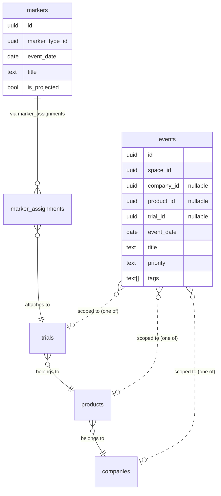

# Catalysts and Events on Entity Detail Pages

## Summary

Bring the existing landscape timeline visualization to the three entity detail pages (trial, product, company), filtered to that entity, with default time windows tuned per scope. Add an adjacent events panel on each page showing the external intelligence stream scoped to the same entity. One timeline component, three scopes, no new chart types. No dedupe logic between markers and events because the data model already separates them by purpose.

## Goals

- Trial, product, and company detail pages each gain a Timeline section showing the trial-scoped markers ("catalysts") that already power the landscape view, filtered to the page's entity.
- Each page gains an Events panel showing external intelligence events (press releases, sell-side notes, partnerships, AdCom commentary, etc.) scoped to the same entity, including events on descendant entities.
- The trial page keeps its existing Markers data table as the analyst-facing detail surface; the Timeline sits above it.
- Reuses the existing `TimelineViewComponent` and `LandscapeStateService` rather than introducing a new chart component.
- Reuses the existing `get_events_page_data` RPC, extended once to roll up events through the trial -> product -> company hierarchy.

## Non-Goals

- No new chart type. The portfolio matrix sketched in `src/client/public/internal/catalyst-event-lenses.html` (Lens 3 Variant A) is explicitly rejected in favor of the existing timeline with company-scope defaults (Variant B).
- No dedupe between markers and events. The schema analysis confirms they are non-overlapping by purpose: markers are typed trial milestones, events are surrounding intelligence. Both can sit on the same page without redundancy.
- No new junction table linking events to markers.
- No changes to the existing landscape page or its filter bar.
- Marker lifecycle change events (`marker_added`, `marker_reclassified`, etc.) stay in the "Recent activity" feed on the trial page where they live today; they do not surface in the new Events panel.
- No server-side rendering of the timeline. Same client-side rendering as the landscape page.
- No new RPC for catalyst data on entity pages. The existing dashboard data fetch through `LandscapeStateService` is reused with locked filters.

---

## Background: markers, events, catalysts

A short version of the data model so the spec is self-contained.

### The three names map to two tables

- **Markers** (`public.markers`): typed milestones pinned to trial timelines via `marker_assignments`. CT.gov auto-creates three system types (Trial Start, PCD, Trial End); analysts create the rest. Render as colored shapes on the timeline.
- **Events** (`public.events`): the competitive intelligence stream. Analyst-curated only, never written by CT.gov sync. Each event is scoped to exactly one of space, company, product, or trial via mutually exclusive FK columns.
- **Catalysts**: a UI term, not a table. `catalyst.model.ts` defines a `Catalyst` TypeScript shape with a `marker_id` (not `catalyst_id`) plus product / company / trial rollup fields. The catalysts page queries forward-looking markers; "catalyst" in user-facing copy means "forward-looking marker."

### Why dedupe is not needed

Markers and events have no FK linking them. They are not parallel streams of the same content. A "Topline data" marker and a "Lilly announces topline" press release are about the same calendar day but carry different information: the marker is the typed milestone (positionable on a timeline), the press release is how the milestone was announced (a piece of intelligence with source, narrative, and market reaction). Both belong on the page.

### Relationship diagram



No edge between markers and events. The closest connection is that they both join up to trials, which join up to products, which join up to companies.

---

## Page-level design

### Trial detail page (`/manage/trials/:id`)

Order, top to bottom:

1. Existing intelligence block and referenced-in panel (unchanged).
2. **NEW** Timeline section: single-trial timeline filtered to this trial, full-history time window (auto-fit to data).
3. Existing Markers data table (unchanged; remains the primary analyst-facing edit surface).
4. **NEW** Events panel (sits in the right rail next to the Timeline if room, otherwise stacked below). Scoped to this trial. 20 most recent. "See all" link to `/activity` pre-filtered.
5. Existing Notes, Materials, CT.gov data, Activity (unchanged).

### Product detail page (`/manage/products/:id`)

Order, top to bottom:

1. **NEW** Timeline section: multi-trial timeline filtered to this product's trials. Time window auto-fits to the program span (first trial start through last projected catalyst).
2. **NEW** Events panel scoped to this product (including events on descendant trials, see RPC change below). 20 most recent. "See all" link.
3. Existing intelligence block, referenced-in, materials sections move below.

### Company detail page (`/manage/companies/:id`)

Order, top to bottom:

1. **NEW** Timeline section: portfolio timeline filtered to this company's products and their trials. Default time window: today through today + 8 quarters (forward-only). Toggleable window control exposed.
2. **NEW** Events panel scoped to this company (including events on descendant products and trials). 20 most recent. "See all" link.
3. Existing intelligence block, referenced-in, materials sections move below.

### Wording rules

- Section header on all three pages: **"Timeline"**. Consistent with the landscape feature; no new term introduced.
- Side panel header: **"Events"**. Sub-label: "External intelligence scoped to this <trial / product / company>."
- The word "catalyst" stays on the catalysts page; it does not appear in the new section headers.

---

## Component design

### 1. `LandscapeStateService` changes

Three small additions:

a) Add `trialIds: string[]` to `LandscapeFilters` and `EMPTY_LANDSCAPE_FILTERS` in `core/models/landscape.model.ts`.

b) Apply the new filter in `filterDashboardData` in `features/landscape/landscape-state.service.ts`. Place the trial filter alongside the existing therapeutic-area / phase / status filters (around line 262), filtering trials by `id`.

c) Add an optional `disablePersistence` flag on `init(spaceId, opts?)`. When true, skip the sessionStorage write in the `persistEffect` (today line 91). Entity pages set this to true so they do not write to the shared `landscape-state:${spaceId}` key.

### 2. `TimelineViewComponent` changes

Promote the existing internal `startYear` and `endYear` signals to optional inputs:

```typescript
readonly startYear = input<number | null>(null);
readonly endYear   = input<number | null>(null);
```

The current `effect()` that auto-fits the year range (lines 67-98) becomes conditional: if either input is provided, skip the effect. Internal signals get a `computed()` derived from input value or the auto-fit result, whichever applies.

No other changes to the component. It continues to read `state.filteredCompanies()`.

### 3. New `EntityEventsPanelComponent`

Standalone component, lives at `src/client/src/app/shared/components/entity-events-panel/`. Inputs:

```typescript
readonly entityLevel = input.required<'trial' | 'product' | 'company'>();
readonly entityId    = input.required<string>();
readonly limit       = input<number>(20);
```

Calls `get_events_page_data` with `p_source_type='event'`, `p_entity_level=<level>`, `p_entity_id=<id>`. Renders the list with the same row shape used on the activity page (icon + title + date + entity context + tags). Includes a "See all" link that navigates to `/activity` pre-filtered.

OnPush, signals, inject DI, native control flow, all per `src/client/CLAUDE.md`.

### 4. Detail page wiring

Each of the three detail pages:

- Adds `providers: [LandscapeStateService]` to the component decorator so each page gets its own state-service instance.
- In a `constructor` effect (or `ngOnInit`), calls `state.init(spaceId, { disablePersistence: true })`, then sets `state.filters.set({ ...EMPTY_LANDSCAPE_FILTERS, <scopeKey>: [<entityId>] })`.
- Mounts `<app-timeline-view [startYear]="..." [endYear]="..." />` with year inputs only set for the company page (forward 8q). Trial and product pages pass `null` for both and let the auto-fit effect run.
- Mounts `<app-entity-events-panel [entityLevel]="..." [entityId]="..." />` adjacent.

---

## Data design

### RPC change: `get_events_page_data` hierarchical event scope

Today the events half of the union matches `p_entity_id` against `ev.company_id`, `ev.product_id`, or `ev.trial_id` directly (`20260413120100_events_rpc_functions.sql:87-91`):

```sql
and (
  p_entity_id is null
  or ev.company_id = p_entity_id
  or ev.product_id = p_entity_id
  or ev.trial_id = p_entity_id
)
```

This does not roll up: a product page misses events tagged at trial level under that product. The markers half of the same RPC (lines 132-137) already rolls up through the `trial -> product -> company` join chain, so the existing behavior is inconsistent between the two halves.

The change: extend the events half to roll up through `products.company_id` and `trials.product_id`. New migration `20260510120000_events_rpc_hierarchical_scope.sql`:

```sql
-- in the events half of the union, replace the entity_id filter with:
left join public.products    ev_pr on ev_pr.id = ev.product_id
left join public.companies   ev_co on ev_co.id = coalesce(ev.company_id, ev_pr.company_id, co_via_trial.id)
-- (existing trial -> product -> company joins already in the query)
and (
  p_entity_id is null
  or ev.company_id = p_entity_id
  or ev.product_id = p_entity_id
  or ev.trial_id   = p_entity_id
  or (p_entity_level = 'product' and pr_via_trial.id = p_entity_id)
  or (p_entity_level = 'company' and (co_via_product.id = p_entity_id or co_via_trial.id = p_entity_id))
)
```

Exact join shape will be settled during implementation; the principle is: when scoping to a product, include events whose `trial_id` is under that product. When scoping to a company, include events whose `trial_id` or `product_id` is under that company. Direct matches still work.

Test plan: insert one event at company level, one at product level under it, one at trial level under that product. Verify each entity scope returns the correct rolled-up set.

### Default time windows per scope

| Scope | Default start | Default end | Strategy |
|-------|---------------|-------------|----------|
| Trial   | min(marker.event_date) - 1y | max(marker.event_date) + 1y | Existing auto-fit. |
| Product | min across all trials in product | max across all trials in product | Existing auto-fit. |
| Company | today (start of quarter)        | today + 8 quarters             | Pass explicit `startYear`/`endYear` inputs. |

All three are toggleable post-MVP via a window selector; defaults are the load-bearing UX call.

---

## Build plan

Tasks are ordered. Each ships with its test in the same change set (per project convention).

1. **`LandscapeStateService` filter changes.** Add `trialIds` to `LandscapeFilters` + `EMPTY_LANDSCAPE_FILTERS`, apply in `filterDashboardData`, add `disablePersistence` option on `init()`. Tests: filter trials by single id, filter trials by multiple ids, persistence is skipped when flag is set.

2. **`TimelineViewComponent` optional year inputs.** Promote `startYear`/`endYear` to inputs, gate the auto-fit effect, internal signals become computed-derived. Tests: parent-provided years override auto-fit, null inputs preserve auto-fit behavior.

3. **`get_events_page_data` hierarchical event scope.** New migration. Extends the events half of the union to roll up through `products` and `trials`. Tests in SQL: insert layered events at company/product/trial, assert each entity scope returns the correct set. Run `supabase db advisors --local --type all` after.

4. **`EntityEventsPanelComponent`.** New standalone component under `shared/components/entity-events-panel/`. Fetches via existing supabase client, renders list with shared row shape, links to `/activity`. Tests: renders empty state, renders list, "See all" link target is correct.

5. **Trial detail page wiring.** Provide `LandscapeStateService` on the component, lock filters to `trialIds: [trialId]`, mount Timeline above Markers table, mount Events panel alongside. Tests: state service is scoped, Markers table still renders, no regressions on existing sections.

6. **Product detail page wiring.** Same pattern, filter `productIds: [productId]`. Tests: timeline shows all product's trials, events panel includes descendant-trial events.

7. **Company detail page wiring.** Same pattern, filter `companyIds: [companyId]`, pass forward-8q year inputs. Tests: window is forward-only, events panel includes events at product and trial levels.

8. **Runbook regen + help-page audit.** Run `npm run docs:arch` from `src/client/`. Check whether help pages (`features/help/`) referencing markers/events need a phrasing update for the entity-page surface.

---

## Tests (per-task)

Per `feedback_tests_first_per_task`: every task above includes its Vitest spec inline. No deferred "Phase: Tests" pile at the end.

Coverage targets that matter:

- `LandscapeStateService.trialIds` filter behavior (pure function, easiest to test).
- `TimelineViewComponent` input override / auto-fit gating.
- RPC hierarchical event scope (pgTAP or plain SQL assertions).
- `EntityEventsPanelComponent` render states.
- End-to-end: trial / product / company detail page renders without console errors and the Timeline shows the expected scope.

A11y: each new component must pass AXE (per `src/client/CLAUDE.md` section 7). Keyboard nav, focus indicators, aria labels.

---

## Open questions

1. **Default window quarter alignment.** "Forward 8 quarters" on the company page: should `startYear` be the start of the current calendar quarter, or the start of the current calendar year? The timeline component takes year inputs, not date inputs, so the finest granularity it accepts is a year. The clean fix is to either accept date inputs or to round the company-window start to the current year. The current proposal rounds to year. Worth confirming.

2. **Window-control affordance.** Defaults are settled. Should the toggle to widen / shift the window be exposed on each page, or hidden behind a context menu? Recommend a small inline control above the Timeline for the company page only (where it matters most), deferring trial/product window controls to a later iteration.

3. **Events panel sort.** `get_events_page_data` orders by `event_date desc, created_at desc`. For the panel, is reverse chronological correct (most recent first), or should pinned / high-priority events float? Recommend reverse chronological for MVP, defer pinning.

4. **Loading state during state-service init.** Each detail page now gets its own `LandscapeStateService` instance, which fetches the full unfiltered dataset. On a slow connection this is the same load that the landscape page does. Worth measuring: does mounting a per-page instance cause a noticeable hit vs. reading from a shared instance? If yes, consider a shared root-scoped data layer with per-page filter scope, or a per-page lighter-weight RPC that returns only the entity's data.

5. **Marker click target.** On the landscape page, clicking a marker opens a shared detail drawer. Should that behavior carry over to the entity-page timelines, or should the click navigate (e.g., from a company-page marker click, drill into the trial detail page)? Recommend keep the drawer for MVP, evaluate after first user feedback.

---

## Out of scope (future)

- Hierarchical event rollup on the activity page itself (today the activity page does not need it because its filters are explicit).
- A junction table linking events to markers (only needed if we ever want to render a single combined feed without ambiguity).
- The portfolio matrix idiom from `catalyst-event-lenses.html` Lens 3 Variant A. Rejected for this iteration; can be revisited if user feedback indicates the timeline is not skimmable enough at company scope.
- Custom export of the per-entity timeline (today's `ExportDialogComponent` ships with the landscape; reuse needs separate thought).
- A "pin to calendar" or "subscribe to entity catalysts" feature.

---

## References

- Internal sketch deck: `src/client/public/internal/catalyst-event-lenses.html` (Variant A vs. B comparison).
- Existing landscape feature: `src/client/src/app/features/landscape/`.
- Existing markers system: `supabase/migrations/20260412130100_marker_system_redesign.sql`.
- Existing events system: `supabase/migrations/20260413120000_events_system.sql`, `20260413120100_events_rpc_functions.sql`.
- CT.gov marker seeding: `supabase/migrations/20260503060000_seed_ctgov_markers_on_sync.sql`.
- Brand and design rules: `docs/brand.md`, project root `CLAUDE.md`, `src/client/CLAUDE.md`.
