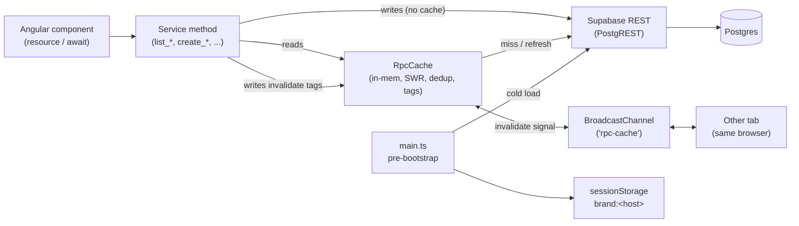

# Caching Strategy Design

**Status:** Proposed. Captures the V1 caching architecture for clint-v2. Implementation plan is the next step.

**Last updated:** 2026-05-14

---

## Goal

Eliminate repeat client-side fetches of the same data within a user session, bound cross-user staleness with explicit TTLs, and make page navigation feel instant. The strategy is layered: each layer is independently shippable and addresses one class of redundancy.

## Forcing function

`pg_stat_statements` analysis (2026-05-13) shows the highest-cost queries by total time are read-heavy aggregations and reference-data fetches that are refetched repeatedly within the same session:

| Pattern | Examples | Why caching helps |
|---|---|---|
| Heavy aggregations (~23% of total DB time) | `get_dashboard_data` (395+295 calls, 222 to 281 ms mean, tails to 4.5 s), `get_activity_feed`, `list_primary_intelligence`, `get_space_landing_stats` | High cost, repeated across components viewing the same filter. Stale-while-revalidate makes revisits instant. |
| Brand resolver (5.6%, **1,246 calls**) | `get_brand_by_host` | Called by `main.ts` on every page load. Host-keyed and anon. Same brand record fetched by every user every visit. |
| Per-space reference lists | `therapeutic_areas` (419 calls), `routes_of_administration` (360), `mechanisms_of_action` (366), companies+products LATERAL joins (583/505), `list_materials_for_entity` (708) | Read-mostly data, refetched by every component that needs it. In-memory dedup eliminates the refetch storm. |

The application currently has **zero client-side caching**. `supabase-js` is a thin HTTP wrapper around PostgREST; it deduplicates nothing and caches nothing. 168 call sites across 35 services hit the network on every invocation.

## Scope

In scope (V1):
- L0: Static-asset `Cache-Control` headers in `src/client/public/_headers`
- L1: `sessionStorage` brand cache in `main.ts`
- L2: `RpcCache` in-memory client cache with stale-while-revalidate, inflight dedup, tag-based invalidation, BroadcastChannel cross-tab signaling, and refresh-on-focus

Out of scope (V1):
- Cloudflare Worker edge cache for `get_brand_by_host` (revisit if the RPC remains in the top-N six months out)
- Postgres index tuning (`companies(display_order)`, `products(display_order)`) tracked as a standalone migration, not in this spec
- IndexedDB persistence (cold-load instant cache)
- Service Worker / offline support
- Cross-user real-time consistency
- Tag scoping by filter params (e.g., a marker on trial X invalidates only dashboard entries whose filter includes trial X)

## Decisions locked in

| Decision | Choice | Reasoning |
|---|---|---|
| Implementation style | Roll an in-house `RpcCache` utility, ~150 to 200 lines | Matches the codebase: signal-first, thin services, `async/await`. `supabase-js` has no built-in caching. `@psteinroe/supabase-cache-helpers` targets React Query / SWR, not Angular. TanStack Query is HttpClient-shaped, awkward fit for `.rpc()`. |
| Storage | In-memory `Map`, per tab, per session | Page reload is a cold cache. RLS-sensitive data does not touch disk. Simplest invalidation surface. |
| Brand cache | `sessionStorage` in `main.ts`, not a Worker route | 1,246 calls/day at 34 ms mean is ~42 s of total DB time. Session cache covers reloads and same-session navigation; cross-user warming via the Worker is not worth the code yet. |
| Mutation-side invalidation | Inline at each mutation method | Local, traceable, easy to grep. Each service method calls `cache.invalidateTags([...])` after the RPC succeeds. |
| Dashboard invalidation granularity | Coarse: any space-level write invalidates `space:<id>:dashboard` | Per-filter scoping is too clever for V1. Dashboards are rarely cached for long anyway; SWR keeps the UX smooth. |
| Realtime cross-user invalidation | Excluded from V1 | TTLs and refresh-on-focus bound staleness. Real-time is a separate spec when needed. |
| Composition with `resource()` | Optional, opt-in | Components keep using `resource()` where they already do (e.g., `landscape*`). Loaders call into services that route through `RpcCache`. No required migration. |
| Cache library | None. No new dependency. | Surface is small enough to own; library impedance mismatch with Supabase RPCs is non-trivial. |

---

## Architecture



### Layers

| Layer | Scope | Mechanism | Location |
|---|---|---|---|
| L0 | `index.html`, hashed JS/CSS bundles, fonts, favicons | `Cache-Control` headers via Cloudflare `_headers` rules | `src/client/public/_headers` |
| L1 | `get_brand_by_host` (anon, pre-bootstrap) | `sessionStorage` key `brand:<host>` with 5 min TTL, cleared on branding mutations and via `BroadcastChannel` | `src/client/src/main.ts` |
| L2 | All authenticated reads (RPCs and table reads) | `RpcCache` singleton injected into all services that need caching | `src/client/src/app/core/services/rpc-cache.service.ts` (new) |

---

## Tier mapping for L2

Each RPC is assigned to one of three tiers. Tier defines the default TTL profile. Per-RPC overrides are allowed and live next to the call site.

| Tier | RPCs / table reads | Fresh TTL | Stale TTL |
|---|---|---|---|
| **Reference (per-space)** | `list_companies` (with products LATERAL), `list_products` (with MoA/RoA LATERAL), `list_therapeutic_areas`, `list_mechanisms_of_action`, `list_routes_of_administration`, marker types / categories / event categories (global) | 5 min | Until invalidate |
| **Heavy aggregations** | `get_dashboard_data`, `get_activity_feed`, `list_primary_intelligence`, `get_space_landing_stats`, `get_trial_detail_with_intelligence`, `list_recent_materials_for_space`, `list_draft_intelligence_for_space`, `list_materials_for_entity` | 30 s | 5 min |
| **No cache** | All write RPCs, `getSession`, audit writes, CT.gov ingest endpoints | n/a | n/a |

Reference data uses `staleUntil = Infinity` because changes only happen via known mutations that invalidate the relevant tags. Heavy aggregations are bounded by a 5-min stale window so that even without an invalidation signal, data cannot get arbitrarily out of date.

---

## L2: `RpcCache` mechanics

### Entry shape

```ts
type CacheEntry<T> = {
  data: T;
  fetchedAt: number;
  freshUntil: number;     // before this: serve, no refresh
  staleUntil: number;     // between fresh and stale: serve + background refresh
  tags: string[];
  inflight?: Promise<T>;  // dedup for concurrent identical requests
};
```

### Public API

```ts
@Injectable({ providedIn: 'root' })
export class RpcCache {
  get<T>(
    rpcName: string,
    params: object,
    opts: {
      ttl: { fresh: number; stale: number };
      tags: string[];
      fetch: () => Promise<T>;
    }
  ): Promise<T>;

  invalidateTags(tags: string[]): void;
  invalidateAll(): void;

  // Optional signal accessor for templates that want reactive updates
  // when a background refresh completes. Returns undefined until first fetch.
  signal<T>(rpcName: string, params: object): Signal<T | undefined>;
}
```

### Read path

1. Compute key as `rpcName + stableStringify(params)`. Object keys are sorted for stable hashing.
2. Look up entry in the `Map<string, CacheEntry>`.
3. If `entry.inflight` exists, return it (dedup).
4. If `entry` exists and `now < entry.freshUntil`, return `entry.data` immediately, no refresh.
5. If `entry` exists and `now < entry.staleUntil`, return `entry.data` immediately AND kick off a background `fetch()`. Background result updates `entry` and notifies any signal subscribers.
6. Otherwise, set `entry.inflight = fetch()`, await it, populate `entry`, return.

### Inflight deduplication

Two components mounting at the same moment and asking for the same data share one network round trip. This is the most common dedup win in practice: a layout component, a sidebar, and a main view all needing `list_companies(spaceId)` on first paint.

### Refresh-on-focus

The cache listens for `document.visibilitychange`. When the page transitions to `visible`, any entry with `now > entry.freshUntil` is treated as needing a background refresh (but is still served immediately to consumers requesting it). Entries strictly past `staleUntil` are evicted on access regardless.

This is the primary mechanism for users coming back from lunch or another tab. Cheap to implement; large UX win.

### LRU eviction

The `Map` is bounded at 200 entries. On every `set`, if `size > 200`, remove the least-recently-accessed entry. Each `get` updates a separate `accessTime` counter. Eviction never removes an inflight entry. Reference-tier entries that are evicted under pressure simply get re-fetched on next access, same as any other tier.

### Cross-tab via BroadcastChannel

```ts
const channel = new BroadcastChannel('rpc-cache');

invalidateTags(tags: string[]): void {
  this.invalidateLocal(tags);
  channel.postMessage({ type: 'invalidate', tags });
}

channel.onmessage = (event) => {
  if (event.data?.type === 'invalidate') {
    this.invalidateLocal(event.data.tags);
  }
};
```

Same-browser, same-user, multi-tab coordination. ~15 lines.

### Composition with `resource()`

The four existing `resource()` call sites in `landscape*.component.ts` need no API change. Their loader functions call service methods, and the service methods route through `RpcCache`. The component still gets the reactive `Signal<T>` interface from `resource()`; the cache adds dedup and SWR underneath.

```ts
companiesResource = resource({
  params: () => ({ spaceId: this.spaceId() }),
  loader: ({ params }) => this.companyService.list(params.spaceId),
});
```

`CompanyService.list` internally calls `this.cache.get('list_companies', { spaceId }, {...})`.

### What `RpcCache` is NOT

- Not persistent. Tab reload is a cold cache. L1 covers the brand resolver case.
- Not RxJS-shaped. Returns Promises. Works with `await`, `resource()`, and `effect()`.
- Not a "query library." There is no separate concept of mutations. Service methods read or write the cache directly.

---

## Tag taxonomy

Tags are plain strings. Two namespaces by convention:

**Entity-collection tags** (granular):
- `space:<id>:companies`
- `space:<id>:products`
- `space:<id>:moa`
- `space:<id>:roa`
- `space:<id>:therapeutic-areas`
- `trial:<id>:detail`
- `entity:<type>:<id>:materials`
- `markers:types` (global)

**View tags** (coarse, derived views):
- `space:<id>:dashboard`
- `space:<id>:landing-stats`
- `space:<id>:activity`
- `space:<id>:primary-intelligence`
- `space:<id>:drafts`
- `space:<id>:materials`

A read carries one or more tags. A write invalidates one or more tags. Tags are not registered anywhere; they are conventional strings.

### Reads to tags

| Read | Tags carried |
|---|---|
| `list_companies(spaceId)` | `space:<id>:companies` |
| `list_products(spaceId)` | `space:<id>:products` |
| `list_therapeutic_areas(spaceId)` | `space:<id>:therapeutic-areas` |
| `list_mechanisms_of_action(spaceId)` | `space:<id>:moa` |
| `list_routes_of_administration(spaceId)` | `space:<id>:roa` |
| `get_dashboard_data(spaceId, ...)` | `space:<id>:dashboard` |
| `get_activity_feed(spaceId, ...)` | `space:<id>:activity` |
| `list_primary_intelligence(spaceId, ...)` | `space:<id>:primary-intelligence` |
| `get_space_landing_stats(spaceId)` | `space:<id>:landing-stats` |
| `list_recent_materials_for_space(spaceId, ...)` | `space:<id>:materials` |
| `list_draft_intelligence_for_space(spaceId, ...)` | `space:<id>:drafts`, `space:<id>:primary-intelligence` |
| `list_materials_for_entity(type, id, ...)` | `entity:<type>:<id>:materials`, `space:<id>:materials` |
| `get_trial_detail_with_intelligence(trialId)` | `trial:<id>:detail` |
| Global lookup tables (`marker_types`, `marker_categories`, `event_categories`) | `markers:types` |

### Writes to tags

| Mutation | Tags invalidated |
|---|---|
| `create_company`, `update_company`, `delete_company` | `space:<id>:companies`, `space:<id>:dashboard`, `space:<id>:landing-stats` |
| `create_product`, `update_product`, `delete_product` | `space:<id>:products`, `space:<id>:companies` (LATERAL embed), `space:<id>:dashboard`, `space:<id>:landing-stats` |
| Link/unlink product to MoA | `space:<id>:products`, `space:<id>:dashboard` |
| Link/unlink product to RoA | `space:<id>:products`, `space:<id>:dashboard` |
| `create_moa`, `update_moa`, `delete_moa` | `space:<id>:moa`, `space:<id>:products`, `space:<id>:dashboard` |
| `create_roa`, `update_roa`, `delete_roa` | `space:<id>:roa`, `space:<id>:products`, `space:<id>:dashboard` |
| `create_therapeutic_area`, `update_therapeutic_area`, `delete_therapeutic_area` | `space:<id>:therapeutic-areas`, `space:<id>:dashboard`, `space:<id>:landing-stats` |
| Place / delete marker | `trial:<id>:detail`, `space:<id>:activity`, `space:<id>:dashboard`, `space:<id>:landing-stats` |
| `create_intelligence`, `update_intelligence`, state transitions | `space:<id>:primary-intelligence`, `space:<id>:drafts`, `space:<id>:activity`, `space:<id>:landing-stats`, `trial:<id>:detail` (if linked) |
| Publish intelligence | as above plus `space:<id>:dashboard` if linked to a dashboard-shown entity |
| Upload / delete material | `entity:<type>:<id>:materials`, `space:<id>:materials`, `space:<id>:activity` |
| `update_tenant_branding`, `update_agency_branding` | L1 only: `sessionStorage.removeItem('brand:<host>')` plus BroadcastChannel cross-tab signal |
| Super-admin marker-type changes | `markers:types` (global) |

### Worked example

```ts
// In CompanyService:
async list(spaceId: string): Promise<Company[]> {
  return this.cache.get('list_companies', { spaceId }, {
    ttl: { fresh: 300_000, stale: Infinity },
    tags: [`space:${spaceId}:companies`],
    fetch: async () => {
      const { data, error } = await this.supabase.client
        .from('companies')
        .select('*, products(*)')
        .eq('space_id', spaceId)
        .order('display_order');
      if (error) throw error;
      return data ?? [];
    },
  });
}

async create(spaceId: string, name: string): Promise<Company> {
  const { data, error } = await this.supabase.client
    .rpc('create_company', { p_space_id: spaceId, p_name: name });
  if (error) throw error;
  this.cache.invalidateTags([
    `space:${spaceId}:companies`,
    `space:${spaceId}:dashboard`,
    `space:${spaceId}:landing-stats`,
  ]);
  return data;
}
```

### Why coarse view tags are fine

`space:<id>:dashboard` gets invalidated by many distinct mutations. The cache will rarely hold a dashboard entry for more than a few seconds during heavy edits. That is fine. The wins are still:

1. Same-page dedup: 5 widgets on a screen asking for the same data, 1 fetch.
2. Back/forward and route revisit within seconds: instant.
3. Refresh-on-focus return from another tab: smooth, no manual reload.

What this design deliberately does NOT do: hold a dashboard cached for 10 minutes while a heavy user clicks around editing trials. We do not want that anyway.

---

## L1: `sessionStorage` brand cache

### Current state

`src/client/src/main.ts` calls `supabase.rpc('get_brand_by_host', { p_host: window.location.host })` before Angular bootstraps. The result drives:

- `document.title`
- Favicon link
- `--brand-50..950` CSS variables
- PrimeNG preset
- `BrandContextService` initial state

This call happens on every fresh page load, every tab, every hard refresh. 1,246 calls / sample window.

### Design

Wrap the fetch in a `sessionStorage` cache with a 5-min TTL:

```ts
async function fetchBrand(): Promise<Brand> {
  const host = window.location.host;
  const key = `brand:${host}`;

  // Cache hit
  const cached = sessionStorage.getItem(key);
  if (cached) {
    try {
      const { brand, fetchedAt } = JSON.parse(cached);
      if (Date.now() - fetchedAt < 5 * 60 * 1000) {
        return brand;
      }
    } catch {
      // fall through to refetch
    }
  }

  // Cache miss
  const supabase = createClient(environment.supabaseUrl, environment.supabaseAnonKey, {
    auth: { persistSession: false, autoRefreshToken: false, detectSessionInUrl: false },
  });
  const { data, error } = await supabase.rpc('get_brand_by_host', { p_host: host });
  if (error || !data) return DEFAULT_BRAND;

  const brand = { ...DEFAULT_BRAND, ...data };
  sessionStorage.setItem(key, JSON.stringify({ brand, fetchedAt: Date.now() }));
  return brand;
}
```

### Invalidation

Three cases:

1. **Self-initiated branding update.** `update_tenant_branding` and `update_agency_branding` are followed by `sessionStorage.removeItem('brand:<host>')` and a `BroadcastChannel` message that other tabs listen for.
2. **Cross-user branding update.** Not handled directly. Bounded by the 5-min TTL. Branding changes are rare.
3. **Dev override** (the `?wl_kind=...&wl_id=...` query string short-circuit in non-prod). Bypasses the cache entirely, same as today.

### What L1 does not cover

- First-ever load on a new browser or after `sessionStorage` is cleared. That path is the same as today: 30 ms anon RPC. Acceptable given the volume.

---

## L0: bundle and asset cache headers

Currently `src/client/public/_headers` only sets security headers. No `Cache-Control` rules.

Add:

```
/index.html
  Cache-Control: no-cache

/*.html
  Cache-Control: no-cache

/*.js
  Cache-Control: public, max-age=31536000, immutable

/*.css
  Cache-Control: public, max-age=31536000, immutable

/*.woff2
  Cache-Control: public, max-age=31536000, immutable

/favicon.svg
  Cache-Control: public, max-age=86400
```

`index.html` is `no-cache` so the user always sees the latest entry point. Hashed bundle files are content-addressed and safe to cache forever. Fonts and favicons get long TTLs.

---

## Testing strategy

### Unit (Vitest)

Per-task tests, paired with each component of the implementation:

| Component | Test cases |
|---|---|
| `RpcCache.get` | Cache miss fetches and stores; cache hit returns without fetching; inflight dedup; SWR returns stale and triggers background refresh; expired stale fetches fresh |
| `RpcCache.invalidateTags` | Drops matching entries; broadcasts via `BroadcastChannel`; other-tab receipt drops local entries |
| `RpcCache` refresh-on-focus | `visibilitychange` to visible flags expired entries for refresh on next access |
| `RpcCache` LRU | At 200 entries, least-recently-accessed evicted on next set |
| `RpcCache` key normalization | Object key order does not change the cache key |
| `main.ts` brand cache | Fresh fetch on miss; cached return within 5 min; cache cleared on mutation event |
| One representative service refactor (`CompanyService`) | Read goes through cache; mutation invalidates the documented tag set |

### Integration

Add to `vitest.units.config.ts` and / or `integration/vitest.config.ts` as appropriate:

- Mount two `RpcCache` instances in the same JSDOM, send a write via one, assert the other sees the invalidation.
- Mount a component that uses `resource()` with a service that routes through `RpcCache`; assert that a mutation in a sibling component triggers a re-fetch on the resource.

### Manual verification

Before merging:

1. Open DevTools Network tab on a page with multiple components needing `list_companies`. Confirm one request, not five.
2. Navigate away and back within 30 s. Confirm dashboards render from cache (no spinner flash).
3. Mutate a company, observe the relevant tags get invalidated (use a `console.debug` hook in dev mode), and the next read fetches fresh.
4. Open two tabs on the same space. Mutate in tab A. Confirm tab B's affected views show fresh data on next visit (BroadcastChannel path).
5. Reload the page. Confirm brand resolves from `sessionStorage` (no network round trip in the waterfall before bootstrap) on the second load.

---

## Rollout plan

Each phase is independently shippable.

### Phase 1: L0 + L1

- Add `_headers` rules.
- Add `sessionStorage` cache to `main.ts` brand fetch.
- Add `sessionStorage.removeItem` calls to `TenantService.updateBranding` and `AgencyService.updateBranding`.
- Wire BroadcastChannel for brand invalidation.

Smallest surface. Smoke test on a deploy preview.

### Phase 2: L2 RpcCache (core)

- Add `src/client/src/app/core/services/rpc-cache.service.ts`.
- Public API: `get`, `invalidateTags`, `invalidateAll`, `signal`.
- Internals: entry map, inflight map, BroadcastChannel, LRU, refresh-on-focus.
- Vitest specs paired with each behavior.

No services touch the cache yet. Ship the primitive on its own.

### Phase 3: Reference-tier migrations

Update the services that own reference data to route reads through `RpcCache` and to invalidate tags on writes:

- `CompanyService` (with products LATERAL)
- `ProductService` (with MoA / RoA LATERAL)
- `TherapeuticAreaService`
- `MechanismOfActionService`
- `RouteOfAdministrationService`
- `MarkerTypeService`, `MarkerCategoryService`, `EventCategoryService` (global, single shared tag)

Per-service Vitest spec asserting the read-hits-cache and write-invalidates-tags behavior.

### Phase 4: Heavy-aggregation tier migrations

- `DashboardService.getDashboardData`
- `ChangeEventService.getActivityFeed` (wraps `get_activity_feed`)
- `PrimaryIntelligenceService.list`
- `SpaceService.getLandingStats`
- `TrialService.getDetailWithIntelligence`
- `MaterialService.listRecentForSpace`, `MaterialService.listDraftsForSpace`, `MaterialService.listForEntity`

Each comes with its tag-write map applied to the corresponding mutation methods.

### Phase 5: Verification and tuning

Re-pull `pg_stat_statements`. Confirm:

- `list_companies`, `list_products`, `list_*` reference reads dropped at least 70% in call count.
- `get_dashboard_data`, `get_activity_feed`, `list_primary_intelligence`, `get_space_landing_stats` dropped at least 40%.
- `get_brand_by_host` dropped at least 60%.

Tune TTLs from the registry if any RPC is too aggressive or too loose.

---

## Failure modes and recovery

| Failure | Detection | Recovery |
|---|---|---|
| Cache returns stale data after a mutation forgot to invalidate | User reports stale UI after a write | Add missing tag to the mutation method. Inline location makes it a one-line fix. |
| Cache key collision (two RPCs sharing a key) | Wrong data appears in unrelated view | Key is `rpcName + stableStringify(params)`; collision requires same name and same params, which is the intent. If a bug emerges, namespace the key prefix. |
| `BroadcastChannel` not supported (older browsers) | n/a (supported in all modern browsers; degraded silently to no cross-tab sync) | No fallback in V1. Single-tab usage is fully functional. |
| `sessionStorage` quota exceeded | Brand fetch fails silently and falls back to network | Try/catch around `setItem`. No retry. |
| Memory pressure from large entries | Profile shows high memory in cache | LRU bound at 200 entries protects; large RPCs can opt into a smaller cap via the `opts` argument. |
| User on a slow connection sees stale-then-fresh flicker | UX feedback | SWR is the contract; entries within `freshUntil` do not refresh in the background. Tune `freshUntil` upward for surfaces where flicker is unacceptable. |

---

## Open questions

None for V1. The design is buildable as written.

Topics deliberately left for later specs:
- Cross-user real-time consistency (Supabase Realtime to tag invalidation)
- Worker edge cache for `get_brand_by_host`
- IndexedDB persistence for cold-load instant cache
- Postgres index tuning (separate migration, not a caching concern)
