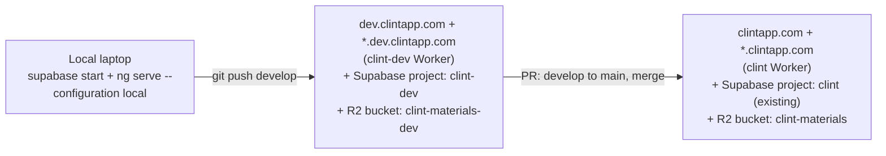
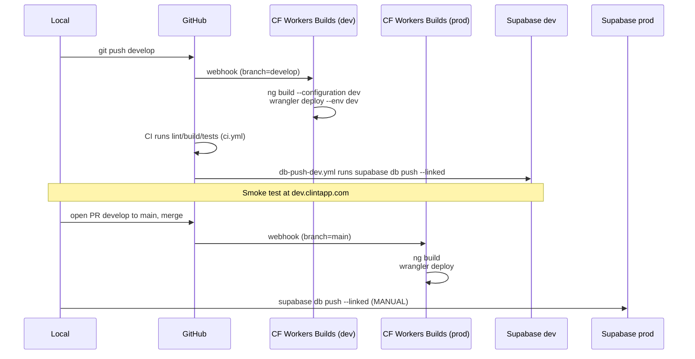

# Dev Environment Design

**Date:** 2026-05-20
**Status:** Draft
**Author:** Aaditya Madala (with Claude)

## Summary

Stand up a persistent dev environment at `dev.clintapp.com` that mirrors prod's
shape: separate Cloudflare Worker, separate Supabase project, separate R2
bucket, wildcard subdomain support, real Google OAuth. Developers push the
`develop` branch from local; Cloudflare Workers Builds auto-deploys the SPA to
`clint-dev`; a GitHub Action auto-applies pending Supabase migrations to the
dev project. Promotion to prod is a PR `develop` to `main`; merging deploys
the SPA automatically. Applying migrations to prod stays a manual
`supabase db push` ritual.

## Goals

- A single shared dev URL developers can push to from local and smoke-test
  against before merging to prod.
- Faithful whitelabel testing on dev: wildcard subdomain (`acme.dev.clintapp.com`
  resolves to the Acme tenant via `get_brand_by_host`, same code path as prod).
- No prod data on dev. Dev runs the same migrations and a clean
  `seed.sql`-derived baseline.
- Auto-deploy on push for low-friction iteration; explicit human gate before
  destructive schema changes hit prod.

## Non-goals

- Per-PR ephemeral previews. (Single shared dev only. Revisit if multiple
  contributors start stepping on each other.)
- Sanitized prod-data snapshots in dev. (Bare migrations + seed only.)
- Promotion automation for prod DB migrations. (Manual `supabase db push`.)
- Production-grade observability on dev. Dev logs are best-effort.

## Architecture

### Topology



### What's shared, what's split

| Concern | Prod | Dev |
|---|---|---|
| Cloudflare Worker | `clint` (existing) | `clint-dev` (new) |
| Hostname | `clintapp.com` + `*.clintapp.com` | `dev.clintapp.com` + `*.dev.clintapp.com` |
| Supabase project | `gmgprkymyjzkzirbzqzd` (existing) | new project `clint-dev` |
| R2 bucket | `clint-materials` | `clint-materials-dev` (new) |
| Rate-limiter namespace ids | 1001 / 1002 | 1003 / 1004 |
| Cron `0 7 * * *` (CT.gov ingest) | enabled | **disabled** (manual trigger only) |
| Google OAuth client | existing | same client, dev redirect URI added |
| `apexDomain` (Angular env) | `clintapp.com` | `dev.clintapp.com` |
| DB data | prod | `seed.sql`-derived only |
| Edge function `send-invite-email` | not in use (scaffolded only) | not deployed (defer until invites go live) |

### Deploy flow



## Component design

### Cloudflare: two separate Workers, one config file

Why two Workers and not one Worker with Wrangler envs: Cloudflare Workers
Builds (the Git auto-deploy you already use) is configured per-Worker. Each
Worker has one Builds connection: one repo, one branch filter, one build
command. To auto-deploy on push to both `main` and `develop` we need two
Builds configs, which map most naturally to two Workers. Side benefit:
separate analytics, logs, secret stores, rate-limit counters. Blast radius
of a dev misconfiguration cannot reach prod.

The wrangler config stays in a single file; `[env.dev]` overrides only what
differs from prod.

```jsonc
// src/client/wrangler.jsonc (excerpted; top-level stays prod)
{
  "name": "clint",
  // ... existing prod config ...
  "vars": {
    "ALLOWED_APEXES": "clintapp.com",
    "R2_BUCKET": "clint-materials",
    "CTGOV_BASE_URL": "https://clinicaltrials.gov",
    "CTGOV_BATCH_SIZE": "100",
    "CTGOV_PARALLEL_FETCHES": "10"
  },
  "triggers": { "crons": ["0 7 * * *"] },
  "ratelimits": [
    { "name": "UPLOAD_LIMITER",   "namespace_id": "1001", "simple": { "limit": 30,  "period": 60 } },
    { "name": "DOWNLOAD_LIMITER", "namespace_id": "1002", "simple": { "limit": 120, "period": 60 } }
  ],

  "env": {
    "dev": {
      "name": "clint-dev",
      "vars": {
        "ALLOWED_APEXES": "dev.clintapp.com",
        "R2_BUCKET": "clint-materials-dev",
        "CTGOV_BASE_URL": "https://clinicaltrials.gov",
        "CTGOV_BATCH_SIZE": "100",
        "CTGOV_PARALLEL_FETCHES": "10"
      },
      "triggers": { "crons": [] },
      "ratelimits": [
        { "name": "UPLOAD_LIMITER",   "namespace_id": "1003", "simple": { "limit": 30,  "period": 60 } },
        { "name": "DOWNLOAD_LIMITER", "namespace_id": "1004", "simple": { "limit": 120, "period": 60 } }
      ]
    }
  }
}
```

Routing is handled by Cloudflare's Custom Domains (set in the dashboard,
not in `wrangler.jsonc`), matching the existing prod setup. The dev
Worker's Custom Domains are configured in the dashboard step below.

Cron is disabled on dev (`"crons": []`) so the daily CT.gov ingest does not
double-hit clinicaltrials.gov and does not fight test fixtures in the dev DB.
The scheduled handler in code is untouched; it can still be triggered on
demand with `wrangler dev --test-scheduled` or via an authenticated admin
route.

Rate-limiter namespace ids differ so dev and prod counters do not share
state.

### Cloudflare: DNS and routes

In Cloudflare DNS for `clintapp.com`:

| Type | Name | Target | Proxy |
|---|---|---|---|
| (auto) | `dev` | (Workers-managed) | proxied |
| (auto) | `*.dev` | (Workers-managed) | proxied |

Pragmatic path: in the Cloudflare dashboard under `clint-dev` Worker
-> Settings -> Domains & Routes, add both `dev.clintapp.com` and
`*.dev.clintapp.com` as Custom Domains. Cloudflare creates the records and
issues TLS certs (including the wildcard).

### Cloudflare: R2 and secrets

One-time:

```
wrangler r2 bucket create clint-materials-dev
# Mirror any CORS/lifecycle rules from clint-materials
wrangler secret put CTGOV_WORKER_SECRET --env dev
# Plus any other secrets that exist on prod
```

Generate a fresh `CTGOV_WORKER_SECRET` for dev rather than reusing prod's.

### Cloudflare: Workers Builds

Two Builds configurations in the Cloudflare dashboard, both pointed at the
same GitHub repo:

| Builds config | Worker | Branch filter | Build command |
|---|---|---|---|
| existing | `clint` | `main` | `cd src/client && npm ci && npm run build && cd .. && wrangler deploy` |
| new | `clint-dev` | `develop` | `cd src/client && npm ci && npm run build -- --configuration dev && cd .. && wrangler deploy --env dev` |

For the `clint-dev` Build, set "non-production branches: none" so feature
branches do not rack up unwanted preview deployments.

### Supabase: dev project

Create a second Supabase project (name: `clint-dev`) in the same region as
prod. Capture the project ref, anon key, and DB password.

One-time bootstrap from local:

```
supabase link --project-ref <dev-ref>
supabase db push                 # apply all migrations to dev
psql "$DEV_DB_URL" -f supabase/seed.sql
```

`seed.sql` is auto-applied only on `supabase db reset` against the local
stack, not on remote `db push`. Running it once via `psql` after the initial
`db push` is the one-time bootstrap; after that the dev DB lives its own
life. Re-running `seed.sql` later is not safe in general (it assumes empty
tables); if a clean reset of dev is ever needed, drop and recreate the
project rather than re-seeding.

### Supabase: Auth (dev project dashboard)

Under **Auth -> Providers -> Google**:
- Client ID and Client Secret: **same** as prod (one OAuth client, two
  redirect URIs).

Under **Auth -> URL Configuration**:
- Site URL: `https://dev.clintapp.com`
- Redirect URLs (allow-list): `https://dev.clintapp.com/auth/callback`,
  `https://*.dev.clintapp.com/auth/callback`

In Google Cloud Console, add to the existing OAuth client's "Authorized
redirect URIs":
- `https://<dev-ref>.supabase.co/auth/v1/callback`

If `[auth.external.azure]` is exercised on dev, mirror the same step for
the Microsoft app registration. Skip otherwise.

### Supabase: edge function and webhook (deferred)

`send-invite-email` is scaffolded but **not** currently active in prod (no
webhook configured, no Resend integration in use). Dev does not deploy it
either. When invite emails are turned on in prod, the dev mirror becomes a
follow-up effort whose own design will need to cover, at minimum:

- Deploying the function to the dev Supabase project.
- Setting `EMAIL_WEBHOOK_SECRET`, `RESEND_API_KEY`, and `EMAIL_BASE_URL`
  on the dev project (distinct from prod values).
- Recreating the `tenant_invites` INSERT webhook on the dev project,
  pointing at the dev function URL.
- A dev-email safety rail (Resend test key or `EMAIL_REDIRECT_TO`
  override) so dev cannot send real mail to real strangers.

Tracked in "Out of scope (future work)" below.

### Angular: env files and build configurations

Rename and add:

```
src/client/src/environments/
  environment.ts            # prod, unchanged
  environment.dev.ts        # NEW
  environment.local.ts      # RENAMED from environment.development.ts
```

`environment.dev.ts`:
```ts
export const environment = {
  production: true,
  supabaseUrl: 'https://<dev-ref>.supabase.co',
  supabaseAnonKey: '<dev-anon-key>',
  apexDomain: 'dev.clintapp.com',
};
```

`environment.local.ts` is byte-for-byte the existing `environment.development.ts`,
just renamed (`production: false`, `supabaseUrl: 'http://127.0.0.1:54321'`,
`apexDomain: ''`).

`angular.json` (`projects.clinical-trial-dashboard.architect.build.configurations`):

- Add a `dev` configuration. File replacement swaps `environment.ts` ->
  `environment.dev.ts`. Otherwise inherits prod's optimization, hashing, no
  source maps.
- Rename the existing `development` configuration to `local`. File
  replacement targets `environment.local.ts`. Other settings unchanged.

`angular.json` (`projects.clinical-trial-dashboard.architect.serve`):
- Change `defaultConfiguration` from `"development"` to `"local"` so
  `ng serve` / `npm start` keeps doing what it does today.

Grep the repo for `--configuration development`,
`configuration: 'development'`, and `environment.development` and update
every occurrence in the same change set (scripts, docs, README).

### Auth cookies on dev

With `apexDomain: 'dev.clintapp.com'`, Supabase JS writes session cookies
with `Domain=.dev.clintapp.com`. Browsers will not send these cookies to
`clintapp.com` (dev sub-tree only).

Documented annoyance, not a security hole: a browser signed into prod
(cookie scope `Domain=.clintapp.com`) *will* send the prod cookie to
`dev.clintapp.com` because dev is a subdomain of the prod apex. The prod
JWT is signed by prod Supabase's secret, dev Supabase rejects it, and
Supabase JS clears the bad session. Net effect: visiting dev while signed
into prod bounces you to login on dev. No prod data is exposed; no dev
data is exposed; the two session stores remain isolated.

### Branching, CI, and migration flow

`develop` is a long-lived branch. Local push deploys dev; PR `develop` to
`main` and merge deploys prod.

`ci.yml` triggers extended to include `develop`:

```yaml
on:
  push:
    branches: [main, develop]
  pull_request:
    branches: [main, develop]
```

No other changes to `ci.yml`. The lint/build/test jobs run against local
Supabase and remain env-agnostic.

New workflow `.github/workflows/db-push-dev.yml` auto-applies pending
migrations to the dev Supabase project on push to `develop` (when migration
files change):

```yaml
name: Push DB migrations to dev
on:
  push:
    branches: [develop]
    paths:
      - 'supabase/migrations/**'
jobs:
  push:
    runs-on: ubuntu-latest
    steps:
      - uses: actions/checkout@v4
      - uses: supabase/setup-cli@v1
        with: { version: latest }
      - run: supabase link --project-ref ${{ secrets.SUPABASE_DEV_PROJECT_REF }}
        env:
          SUPABASE_ACCESS_TOKEN: ${{ secrets.SUPABASE_ACCESS_TOKEN }}
      - run: supabase db push
        env:
          SUPABASE_DB_PASSWORD: ${{ secrets.SUPABASE_DEV_DB_PASSWORD }}
```

New GitHub repository secrets:
- `SUPABASE_ACCESS_TOKEN` (personal access token from the Supabase account)
- `SUPABASE_DEV_PROJECT_REF`
- `SUPABASE_DEV_DB_PASSWORD`

Edge function deploys are **not** in the automated workflow. They run rarely
and re-deploying on every push wastes CI minutes. Run
`supabase functions deploy send-invite-email --project-ref <dev-ref>` from
local when the function changes.

For **prod**, no DB workflow. The ritual is explicit:

```
supabase link --project-ref <prod-ref>
supabase db push       # review the diff; confirm
supabase functions deploy send-invite-email --project-ref <prod-ref>   # if changed
```

This ritual is documented in the runbook (see Documentation below).

### Branch protection

- `main`: require PR, require green CI, require at least one approval.
- `develop`: permissive. Direct push is the intended workflow.

## Day-to-day workflow (after bootstrap)

1. `git checkout develop && git pull`
2. Branch off, make changes, commit.
3. (For schema changes) `supabase migration new <name>`, add SQL, verify
   locally with `supabase db reset`.
4. Open a PR into `develop`. CI runs. Merge.
5. Push of merged commit to `develop` triggers:
   - Cloudflare Workers Builds -> `wrangler deploy --env dev`
   - `db-push-dev.yml` -> `supabase db push` against dev project
6. Smoke-test at `dev.clintapp.com` (or `<tenant>.dev.clintapp.com`).
7. When dev is green, open PR `develop -> main`. CI runs. Get approval.
   Merge.
8. Merge to `main` triggers Cloudflare Workers Builds -> `wrangler deploy`
   (prod SPA).
9. If the change included a migration, run from local:
   `supabase link --project-ref <prod-ref> && supabase db push`. Review the
   diff. Confirm.

## One-time bootstrap checklist

In recommended order:

1. **Supabase dev project**
   1. Create project `clint-dev` in the same region as prod. Capture
      `<dev-ref>`, anon key, DB password.
   2. `supabase link --project-ref <dev-ref>`
   3. `supabase db push`
   4. `psql "$DEV_DB_URL" -f supabase/seed.sql`
   5. Set Auth -> Providers -> Google: same client_id / secret as prod.
   6. Set Auth -> URL Configuration: Site URL
      `https://dev.clintapp.com`; redirect URLs
      `https://dev.clintapp.com/auth/callback`,
      `https://*.dev.clintapp.com/auth/callback`.

2. **Google Cloud Console**
   1. Add `https://<dev-ref>.supabase.co/auth/v1/callback` to the existing
      OAuth client's Authorized redirect URIs.

3. **Cloudflare**
   1. `wrangler r2 bucket create clint-materials-dev` and mirror any
      CORS/lifecycle rules from `clint-materials`.
   2. Add `[env.dev]` block to `wrangler.jsonc` (code change).
   3. From local: `wrangler deploy --env dev` to create the `clint-dev`
      Worker (or pre-create it via dashboard).
   4. Add Custom Domains `dev.clintapp.com` and `*.dev.clintapp.com` to
      `clint-dev` Worker.
   5. `wrangler secret put CTGOV_WORKER_SECRET --env dev` (and any other
      prod secrets).
   6. Cloudflare dashboard -> create second Workers Builds connection:
      repo = same, branch filter = `develop`, target Worker = `clint-dev`,
      build command =
      `cd src/client && npm ci && npm run build -- --configuration dev && cd .. && wrangler deploy --env dev`,
      non-production branches: none.

4. **GitHub repo**
   1. Add secrets: `SUPABASE_ACCESS_TOKEN`, `SUPABASE_DEV_PROJECT_REF`,
      `SUPABASE_DEV_DB_PASSWORD`.
   2. Create `develop` branch: `git checkout -b develop && git push -u origin develop`.
   3. Enable branch protection on `main` (PR + green CI + 1 approval).

5. **Code changes (single PR into `develop`)**
   1. Rename `src/client/src/environments/environment.development.ts` to
      `environment.local.ts`.
   2. Add `src/client/src/environments/environment.dev.ts` with dev
      Supabase URL / anon key / `apexDomain`.
   3. Update `src/client/angular.json`: rename `development` configuration
      to `local`; add `dev` configuration; set
      `serve.defaultConfiguration` to `"local"`.
   4. Grep + update any references to `--configuration development`,
      `configuration: 'development'`, `environment.development`.
   5. Add `[env.dev]` block to `src/client/wrangler.jsonc`.
   6. Add `.github/workflows/db-push-dev.yml`.
   7. Update `.github/workflows/ci.yml` triggers to include `develop`.
   8. Update runbook (`docs/runbook/`) with the prod migration ritual.
   9. Update `CLAUDE.md` with the new env file names and the dev URL.

6. **Smoke test the full pipeline**
   1. Push the bootstrap PR to `develop`. Confirm Cloudflare deploys
      `clint-dev`; confirm dev URL loads.
   2. Add a no-op migration, push to `develop`. Confirm `db-push-dev.yml`
      applies it.
   3. Sign in on dev via Google OAuth. Confirm session works on
      `dev.clintapp.com` and on a wildcard subdomain test
      (`acme.dev.clintapp.com` once an Acme tenant is created on dev).

## Documentation

- Update `CLAUDE.md` "Tech Stack" and "Spec Location" sections to name the
  dev environment and the env file convention (`local` / `dev` / prod).
- Add a section to `docs/runbook/` describing the prod migration ritual
  and the day-to-day promote-to-prod flow.
- Cross-link this spec from the runbook.

## Risks and open questions

- **Cookie bleed.** Prod cookies are visible to dev (subdomain), rejected
  by dev Supabase. Documented as user-visible annoyance. Acceptable.
- **R2 CORS drift.** Mirroring CORS / lifecycle from prod is a manual
  step. If prod's rules change later, dev does not auto-update. Acceptable;
  flag in the runbook.
- **Workers Builds preview deploys.** Disabling non-production-branch
  builds on `clint-dev` is a one-checkbox setting; if forgotten, every
  feature branch racks up clint-dev previews. Bootstrap step 3.6 calls it
  out.
- **Supabase plan limits.** A second Supabase project counts against the
  account's project quota. Confirm plan supports two active projects
  before starting bootstrap.

## Out of scope (future work)

- Per-PR preview deployments.
- Snapshotted-and-sanitized prod data in dev.
- Automated prod migration deploys.
- Dev observability parity with prod (Sentry, alerting, dashboards).
- Wildcard `*.<tenant-custom-domain>` testing on dev.
- **`send-invite-email` on dev.** Function is scaffolded in the repo but
  not active in prod. When invite emails go live, a follow-up will deploy
  the function to dev, set its secrets (`EMAIL_WEBHOOK_SECRET`,
  `RESEND_API_KEY`, `EMAIL_BASE_URL`), recreate the `tenant_invites`
  INSERT webhook on dev, and add a dev-email safety rail (Resend test key
  or `EMAIL_REDIRECT_TO` override) so dev cannot send real mail to real
  strangers.
