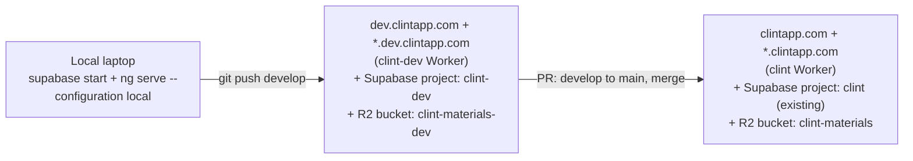

# Dev Environment Design

**Date:** 2026-05-20
**Status:** Draft
**Author:** Aaditya Madala (with Claude)

## Summary

Stand up a persistent dev environment at `dev.clintapp.com` that mirrors prod's
shape: separate Cloudflare Worker, separate Supabase project, separate R2
bucket, wildcard subdomain support, real Google OAuth.

Both environments deploy via the same shape of GitHub Actions workflow: a
single job that (1) applies pending Supabase migrations, then (2) builds
and deploys the SPA via `wrangler deploy`. If migrations fail, the SPA
deploy is skipped — atomic and ordered.

Dev deploys are ungated: push to `develop` triggers `deploy-dev.yml`
which runs end-to-end against the `clint-dev` Worker and the dev
Supabase project. Prod deploys are gated by a `production` GitHub
Environment requiring reviewer approval: merging a PR `develop -> main`
queues `deploy-prod.yml`, which pauses on the gate until a human clicks
Approve, then runs against the `clint` Worker and the prod Supabase
project.

Cloudflare Workers Builds is not used. The existing `clint` Build
auto-deploy is disabled; the GHA workflows take over both deploys.

## Goals

- A single shared dev URL developers can push to from local and smoke-test
  against before merging to prod.
- Faithful whitelabel testing on dev: wildcard subdomain (`acme.dev.clintapp.com`
  resolves to the Acme tenant via `get_brand_by_host`, same code path as prod).
- No prod data on dev. Dev runs the same migrations and a clean
  `seed.sql`-derived baseline.
- Auto-deploy on push for low-friction iteration on dev; explicit human
  gate before anything hits prod.
- Atomic prod deploys: migrations and SPA succeed or fail as a unit. SPA
  never deploys against a schema it does not understand.

## Non-goals

- Per-PR ephemeral previews. (Single shared dev only. Revisit if multiple
  contributors start stepping on each other.)
- Sanitized prod-data snapshots in dev. (Bare migrations + seed only.)
- Zero-touch prod deploys. Prod requires a manual approval click in the
  `production` GitHub Environment; the workflow then runs migrations and
  the SPA deploy as a single atomic job.
- Production-grade observability on dev. Dev logs are best-effort.

## Architecture

### Topology



### What's shared, what's split

| Concern | Prod | Dev |
|---|---|---|
| Cloudflare Worker | `clint` (existing) | `clint-dev` (new) |
| Hostname | `clintapp.com` + `*.clintapp.com` | `dev.clintapp.com` + `*.dev.clintapp.com` |
| Supabase project | `gmgprkymyjzkzirbzqzd` (existing) | new project `clint-dev` |
| R2 bucket | `clint-materials` | `clint-materials-dev` (new) |
| Rate-limiter namespace ids | 1001 / 1002 | 1003 / 1004 |
| Cron `0 7 * * *` (CT.gov ingest) | enabled | **disabled** (manual trigger only) |
| Google OAuth client | existing | same client, dev redirect URI added |
| `apexDomain` (Angular env) | `clintapp.com` | `dev.clintapp.com` |
| DB data | prod | bare migrations only (no seed.sql) |
| Edge function `send-invite-email` | not in use (scaffolded only) | not deployed (defer until invites go live) |

### Deploy flow

```mermaid
sequenceDiagram
  participant L as Local
  participant GH as GitHub
  participant SB_dev as Supabase dev
  participant CF_dev as clint-dev Worker
  participant SB_prod as Supabase prod
  participant CF_prod as clint Worker

  L->>GH: git push develop
  GH->>GH: ci.yml (lint/build/tests)
  GH->>GH: deploy-dev.yml triggered (no gate)
  GH->>SB_dev: supabase db push --linked
  alt migrations fail
    GH-->>L: workflow stops; SPA not deployed
  else migrations succeed
    GH->>CF_dev: wrangler deploy --env dev
  end
  Note over L,CF_dev: Smoke test at dev.clintapp.com

  L->>GH: open PR develop to main, merge
  GH->>GH: deploy-prod.yml triggered (gated by 'production' env)
  Note over GH: Reviewer clicks Approve in GitHub UI
  GH->>SB_prod: supabase db push --linked
  alt migrations fail
    GH-->>L: workflow stops; SPA not deployed
  else migrations succeed
    GH->>CF_prod: wrangler deploy
  end
```

## Component design

### Cloudflare: two separate Workers, one config file

Why two Workers and not one Worker with Wrangler envs: Cloudflare Workers
Builds (the Git auto-deploy you already use) is configured per-Worker. Each
Worker has one Builds connection: one repo, one branch filter, one build
command. To auto-deploy on push to both `main` and `develop` we need two
Builds configs, which map most naturally to two Workers. Side benefit:
separate analytics, logs, secret stores, rate-limit counters. Blast radius
of a dev misconfiguration cannot reach prod.

The wrangler config stays in a single file; `[env.dev]` overrides only what
differs from prod.

```jsonc
// src/client/wrangler.jsonc (excerpted; top-level stays prod)
{
  "name": "clint",
  // ... existing prod config ...
  "vars": {
    "ALLOWED_APEXES": "clintapp.com",
    "R2_BUCKET": "clint-materials",
    "CTGOV_BASE_URL": "https://clinicaltrials.gov",
    "CTGOV_BATCH_SIZE": "100",
    "CTGOV_PARALLEL_FETCHES": "10"
  },
  "triggers": { "crons": ["0 7 * * *"] },
  "ratelimits": [
    { "name": "UPLOAD_LIMITER",   "namespace_id": "1001", "simple": { "limit": 30,  "period": 60 } },
    { "name": "DOWNLOAD_LIMITER", "namespace_id": "1002", "simple": { "limit": 120, "period": 60 } }
  ],

  "env": {
    "dev": {
      "name": "clint-dev",
      "vars": {
        "ALLOWED_APEXES": "dev.clintapp.com",
        "R2_BUCKET": "clint-materials-dev",
        "CTGOV_BASE_URL": "https://clinicaltrials.gov",
        "CTGOV_BATCH_SIZE": "100",
        "CTGOV_PARALLEL_FETCHES": "10"
      },
      "triggers": { "crons": [] },
      "ratelimits": [
        { "name": "UPLOAD_LIMITER",   "namespace_id": "1003", "simple": { "limit": 30,  "period": 60 } },
        { "name": "DOWNLOAD_LIMITER", "namespace_id": "1004", "simple": { "limit": 120, "period": 60 } }
      ]
    }
  }
}
```

Routing is handled by Cloudflare's Custom Domains (set in the dashboard,
not in `wrangler.jsonc`), matching the existing prod setup. The dev
Worker's Custom Domains are configured in the dashboard step below.

Cron is disabled on dev (`"crons": []`) so the daily CT.gov ingest does not
double-hit clinicaltrials.gov and does not fight test fixtures in the dev DB.
The scheduled handler in code is untouched; it can still be triggered on
demand with `wrangler dev --test-scheduled` or via an authenticated admin
route.

Rate-limiter namespace ids differ so dev and prod counters do not share
state.

### Cloudflare: DNS and routes

In Cloudflare DNS for `clintapp.com`:

| Type | Name | Target | Proxy |
|---|---|---|---|
| (auto) | `dev` | (Workers-managed) | proxied |
| (auto) | `*.dev` | (Workers-managed) | proxied |

Pragmatic path: in the Cloudflare dashboard under `clint-dev` Worker
-> Settings -> Domains & Routes, add both `dev.clintapp.com` and
`*.dev.clintapp.com` as Custom Domains. Cloudflare creates the records and
issues TLS certs (including the wildcard).

### Cloudflare: R2 and secrets

One-time:

```
wrangler r2 bucket create clint-materials-dev
# Mirror any CORS/lifecycle rules from clint-materials
wrangler secret put CTGOV_WORKER_SECRET --env dev
# Plus any other secrets that exist on prod
```

Generate a fresh `CTGOV_WORKER_SECRET` for dev rather than reusing prod's.

### Cloudflare: Workers Builds (disabled)

Cloudflare Workers Builds is not used by either environment. Both
deploys are driven by GHA workflows that call `wrangler deploy`
themselves using a `CLOUDFLARE_API_TOKEN`.

The existing `clint` Build (currently auto-deploying prod on push to
`main`) must be disabled: Cloudflare dashboard -> `clint` Worker ->
Settings -> Builds -> turn off "Automatic deploys" (or change the
branch filter to a non-existent branch). Leave the connection in place
so the Build can be re-enabled in one click as an emergency fallback if
GHA is unavailable.

No dev Workers Build is created. The `clint-dev` Worker itself exists
(created on first `wrangler deploy --env dev`), but no Cloudflare-side
auto-deploy is configured for it.

### Supabase: dev project

Create a second Supabase project (name: `clint-dev`) in the same region as
prod. Capture the project ref, anon key, and DB password.

One-time bootstrap from local:

```
supabase link --project-ref <dev-ref>
supabase db push                 # apply all migrations to dev
```

`seed.sql` is intentionally NOT loaded on dev. System constants
(marker_categories, marker_types, event_categories with `is_system=true`,
`space_id=null`) are seeded by migrations themselves, so they exist on
dev after `db push`. `seed.sql` additionally creates a "Demo Pharma CI"
tenant + space + populates it via `seed_demo_data()`, and installs an
`auto_join_demo_on_signup` trigger that auto-grants any Google sign-in
owner access to the demo workspace. None of that runs on dev. The
first Google sign-in on dev lands the user with zero tenants and zero
spaces, exactly like prod for a new user; the user provisions a real
tenant manually (via SQL editor or a `provision_tenant` RPC call) to
exercise the app.

### Supabase: Auth (dev project dashboard)

Under **Auth -> Providers -> Google**:
- Client ID and Client Secret: **same** as prod (one OAuth client, two
  redirect URIs).

Under **Auth -> URL Configuration**:
- Site URL: `https://dev.clintapp.com`
- Redirect URLs (allow-list): `https://dev.clintapp.com/auth/callback`,
  `https://*.dev.clintapp.com/auth/callback`

In Google Cloud Console, add to the existing OAuth client's "Authorized
redirect URIs":
- `https://<dev-ref>.supabase.co/auth/v1/callback`

If `[auth.external.azure]` is exercised on dev, mirror the same step for
the Microsoft app registration. Skip otherwise.

### Supabase: edge function and webhook (deferred)

`send-invite-email` is scaffolded but **not** currently active in prod (no
webhook configured, no Resend integration in use). Dev does not deploy it
either. When invite emails are turned on in prod, the dev mirror becomes a
follow-up effort whose own design will need to cover, at minimum:

- Deploying the function to the dev Supabase project.
- Setting `EMAIL_WEBHOOK_SECRET`, `RESEND_API_KEY`, and `EMAIL_BASE_URL`
  on the dev project (distinct from prod values).
- Recreating the `tenant_invites` INSERT webhook on the dev project,
  pointing at the dev function URL.
- A dev-email safety rail (Resend test key or `EMAIL_REDIRECT_TO`
  override) so dev cannot send real mail to real strangers.

Tracked in "Out of scope (future work)" below.

### Angular: env files and build configurations

Rename and add:

```
src/client/src/environments/
  environment.ts            # prod, unchanged
  environment.dev.ts        # NEW
  environment.local.ts      # RENAMED from environment.development.ts
```

`environment.dev.ts`:
```ts
export const environment = {
  production: true,
  supabaseUrl: 'https://<dev-ref>.supabase.co',
  supabaseAnonKey: '<dev-anon-key>',
  apexDomain: 'dev.clintapp.com',
};
```

`environment.local.ts` is byte-for-byte the existing `environment.development.ts`,
just renamed (`production: false`, `supabaseUrl: 'http://127.0.0.1:54321'`,
`apexDomain: ''`).

`angular.json` (`projects.clinical-trial-dashboard.architect.build.configurations`):

- Add a `dev` configuration. File replacement swaps `environment.ts` ->
  `environment.dev.ts`. Otherwise inherits prod's optimization, hashing, no
  source maps.
- Rename the existing `development` configuration to `local`. File
  replacement targets `environment.local.ts`. Other settings unchanged.

`angular.json` (`projects.clinical-trial-dashboard.architect.serve`):
- Change `defaultConfiguration` from `"development"` to `"local"` so
  `ng serve` / `npm start` keeps doing what it does today.

Grep the repo for `--configuration development`,
`configuration: 'development'`, and `environment.development` and update
every occurrence in the same change set (scripts, docs, README).

### Auth cookies on dev

With `apexDomain: 'dev.clintapp.com'`, Supabase JS writes session cookies
with `Domain=.dev.clintapp.com`. Browsers will not send these cookies to
`clintapp.com` (dev sub-tree only).

Documented annoyance, not a security hole: a browser signed into prod
(cookie scope `Domain=.clintapp.com`) *will* send the prod cookie to
`dev.clintapp.com` because dev is a subdomain of the prod apex. The prod
JWT is signed by prod Supabase's secret, dev Supabase rejects it, and
Supabase JS clears the bad session. Net effect: visiting dev while signed
into prod bounces you to login on dev. No prod data is exposed; no dev
data is exposed; the two session stores remain isolated.

### Branching and CI

`develop` is a long-lived branch. Local push deploys dev; PR `develop` to
`main` and merge deploys prod.

`ci.yml` triggers extended to include `develop`:

```yaml
on:
  push:
    branches: [main, develop]
  pull_request:
    branches: [main, develop]
```

No other changes to `ci.yml`. The lint/build/test jobs run against local
Supabase and remain env-agnostic.

Edge function deploys are **not** in the automated workflows. They run
rarely and re-deploying on every push wastes CI minutes. Run
`supabase functions deploy <name> --project-ref <ref>` from local when a
function changes.

### Dev deploy workflow

New `.github/workflows/deploy-dev.yml`. Triggered by `push` to `develop`,
no approval gate (dev is freely pushable). Atomic: migrations first, SPA
second; if migrations fail, SPA is not deployed.

```yaml
name: Deploy to dev
on:
  push:
    branches: [develop]
  workflow_dispatch:
jobs:
  deploy:
    runs-on: ubuntu-latest
    concurrency:
      group: deploy-dev
      cancel-in-progress: false
    steps:
      - uses: actions/checkout@v4
      - uses: actions/setup-node@v4
        with:
          node-version: 20
          cache: npm
          cache-dependency-path: src/client/package-lock.json

      - name: Install Supabase CLI
        uses: supabase/setup-cli@v1
        with: { version: latest }

      - name: Link dev Supabase project
        run: supabase link --project-ref ${{ secrets.SUPABASE_DEV_PROJECT_REF }}
        env:
          SUPABASE_ACCESS_TOKEN: ${{ secrets.SUPABASE_ACCESS_TOKEN }}

      - name: Apply migrations to dev
        run: supabase db push
        env:
          SUPABASE_DB_PASSWORD: ${{ secrets.SUPABASE_DEV_DB_PASSWORD }}

      - name: Install client deps
        run: cd src/client && npm ci

      - name: Build SPA (dev)
        run: cd src/client && npm run build -- --configuration dev

      - name: Deploy Worker (dev)
        uses: cloudflare/wrangler-action@v3
        with:
          apiToken: ${{ secrets.CLOUDFLARE_API_TOKEN }}
          accountId: ${{ secrets.CLOUDFLARE_ACCOUNT_ID }}
          workingDirectory: src/client
          command: deploy --env dev
```

### Prod deploy workflow

New `.github/workflows/deploy-prod.yml`. Same shape as dev, with two
differences: it watches `main` and is gated by the `production` GitHub
Environment which requires reviewer approval before any step runs.

```yaml
name: Deploy to production
on:
  push:
    branches: [main]
  workflow_dispatch:
jobs:
  deploy:
    runs-on: ubuntu-latest
    environment: production    # required-reviewer gate; pauses here
    concurrency:
      group: deploy-prod
      cancel-in-progress: false
    steps:
      - uses: actions/checkout@v4
      - uses: actions/setup-node@v4
        with:
          node-version: 20
          cache: npm
          cache-dependency-path: src/client/package-lock.json

      - name: Install Supabase CLI
        uses: supabase/setup-cli@v1
        with: { version: latest }

      - name: Link prod Supabase project
        run: supabase link --project-ref ${{ secrets.SUPABASE_PROD_PROJECT_REF }}
        env:
          SUPABASE_ACCESS_TOKEN: ${{ secrets.SUPABASE_ACCESS_TOKEN }}

      - name: Apply migrations to prod
        run: supabase db push
        env:
          SUPABASE_DB_PASSWORD: ${{ secrets.SUPABASE_PROD_DB_PASSWORD }}

      - name: Install client deps
        run: cd src/client && npm ci

      - name: Build SPA (prod)
        run: cd src/client && npm run build

      - name: Deploy Worker (prod)
        uses: cloudflare/wrangler-action@v3
        with:
          apiToken: ${{ secrets.CLOUDFLARE_API_TOKEN }}
          accountId: ${{ secrets.CLOUDFLARE_ACCOUNT_ID }}
          workingDirectory: src/client
          command: deploy
```

Key properties of both workflows:

- **Single job, sequenced steps.** `supabase db push` runs first. If it
  fails (e.g., a constraint violation, a migration needing manual
  intervention), the workflow stops and `wrangler deploy` never runs.
  The corresponding Worker stays on the previous build.
- **Concurrency group.** Prevents two deploys to the same env from
  racing if pushes land back-to-back. Second deploy queues.
- **`workflow_dispatch`** lets you redeploy a specific SHA on demand
  without a new commit.

Prod-only property:

- **`environment: production` gate.** The job does not start until a
  reviewer (configured under repo Settings -> Environments -> production
  -> Required reviewers) clicks "Approve and deploy" in the Actions UI.
  Merging the PR queues the deploy; an explicit click runs it.

New GitHub repository secrets:

- `SUPABASE_ACCESS_TOKEN` (personal access token from the Supabase
  account; used by both workflows)
- `SUPABASE_DEV_PROJECT_REF`
- `SUPABASE_DEV_DB_PASSWORD`
- `SUPABASE_PROD_PROJECT_REF`
- `SUPABASE_PROD_DB_PASSWORD`
- `CLOUDFLARE_API_TOKEN` (Workers scope; one token covers both Workers
  if the account-level token has access, or use a token scoped to both
  `clint` and `clint-dev`)
- `CLOUDFLARE_ACCOUNT_ID`

### Destructive migrations (two-deploy pattern)

The default flow assumes migrations are additive: SPA sees old-or-newer
schema, never older. For destructive changes (dropping a column the
current prod SPA still reads, renaming an RPC, etc.) this is unsafe even
with atomic deploys, because between the migration step and the
`wrangler deploy` step there is a window where the new schema is live
and the old SPA is still serving.

Pattern for destructive migrations:

1. **PR 1:** SPA change only. Remove all references to the soon-to-be-
   dropped column / renamed RPC. Merge, deploy. Prod SPA no longer
   touches the doomed surface.
2. **PR 2:** Migration only. Drop the column / rename. Merge, deploy.

This stays a convention (no enforcement). Document in the runbook.

### Branch protection

- `main`: require PR, require green CI, require at least one approval.
- `develop`: permissive. Direct push is the intended workflow.

## Day-to-day workflow (after bootstrap)

1. `git checkout develop && git pull`
2. Branch off, make changes, commit.
3. (For schema changes) `supabase migration new <name>`, add SQL, verify
   locally with `supabase db reset`.
4. Open a PR into `develop`. CI runs. Merge.
5. Push of merged commit to `develop` triggers `deploy-dev.yml`:
   `supabase db push` against dev, then `wrangler deploy --env dev`.
   If migrations fail, SPA is not deployed.
6. Smoke-test at `dev.clintapp.com` (or `<tenant>.dev.clintapp.com`).
7. When dev is green, open PR `develop -> main`. CI runs. Get approval.
   Merge.
8. Merge to `main` queues `deploy-prod.yml` and pauses on the
   `production` environment gate. A designated reviewer opens the run in
   GitHub Actions, reviews the SHA and the migration diff, and clicks
   "Approve and deploy".
9. Workflow runs `supabase db push` against prod, then `wrangler deploy`.
   If migrations fail, the SPA deploy is skipped and the workflow ends
   red; investigate and either fix-forward or revert before reapproving.
10. For destructive migrations, use the two-deploy pattern (see
    "Destructive migrations" above).

## One-time bootstrap checklist

In recommended order:

1. **Supabase dev project**
   1. Create project `clint-dev` in the same region as prod. Capture
      `<dev-ref>`, anon key, DB password.
   2. `supabase link --project-ref <dev-ref>`
   3. `supabase db push`
   4. `psql "$DEV_DB_URL" -f supabase/seed.sql`
   5. Set Auth -> Providers -> Google: same client_id / secret as prod.
   6. Set Auth -> URL Configuration: Site URL
      `https://dev.clintapp.com`; redirect URLs
      `https://dev.clintapp.com/auth/callback`,
      `https://*.dev.clintapp.com/auth/callback`.

2. **Google Cloud Console**
   1. Add `https://<dev-ref>.supabase.co/auth/v1/callback` to the existing
      OAuth client's Authorized redirect URIs.

3. **Cloudflare**
   1. `wrangler r2 bucket create clint-materials-dev` and mirror any
      CORS/lifecycle rules from `clint-materials`.
   2. Add `[env.dev]` block to `wrangler.jsonc` (code change).
   3. From local: `wrangler deploy --env dev` to create the `clint-dev`
      Worker (or pre-create it via dashboard).
   4. Add Custom Domains `dev.clintapp.com` and `*.dev.clintapp.com` to
      `clint-dev` Worker.
   5. `wrangler secret put CTGOV_WORKER_SECRET --env dev` (and any other
      prod secrets the dev Worker needs).
   6. Disable the existing `clint` Workers Build auto-deploy:
      dashboard -> `clint` -> Settings -> Builds -> turn off
      "Automatic deploys". Leave the connection in place as an
      emergency fallback. **No Workers Build is created for
      `clint-dev`** — the GHA workflows handle both deploys.
   7. Create a `CLOUDFLARE_API_TOKEN` (Workers scope, access to both
      `clint` and `clint-dev`) and capture the account ID. Both go into
      GitHub secrets in the next step.

4. **GitHub repo**
   1. Add secrets: `SUPABASE_ACCESS_TOKEN`, `SUPABASE_DEV_PROJECT_REF`,
      `SUPABASE_DEV_DB_PASSWORD`, `SUPABASE_PROD_PROJECT_REF`,
      `SUPABASE_PROD_DB_PASSWORD`, `CLOUDFLARE_API_TOKEN`,
      `CLOUDFLARE_ACCOUNT_ID`.
   2. Create `develop` branch:
      `git checkout -b develop && git push -u origin develop`.
   3. Enable branch protection on `main` (PR + green CI + 1 approval).
   4. Create GitHub Environment `production`: Settings -> Environments ->
      New environment. Add yourself (and ideally a backup) to "Required
      reviewers". This is what gates `deploy-prod.yml`.

5. **Code changes (single PR into `develop`)**
   1. Rename `src/client/src/environments/environment.development.ts` to
      `environment.local.ts`.
   2. Add `src/client/src/environments/environment.dev.ts` with dev
      Supabase URL / anon key / `apexDomain`.
   3. Update `src/client/angular.json`: rename `development` configuration
      to `local`; add `dev` configuration; set
      `serve.defaultConfiguration` to `"local"`.
   4. Grep + update any references to `--configuration development`,
      `configuration: 'development'`, `environment.development`.
   5. Add `[env.dev]` block to `src/client/wrangler.jsonc`.
   6. Add `.github/workflows/deploy-dev.yml`.
   7. Add `.github/workflows/deploy-prod.yml`.
   8. Update `.github/workflows/ci.yml` triggers to include `develop`.
   9. Update runbook (`docs/runbook/`) with the deploy flow for both
      envs (approval gate on prod, atomic migration+SPA on both,
      destructive-migration two-deploy pattern).
   10. Update `CLAUDE.md` with the new env file names and the dev URL.

6. **Smoke test the full pipeline**
   1. Push the bootstrap PR to `develop`. Confirm `deploy-dev.yml` runs
      (migration step is a no-op on first run), `wrangler deploy --env dev`
      succeeds, and `dev.clintapp.com` loads.
   2. Add a no-op migration, push to `develop`. Confirm
      `deploy-dev.yml` applies it and redeploys the SPA atomically.
   3. Sign in on dev via Google OAuth. Confirm session works on
      `dev.clintapp.com` and on a wildcard subdomain test
      (`acme.dev.clintapp.com` once an Acme tenant is created on dev).
   4. Merge `develop -> main`. Confirm `deploy-prod.yml` queues and
      pauses on the `production` environment gate. Approve. Confirm the
      no-op migration applies to prod and `wrangler deploy` runs.
   5. Verify prod URL still loads with the new build.

## Documentation

- Update `CLAUDE.md` "Tech Stack" and "Spec Location" sections to name the
  dev environment and the env file convention (`local` / `dev` / prod).
- Add a section to `docs/runbook/` describing the prod migration ritual
  and the day-to-day promote-to-prod flow.
- Cross-link this spec from the runbook.

## Risks and open questions

- **Cookie bleed.** Prod cookies are visible to dev (subdomain), rejected
  by dev Supabase. Documented as user-visible annoyance. Acceptable.
- **R2 CORS drift.** Mirroring CORS / lifecycle from prod is a manual
  step. If prod's rules change later, dev does not auto-update. Acceptable;
  flag in the runbook.
- **Supabase plan limits.** A second Supabase project counts against the
  account's project quota. Confirm plan supports two active projects
  before starting bootstrap.
- **Destructive migration window.** Atomic `db push` then `wrangler
  deploy` still has a window between the two steps where the new schema
  is live and the old SPA is still serving. Mitigated by the two-deploy
  pattern (SPA-first, then migration) for destructive changes.
  Convention, not enforcement.
- **Prod CF Build disabled = single point of failure for SPA deploys.**
  If GHA is down, prod SPA can't deploy. Mitigation: leave the
  Cloudflare Workers Build connection in place (just auto-deploy off);
  re-enabling auto-deploy is one click for an emergency.
- **GHA approval bottleneck.** Only-one-reviewer = bus factor of one.
  Add at least one backup reviewer to the `production` environment.

## Out of scope (future work)

- Per-PR preview deployments.
- Snapshotted-and-sanitized prod data in dev.
- Automated prod migration deploys.
- Dev observability parity with prod (Sentry, alerting, dashboards).
- Wildcard `*.<tenant-custom-domain>` testing on dev.
- **`send-invite-email` on dev.** Function is scaffolded in the repo but
  not active in prod. When invite emails go live, a follow-up will deploy
  the function to dev, set its secrets (`EMAIL_WEBHOOK_SECRET`,
  `RESEND_API_KEY`, `EMAIL_BASE_URL`), recreate the `tenant_invites`
  INSERT webhook on dev, and add a dev-email safety rail (Resend test key
  or `EMAIL_REDIRECT_TO` override) so dev cannot send real mail to real
  strangers.
