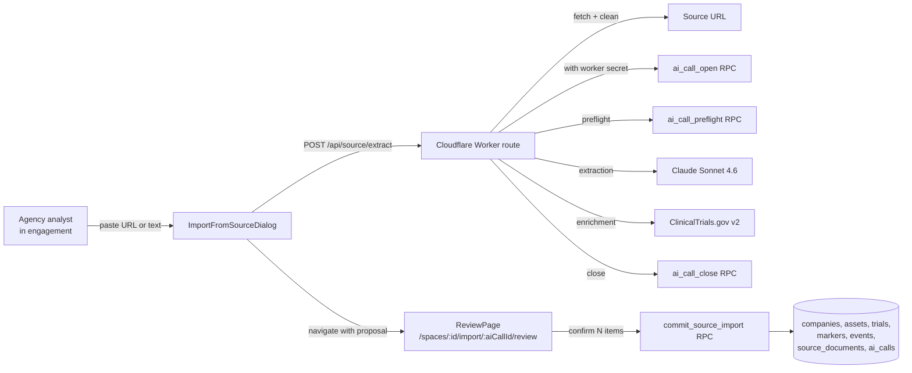

# Source-document ingestion

## Summary

An agency analyst pastes a press release URL or text into an engagement. Claude Sonnet 4.6 reads the source, proposes structured rows across companies, assets, trials, markers (past + projected), and events, with CT.gov registry lookups attached to every proposed trial. The analyst reviews all proposals on a dedicated routed review page with per-row reassign / unlink / override affordances, then confirms. Confirmed rows write atomically via one RPC, with source provenance on every row and a durable AI-call audit trail.

This is the first AI feature in Clint. It targets the highest-leverage producer workflow (turning raw source documents into structured intelligence rows) and establishes the infrastructure (ai_calls audit, worker secret, cost caps, Vault) that subsequent AI features will reuse. It supersedes the earlier press-release-to-event draft, which targeted a single event extraction; this expands to multi-entity ingestion with explicit review and atomic commit.

Extraction runs as a Cloudflare Worker route (`/api/source/extract`) inside the existing `clint` / `clint-dev` Workers, not a Supabase Edge Function. This keeps the runtime, test infrastructure, secret management, and deployment pipeline consistent with the CT.gov sync, R2 materials, and other Worker-based features.

## Parent-spec overrides

This spec inherits the operating constraints from `2026-04-28-ai-inventory-design.md` but explicitly overrides two decisions from the parent and superseded specs:

1. **`ai_calls` schema.** The parent spec defines `ai_calls` with fields `input_tokens, output_tokens, cost_cents, latency_ms, raw_input, raw_output, status`. This spec restructures those to `prompt_tokens, completion_tokens, cost_estimate_cents, duration_ms, input_hash, output (JSONB), outcome, warnings, closed_at`. Neither spec has been implemented. This spec's schema is the canonical definition going forward.

2. **`ai_config` location.** The parent and superseded specs put AI config columns directly on the `tenants` table (`ai_provider_mode, ai_model_config, ai_monthly_token_cap`). This spec creates a separate `ai_config` table. Rationale: AI configuration is optional, changes independently of tenant settings, and will grow as features ship. A separate table avoids bloating the tenants row and simplifies RLS (tenant owner + platform admin, vs. the broader tenant column policies).

3. **Model.** The superseded press-release-to-event spec committed to Claude Haiku for single-event extraction. This spec uses Sonnet 4.6 for multi-entity schema complexity, cross-ref reasoning, and entity resolution against the inventory. Different cost profile (~4x), justified by the expanded scope.

## Goals

1. Cut the time to log a press-release-derived set of events, catalysts, and trial updates from minutes to under 60 seconds.
2. Build the entity graph automatically: companies, assets, trials, markers, events, with correct cross-references and CT.gov registry linkage where available.
3. Ground every proposal in the source via the analyst-reviewable evidence pill, and gate every "create new" entity behind a name-substring rule so fabricated entities never reach the review screen unmarked.
4. Establish the AI infrastructure backbone (ai_calls, ai_config, source_documents, worker secret, cost cap, rate limit) that the rest of the AI roadmap will reuse.
5. Be invisible to tenant-side users (clients): all AI scaffolding is agency-only; clients see only the resulting clean rows on the timeline with their existing source_url citations.

## Non-goals (v1)

- PDF, email-forward, or batch-URL inputs. Paste text and URL only.
- Primary intelligence drafts. Hallucination-sensitive write-up generation stays out of v1.
- Re-extract from same source. Close and re-open the dialog to retry.
- CSV exports. JSON download is the export safety valve.
- Proposal drafts or session persistence. One-shot review.
- Async or queued imports. Sync flow only.
- BYO providers (Anthropic, Bedrock, Azure routing). `ai_calls.provider` defaults to `anthropic`; no provider switch surfaced.
- Embeddings for entity matching. LLM-with-inventory plus `pg_trgm` fuzzy fallback is enough at our inventory sizes.
- Indication hierarchy management via this flow. The commit RPC creates flat indication rows; hierarchical nesting is a separate analyst workflow.
- Cross-space inventory matching. Each space sees only its own inventory.
- Refreshing CT.gov data for existing trials via this flow. The CT.gov worker handles ongoing sync.
- Semantic search or MCP server. Those are subsequent waves.
- Tenant-owner self-service UI for `ai_config`. Super-admin toggles per tenant.

## Operating constraints

Inherited from `2026-04-28-ai-inventory-design.md`:

1. Tenant + space isolation. RAG, embeddings, and LLM context windows enforce `tenant_id` + `space_id` boundaries via RLS and application checks. No cross-tenant leakage.
2. Provenance over fluency. Every confirmed row carries `source_doc_id`. Default to extractive over generative.
3. Speed over magic. Target latency under 7 seconds end-to-end for typical sources.
4. Authority through restraint. Brand voice in all copy: terse, factual, no playful tone.
5. User-in-the-loop. Every proposal passes through review before persisting. No autonomous writes.
6. Audit log is the floor. Every LLM call writes to `ai_calls` regardless of outcome.

## Prerequisite specs

Two schema standardization specs landed before this spec. Each is a separate spec with its own migration and tests:

1. **`2026-05-23-entity-audit-columns-design.md`** (landed) -- Renames `user_id` to `created_by` on the five legacy entity tables (`companies`, `assets`, `trials`, `trial_phases`, `marker_types`) and adds `updated_by` on all tables that have `updated_at`. This spec's commit RPC uses `created_by` consistently.

2. **`2026-05-23-entity-name-uniqueness-design.md`** (landed) -- Adds `unique(space_id, name)` constraints to `marker_types` and `event_categories` (plus a partial unique index on system event categories). This enables the commit RPC to resolve LLM-proposed names deterministically via exact match and use `ON CONFLICT (space_id, name) DO NOTHING` for idempotent upserts.

### Schema changes since first draft

The following migrations landed after this spec was first drafted. This revision updates all references:

- **`20260524120200_rename_products_to_assets`** -- `products` table renamed to `assets`; `product_id` FK columns renamed to `asset_id` on `trials`, `events`, and junction tables. All spec references now use `assets` / `asset_id` / `asset_ref`.
- **`20260524120000` through `20260524120800`** (indication model) -- `therapeutic_areas` table dropped and replaced by `indications` + `conditions` + `trial_conditions` + `asset_indications`. Trial-to-disease linkage is now: trials -> trial_conditions -> conditions, with conditions mapped to analyst-created indications via `condition_indication_map`. The `asset_indications` table tracks per-asset-per-indication development status (auto-derived from trial phases). All spec references now use the indication model.

## User flow (happy path)

1. Agency analyst navigates to any engagement (space) and clicks **Import from source** in the engagement dashboard header.
2. `ImportFromSourceDialog` opens with two modes: URL and paste text. Analyst supplies one.
3. Analyst clicks **Extract**. Dialog shows a deterministic progress indicator.
4. Cloudflare Worker route `/api/source/extract`:
   1. Validates JWT and `space_id` via `has_space_access` RPC.
   2. If URL, fetches and strips HTML to plain text. If text, normalizes whitespace.
   3. Enforces source text size limit (500KB). Rejects with a clear message if exceeded.
   4. Computes `text_hash` and probes `source_documents` for duplicates. If found, returns `duplicate_source` with the existing import's metadata so the dialog can prompt before continuing.
   5. Opens an `ai_calls` row via `ai_call_open` (status pending), then preflights cost cap + rate limit via `ai_call_preflight`.
   6. Calls Claude Sonnet 4.6 with the source text plus the full space inventory snapshot and a strict JSON schema.
   7. Validates the response server-side: schema, cross-references, existing-id existence, name-substring rule.
   8. For each proposed trial, queries ClinicalTrials.gov v2 (`query.spons`, `query.titles`, `query.cond`, `query.intr`, phase via `filter.advanced`), ranks top three NCT candidates by Jaro-Winkler similarity on `briefTitle`.
   9. Attaches fuzzy alternates (`pg_trgm`) to every "create new" proposal.
   10. Closes the `ai_calls` row via `ai_call_close` with outcome and warnings.
5. Dialog receives the validated proposal, stores it in `SourceImportService`, and navigates to `/spaces/:spaceId/import/:aiCallId/review`. Dialog closes.
6. Analyst reviews on the dedicated review page. For each entity:
   - Toggles checkbox to include / exclude.
   - Reassigns the LLM's entity match (LLM pick, fuzzy alternate, pick-from-inventory, or create-new with editable name).
   - For trials, picks one of the top three CT.gov NCT candidates, or selects "unlink (keep untracked)".
   - For trials, must assign an asset (existing or new). The Confirm button is disabled until every included trial has an asset.
   - Edits any field inline. NCT-linked trials have CT.gov-locked fields rendered read-only.
   - Hovers the "as quoted" pill to highlight the evidence substring in the left source pane.
7. Analyst clicks **Confirm N items**. Angular calls `commit_source_import(p_space_id, p_ai_call_id, p_source_document, p_proposal, p_inventory_snapshot_hash)`.
8. RPC writes everything in dependency order (companies, assets, trials, trial_conditions, markers, events) inside one transaction. Auto-derives `asset_indications` via existing triggers. Returns the `source_doc_id` plus arrays of newly-created ids.
9. Toast: `Committed N items from {source_title}. View in timeline.` Review page navigates back to the engagement dashboard.

Latency target: 3 to 7 seconds for URL flow, 2 to 5 seconds for paste-text flow. Worker route timeout: 25 seconds. Angular HTTP timeout: 30 seconds.

## Architecture



Pieces:

- **`ImportFromSourceDialog`** (Angular standalone component in `src/client/src/app/features/source-import/`). Two-mode input (URL / paste text). Calls the Worker route. On success, stores the proposal in `SourceImportService` and navigates to the review page.
- **`/api/source/extract` Worker route** (TypeScript, `src/client/worker/source-extract/`). The orchestrator. No direct DB writes outside the three worker-callable RPCs (`ai_call_open`, `ai_call_preflight`, `ai_call_close`). Anthropic API key, worker secret, and Supabase credentials accessed via `env` bindings. Follows the same pattern as `/api/ctgov/sync-trial` and `/api/materials/sign-upload`.
- **`ReviewPage`** (Angular standalone, routed at `/spaces/:spaceId/import/:aiCallId/review`). Full-viewport two-pane layout. Receives the proposal from `SourceImportService`. Route guard checks `has_space_access` and proposal availability. `CanDeactivate` guard prompts for discard if dirty. Persists no state across page navigations (one-shot).
- **`SourceImportService`** (Angular, `providedIn: 'root'`). Holds the in-flight proposal between the dialog and review page. Clears on commit, cancel, or navigation away. One proposal at a time.
- **`commit_source_import` RPC** (Postgres, SECURITY DEFINER, user-callable with JWT). One transaction, dependency-ordered inserts, FK and RLS enforcement, returns ids.
- **`source_documents` table** (new). One row per imported source, scoped by `space_id`.
- **`ai_calls` table** (new). Every LLM call, regardless of outcome. The audit trail. This spec's schema is the canonical definition, replacing the parent spec's draft.
- **`ai_config` table** (new). Tenant-level AI settings: model, cost cap, rate limits, `ai_enabled` flag. Separate table (not columns on `tenants`) per the override documented above.
- **Worker secret** (Vault). `extract_source_worker_secret` mirrors the CT.gov pattern. Gates the three worker-callable RPCs.

Key invariants:

- All proposals are ephemeral until the user confirms. Nothing writes to entity tables before commit.
- Every confirmed row carries `source_doc_id` (nullable on the columns; populated only on imports).
- Tenant + space isolation enforced at three layers: client (dialog scoped to current space), Worker route (verifies JWT and `space_id` via RPC), commit RPC (`has_space_access(p_space_id)`).
- Audit row in `ai_calls` regardless of outcome: success, fetch_failed, parse_failed, timeout, cost_capped, rate_limited, cancelled.

## Extraction model

### LLM input

The Worker route builds the prompt from:

- The cleaned source text (URL fetch result or paste body). Maximum 500KB; larger inputs are rejected before the LLM is called.
- The full space inventory snapshot: `{ companies: [{id, name}], assets: [{id, name, company_id, moa?, roa?}], trials: [{id, nct_id?, name, sponsor_company_id?, phase?}], indications: [{id, name}] }`. No per-type cap. Each entity is represented as `{id, name}` only to minimize tokens. At typical pharma CI scales (under 500 entities per type), the inventory adds roughly 10-30K tokens, well within Sonnet 4.6's 200K context.
- A strict JSON schema describing the expected output shape.
- A system prompt that enforces: extract only what is in the source, quote evidence verbatim where possible, do not infer regulatory dates that are not stated, prefer matching existing inventory ids over creating new entities.

If a space's inventory grows past 1000 entities per type, the super-admin AI Usage telemetry will surface a warning. A two-pass approach (extract names first, fuzzy-match, then send only candidates) can be added as a follow-up without changing the user flow.

### LLM output schema (strict JSON)

```jsonc
{
  "source_summary":   "string, <= 200 chars, factual",
  "source_title":     "string | null",
  "source_date":      "YYYY-MM-DD | null",
  "companies": [
    {
      "match":   { "kind": "existing", "id": "uuid" }
              |  { "kind": "new", "name": "string", "website": "string | null" },
      "evidence": "string"
    }
  ],
  "assets": [
    {
      "match":         { "kind": "existing"|"new", ... },
      "name":          "string",
      "generic_name":  "string | null",
      "company_ref":   "<index into companies[]>",
      "moa":           ["string", ...],
      "roa":           ["string", ...],
      "evidence":      "string"
    }
  ],
  "trials": [
    {
      "match":         { "kind": "existing"|"new", ... },
      "name":          "string",
      "phase":         "phase_1 | phase_2 | phase_3 | phase_4 | null",
      "phase_start_date": "YYYY-MM-DD | null",
      "phase_end_date":   "YYYY-MM-DD | null",
      "status":        "Planned | Active | Completed | Terminated | Withdrawn | null",
      "sample_size":   "int | null",
      "sponsor_ref":   "<index into companies[]>",
      "asset_ref":     "<index into assets[]> | null",
      "indication":    "string | null",
      "evidence":      "string"
    }
  ],
  "markers": [
    {
      "marker_type":   "string (matches marker_types.name in space)",
      "title":         "string",
      "event_date":    "YYYY-MM-DD",
      "end_date":      "YYYY-MM-DD | null",
      "projection":    "actual | company | primary",
      "description":   "string | null",
      "trial_refs":    ["<index into trials[]>", ...],
      "evidence":      "string"
    }
  ],
  "events": [
    {
      "category":      "string (matches event_categories.name in space)",
      "title":         "string",
      "event_date":    "YYYY-MM-DD",
      "description":   "string | null",
      "priority":      "high | low",
      "tags":          ["string", ...],
      "anchor": {
        "level":       "space | company | asset | trial",
        "ref":         "<index into companies[]|assets[]|trials[]> | null when level=space"
      },
      "evidence":      "string"
    }
  ]
}
```

`asset_ref` is nullable in the LLM output because the LLM may extract a trial without identifying its asset. However, `trials.asset_id` is NOT NULL in the database. The review page must require the analyst to assign an asset (existing or new) to every included trial before Confirm is enabled. Trials without an asset assignment show a red validation indicator.

Marker `projection` value `stout` is reserved for internal Stout sources and is not extracted by the LLM. Press release projections default to `company`.

### Server-side validation (after LLM response)

Hard guarantees enforced before the proposal reaches the review page:

1. **Schema conformance.** Output parsed against a Zod schema mirroring the above. Parse failure raises `parse_failed`.
2. **Cross-ref bounds.** Every `company_ref`, `asset_ref`, `sponsor_ref`, `trial_ref`, `anchor.ref` index is in range for its target array. Out-of-bounds refs cause the offending entity to be dropped with a warning.
3. **Existing-id existence.** Any `match.kind = "existing"` id is verified against the space's inventory snapshot. Dangling ids demote to `"new"` and are flagged in the review UI.
4. **Name-substring rule** (the trust floor). For every `match.kind = "new"` company / asset / trial proposal:
   - Company: `name` must substring-match the normalized source text.
   - Asset: `name` OR `generic_name` must substring-match.
   - Trial: `name` (acronyms count) must substring-match.

   For every marker and event: at least one anchor must be "grounded" (existing id, or new entity that passed the name check above).

   Match rule: case-insensitive, punctuation-stripped, whitespace-normalized substring. Failing entities are dropped server-side and surfaced in a collapsible "Dropped (N)" section at the top of the review page with reason and an "Add manually" link to the existing creation form.

5. **Fuzzy alternates.** For every "new" company / asset / trial proposal that passed the name check, `extensions.similarity()` (from the `pg_trgm` extension, already installed in the `extensions` schema per migration `20260509120300_advisor_sweep_pg_trgm_to_extensions`) against the inventory attaches up to three alternate candidates (`{id, name, score}`) for the review page's match picker.

### CT.gov enrichment

For every proposed trial (new, or existing without `nct_id`), the Worker route constructs a CT.gov v2 query:

| Source | CT.gov param | Notes |
|---|---|---|
| `companies[trials[].sponsor_ref].name` | `query.spons` | Sponsor name |
| `trials[].name` | `query.titles` | Acronym or short name |
| `trials[].indication` | `query.cond` | Disease |
| `assets[trials[].asset_ref].name` | `query.intr` | Intervention / drug name |
| `trials[].phase` | `filter.advanced=AREA[Phase]PHASE{n}` | Phase as Essie expression |

Request `pageSize=10&format=json`. Returned studies are ranked by Jaro-Winkler similarity on `briefTitle` against `trials[].name`. Jaro-Winkler runs in the Worker (JS implementation or `jaro-winkler` npm package; both work in Cloudflare Workers). Top three surface to the review page. Empty result is valid (no CT.gov match): the review page shows only the "unlink, keep untracked" option, pre-selected. CT.gov 5xx or timeout marks the trial proposal `ctgov_partial`; the row continues with "unlink" pre-selected and the analyst can re-run CT.gov match later via the existing trial detail page.

The exact CT.gov query and the candidate NCT list are logged to `ai_calls.warnings.ctgov[]` for traceability.

### Model + provider

Default: **`claude-sonnet-4-6`**. Justified by the multi-entity schema, cross-ref reasoning, and entity resolution against the inventory; Haiku drops too many edges on this profile, Opus is overkill. One tenant-level `ai_config.ai_model` override.

Realistic per-import costs (typical pharma press release, ~2k input + ~1k output): about $0.025. Daily cap default $5 covers about 200 imports per tenant per day.

## Review page

Dedicated routed page at `/spaces/:spaceId/import/:aiCallId/review`. Full-viewport two-pane layout.

Route setup:
- Lazy-loaded via `loadComponent` in the space routes.
- `CanActivate` guard checks `has_space_access` and that `SourceImportService` holds a proposal for the given `aiCallId`. If the proposal is missing (e.g., direct URL navigation or page refresh), redirects to the engagement dashboard with a toast: "Import session expired. Start a new import."
- `CanDeactivate` guard prompts "Discard import? Unsaved proposals will be lost." if any field was edited and commit has not fired.

```
+-------------------------------------------------------------------------+
| Import from source -- {source_title} -- {url}              [X] [Back]   |
|                                              [Download proposal (JSON)] |
+---------------------------------+---------------------------------------+
| SOURCE                          | PROPOSALS                             |
|                                 |                                       |
| {fetched text or pasted body,   | [v] Dropped (2)   <- only if non-zero |
|  scrollable, with the row's     |                                       |
|  evidence substring highlighted | Companies (2 new, 1 existing)         |
|  when hovered on the right}     |  [x] PFIZER       Match: Pfizer v     |
|                                 |                                       |
|                                 | Assets (1 new, 2 existing)            |
|                                 |  [x] PAXLOVID     Match: Paxlovid v   |
|                                 |  [x] (new) ETX-101                    |
|                                 |       Generic: [blank]   MOA: [GLP-1] |
|                                 |       ROA: [oral]   Company: Eikon     |
|                                 |                                       |
|                                 | Trials (1 new, 1 existing)            |
|                                 |  [x] ATTAIN-1     Match: existing v   |
|                                 |  [x] (new) ETX-101-001 NCT:           |
|                                 |       ( ) NCT05551234 brief title ...  |
|                                 |       ( ) NCT05612340 brief title ...  |
|                                 |       ( ) NCT05789012 brief title ...  |
|                                 |       (*) unlink, keep untracked       |
|                                 |       Asset: ETX-101  Ind: [Obesity]   |
|                                 |       !! Asset required                |
|                                 |                                       |
|                                 | Markers (3 past, 1 projected)         |
|                                 |  [x] PALOMA-3 primary endpoint met    |
|                                 |       data_readout -- 2026-05-15      |
|                                 |       Projection: actual v             |
|                                 |       Trial: PALOMA-3 (existing)       |
|                                 |                                       |
|                                 | Events (2)                            |
|                                 |  [x] Pfizer Q1 2026 earnings call     |
|                                 |       financing -- 2026-04-30         |
|                                 |       Anchor: Company > Pfizer         |
+---------------------------------+---------------------------------------+
| 11 of 13 selected (3C/3A/2T/3M/2E)         [Cancel]  [Confirm 11 items] |
+-------------------------------------------------------------------------+
```

### Per-row affordances

For every proposal across every entity type:

- **Checkbox** to include or exclude. Default checked.
- **Match picker** (companies, assets, trials): dropdown with LLM pick (selected by default), fuzzy alternates with hover-score, "Pick from inventory" typeahead against the full inventory, "Create new" with editable name.
- **Evidence pill** ("as quoted"): hover highlights the matching substring in the left source pane; click pins the highlight.
- **Field editors** appropriate to the entity type (see below).
- **Dependency cascade**: unchecking a proposed-new company shows a yellow flag on every dependent asset / trial ("Depends on X, unchecked"). Confirm button disables until resolved (re-check, or reassign dependent to a different company).

### Field editors by entity type

**Companies (new)**
- `name` (text, required)
- `logo_url` (auto-fetched via `https://cdn.brandfetch.io/{domain}` if `website` was extracted, editable)

**Assets (new)**
- `name` (text, required)
- `generic_name` (text, optional)
- MOA multi-select against `mechanisms_of_action`, with "Create new MOA" affordance.
- ROA multi-select against `routes_of_administration`, with "Create new ROA" affordance.
- Company link inherited from the parent company match.

**Trials**
- **Mode A: NCT-linked** (analyst picked one of the top three NCTs). CT.gov-sourced fields rendered read-only with a "from CT.gov" pill: `name`, `identifier`, `recruitment_status`, `status`, `study_type`, `phase_type`, `phase_start_date`, `phase_end_date`. Today's migration `20260521200200_trial_phase_ctgov_truth` enforces CT.gov-wins. Analyst-editable: `asset_id` (parent asset, required), `indication` (typeahead against `indications` table with "Create new" affordance), `notes` (optional).
- **Mode B: Untracked** (unlink, or CT.gov empty). All fields editable: `name`, `status` (dropdown), `sample_size`, `indication` (typeahead against `indications`), `asset_id` (required), plus a generated `trial_phases` row on commit (`phase_type`, `phase_start_date`, `phase_end_date`).
- **Asset required.** Both modes require an asset assignment. If the LLM did not resolve an `asset_ref`, the field shows a red validation border and "Asset required" hint. The Confirm button is disabled while any included trial lacks an asset.
- **Indication handling.** When the analyst selects or creates an indication for a trial, the commit RPC: (1) upserts the indication by `(space_id, name)`, (2) creates a `condition` from the indication name with `source='analyst'`, (3) inserts a `trial_conditions` row linking the trial to the condition. The `asset_indications` row (asset + indication with development status) is auto-derived by the existing `trg_auto_derive_asset_indication` trigger when the trial is inserted.

**Markers**
- `title` (text)
- `marker_type_id` (typeahead against `marker_types` in space, exact match on `(space_id, name)` unique constraint; "Create new" affordance for unmatched names)
- `projection` (dropdown: `actual | company | primary`; `stout` reserved for internal sources, not in this UI). `is_projected` is a generated column, not directly editable.
- `event_date` (date)
- `end_date` (date, optional)
- `description` (textarea, optional)
- `source_url` (auto-filled from the import URL when source_kind = url; editable)
- **Anchor**: multi-select trials only (markers anchor to trials via `marker_assignments`; companies / assets derive through the trial).

**Events**
- `title` (text)
- `category_id` (dropdown against `event_categories` in space; resolution order: space-scoped categories first, then system categories with `is_system = true`)
- `event_date` (date)
- `priority` (`high | low`)
- `tags` (chip input, free-text array)
- `description` (textarea, optional)
- **Anchor**: radio (`Space | Company | Asset | Trial`) + typeahead for the chosen level. Enforces the `events_entity_level_check` constraint (at most one of company / asset / trial).

### Bulk affordances

- "Select all in section" / "Select none" per group.
- No global "Select all" by design. Analysts work category by category.

### Always-on Download Proposal button

Top-right of the review page header. Downloads a single JSON file with the current state of the reviewed proposal (selections, edits, NCT picks, dropped items). Available before commit (as a safety net) and on commit failure. Lets the analyst preserve work even if the commit path is broken.

### Keyboard

- `Space` toggles the focused checkbox.
- `Cmd/Ctrl + Enter` fires Confirm.
- `Esc` prompts discard (via CanDeactivate guard) and navigates back.
- `J / K` or arrows move focus row to row.

### Empty and success states

- AI returned zero proposals: friendly factual copy ("No structured items found in this source.") with a "Try a different source" link back to the engagement dashboard.
- Post-commit: toast ("Committed N items from {source_title}. View in timeline."). Review page navigates to the engagement dashboard.

## Data model

### New tables

```sql
-- source_documents: one row per imported source
create table public.source_documents (
  id              uuid primary key default gen_random_uuid(),
  space_id        uuid not null references public.spaces(id) on delete cascade,
  source_kind     text not null check (source_kind in ('url', 'text')),
  source_url      text,
  source_title    text,
  source_text     text not null,
  text_hash       text not null,
  fetched_at      timestamptz not null default now(),
  fetch_outcome   text not null check (fetch_outcome in ('success','failed','paste')),
  fetch_error     text,
  created_by      uuid not null references auth.users(id),
  created_at      timestamptz not null default now(),

  constraint source_documents_text_length check (length(source_text) <= 500000)
);
create index idx_source_documents_space_created on public.source_documents (space_id, created_at desc);
create index idx_source_documents_space_text_hash on public.source_documents (space_id, text_hash);
```

`(space_id, text_hash)` is an index, not a unique constraint: re-imports of an updated source are legitimate. The commit RPC probes this index to surface a "Re-import?" warning before writing a new row.

The 500KB limit on `source_text` covers all realistic pharma press releases (~1-5KB), earnings transcripts (~50-80KB), and SEC filings. Sonnet 4.6's 200K-token context accommodates the source text (~125K tokens at 500KB) plus the full inventory (~10-30K tokens) plus the system prompt (~2K tokens) with headroom. Chunking is deferred: it adds cross-chunk entity resolution and dedup complexity that is not justified at these document sizes.

```sql
-- ai_calls: every LLM call, regardless of outcome
create table public.ai_calls (
  id                   uuid primary key default gen_random_uuid(),
  tenant_id            uuid not null references public.tenants(id) on delete cascade,
  space_id             uuid not null references public.spaces(id) on delete cascade,
  user_id              uuid not null references auth.users(id),
  source_doc_id        uuid references public.source_documents(id) on delete set null,
  provider             text not null default 'anthropic',
  model                text not null,
  feature              text not null,
  prompt_tokens        int,
  completion_tokens    int,
  cost_estimate_cents  numeric(10,4),
  duration_ms          int,
  outcome              text not null check (outcome in
    ('pending','success','fetch_failed','parse_failed','timeout',
     'cost_capped','rate_limited','cancelled')),
  input_hash           text,
  output               jsonb,
  warnings             jsonb,
  error_code           text,
  error_message        text,
  created_at           timestamptz not null default now(),
  closed_at            timestamptz
);
create index idx_ai_calls_tenant_created on public.ai_calls (tenant_id, created_at desc);
create index idx_ai_calls_space_user_created on public.ai_calls (space_id, user_id, created_at desc);
```

```sql
-- ai_config: tenant-level AI settings
create table public.ai_config (
  tenant_id                 uuid primary key references public.tenants(id) on delete cascade,
  ai_enabled                boolean not null default false,
  ai_model                  text not null default 'claude-sonnet-4-6',
  daily_cost_cap_cents      int not null default 500,
  per_call_cost_cap_cents   int not null default 5,
  per_user_rate_per_min     int not null default 6,
  per_user_rate_per_hour    int not null default 60,
  updated_by                uuid references auth.users(id),
  updated_at                timestamptz not null default now()
);
```

### Provenance columns on existing tables

```sql
alter table public.companies add column source_doc_id uuid references public.source_documents(id) on delete set null;
alter table public.assets    add column source_doc_id uuid references public.source_documents(id) on delete set null;
alter table public.trials    add column source_doc_id uuid references public.source_documents(id) on delete set null;
alter table public.markers   add column source_doc_id uuid references public.source_documents(id) on delete set null;
alter table public.events    add column source_doc_id uuid references public.source_documents(id) on delete set null;
```

Nullable, set-null on delete: a source document going away does not cascade-delete weeks of analyst work.

### RLS

All three new tables are agency-only on the read side. Tenant-side users (clients) see only the resulting clean rows on the timeline via their existing `source_url` citations, not the AI scaffolding.

| Table | SELECT | INSERT | UPDATE | DELETE |
|---|---|---|---|---|
| `source_documents` | agency members of space + platform admin | via RPC only | none | agency owner of space |
| `ai_calls` | agency members of space + platform admin | via RPC only | via RPC only | platform admin only |
| `ai_config` | tenant owner + platform admin | none | tenant owner + platform admin | tenant owner |

`is_agency_member_of_space(space_id)` and `is_platform_admin()` helpers exist (whitelabel spec). Tenant member SELECT on these three tables returns zero rows.

## Commit RPC

```sql
create or replace function public.commit_source_import(
  p_space_id                  uuid,
  p_ai_call_id                uuid,
  p_source_document           jsonb,
  p_proposal                  jsonb,
  p_inventory_snapshot_hash   text
) returns jsonb
language plpgsql
security definer
set search_path = public
as $$
-- 1. has_space_access(p_space_id) check.
-- 2. inventory_snapshot_hash freshness check. If stale, the RPC continues
--    but includes a 'inventory_drift' warning in the response. The UI
--    surfaces a banner: "Inventory changed during your review. Verify the
--    committed matches." This is a warning, not a block.
-- 3. dedup probe: select existing source_documents.id where (space_id, text_hash) match.
--    If found AND p_source_document.allow_duplicate IS NOT TRUE, return jsonb with
--    code 'duplicate_source' and the existing id. UI prompts; if user continues,
--    p_source_document.allow_duplicate=true bypasses on retry.
-- 4. Insert source_documents row, capture source_doc_id.
-- 5. Dependency-ordered inserts in one transaction:
--    a. Upsert any new mechanisms_of_action, routes_of_administration, indications
--       using ON CONFLICT (space_id, name) DO NOTHING (all three have this constraint).
--       For each indication, also upsert a matching condition with source='analyst'
--       and insert a condition_indication_map row.
--    b. Insert new companies (with source_doc_id, created_by = auth.uid()).
--    c. Insert new assets (resolve company_ref to existing or just-created id,
--       created_by = auth.uid()), plus asset_mechanisms_of_action and
--       asset_routes_of_administration join rows.
--    d. Insert new trials (resolve asset_ref, created_by = auth.uid()). Insert
--       trial_phases rows for Mode B. For NCT-linked trials, set
--       trials.identifier=NCT and let the existing ct.gov worker watermark
--       pick it up on next poll. For each trial with an indication, insert
--       a trial_conditions row (the trg_auto_derive_asset_indication trigger
--       on trials auto-creates asset_indications rows).
--    e. Insert new markers (with source_doc_id, created_by = auth.uid()) and
--       marker_assignments (resolve trial_ref). Marker type resolved by exact
--       match on (space_id, name) via the unique constraint.
--    f. Insert new events (validate single-anchor constraint; resolve anchor ref).
--       Event category resolved by exact match: check (space_id, name) first,
--       fall back to (name WHERE space_id IS NULL AND is_system = true).
-- 6. Update ai_calls set source_doc_id, output=committed_payload where id=p_ai_call_id.
-- 7. Return {
--      source_doc_id,
--      warnings: ['inventory_drift'] | [],
--      created: { companies:[...], assets:[...], trials:[...], markers:[...], events:[...] }
--    }
$$;
```

Atomic. Any FK violation, RLS denial, or CHECK constraint failure rolls back the whole transaction. Analyst sees a clear error and the review page state is preserved client-side for retry.

Not a Tier 1 audit RPC (it is data CRUD, not governance). Audit trail lives in `ai_calls` + `source_documents`.

## Worker route + secrets

The extraction route lives in the existing Cloudflare Worker at `src/client/worker/`, following the same patterns as `/api/materials/sign-upload`, `/api/ctgov/sync-trial`, and `/admin/ctgov-backfill`.

### Env bindings

Add to the `Env` interface in `src/client/worker/index.ts`:

```typescript
ANTHROPIC_API_KEY: string;
EXTRACT_SOURCE_WORKER_SECRET: string;
```

Provisioned via `wrangler secret put ANTHROPIC_API_KEY` and `wrangler secret put EXTRACT_SOURCE_WORKER_SECRET`. NOT listed in `wrangler.jsonc` vars. The Anthropic API key never leaves the Worker.

### Route handler

```typescript
if (url.pathname === '/api/source/extract' && request.method === 'POST') {
  return handleSourceExtract(request, env, cors);
}
```

`handleSourceExtract` follows the existing handler pattern:
1. Validate JWT via `Authorization` header.
2. Parse request body (`{ space_id, source_kind, source_url?, source_text? }`).
3. If URL, fetch and strip HTML. Enforce 500KB limit.
4. Call `ai_call_open` RPC with worker secret.
5. Call `ai_call_preflight` RPC with worker secret.
6. Call Anthropic API via `@anthropic-ai/sdk` (works in Cloudflare Workers).
7. Validate response, attach CT.gov enrichment, attach fuzzy alternates.
8. Call `ai_call_close` RPC with worker secret.
9. Return the validated proposal as JSON.

### Vault secret + verification helper

Mirrors the existing CT.gov pattern (`20260502120300_ctgov_worker_secret`).

```sql
do $$
begin
  if not exists (select 1 from vault.secrets where name = 'extract_source_worker_secret') then
    perform vault.create_secret('local-dev-extract-source-secret', 'extract_source_worker_secret');
  end if;
end$$;

create or replace function public._verify_extract_source_worker_secret(p_secret text)
returns void
language plpgsql
security definer
set search_path = public, vault
as $$
declare v_expected text;
begin
  select decrypted_secret into v_expected
    from vault.decrypted_secrets where name = 'extract_source_worker_secret';
  if v_expected is null or p_secret <> v_expected then
    raise exception 'unauthorized' using errcode = '42501';
  end if;
end;
$$;
revoke execute on function public._verify_extract_source_worker_secret(text) from public;
```

### Worker-callable RPCs

Three RPCs (SECURITY DEFINER, revoked from public, granted to `anon`):

```sql
-- Open a placeholder ai_calls row before invoking Claude.
public.ai_call_open(p_secret text, p_tenant_id uuid, p_space_id uuid,
                    p_user_id uuid, p_source_doc jsonb, p_model text,
                    p_feature text)
  returns uuid;

-- Preflight: cost cap + rate limit check (read-only).
public.ai_call_preflight(p_secret text, p_tenant_id uuid, p_user_id uuid)
  returns jsonb;  -- { allowed: bool, reason: text|null, remaining_today_cents: int, remaining_rate_min: int }

-- Finalize after the LLM call returns or fails.
public.ai_call_close(p_secret text, p_ai_call_id uuid, p_outcome text,
                     p_prompt_tokens int, p_completion_tokens int,
                     p_cost_cents numeric, p_duration_ms int,
                     p_output jsonb, p_warnings jsonb, p_error jsonb)
  returns void;
```

Each starts with `perform public._verify_extract_source_worker_secret(p_secret)`. `commit_source_import` is NOT worker-callable; it is user-callable with the user's JWT.

Rotation: same as CT.gov. Delete the Vault row, re-run `vault.create_secret`, rotate the Wrangler secret in lockstep.

## Cost cap, rate limit, model defaults

- Per-tenant daily cap: `ai_config.daily_cost_cap_cents`, default 500 ($5). Enforced via rolling 24-hour sum over `ai_calls.cost_estimate_cents` in `ai_call_preflight`.
- Per-user rate: 6 imports/min, 60/hour. Enforced via count window over `ai_calls` for `(user_id, created_at > now() - window)`.
- Per-call cap: `ai_config.per_call_cost_cap_cents`, default 5 ($0.05). Defense-in-depth bound on token usage; rarely fires with the schema-capped output.
- Cap or rate breach writes the `ai_calls` row with the appropriate outcome and surfaces a brand-voice message in the dialog.

## Super-admin telemetry view

New page under `super-admin-shell`: **AI Usage**. Three drill-down levels, one RPC.

```sql
public.get_ai_usage_rollup(
  p_scope    text,            -- 'tenant' | 'space' | 'import'
  p_id       uuid,
  p_window   interval default '7 days'
) returns jsonb;
-- Authorization: is_platform_admin() only.
```

Levels:

1. **Tenant rollup**: row per tenant. Columns: enabled, imports, cost (USD), accept rate, p50 latency, fail count.
2. **Space drill**: tenant tenant_id selected, row per space. Same columns plus top dropper (entity type with highest drop rate).
3. **Import drill**: single space selected, row per `ai_calls` entry. Columns: source title, user, cost, outcome, accepted count vs. proposed count.

Time windows: 7 / 30 / 90 days.

Surface a warning row for any space with >1000 entities per type (inventory size nearing the point where a two-pass approach should be considered).

### Platform-admin toggle for `ai_enabled`

Tier 1 RPC, surfaced in `super-admin-tenants.component.ts` as an "AI" column with a toggle.

```sql
create or replace function public.platform_admin_set_ai_enabled(
  p_tenant_id uuid,
  p_enabled   boolean,
  p_reason    text                                  -- required
) returns void
language plpgsql
security definer
set search_path = public
as $$
-- @audit:tier1
-- 1. is_platform_admin() check
-- 2. upsert ai_config(tenant_id) with the new value + updated_by + updated_at
-- 3. record_audit_event(
--      'ai_enabled_changed',   -- p_action
--      'rpc',                  -- p_source
--      'ai_config',            -- p_resource_type
--      p_tenant_id,            -- p_resource_id (ai_config is keyed by tenant_id)
--      null,                   -- p_agency_id
--      p_tenant_id,            -- p_tenant_id
--      null,                   -- p_space_id
--      jsonb_build_object('enabled', p_enabled, 'reason', p_reason)  -- p_metadata
--    )
$$;
```

UI flow: toggle in the tenant row, confirmation dialog with a required free-text reason, fires the RPC. Audit log surfaces the change via the existing super-admin audit view.

## Failure paths

### Fetch layer (URL mode only)

| Code | Fires when | User-facing message | Recovery |
|---|---|---|---|
| `fetch_timeout` | Source URL no response in 10s | "Couldn't reach {host}. The site may be slow or blocking us." | "Paste the article text instead" |
| `fetch_blocked` | HTTP 403/429 or Cloudflare challenge | "{host} blocked our fetch. Paste the text instead." | Switch to paste mode |
| `fetch_notfound` | HTTP 404 | "Page not found." | Check URL or paste text |
| `fetch_paywall` | Body <200 chars after strip, or known paywall markers | "Article appears to be behind a paywall. Paste the text instead." | Switch to paste mode |
| `fetch_unsupported` | Non-HTML response (PDF, image, video) | "Only HTML pages are supported. Paste the text instead." | Switch to paste mode |
| `fetch_too_large` | Stripped text exceeds 500KB | "Source text exceeds the 500KB limit. Trim to the relevant sections and try again." | Paste a trimmed version |

`ai_calls.outcome = 'fetch_failed'` for all the above; the LLM is never called; no cost incurred.

### Extract layer

| Code | Fires when | User-facing message | Recovery |
|---|---|---|---|
| `llm_timeout` | LLM no response in 25s | "Extraction timed out. Try again or use a shorter source." | Retry; no cost charged |
| `llm_parse_failed` | Output not valid JSON or schema-invalid | "Couldn't read the AI response. Try again." | Retry; raw output logged for diagnosis |
| `llm_empty` | LLM returned valid JSON with zero entities | "No structured items found in this source." | Try a different source |
| `llm_name_mismatch` | One or more new-entity proposals failed the name-substring rule | Banner: "Dropped N entities the AI couldn't ground in the source. [View dropped items]" | Collapsible Dropped section, "Add manually" link to existing creation form |
| `cost_capped` | `ai_call_preflight` returns cost exceeded | "Daily AI quota reached. Resets at midnight UTC." | Wait or super-admin raises cap |
| `rate_limited` | Per-user rate window exceeded | "Too many imports in a short window. Try again shortly." | Countdown 10 to 60s; button re-enables |
| `ctgov_partial` | CT.gov 5xx or timeout for one or more trial proposals | Per-trial badge: "CT.gov unavailable, pick a match later" | Review continues; analyst can re-run match later via trial detail page |

### Commit layer

| Code | Fires when | User-facing message | Recovery |
|---|---|---|---|
| `duplicate_source` | `(space_id, text_hash)` already present | "This source was already imported on {date} by {user}. Continue anyway?" | `[Continue]` re-fires with `allow_duplicate=true`, or `[Cancel]` |
| `inventory_drift` | `inventory_snapshot_hash` stale | Warning banner: "Inventory changed during your review. Verify the committed matches." | Warning only, not a block. Commit proceeds. Analyst can review affected rows in the timeline. |
| `fk_violation` | Referenced entity deleted between review and commit | "One of the referenced entities was just deleted ({entity}). Resolve and retry." | Retry, or Download Proposal |
| `space_access_denied` | `has_space_access` returns false | "You no longer have access to this space." | Navigate to spaces list |
| `constraint_violation` | Other DB constraint failure | "Something didn't validate: {constraint}." | Download Proposal, fix and retry |

All commit failures (except `inventory_drift`, which is a warning) surface a `[Retry commit]` / `[Download proposal]` / `[Cancel and start over]` action set in the error banner.

### Cancellation paths

- Close dialog mid-extract: Worker route call completes (no in-flight LLM cancellation in v1). `ai_calls.outcome = 'cancelled'`. Source document NOT written.
- Navigate away from review page without committing: `CanDeactivate` guard prompts. State dropped from `SourceImportService`. `ai_calls.outcome` stays `success` with no commit linkage; "stranded" calls show up in telemetry.
- Click Download Proposal then leave: state still dropped; file is the analyst's record.

## Validation (defense in depth)

| Layer | What it validates |
|---|---|
| Client (Angular) | Required fields per entity (including asset on trials), dependency cascade, single-anchor for events, Confirm disabled while errors exist |
| Worker route | LLM schema, cross-ref bounds, existing-id existence, name-substring rule, fuzzy alternates, cost cap, rate limit, source text size limit (500KB) |
| Commit RPC | `has_space_access`, FK integrity, CHECK constraints (events single-anchor, marker projection enum, source text length, etc.), MOA/ROA/indication uniqueness within space (via ON CONFLICT) |

Each layer catches what is cheapest to catch there; none assumes the others ran.

## Testing

Tests pair with each task per project convention.

| Layer | Framework | Coverage |
|---|---|---|
| Worker route | Vitest (`@cloudflare/vitest-pool-workers`, `test:worker`) | HTML cleaning fixtures, schema validation, name-substring rule, fuzzy alternates attachment, CT.gov query construction, Jaro-Winkler ranking, cost-cap and rate-limit gates, every `ai_calls.outcome` path, Anthropic API mock via Miniflare `fetchMock` |
| LLM goldens | Vitest with snapshot fixtures in `src/client/worker/source-extract/__fixtures__/` | Real press releases + earnings transcripts with hand-curated expected proposals; catches prompt regressions on model bumps |
| Database / RPC | Vitest integration (`test:integration`, real local Supabase) | `commit_source_import` dependency order, atomic rollback, RLS enforcement, MOA/ROA/indication upsert idempotency, `source_documents` dedup probe, `source_documents` text length constraint, `platform_admin_set_ai_enabled` audit row, `ai_call_open` / `_preflight` / `_close` worker-secret gate, unique constraint enforcement on marker_types / event_categories / indications, trial_conditions + asset_indications auto-derivation |
| Pure-TS units | Vitest (`test:units`) | Name-substring validator, dependency cascade logic, JSON proposal serializer for export |
| E2E | Playwright (`test:e2e`) | Paste-text happy path, URL fetch happy path, fetch failure to paste-mode recovery, commit failure to download fallback, rate-limit countdown, NCT picker unlink, dropped section render, asset-required validation on trials, route guard redirect on missing proposal |

The project does not use `ng test`. No Angular Karma tests in v1.

## Rollout

Three stages gated by `ai_config.ai_enabled`:

1. **Internal.** Stout enables on its own demo tenant via the super-admin toggle. End-to-end smoke. Cost data collected for one week.
2. **Pilot.** One real agency tenant flipped on. Two-week soak with weekly review of `ai_calls` outcomes + accept rates. Time-to-commit measured against a baseline survey of agency analysts.
3. **GA.** Documented enablement path. Super-admin enables per request until tenant-owner self-service UI ships (deferred).

Stage gates:
- Stage 1 to stage 2: `parse_failed` rate <2% across 50+ imports.
- Stage 2 to stage 3: accept rate >=80% on companies/assets/trials, >=70% on markers/events; time-to-commit p50 <90s.

## Operational notes

- Anthropic API key: Wrangler secret (`wrangler secret put ANTHROPIC_API_KEY`), rotated via the existing secret-rotation path.
- Extract source worker secret: Wrangler secret + Vault, same rotation as CT.gov.
- Brandfetch CDN: no auth required.
- Cloudflare Worker route: same worker as materials, CT.gov sync; no separate Worker deployment.
- Daily cost report: SQL query lives in the runbook ops view, also surfaced in the super-admin AI Usage page.

## Open questions (deferred)

- Tenant-owner self-service `ai_config` UI (when, by whom, what knobs surfaced).
- PDF input (largest demand from earnings-transcript workflow). Once added, the 500KB text limit and chunking strategy will need revisiting.
- Primary-intelligence drafts from confirmed source imports (post-v1, based on per-field edit rate data).
- Cross-source batching (paste multiple URLs at once).
- "Refresh CT.gov for existing trial" via this flow (today, the CT.gov worker handles ongoing sync; this flow only creates new trials).
- Provider abstraction surfacing (BYO Bedrock / Azure).
- Two-pass extraction for spaces with >1000 entities per type (extract names first, fuzzy-match, send only candidates).

## References

- Parent: `2026-04-28-ai-inventory-design.md` (AI capabilities inventory)
- Supersedes: `2026-04-28-press-release-to-event-design.md` (single-event extraction; expanded here to multi-entity)
- Prerequisite: `2026-05-23-entity-audit-columns-design.md` (rename user_id to created_by, add updated_by)
- Prerequisite: `2026-05-23-entity-name-uniqueness-design.md` (unique constraints on marker_types, event_categories; indications has `(space_id, name)` unique from its creation migration)
- Related: `2026-04-27-whitelabel-design.md` (tenant + space isolation, agency/super-admin helpers)
- Related: `2026-05-10-audit-log-design.md` (Tier 1 audit pattern for `platform_admin_set_ai_enabled`)
- Related: Indication model migrations: `20260524120000_create_indication_condition_tables`, `20260524120100_migrate_ta_to_indications`, `20260524120400_asset_indication_auto_derive`, `20260524120800_drop_therapeutic_areas`
- Related: Rename migration: `20260524120200_rename_products_to_assets`
- Related: CT.gov ingestion migrations: `20260502120300_ctgov_worker_secret`, `20260502120500_ctgov_ingest_rpc`, `20260521200200_trial_phase_ctgov_truth`
- Worker patterns: `src/client/worker/index.ts` (route handler), `src/client/worker/ctgov-sync/` (CT.gov sync), `src/client/worker/supabase.ts` (`callRpc` helper)
