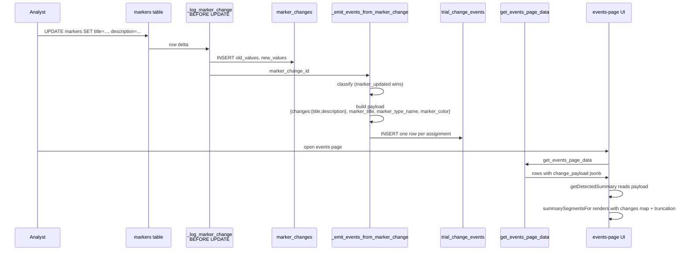

# Detected feed rows: full marker context and multi-field change rendering

**Status:** Draft
**Date:** 2026-05-28
**Owner:** events-feed

## Problem

Detected rows in the events feed (`/manage/events`, source = "Detected") render with missing or hidden context:

1. **Marker context is null.** `marker_added`, `marker_removed`, `marker_updated`, `marker_reclassified`, and `projection_finalized` rows show as just `"Marker added"` / `"Reclassified"` / `"Marker edited: description"` — without the marker title, type, or color. The intelligence feed elsewhere shows the full context because its RPC joins marker fields onto each row. The events feed's `get_events_page_data` RPC does not, and `events-page.component.ts:getDetectedSummary` hard-codes `marker_title`, `marker_color`, `marker_type_name`, `from_marker_type_name`, `to_marker_type_name` to `null` when building the `ChangeEvent` stub it passes to the formatter.

2. **Marker edits lose old/new values.** `marker_updated` payload carries only `changed_fields: string[]` — the names of fields that changed. The formatter therefore renders `"Marker edited: description"` with no indication of what the description changed from or to. The audit table `marker_changes` has the values, but they never make it into the event payload.

3. **Multi-field edits show only the highest-priority change.** The trigger `_emit_events_from_marker_change` ranks simultaneous changes (`date_moved` > `projection_finalized` > `marker_reclassified` > `marker_updated`) and emits one event row per save, stashing the lower-priority changes in `payload.secondary_changes`. The formatter never reads `secondary_changes`. So if a user changes a marker's event_date AND its description in one save, only the date move renders; the description change is invisible.

## Goal

Detected marker rows in the events feed render the same level of context as the intelligence feed elsewhere:

- Title, type, and event date are present on every marker-related row.
- `marker_updated` rows show each changed field with old → new values.
- Multi-field edits show every change in one row.
- Truncation keeps row heights bounded.

Forward-only — existing `trial_change_events` rows continue to render with whatever payload they have. No backfill.

## Architecture

All change-payload widening happens in the trigger. The RPC `get_events_page_data` is unchanged. The client formatter gains one helper to render `{ field: { from, to } }` change maps with truncation.

### Trigger changes (`_emit_events_from_marker_change`)

Replaces the function defined in `20260528120000_marker_change_payload_event_date.sql`. Branches change as follows:

**`marker_added` payload — add:**
- `marker_title` (from `v_new ->> 'title'`)
- `marker_type_name` (lookup `marker_types.name` where id = `v_new_type`)
- `marker_color` (lookup `marker_types.color` where id = `v_new_type`)

**`marker_removed` payload — add:**
- `marker_title` (from `v_old ->> 'title'`)
- `marker_type_name` (lookup via `v_old_type`)
- `marker_color` (lookup via `v_old_type`)

The lookup runs before `trial_change_events` insert, while the markers row still exists for `marker_removed` (we already pulled `v_old` from the audit row, which has the pre-delete snapshot — no DB read against `markers` is needed; we look up `marker_types` only).

**`marker_updated` payload — add and rename:**
- Add `marker_title`, `marker_type_name`, `marker_color` (same lookup as marker_added).
- Add `changes: { fieldname: { from, to } }` — keyed by `'title' | 'description' | 'end_date' | 'projection'`, only present for fields that actually changed in this update.
- Keep `changed_fields: string[]` for back-compat (any reader iterating it still works).

**`marker_reclassified` payload — add and rename:**
- Add `marker_title` (from `v_new ->> 'title'`).
- Add `from_marker_type_name` (lookup `marker_types.name` where id = `v_old_type`).
- Add `to_marker_type_name` (lookup `marker_types.name` where id = `v_new_type`).
- Add `marker_color` (lookup via `v_new_type` — the new type's color).
- Rename existing `secondary_changes` → `changes`.

**`projection_finalized` payload — add and rename:**
- Add `marker_title`, `marker_type_name`, `marker_color`.
- Rename existing `secondary_changes` → `changes`.

**`date_moved` payload (marker-side, `which_date='event_date'`) — add and rename:**
- Add `marker_title`, `marker_type_name`, `marker_color`.
- Rename existing `secondary_changes` → `changes`.

`date_moved` for trial-side date fields (start, primary_completion, study_completion) is emitted by a different code path (CT.gov ingestion) and is out of scope.

### `changes` shape

```jsonc
{
  "changes": {
    "title":       { "from": "Old title",         "to": "New title" },
    "description": { "from": "Old text",          "to": "New text" },
    "end_date":    { "from": "2026-06-01",        "to": "2026-07-15" },
    "projection":  { "from": "stout",             "to": "company" }
  }
}
```

All values are strings. Dates as ISO `YYYY-MM-DD`. Booleans are not currently tracked as material fields. Projection enums stay as raw enum values; the formatter maps to `PROJECTION_LABEL` for display.

### RPC

`get_events_page_data` — **no change.** All new context flows through the existing `change_payload` jsonb that's already projected on detected rows.

### Client

**`events-page.component.ts:getDetectedSummary`** — read marker context from `item.change_payload` instead of hard-coding null:

```ts
const p = (item.change_payload ?? {}) as Record<string, unknown>;
const stub: ChangeEvent = {
  // ...existing fields...
  marker_title: (p['marker_title'] as string | undefined) ?? null,
  marker_color: (p['marker_color'] as string | undefined) ?? null,
  marker_type_name: (p['marker_type_name'] as string | undefined) ?? null,
  from_marker_type_name: (p['from_marker_type_name'] as string | undefined) ?? null,
  to_marker_type_name: (p['to_marker_type_name'] as string | undefined) ?? null,
};
```

**`change-event-summary.ts`** — two new helpers and four updated cases:

- `truncate(s: string, max = 40): string` — `s.length > max ? s.slice(0, max - 1) + '…' : s`. The `40` constant is shared across all surfaces (events feed, activity page, intelligence feed) for consistency.

- `renderFieldChanges(changes: Record<string, {from: unknown; to: unknown}> | null | undefined): SummarySegment[]` — returns `, {label} (~~old~~ → **new**), {label} (~~old~~ → **new**)` segments. Label resolution via `MARKER_FIELD_LABELS`. Value formatting via `formatMarkerFieldValue` (handles dates, projection enum). Each value truncated to 40 chars. Returns empty array when input is null/undefined/empty.

- `marker_updated` case: read `payload.changes` (preferred); fall back to `payload.changed_fields` (legacy slim payload renders as today, no regression). Always append the trailing `· {type} · {event_date}` context via existing `markerContextSegments` (matches `marker_added` consistency).

- `date_moved`, `projection_finalized`, `marker_reclassified` cases: after the existing primary segments, append `renderFieldChanges(payload.changes ?? payload.secondary_changes)`. The fallback to `secondary_changes` keeps any in-flight rows written between trigger replace and migration apply rendering correctly.

### Rendering examples

```
Marker added: PDUFA decision · Topline readout · Jun 20, 2026
Marker edited: title (~~Old title~~ → **New title**), description (~~Old text~~ → **New text**) · Topline readout · Jun 20, 2026
TRIUMPH-1 readout: event date delayed 2 days (~~Oct 19~~ → **Oct 21**), description (~~Initial entry from CT.gov…~~ → **Updated to reflect new s…**)
Reclassified: ~~Interim readout~~ → **Topline readout**, end date (~~Jun 1~~ → **Jul 15**) · Jun 20, 2026
Projection: ~~projected~~ → **actual**, title (~~Old~~ → **New**) · Topline readout · Jun 20, 2026
```

## Data flow



## Tests

### SQL smoke (inline in the new migration)

Builds a hermetic fixture matching the pattern in `20260528120000_marker_change_payload_event_date.sql`. Asserts:

1. Multi-field marker_updated: edit title + description + end_date + projection in one UPDATE → `event_type = marker_updated`, `payload.changes` contains all four keys each with `{from, to}`.
2. date_moved + simultaneous description edit → `event_type = date_moved`, `payload.changes.description = {from, to}`, `payload.marker_title` present.
3. marker_reclassified + simultaneous end_date edit → `event_type = marker_reclassified`, `payload.from_marker_type_name` and `payload.to_marker_type_name` present, `payload.changes.end_date = {from, to}`.
4. marker_added → `payload.marker_title`, `payload.marker_type_name`, `payload.marker_color` all present.
5. marker_removed → same three fields present, resolved from `v_old` and a marker_types lookup.

### Vitest (`change-event-summary.spec.ts` additions)

- `marker_updated` with rich `changes` → joined segment text contains both old (strikethrough segment) and new (bold segment) for each field.
- `marker_updated` with value longer than 40 chars → joined text contains `…`.
- `marker_updated` with legacy slim payload (`changed_fields` only, no `changes`) → joined text contains field names but no `~~` or `**` markers (regression guard).
- `marker_added` with `payload.marker_title` → stub picks it up, segment contains the title.
- `marker_reclassified` with `payload.from_marker_type_name`/`to_marker_type_name` → both names render.
- `date_moved` with `payload.changes.description` → both the date move AND `description (from → to)` appear.
- `projection_finalized` with `payload.changes.title` → both projection swap AND title from → to appear.
- `marker_reclassified` with `payload.changes.end_date` → both reclassification AND end_date from → to appear.

### Manual

- Edit a marker's title + description in one save in the manage UI; verify the events-feed row shows both `(~~old title~~ → **new title**), (~~old desc~~ → **new desc**)`.
- Move a marker's event_date and edit its description in one save; verify the row shows the date move AND the description from → to.

## Forward compatibility

| Existing payload | Renders as |
|---|---|
| `marker_updated` with `changed_fields` only, no `changes` | Field names only (today's behavior) |
| `date_moved` with `secondary_changes` (legacy key) | Date move + secondary changes (formatter checks both keys) |
| `marker_*` without `marker_title` in payload | Title/type/color stay null; row reads as today |

No backfill of historical rows. The feed shows mixed rendering during the transition until older rows scroll off.

## Out of scope

- Backfilling existing `trial_change_events` rows.
- `event-detail-panel` (right rail) — already loads marker_changes diff via separate query; not affected.
- Non-marker detected events (phase_transitioned, status_changed, sponsor_changed, enrollment_target_changed, arm_*, intervention_*, outcome_measure_*, eligibility_*, trial_withdrawn) — they already render full from → to from payload.
- Boolean-typed marker fields (is_projected, no_longer_expected). Not currently tracked as material in the trigger.

## Migration file

`supabase/migrations/20260528130100_marker_change_payload_full_context.sql` — replaces `_emit_events_from_marker_change` in full via `create or replace function`. Timestamp `130100` follows the parallel `130000` migration (`update_event_sources_rpc`) that is in the same date.

## Files touched

**Create:**
- `supabase/migrations/20260528130100_marker_change_payload_full_context.sql`

**Modify:**
- `src/client/src/app/features/events/events-page.component.ts` — `getDetectedSummary` reads marker context from `item.change_payload`.
- `src/client/src/app/shared/utils/change-event-summary.ts` — add `truncate`, add `renderFieldChanges`, extend four cases (`marker_updated`, `date_moved`, `projection_finalized`, `marker_reclassified`).
- `src/client/src/app/shared/utils/change-event-summary.spec.ts` — add 8 cases listed above.

**Do not touch:**
- `supabase/migrations/20260527120100_events_rpc_unified_feed.sql` — RPC stays as-is; no JOINs added.
- `src/client/src/app/features/events/event-detail-panel.component.ts` — right rail is unaffected.
- `src/client/src/app/core/services/event.service.ts` — RPC shape unchanged.
