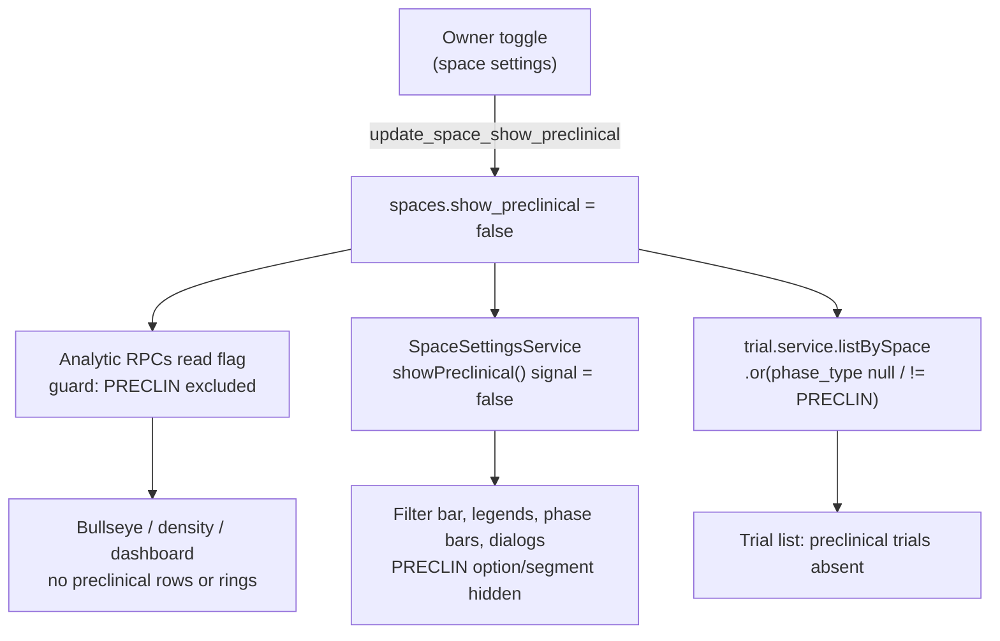

# Hide Preclinical Phase (per-space setting)

Status: Draft for review
Date: 2026-06-03

## Problem

Preclinical activity is hard to track and is not usually tracked by CI teams. The
`PRECLIN` phase currently appears across the app (landscape bullseye/density, phase
bars, filters, trial create/edit dialogs, competitive read) where it mostly adds
noise. We want preclinical hidden by default, with an explicit per-space opt-in for
the spaces that do want to track it.

## Decisions (locked during brainstorming)

1. **Build the per-space toggle now.** A real owner-facing setting, not a deferred
   hook. Default **OFF**.
2. **OFF excludes the records.** When a space has preclinical off, preclinical
   trials/assets drop out of analytic views and lists entirely; they do not
   contribute to counts, rings, or "highest phase present" aggregates. This is the
   "not tracked" interpretation, not "hide the category but keep empty records".
3. **OFF removes preclinical from data entry too.** The create/edit trial dialogs
   do not offer Preclinical as a phase when the space has it off.
4. **Server-side enforcement, server-decided, for analytic RPCs.** Each analytic RPC
   already receives `p_space_id`; it reads the space's flag itself and excludes
   `PRECLIN` accordingly. The client cannot opt back in via a param.
5. **Trial-list stays PostgREST.** The management trial list is a direct
   `from('trials').select(...)` with embedded joins; converting it to a hand-written
   RPC would mean rebuilding that embed shape in SQL, against the grain of the other
   CRUD services. Preclinical visibility is noise-reduction, not a security boundary
   (a user in the space already has RLS access to every trial in it), so a
   client-decided, Postgres-executed filter is sufficient and consistent with the
   existing read pattern.

## Architecture

Three layers, one source of truth per concern.

### 1. Storage

Add a typed boolean column to `spaces`:

```sql
alter table public.spaces
  add column show_preclinical boolean not null default false;
```

Rationale for a dedicated column over reusing the `ctgov_field_visibility` JSONB bag:
it is a single flag, it reads cleanly in SQL guards, and it is trivially indexable.
The JSONB pattern is the right call when there is a cluster of related flags; there
is exactly one here.

### 2. Server-side enforcement (analytic RPCs)

Every phase-sensitive RPC reads the flag once and guards the `PRECLIN` rows. The
guard pattern, applied wherever the function joins `trial_phases tp` (or computes a
phase rank):

```sql
-- read once near the top of the function body
v_show_preclin boolean := (select show_preclinical from public.spaces where id = p_space_id);
...
-- in the WHERE / rank computation
and (v_show_preclin or tp.phase_type <> 'PRECLIN')
```

For SQL (non-plpgsql) functions, inline the scalar subquery instead of a local
variable: `and ((select show_preclinical from public.spaces where id = p_space_id)
or tp.phase_type <> 'PRECLIN')`. Do **not** call a per-row helper function.

When the flag is off, also drop `PRECLIN` from any hardcoded ring-order array the
function returns (e.g. `get_bullseye_data` returns
`['PRECLIN','P1',...,'LAUNCHED']`), so the rendered rings match the data.

RPCs to update (each via a new `CREATE OR REPLACE FUNCTION` migration; never edit an
applied migration):

| RPC | File of current definition | Note |
|-----|----------------------------|------|
| `get_landscape_index` | `20260411120200_create_landscape_index_function.sql` | no phase param; add guard + adjust `max_rank` so PRECLIN can't win |
| `get_landscape_index_by_company` / `_by_moa` / `_by_roa` | `20260412120100_create_landscape_index_by_dimension.sql` | same guard |
| `get_bullseye_data` | `20260412120000_update_landscape_rpcs_generalized.sql` | guard + trim returned ring order |
| `get_bullseye_by_company` / `_by_moa` / `_by_roa` | `20260412120200/300/400_*.sql` | same |
| `get_positioning_data` | `20260412130000_create_positioning_data_function.sql` (+ `20260527140000_positioning_phase_counts.sql`) | already takes `p_phases`; add the flag guard on top so an explicit client phase list can't reintroduce PRECLIN |
| `get_bullseye_assets` | `20260525120000_create_bullseye_assets_rpc.sql` | guard on `asset_indications.development_status` rank too |
| `get_dashboard_data` | `20260530210311_add_change_event_navigation.sql` | guard on `t.phase_type` |

Notifications (`get_notifications`, `get_unread_notification_count`): **review during
planning.** If a preclinical-only change can surface a notification, guard it the same
way for consistency; if notifications never key on preclinical phase, leave them. This
is a verify-then-decide item, not a blind edit.

The `OBS` phase is already excluded from ring math (`tp.phase_type <> 'OBS'`); the new
guard sits alongside it.

### 3. Trial-list (PostgREST, Postgres-executed filter)

In `trial.service.ts` `listBySpace`, when the space has the flag off, append a
Postgres-executed filter that keeps null-phase rows:

```ts
let query = this.supabase.client
  .from('trials')
  .select(TRIAL_SELECT)
  .eq('space_id', spaceId)
  .order('display_order');

if (!showPreclinical) {
  query = query.or('phase_type.is.null,phase_type.neq.PRECLIN');
}
```

The `.or(...is.null,...neq.PRECLIN)` is required because `phase_type <> 'PRECLIN'` is
NULL (and thus excluded) for null-phase trials.

### 4. Frontend: one resolver, not six edits

Today the visible-phase list is hardcoded in the filter bar, both legends, the
phase-bar `RING_ORDER` consumers, and the two trial dialogs. Introduce a single
source of truth so the flag is read once and every surface narrows automatically.

- **`SpaceSettingsService`** (new, small). Exposes the active space's
  `show_preclinical` as a signal, (re)fetched when the active space changes. Modeled
  on `SpaceFieldVisibilityService` (the existing per-space config reader). This is
  the seam future per-space flags also flow through.
- **Pure phase helpers** in the existing model files, so filtering logic isn't
  duplicated in every component:
  - `phase-colors.ts`: `visiblePhaseDescriptors(showPreclinical)`,
    `visibleDevelopmentStatusOptions(showPreclinical)`.
  - `landscape.model.ts`: `visibleRingOrder(showPreclinical)`.
  Each simply returns the existing constant minus `PRECLIN` when the flag is off.

Consumers updated to read `SpaceSettingsService.showPreclinical()` and derive from the
helpers instead of their local hardcoded arrays:

| Surface | File | Current hardcode |
|---------|------|------------------|
| Landscape phase filter | `landscape/landscape-filter-bar.component.ts` | `phaseOptions` (~L116) |
| Bullseye legend | `landscape/bullseye-controls-panel.component.ts` | legend map (~L267) |
| Density legend | `landscape/density-controls-panel.component.ts` | legend map (~L347) |
| Mini phase bar | `shared/components/detail-panel-mini-phase-bar.component.ts` | `RING_ORDER` (~L42) |
| Phase race | `shared/components/detail-panel-phase-race.component.ts` | `RING_ORDER` / `PHASE_DISPLAY` |
| Trial create dialog | `manage/trials/trial-create-dialog.component.ts` | phase option (~L85) |
| Trial edit dialog | `manage/trials/trial-edit-dialog.component.ts` | phase option (~L88) |

The DB stays authoritative regardless of the frontend; the resolver is purely about
not *showing* a control/segment for a phase that will never return data.

**a11y / signal rule:** any phase list bound via `[(ngModel)]` that feeds a
`computed()` must be a signal-derived value, per the project's computed-form-field
rule. The dialogs' phase dropdowns must read the helper output through a signal, not a
plain field.

**Editorial copy (lower priority, in-scope):**
- `bullseye-chart.component.html` (~L11) text says rings run "from Launched at the
  center to Preclinical at the outer rim." When the flag is off the outer ring is
  preclinical-free; adjust the copy to not name preclinical, or make it
  flag-conditional. Pick one during implementation.
- `competitive-read/view-clauses.ts` and `competitive-headlines.ts` hold
  `PRECLIN: 'Preclinical'` label maps. With preclinical excluded upstream these keys
  are simply never hit; leave the maps intact (harmless, and correct if a space turns
  the flag on).
- `phases-help.component.ts` documents the full phase model. **Leave preclinical
  documented**, add one line noting it is a per-space setting. The help page explains
  the data model, not a single space's current view.

### 5. Owner toggle UI

A single toggle, label **"Track preclinical phase"**, owner-only, default off,
co-located with the existing `ctgov_field_visibility` editor in the owner-gated
space-settings surface (located precisely during planning).

Write path: an owner-gated RPC `update_space_show_preclinical(p_space_id uuid,
p_show boolean)`, modeled on the existing field-visibility update RPC, with audit
posture matching that RPC (audit/timestamp fields set server-side via the standard
trigger pattern, never trusted from the client). Confirm during planning whether the
field-visibility update is treated as a Tier 1 audited RPC and match it.

## Data flow (off case)



## Testing

Per the project rule, each behavior task ships its test inline (no deferred test
phase).

- **Frontend unit (Vitest, `npm run test:units`):**
  - `visibleRingOrder` / `visiblePhaseDescriptors` / `visibleDevelopmentStatusOptions`
    omit `PRECLIN` when false, include it when true.
  - `SpaceSettingsService.showPreclinical()` reflects the fetched space value and
    updates on space change.
  - `trial.service.listBySpace` appends the `.or` filter only when off (assert on the
    built query / mock).
- **DB / integration:** for at least one analytic RPC (e.g. `get_bullseye_data`) and
  `get_dashboard_data`, seed a space with a preclinical trial and assert it is absent
  with the flag off and present with it on. Run via the local integration harness
  (`SUPABASE_SERVICE_ROLE_KEY` from `supabase status`).
- **Advisors:** `supabase db advisors --local --type all` clean after the migration.

## Docs (same change set, no drift)

- New migration(s) under `supabase/migrations/`.
- Regenerate architecture docs: `npm run docs:arch` (schema + RPC matrix pick up the
  new column and RPC).
- Runbook: note the new `spaces.show_preclinical` column and the per-space behavior in
  the schema / multi-tenant sections that the regen touches; hand-written prose around
  the auto-gen blocks updated as needed.
- `phases-help` editorial note added (above).

## Out of scope

- A general per-space settings/feature-flag framework. One typed column now; revisit a
  JSONB bag or settings table only when a second flag appears.
- Hiding `OBS` or any other phase. This is preclinical-only.
- Backfilling or deleting existing preclinical records. They remain in the DB; they are
  only filtered from view when the flag is off.

## Verification

```bash
cd src/client && ng lint && ng build
cd src/client && npm run test:units
supabase db advisors --local --type all
```
