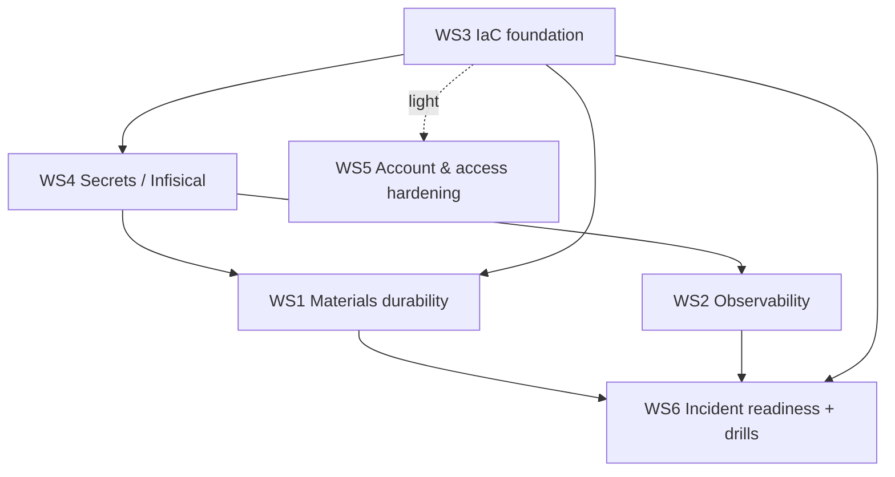

# Disaster Recovery Remediation Program - Design

Status: approved (design). Date: 2026-06-10.
Supersedes the first-cut `docs/specs/dr-remediation/plan.md` (which assumed a
hybrid two-track sequencing). This document is the authoritative program design;
each workstream below gets its own spec and implementation plan.

## 1. Context and goals
`docs/runbook/14-disaster-recovery.md` audited every way Clint can lose data or go
down and produced a prioritized action register. This program is the plan to close
that register. Clint is a multi-tenant whitelabel pharma app on Cloudflare Workers
plus Supabase, with uploaded materials in Cloudflare R2.

Goal: reach a sound disaster-recovery posture, foundations included, before the
first paying customer. Because the project is greenfield and pre-revenue, we build
durability and recovery into the substrate now rather than retrofitting them under
a live system.

## 2. Constraints and decisions
- **Driver:** proactive hardening, no external deadline. Optimize for a durable,
  correct end state.
- **Stage:** greenfield, no paying customers, no irreplaceable customer data in R2
  yet. This removes the urgency to hedge the materials gap and lets us restructure
  freely (for example, create R2 buckets with Object Lock from the start rather
  than migrating data).
- **Budget:** hybrid. Free or self-hosted by default; willing to pay for the few
  services that materially cut risk. Each paid-service decision is made per item
  with its cost/benefit surfaced, not committed up front.
- **Scope:** technical plus operational. In scope: data durability, recovery, IaC,
  secrets, detection/monitoring, incident roles, on-call/paging, drills, and a
  status/comms plan. Out of scope (for now): formal compliance/audit evidence.
- **Sequencing:** foundations-first. Build IaC and secrets management before the
  resilience features that ride on them, so no resilience feature is built on
  un-codified infra or scattered secrets.
- **Tooling (locked):** OpenTofu for IaC; Infisical (self-hostable) for secrets.
- **Learning-oriented:** the user is new to DR, SRE, IaC, and secrets management.
  Every workstream is a teaching exercise (see principle 1).

## 3. Workstream decomposition
The 12 runbook failure domains plus the two new tooling tracks collapse into six
workstreams. Each is independently spec-able and ownable.

| WS | Workstream | Runbook domains | Delivers |
|----|-----------|-----------------|----------|
| 1 | Materials durability | 2 | R2 versioning + Object Lock, R2->B2 cross-cloud mirror, materials-to-object reconciliation |
| 2 | Observability & alerting | 10 | Real alert channel, backup heartbeat, external uptime/cert monitor, app/Worker error monitoring |
| 3 | IaC foundation (OpenTofu) | 4, 6, 7-config | Codified Cloudflare + Supabase config, encrypted remote state, no-drift plan |
| 4 | Secrets & key management (Infisical) | 3, new 13 | Inventory, sync into the four stores, rotation, break-glass export |
| 5 | Account, access & identity hardening | 5, 7-account, 12-partial | Cloudflare account MFA + break-glass admin, break the single-account concentration, OAuth recovery |
| 6 | Incident readiness | 1-drill, 11, 12-response | Roles, on-call/paging, escalation, status/comms, offline runbook, recovery drills |

### Boundaries and dependencies
- **WS3 IaC** - no dependencies; the substrate. Scope: provider setup plus
  encrypted remote state; codify Cloudflare (Workers, routes, R2 buckets including
  lock/versioning, DNS zone, custom domains, rate limits) and Supabase project
  config; import existing resources to a no-drift `plan`. Out of scope: app code
  and database migrations, which keep their existing pipelines.
- **WS4 Secrets** - depends on WS3 (provisioned via IaC). Scope: stand up
  Infisical, import the inventory, machine identity for CI, syncs into
  Worker/GitHub/Supabase, rotation where the provider supports it, scheduled
  break-glass export. Hard boundary: the offline age key is never imported.
- **WS1 Materials durability** - depends on WS3 (bucket plus lock as code) and WS4
  (mirror token from Infisical). Scope: versioning, Object Lock, scheduled R2->B2
  mirror, reconciliation job.
- **WS2 Observability** - depends on WS4 (alert/monitor secrets). Scope: real alert
  channel (replaces the interim GitHub-issue baseline shipped in the early Phase
  0.2 work), backup heartbeat/dead-man's-switch, external uptime + cert monitor,
  app/Worker error monitoring.
- **WS5 Account, access & identity hardening** - mostly independent settings; light
  dependency on WS3 for anything codifiable. Scope: Cloudflare account MFA plus
  break-glass second admin, breaking the single-account concentration (for example
  isolating backups or DNS), OAuth client recovery posture.
- **WS6 Incident readiness** - depends on WS1/WS2/WS3 being far enough to drill.
  Scope: incident roles, on-call/paging, escalation, status/comms, offline runbook
  copy, and the three drills (DNS-repoint, materials-restore, project re-provision).

## 4. Sequencing (foundations-first)
- **Phase 1 Foundations:** WS3 IaC, then WS4 Secrets.
- **Phase 2 Resilience:** WS1 Materials durability, WS2 Observability, WS5
  Account/access hardening. All codified from day one because the foundations exist.
- **Phase 3 Readiness:** WS6 Incident roles, on-call, comms, and drills. Drills
  come last because they validate everything built before them.

## 5. Cross-cutting principles
1. **Teach as we go.** Each workstream spec opens with a concepts primer; jargon is
   defined inline; every decision explains the why and the tradeoffs before acting.
2. **Decide cost per item.** Cost/benefit is surfaced at each paid-service decision;
   nothing recurring is adopted without an explicit yes.
3. **No-drift docs.** Runbook 14 and its action register are updated in the same
   change set as each workstream lands.
4. **Age key offline, always.** Never in Infisical, IaC state, or any online system.
5. **IaC state is sensitive.** Encrypted remote backend, least-privilege access.
6. **Verify before done.** Vitest for Worker code, `tofu validate`/`plan` for IaC,
   live checks where possible. Evidence, not assertion.
7. **Per-domain RPO/RTO targets**, not one global number.

## 6. Definition of done (program gate, before first paying customer)
- Every failure domain has a documented recovery procedure, a detection signal,
  and (where it holds data) a restore tested against its RPO/RTO target.
- Materials: versioned plus Object Lock plus off-cloud mirror, restore drilled.
- Secrets: full inventory in Infisical, rotation on DB credentials, break-glass
  export proven, age-key offline custody confirmed.
- Infra: a fresh environment can be stood up from OpenTofu plus a short documented
  manual residue.
- Monitoring: backup, heartbeat, uptime, cert, and app errors all alert to a real
  channel.
- Ops: incident roles, on-call, and comms defined; the three drills logged.

Each workstream's own done is sharpened in its spec.

## 7. Domain-to-workstream traceability
| Runbook domain | Workstream |
|----------------|-----------|
| 1 Database | existing backup system; drill in WS6 |
| 2 Materials / R2 | WS1 |
| 3 Secrets & keys | WS4 |
| 4 DNS & domains | WS3 (codify), WS6 (drill) |
| 5 Identity & auth | WS5 |
| 6 Supabase project config | WS3 |
| 7 Cloudflare account & Workers | WS3 (config), WS5 (account) |
| 8 CI/CD & GitHub | WS4 (secrets), WS3 (deploy config) |
| 9 Vendors & billing | tracked in runbook; WS2 detection |
| 10 Detection & monitoring | WS2 |
| 11 People & process | WS6 |
| 12 Security incident | WS4 (rotation), WS5 (access), WS6 (response) |

## 8. Relationship to existing docs
- `docs/runbook/14-disaster-recovery.md` remains the operational source of truth
  (failure domains, recovery procedures, action register). It is updated as each
  workstream lands.
- `docs/specs/dr-remediation/plan.md` is the earlier first cut and is superseded by
  this design plus the per-workstream specs. It will carry a pointer to here.
- Each workstream produces its own `docs/superpowers/specs/<date>-ws<N>-*-design.md`
  and an implementation plan.

## 9. Next step
Begin WS3 (IaC foundation) with its own brainstorm and spec, where the teaching
starts: what IaC and OpenTofu are, why state matters, and how we import existing
Cloudflare and Supabase resources without disrupting the running app.
