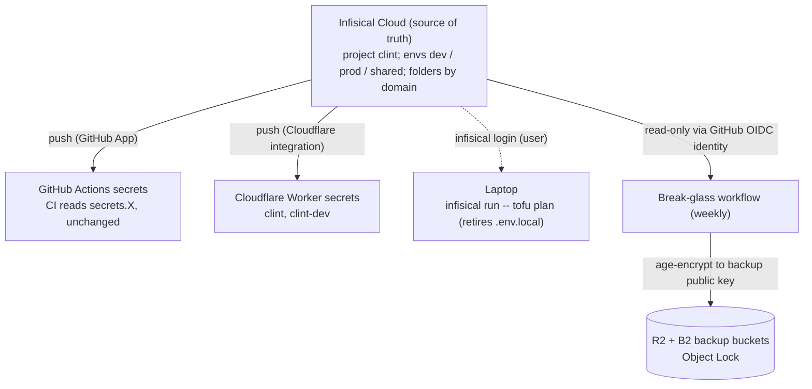

# WS4: Secrets Management (Infisical) - Design

Status: approved (design). Date: 2026-06-12.
Part of the DR remediation program (`2026-06-10-dr-program-design.md`), workstream 4.
Closes runbook domain 3 (secrets and encryption keys): the "scattered, unaudited,
partial inventory" top-gap. Depends on WS3 (IaC foundation, now landed).

This spec is written to teach as well as specify (the user is new to secrets
management), so it includes a concepts primer it would otherwise omit.

## 1. Concepts primer (reference)
- **Secret:** a credential whose value must stay confidential (API token, DB
  password, signing key). Distinct from config (non-secret settings).
- **Secrets manager:** one encrypted, access-controlled, audited store that holds
  the canonical value of every secret, instead of secrets being copy-pasted into
  each system that needs them (where they drift and nobody knows the true value).
- **Infisical:** an open-source secrets manager, usable as hosted SaaS (Infisical
  Cloud) or self-hosted. Tooling locked by the DR program.
- **Sync / push integration:** Infisical holds the canonical secret and
  automatically copies it into a downstream system (GitHub Actions secrets,
  Cloudflare Worker secrets). One-way, Infisical -> consumer. Consumers read their
  native secret store unchanged; they do not know Infisical is upstream.
- **Machine identity:** a non-human identity (for CI) that authenticates to
  Infisical. Here it authenticates via **GitHub OIDC** - GitHub mints a short-lived
  token per job, so no Infisical bootstrap secret is stored in GitHub.
- **Break-glass export:** a scheduled, encrypted offline copy of all secrets, so a
  loss of the secrets manager itself never blocks recovery.
- **age:** the file-encryption tool already used for DB backups. The break-glass
  bundle is encrypted to the backup **public** key; only the offline **private**
  key decrypts it.

## 2. Goal and scope
Goal: every live secret has a single canonical home in Infisical, which syncs out to
the systems that consume it, with a scheduled offline break-glass copy - so secrets
are centralized, auditable, and recoverable, and adding/rotating a secret is one edit
in one place.

In scope:
- Stand up **Infisical Cloud** (free tier). Project `clint`; environments `dev`,
  `prod`, `shared`; folders by domain (`/cloudflare`, `/supabase`, `/backups`,
  `/ai`, `/ci`).
- Import the inventory: the ~20 GitHub Actions secrets, the Cloudflare Worker
  runtime secrets, and the laptop `.env.local` provider credentials.
- **Sync/push** integrations: Infisical -> GitHub Actions secrets (GitHub App), and
  Infisical -> Cloudflare Worker secrets (one mapping per Worker: `clint`,
  `clint-dev`).
- **Machine identity** via GitHub OIDC (read-only, least-privilege) for the
  break-glass job. Laptop authenticates as the user (`infisical login`) and runs
  tofu via `infisical run`, retiring `.env.local`.
- **Break-glass export:** weekly GitHub Actions workflow that reads all secrets,
  encrypts the bundle with age (backup public key), and writes it to the R2 + B2
  backup buckets (same Object Lock immutability as DB backups).
- Update runbook domain 3 + the action register.

Out of scope (explicit boundaries):
- **Automated rotation** - its own follow-on spec. Many Clint secrets (Anthropic,
  Brandfetch, custom Worker secrets) have no auto-rotation provider, so that work is
  largely a manual-rotation runbook and is cleaner separated.
- **The age private key** (`BACKUP_AGE_PRIVATE_KEY`) - never imported into Infisical;
  the offline vault stays its only canonical home. Its existing GitHub copy (used by
  `backup-verify` to decrypt) remains a direct GitHub secret, documented as the one
  deliberate exception.
- **Self-hosting** - Cloud chosen for low ops and blast-radius isolation; self-host
  remains an exit option (no lock-in) if ever needed.
- **Pull-at-runtime** for CI/Workers - rejected for now (changes pipelines, adds a
  hard runtime dependency on Infisical); revisit per-consumer later.

## 3. Why Infisical Cloud (not self-hosted)
A secrets manager used for DR has a bootstrapping problem: if it is down or lost
during a disaster, it cannot hand over the secrets needed to recover. Cloud turns
this in our favor: as a separate vendor it sits **outside** the Cloudflare/Supabase
blast radius, with near-zero ops for a single operator. Self-hosting would keep the
data fully in-hand but create a placement paradox (host it on the infra it protects
and it dies in the same disaster; host it elsewhere and that becomes new infra to run,
patch, and back up). The break-glass export (section 6) covers the residual "Cloud is
unavailable" risk regardless.

## 4. Why sync/push (not pull-at-runtime)
Sync/push makes Infisical the source of truth while CI and the Workers keep reading
their native secret stores unchanged - the lowest-risk way to move ~20 live secrets
without touching pipelines or giving every job a runtime dependency on Infisical.
Cloudflare Worker secrets must be set at deploy time anyway, so Workers require push
regardless. Copies still exist in GitHub/CF, but they are centrally managed and
overwritten from one source.

## 5. Architecture

## 6. Components
- **Infisical project + structure.** One project, three environments (`dev`, `prod`,
  `shared`), domain folders. `shared` holds non-env-specific secrets (Cloudflare
  token, B2 management key, age *public* key, CI tokens).
- **Inventory import.** GitHub Actions secrets are write-only and cannot be read
  back, so import is not a copy: each value is re-collected from its origin
  (Cloudflare/Supabase dashboard, password-manager inventory) or rotated if
  unrecoverable, then loaded into Infisical and pushed back out.
- **GitHub sync.** Infisical GitHub App connected to `clint-org/clint`, mapping
  environments to the repo's Actions secrets.
- **Cloudflare sync.** Infisical Cloudflare Workers integration, one mapping per
  Worker.
- **Machine identity (OIDC).** Read-only identity for the break-glass job; no stored
  bootstrap secret. The sync integrations push using credentials granted to Infisical
  in its own dashboard, so they need no GitHub-side identity.
- **Break-glass export workflow.** Weekly; reads all secrets, age-encrypts, writes to
  R2 + B2.

## 7. Migration / cutover plan
Incremental, one domain folder at a time, each verified before the next, with the
GitHub/CF copies kept as fallback until verified (nothing deleted blindly):
1. Collect the canonical values for the domain into Infisical (origin/inventory, or
   rotate if unrecoverable).
2. Enable the sync so Infisical pushes them to GitHub / Cloudflare.
3. Verify the consumer still works (a green CI run, or the Worker responds) and the
   synced value matches.
4. Move to the next domain.
The laptop `.env.local` -> `infisical run` switch comes last (only affects tofu).

## 8. Success criteria (WS4 done)
- Every in-scope secret has its canonical value in Infisical, organized by env/domain.
- A change made in Infisical propagates to both GitHub Actions and Cloudflare Worker
  secrets.
- A CI run stays green drawing entirely from synced secrets.
- `infisical run -- tofu plan` works with no `.env.local` present.
- The weekly break-glass workflow produces an age bundle that the offline age private
  key decrypts.
- Runbook domain 3 and the action register reflect Infisical as the source of truth,
  with the age-key and rotation boundaries documented.

## 9. Risks and mitigations
- **Cloud unavailable / account lost:** break-glass export (weekly, offline,
  age-encrypted) guarantees a recent recoverable copy.
- **Botched cutover breaks prod:** incremental per-domain migration with verification
  and fallback copies; no blind deletes.
- **Unrecoverable GitHub secret values:** rotate as part of the move rather than
  trying to read them back.
- **New vendor dependency:** accepted; offset by blast-radius isolation and the exit
  option (self-host) that Infisical's open-source nature preserves.

## 10. Next step
Write the WS4 implementation plan (phased: stand up + structure, import + sync per
domain, machine identity + break-glass, laptop cutover, docs) and execute it. Rotation
gets its own later spec.
