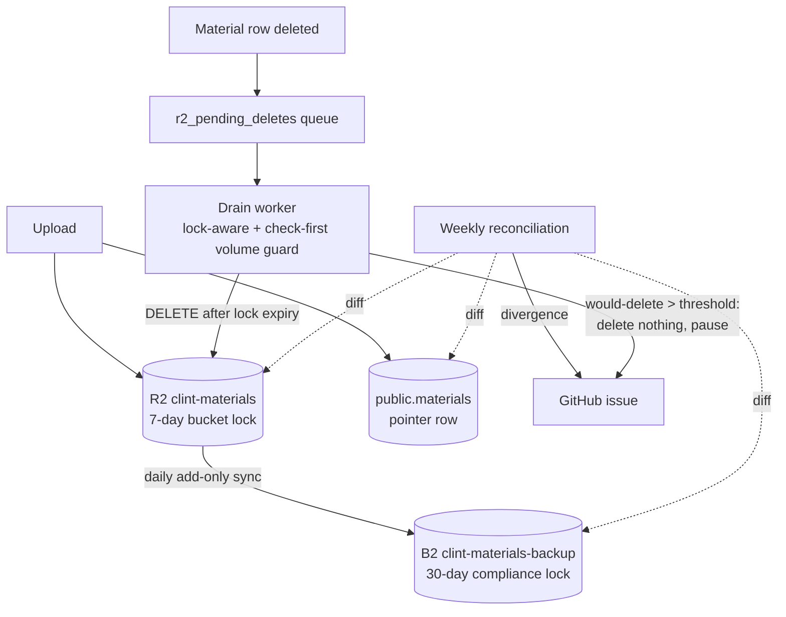

# WS1: Materials Durability - Design

Status: approved (design pending user review). Date: 2026-06-23.
Workstream 1 of the DR remediation program
(`docs/superpowers/specs/2026-06-10-dr-program-design.md`). Closes the single
largest data-loss gap in the system: tenant-uploaded materials in Cloudflare R2 have
no second copy, no immutability, and no detection (runbook 14, domain 2).

Depends on (both DONE): WS3 (R2 buckets and the B2 backup bucket are codified in
OpenTofu) and WS4 (mirror and tooling credentials live in Infisical).

## 1. Concepts primer (reference)

New vocabulary, defined once. The program is a teaching exercise (program design,
principle 1).

- **Object storage / R2.** Files are stored as opaque objects under a string key,
  not in a filesystem. Clint keys each material `{space_id}/{material_id}/{file_name}`
  in the `clint-materials` bucket. The database row in `public.materials` is only the
  pointer; the bytes live in R2.
- **Immutability / WORM (write-once-read-many).** Storage that physically refuses to
  delete or overwrite an object until a retention period elapses. The refusal is
  enforced below the API, so it holds regardless of who issues the delete (our code,
  a leaked token, an attacker) and regardless of bugs in our code.
- **R2 bucket locks.** Cloudflare R2's immutability feature. A bucket carries up to
  1,000 prefix-scoped rules; each says "objects under this prefix stay undeletable and
  unoverwritable for N days after they are written." Rules apply to existing buckets
  and existing objects (no bucket recreation needed) and take precedence over
  lifecycle deletion rules. R2 has NO governance-vs-compliance distinction (unlike
  S3): a lock is a hard guarantee while in force, with no privileged bypass.
- **R2 has no object versioning.** There is no version history and no "previous
  version" to restore. The earlier design/runbook language ("R2 versioning... restore
  the prior version") is borrowed from S3 and is wrong for R2. R2's protection is
  immutability of the live object, which fits because Clint materials are write-once
  (every upload is a new `material_id`; keys are never overwritten in place).
- **Cross-cloud mirror.** A scheduled copy of the bucket into a different cloud
  provider (Backblaze B2) with a separate login and separate blast radius, so a total
  loss of the Cloudflare account does not take the only copy with it. Mirrors the DB
  backup posture (runbook 13).
- **B2 Object Lock (compliance mode).** Backblaze's WORM. Compliance mode means not
  even the account owner can shorten or remove the lock before expiry. This is the
  anti-ransomware guarantee already used by the DB backup bucket.
- **RPO / RTO.** Recovery Point Objective: how much recent data you can afford to
  lose, measured in time (set by mirror cadence). Recovery Time Objective: how long
  recovery may take. Runbook target for materials: RPO 24h, RTO 4h.
- **Reconciliation.** A periodic three-way diff of the DB pointers, the R2 objects,
  and the B2 copy, to catch silent divergence.
- **The drain.** `src/client/worker/r2-drain/queue.ts`. A daily worker that processes
  `public.r2_pending_deletes` (populated by an AFTER DELETE trigger on
  `public.materials`) by calling R2 DELETE. This is the live deletion path and the
  one piece of our own code that issues deletes.

## 2. The gap today (what we are fixing)

For each material there are two facts: the bytes (R2) and the pointer (a `materials`
row). Today the pointer is well protected (daily encrypted DB backups to R2 + B2,
restore-drilled) and the bytes are not protected at all:

- **No second copy.** Loss of the bucket or the whole Cloudflare account permanently
  destroys every uploaded file. The DB backup stores only the pointers.
- **No immutability.** A bad delete erases live files with no undo. The daily drain
  is automated machinery issuing deletes; a drain bug, a bad cascade, or a malicious
  enqueue deletes live objects.
- **No detection.** Nothing notices if R2 and the DB disagree; a dangling pointer
  shows a download link that 404s, which the runbook calls worse than an honest empty
  state.

Runbook 14 calls this "the single largest data-loss gap in the system" and rates it
medium-likelihood x catastrophic-impact (action register P1).

## 3. Goal and scope

**Goal.** Bring materials to a sound durability posture: immutable in-account for a
recovery window, copied off-cloud, and continuously reconciled, with a deletion path
that coexists with immutability and cannot run away.

**In scope.**
1. R2 bucket lock on `clint-materials` / `clint-materials-dev` (7-day retention).
2. Daily R2-to-B2 add-only mirror into dedicated B2 buckets under a 30-day compliance
   lock.
3. Weekly materials-to-object reconciliation that alerts via a GitHub issue.
4. Drain rework: lock-aware reschedule plus a check-first volume guard
   (deny-by-default, one-shot approval; folds in action register P3).

**Out of scope (documented follow-ups).**
- B2 lagged-prune (bounding cold-copy growth and flushing deletions from B2). Add-only
  is the starting posture; the deletion ledger (section 6.4) is the data source when
  prune is added.
- Event-driven near-real-time mirror (sub-24h RPO). Deferred until a customer needs
  tighter RPO; the daily cron meets the stated 24h target.
- Provenance-based auto-approve for the drain guard (authorized bulk actions skip the
  pause; only unexplained bulk deletes alert). v1 pauses on raw volume; this refinement
  removes the rare false-trip once it becomes worth the plumbing.
- The materials-restore drill itself (a tabletop/live exercise) belongs to WS6, but
  this spec must leave it possible (it is impossible today: nothing to restore from).

**Non-goals.** No change to the upload path, the materials data model, or the app's
delete UX. No bucket recreation (locks apply in place).

## 4. Delete semantics: access now, bytes later

The retention window does not delay the user's delete. "Delete" is two operations:

1. **Revoke access** (instant): the `materials` row is removed, so the app cannot
   serve the file (no pointer; RLS denies; downloads 404). This already happens today
   and is unchanged. From the user's perspective the file is gone immediately.
2. **Purge bytes** (deferred): the drain physically removes the object after the lock
   window.

Storage cannot distinguish a legitimate delete from an accidental or malicious one;
they are identical operations. So the only way to recover from a bad delete is to
delay the physical purge behind a window during which the bytes still exist. This is
the standard "trash can" model (Gmail 30-day purge, S3 delete markers, OS trash).
GDPR's "without undue delay" erasure standard is satisfied by instant access
revocation plus a bounded purge schedule; data persisting in backups through their
normal cycle is explicitly tolerated. Caveat held openly: under the add-only B2 mirror
(section 5, Layer 2) the off-cloud copy is currently retained indefinitely, so the
hot-store purge is bounded (7 days) but the cold-copy purge is not. That is acceptable
pre-revenue and is precisely what the deferred B2 lagged-prune (driven by the deletion
ledger, section 6.4) closes before erasure guarantees are made to a paying customer.

The one cost, stated honestly: an R2 lock has no bypass, so there is no "destroy this
right now" override even for us. Access can always be revoked instantly, but the byte
purge cannot be forced early. That is the inherent trade of unbypassable immutability
and is the correct choice for user materials.

## 5. Architecture

Three layers, each closing exactly one failure, plus the drain rework that lets the
deletion path survive the lock.

### Layer 1: R2 bucket lock (in-account immutability)
A single empty-prefix rule, 7-day retention, on each materials bucket. Every object
is immutable for its first 7 days of life; the clock starts at write, not at delete.
A delete attempt inside the window is rejected by R2 regardless of caller. After 7
days the object becomes deletable like normal (the lock is a floor on lifetime, not a
ceiling). This gives a guaranteed 7-day undo window on recent uploads, which is when
accidental-delete incidents happen and get noticed. Short, because R2 is the hot
read path: dead-but-locked bytes should not accumulate and real deletions should
flush within a week.

Configuration note (resolve in the plan): the Cloudflare Terraform provider may not
yet expose an R2 bucket-lock resource (the docs list dashboard / wrangler / API). If
the provider supports it, codify in `infra/tofu/{prod,dev}/r2.tf` alongside the
bucket. If not, configure via `wrangler r2 bucket lock` in a committed, idempotent
script with a drift check (assert the live lock matches expected), and document the
residue. Either way, a test must prove a real delete of a fresh object is rejected.

### Layer 2: R2-to-B2 add-only mirror (off-cloud copy)
A daily GitHub Actions job syncs each R2 materials bucket to a dedicated B2 bucket
(`clint-materials-backup`, `clint-materials-backup-dev`), reusing the S3-compatible
tooling and the credential pattern from the DB backup (`scripts/backup/upload.sh`,
Infisical-sourced keys). Add-only: the sync copies new objects and never deletes from
B2. Because materials are write-once, the sync is almost always pure adds.

Dedicated buckets (not the existing `clint-db-backups`) because that bucket's
lifecycle rule reaps objects at 365 days, which must never apply to live materials.
The materials B2 buckets get a 30-day compliance Object Lock (anti-ransomware floor on
the freshest copies) and NO age-based lifecycle deletion. Codified in
`infra/tofu/shared/b2.tf` (or a sibling file), mirroring the existing `b2_bucket`
resource.

Add-only is also the maximally-safe choice for the runaway case (section 7): a bad R2
deletion can never propagate to B2, so the off-cloud copy is always intact to restore
from. The cost is unbounded B2 growth and deletions never flushing from the cold copy;
both are acceptable pre-revenue and are the motivation for the deferred lagged-prune.

### Layer 3: weekly reconciliation (detection)
A scheduled job lists `public.materials`, R2 objects, and B2 objects, and reports
three divergences:
- **Dangling pointer**: row with no R2 object (the 404-download case).
- **Orphan object**: R2 object with no row (wasted storage / possible leak).
- **Mirror gap**: R2 object absent from B2 (incomplete disaster copy).

On any divergence it opens or updates a deduplicated GitHub issue, the same sink as
`backup-db.yml` / `uptime-check.yml`. Weekly to start. Runs as a GitHub Actions cron
(consistent with the other DR jobs) reading R2/B2 over the S3 API and the DB over the
pooler with a least-privilege read path.

### Drain rework (deletion path survives the lock)
Two changes to `src/client/worker/r2-drain/queue.ts`:
1. **Lock-aware reschedule.** A delete rejected because the object is still locked is
   "not yet," not a failure. The worker reschedules the attempt for after the lock
   expires (it can compute expiry from object age) instead of consuming the retry
   budget. Without this, locked rejections would burn the 5-attempt budget and orphan
   the object. This is mandatory; lock and drain cannot coexist otherwise.
2. **Check-first volume guard (deny-by-default).** Before issuing any DELETE, the run
   counts how many objects the queue wants removed. If that count exceeds a threshold,
   the run deletes **nothing**, pauses, and opens a GitHub issue. A normal-sized run
   proceeds and purges as usual. This is a pre-flight check, not a "delete N then
   stop" cap: in a runaway the blast radius is zero, not a capped batch. The pause is
   denial; resuming requires an explicit, auditable one-shot approval (see below).
   Safe to set the threshold conservatively because a trip costs nothing.

   The issue states the count, a sample of keys, and a cause hint (the
   tenant/space the keys cluster under) so the decision is usually obvious at a glance.
   - **Allow** (it was an expected bulk event, e.g. a tenant offboarding): trigger a
     manual "approve materials drain" GitHub Actions dispatch with a max-count input;
     it authorizes a single run, which then purges the batch (next tick or immediately)
     and auto-closes the issue.
   - **Deny** is the default and needs no action: the run already deleted nothing and
     stays paused. Investigate the unexplained enqueue, fix the cause, and drop the bad
     queue rows. Nothing was destroyed (recent objects are lock-protected; all objects
     remain in B2).

   The asymmetry is the safety property: allow takes a deliberate action, deny takes
   none. A mass deletion can only happen if a human actively approves it. Threshold
   configurable via env. (Provenance-based auto-approve, so authorized bulk actions
   skip the pause entirely and only truly-unexplained deletes alert, is a documented
   follow-up; not built for v1.)

## 6. Components

| # | Component | Location | Responsibility |
|---|-----------|----------|----------------|
| 6.1 | R2 lock config | `infra/tofu/{prod,dev}/r2.tf` or wrangler script | 7-day immutability on materials buckets |
| 6.2 | B2 materials buckets | `infra/tofu/shared/b2.tf` | dedicated 30-day compliance-locked copy targets |
| 6.3 | Mirror job | `.github/workflows/materials-mirror.yml` + script | daily add-only R2-to-B2 sync, Infisical creds, notify-on-failure |
| 6.4 | Reconciliation job | `.github/workflows/materials-reconcile.yml` + script | weekly three-way diff, issue on divergence |
| 6.5 | Drain rework | `src/client/worker/r2-drain/queue.ts` + Vitest specs | lock-aware reschedule + check-first volume guard (deny-by-default) |
| 6.5a | Drain approval | `.github/workflows/materials-drain-approve.yml` | manual one-shot dispatch authorizing a single over-threshold run |
| 6.6 | Deletion ledger | `public.r2_pending_deletes` (existing) | succeeded rows retained as the timestamped record of deletions; data source for the future B2 lagged-prune |
| 6.7 | Runbook + register | `docs/runbook/14-disaster-recovery.md` | domain 2 rewritten to immutability model; action register P1 + drain-guardrail rows closed |

## 7. Failure scenarios and recovery (honest)

| Scenario | Outcome | Mechanism |
|----------|---------|-----------|
| Fat-finger / leaked-token delete of a recent object | **Impossible to lose** | R2 lock refuses the delete (storage-enforced) |
| Overwrite / corruption of a recent object | **Impossible** | lock forbids overwrite |
| Drain runaway targeting recent files (< 7d) | **Impossible to lose** | lock refuses every delete in-window |
| Drain runaway targeting old files (> 7d) | **Prevented in the loud case, else recoverable** | check-first guard deletes nothing and pauses when a run is anomalous; reconciliation catches a sub-threshold slow drip (< 1 week); add-only B2 copy is always intact to restore from |
| Whole Cloudflare account / bucket loss | **Recoverable, 24h RPO** | rehydrate from B2 into a fresh bucket, repoint the Worker binding; lose at most the uploads since the last daily sync |
| Silent pointer/object divergence | **Detected < 1 week** | weekly reconciliation opens an issue |

Residual risks named: (a) a file deleted and its loss undiscovered past the window is
gone by design (that is what deletion means); (b) simultaneous loss of both Cloudflare
and Backblaze (two companies, separate logins) is accepted out of scope, as the DB
backups already do; (c) the 24h RPO gap before the next mirror run, the price of daily
vs event-driven, matching the runbook target.

The key honesty: protection against accidental destruction **within the window is
storage-enforced, not dependent on our code being bug-free**. Tests confirm the lock
is on and that our surrounding code cooperates; they do not carry the guarantee.

### Recovery from a wrongful bulk delete (written down before it happens)
If a batch of valid materials is wrongly deleted (bad cascade, bad migration, hostile
enqueue), this is a restore event, not a loss event. Procedure:
1. **Stop the bleeding.** Disable the drain trigger (or set the threshold to 0) so no
   further deletes run. (In the common path the check-first guard already paused it.)
2. **List the affected keys.** Three sources name them: the guard's issue (the keys it
   was about to delete), the `r2_pending_deletes` ledger (succeeded rows, timestamped),
   and reconciliation's dangling-pointer list (rows whose objects are now missing).
3. **Sort legitimate from erroneous.** Deletes that match a known authorized action
   (a real offboarding) are correct; leave them. The rest are the mistakes.
4. **Restore the mistakes from B2.** Recent objects (< 7d) need no action: the lock
   refused those deletes, the bytes never left R2. For older objects, copy each key
   from the B2 materials bucket back into R2 (the same S3 `cp` the disaster restore
   uses, scoped to a key list). If a pointer row was also deleted, restore it from the
   latest DB backup or recreate it.
5. **Root-cause and re-enable.** Find and fix what enqueued the bad deletes, drop the
   bad queue rows, restore the threshold, re-enable the drain.

## 8. Testing strategy

Each task ships with its tests inline (project convention). Coverage maps to the
scenarios in section 7:
- **Lock proof** (highest value): assert the live bucket carries the rule, then prove
  it by attempting a delete of a freshly written object and asserting R2 rejects it.
- **Drain unit tests** (most code risk): locked rejection reschedules (does not consume
  the retry budget); already-deleted key is a no-op; an anomalous run deletes **nothing**
  and opens the issue (deny-by-default), a normal run proceeds, and an approved run
  purges its batch; non-lock errors still retry then surface at MAX_ATTEMPTS.
- **Mirror tests**: a new R2 object appears in B2 after a sync; an object deleted from
  R2 is NOT removed from B2 (proves add-only / runaway recoverability for old files).
- **Reconciliation tests**: inject each divergence type (dangling, orphan, mirror gap)
  and assert the issue is opened.
- **Restore exercise**: rehydrate from B2 into a throwaway bucket and confirm objects
  return (named task with green/red evidence; the live drill itself is WS6).

## 9. Rollout plan (greenfield, no data to preserve)

Confirmed greenfield/pre-revenue: current bucket contents are demo/test data, so the
lock can be applied to existing objects with no migration.

1. B2 materials buckets in IaC (`tofu apply`, no-drift plan).
2. Mirror job; run once; confirm objects land in B2.
3. Reconciliation job; confirm a clean run, then an injected-divergence run alerts.
4. Drain rework with tests; deploy.
5. R2 bucket lock last, after the drain is lock-aware (order matters: locking before
   the drain understands rejections would stick the queue).
6. Runbook domain 2 + action register updated in the same change set (no-drift docs).

## 10. Success criteria (WS1 done)

- R2 materials buckets carry a 7-day lock; a real delete of a fresh object is proven
  rejected.
- Daily mirror runs green; B2 holds a copy of every current materials object;
  notify-on-failure wired.
- Weekly reconciliation runs green and proven to alert on each divergence type.
- Drain reschedules locked rejections (no budget burn) and, on an anomalous run,
  deletes nothing and opens an issue (deny-by-default) with a one-shot approval path,
  all with passing Vitest specs.
- A restore-from-B2 exercise has rehydrated objects into a throwaway bucket.
- Runbook 14 domain 2 rewritten to the immutability model; action register P1 and the
  drain-guardrail row closed; the materials-restore drill is now possible (handed to
  WS6).

## 11. Risks and mitigations

| Risk | Mitigation |
|------|-----------|
| Cloudflare TF provider lacks an R2 bucket-lock resource | configure via committed idempotent `wrangler` script + drift check; document residue (section 5, Layer 1) |
| Locking before the drain is lock-aware stalls the queue | rollout order: drain rework ships before the lock (section 9) |
| Add-only B2 grows unbounded / deletions never flush from cold copy | accepted pre-revenue; deletion ledger (6.4) enables the deferred lagged-prune when volume warrants |
| Reconciliation false positives during a sync race | compare against a consistent snapshot; tolerate in-flight objects within one sync interval |
| B2 materials bucket accidentally inherits the db-backups 365-day lifecycle | dedicated buckets with no age-based lifecycle deletion (section 5, Layer 2) |

## 12. Next step

Invoke the writing-plans skill to turn this into a task-by-task implementation plan
(tests paired per task), executed in the `.worktrees/ws1-materials-durability`
worktree off develop.
