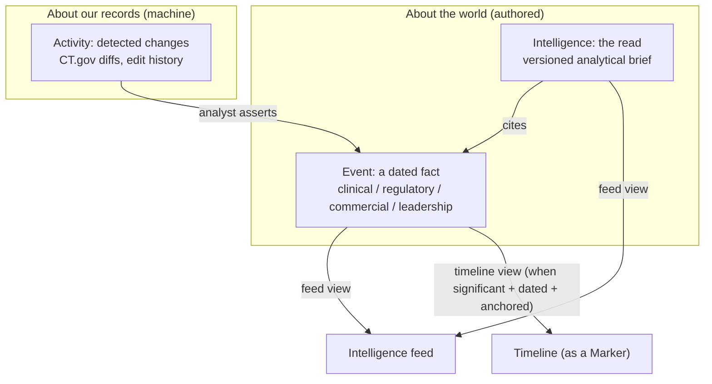
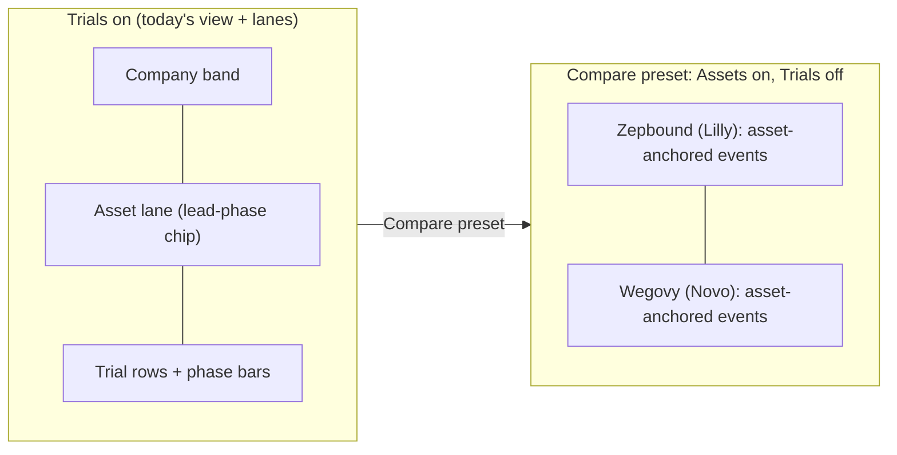

# Unified Event Model and Multi-level Timeline: Design

Date: 2026-06-28
Status: Approved (design); implementation plan pending
Related: marker system (`20260412130100_marker_system_redesign.sql`), events system
(`20260413120000_events_system.sql`), primary intelligence anchors
(`20260627130050_intelligence_anchors_schema.sql`), multilevel landscape
(`docs/superpowers/specs/2026-06-27-multilevel-intelligence-landscape-design.md`)

## Problem

The product has three concepts that should be two layers, and the boundaries
between them leak.

1. **Markers** are dated timeline glyphs attached to trials. They have a rich
   date model (point, range, fuzzy precision, ongoing) and a provenance
   (`projection`: actual / company / primary / stout). They derive the phase
   bars. They are clinical-flavored and can only attach to trials.

2. **Events** are an analyst-authored competitive-intelligence log (Leadership,
   Regulatory, Financial, Strategic, Clinical, **Commercial**) anchored to a
   company / asset / trial. They have a single exact date, no ranges, no
   precision. They never render on the timeline.

3. **Primary Intelligence** is the agency-authored analytical read (versioned
   markdown briefs).

Three concrete failures follow from this split:

- **Business facts cannot reach the timeline.** "Lilly shipped Zepbound to
  distributors, ~Q1 2024" is a Commercial *event* today. It is exactly the kind
  of fact an analyst wants on the timeline next to approval and launch, to read
  the gap ("approval to distribution took N months") and compare that gap across
  competitors. There is no path for it.

- **Events have no fuzzy dates.** A forward-looking, primary-sourced claim
  ("Lilly switches vials to pens for everyone, ~Q4 2026") cannot even be
  represented as an event, because events are exact-date only. Only markers carry
  the fuzzy/range model.

- **The vocabulary is overloaded and confuses users.** "Primary" means two
  unrelated things (`projection = primary` = a date came from a primary source,
  vs **Primary Intelligence** = the authored deliverable). "Feed" means two
  different streams (the Intelligence feed of briefs vs the Events/Activity feed
  of changes). Both feeds sit under one "Intelligence" sidebar group. Users
  (and we) trip on it constantly.

This is greenfield: there is no external commitment to the current table names,
routes, or labels, so we re-derive the model and vocabulary on merit.

## The core reframe: two layers and a change log

Stop modeling marker-vs-event as two things. They are the same layer split by
accident. The clean structure is two authored layers plus one machine layer:



- **Event** = something that happened in the *world* (Lilly shipped to
  distributors; FDA approved; a CEO resigned). Confirmed or projected. This is
  the merge of today's `events` and `markers`.
- **Intelligence** = the authored *read* on entities. Cites events. ("Primary"
  drops from the name; it survives only as event provenance.)
- **Activity** = a change in our *records* about the world (CT.gov moved a date;
  an event was edited). Machine-detected, high-volume, low-signal. A detected
  change can be *promoted* by an analyst into an Event.

## Vocabulary (locked)

| Term | Meaning |
| --- | --- |
| **Intelligence** (a *brief* / *entry*) | The authored analytical read. |
| **Event** | A dated fact about an entity. The merge of today's events + markers. |
| **Marker** | The glyph that draws an event on the timeline (shape + fill + color + inner mark). Pure rendering. |
| **Activity** | System-detected record changes (CT.gov diffs, edit history). |

Why **Event** over the alternatives: "Signal" is intrinsically wrong (it
connotes an inferred indicator; a confirmed approval is a fact, not a signal).
"Development" collides with *drug development* (the R&D process, `development_status`)
in this domain. "Event" is the accurate, terse, industry-standard word (Bloomberg,
Citeline, Evaluate). The glyph that draws an event on the timeline is a Marker,
and significance (high/low) decides which events get one, so there is no third
term to learn. "Catalyst" is retired; everything is an Event.

## The Event entity

One table, merging the marker date model with the event anchoring model:

```
event
  id, space_id
  type_id            -> event_types (category + default significance + marker visual)
  title, description
  event_date, date_precision, end_date, end_date_precision, is_ongoing   (marker date model)
  projection         actual | company | primary | stout                  (provenance)
  significance       null = inherit from type, or an explicit override
  anchor_type        space | company | asset | trial
  anchor_id
  visibility         null = use default | pinned | hidden                 (manual override)
  no_longer_expected, metadata, source_doc_id
  created_by, created_at, updated_by, updated_at                          (audit, server-side)
```

There is **no `source_url` column** on the event. Sources are modeled separately
(see "Event sources" below).

```text
event_sources                                                            (attached citations)
  id, event_id   -> events(id) on delete cascade
  url            not null
  label          null
  sort_order, created_at                                                 (deterministic ordering)
```

Notes:

- **No `on_timeline` column.** Timeline membership is computed (see below).
- **`projection` keeps the value `primary`** ("primary source estimate"). The
  collision is resolved by renaming the *deliverable* to "Intelligence," so no
  projection rename is needed.
- **`event_types`** unifies today's `marker_types` and `event_categories` into one
  type system. Each type carries its category, a default significance, and (for
  timeline-eligible types) a marker visual. Clinical / Regulatory / Approval /
  LOE / Commercial milestone types default to high significance; Leadership /
  Financial / Strategic default to low.
- **Single anchor in v1.** An event has one anchor. There is no legacy
  many-to-many data to preserve (greenfield), so this is a clean forward choice;
  multi-placement returns via the placement table (see the seam), not as a
  property of the fact.

## Event sources (the "A-derived" sources model -- locked)

Sources are three orthogonal things, not one column. This was decided during
Stage 3 brainstorming and pulled FORWARD into the cutover (producers and readers
must reflect it now, or they get built twice). Only the multi-source authoring
control in the merged form stays in Stage 3.

1. **Attached citations -> `event_sources` (the single source of truth).** An
   event has zero or more labeled citations (press release, SEC filing, earnings
   transcript) added by an analyst or by AI import. They live in an
   `event_sources` side table (`event_id` FK -> `events(id) on delete cascade`,
   `url not null`, `label null`, plus `sort_order`/`created_at` for deterministic
   ordering). There is **no `events.source_url` column** -- it is dropped. Where a
   compact row needs a single "primary" link, take the first `event_sources` row
   by `(sort_order, created_at)`.

2. **CT.gov registry link -> DERIVED, never stored.** The registry link is the
   per-trial NCT page `https://clinicaltrials.gov/study/<trial.identifier>`. It is
   identical for every clinical event on a trial, so storing it per-event (in a
   column OR an `event_sources` row) is pure duplication. The CT.gov producer
   writes **zero** source rows. Readers derive the link from the anchor trial's
   `identifier` at render time and show it ALONGSIDE (not inside) the
   `event_sources` citation list. The `'https://clinicaltrials.gov/study/' || nct`
   format has ONE home: a SQL helper plus a TS util mirror; every prior hardcoded
   copy is repointed to it.

3. **Ingest provenance -> `source_doc_id` (unchanged).** The AI-ingest provenance
   line (which uploaded document an event was extracted from) is orthogonal to
   citations and stays exactly as-is.

**RPC surface.** `create_event` accepts an optional `p_sources jsonb` array of
`{url, label}` and writes the `event_sources` rows atomically in the same
SECURITY DEFINER transaction (producers and import never inline-insert sources --
per the shared-RPC and atomic-multi-row-write rules). `update_event_sources` is
the single edit path, repointed onto the new `events` table (the Stage 3 merged
form consumes it). `event_sources` is space-scoped through its parent event: RLS
SELECT = `has_space_access`, write = owner/editor, viewer read-only; the firewall
(viewer-deny / non-member-deny / sibling-no-leak) is proven the same way the
events firewall was.

**Out of scope here:** `event_links` (event-to-event) and `event_threads` remain a
separate, still-open Stage 3 decision -- not added, assumed, or dropped by this
work.

## Derived timeline membership (no stored flag)

The feed and the timeline are two queries over the same rows. Whether an event
renders on a given entity's timeline is a function, never a stored property:

```
showsOnTimeline(event, row) =
      hasResolvableDate(event)          // event_date exists; fuzzy is fine
  AND event.anchor == row.entity        // direct match only; no roll-up, no roll-down
  AND effectiveVisibility(event)

effectiveVisibility(e) =
      e.visibility == 'pinned' ? true
    : e.visibility == 'hidden' ? false
    : significance(e) == 'high'         // high = shown on timeline, low = feed-only
```

An event renders on exactly one row: the row of the entity it is anchored to. The
visibility toggles do not move events between rows; they only show or hide whole
levels.

- **Intelligence feed** (space): every event, ordered by recency, any
  significance, interleaved with briefs.
- **Timeline** (entity E): events whose anchor resolves to E and that pass
  `effectiveVisibility`.

"Promote an event onto the timeline" is no longer a data migration; it is
setting `visibility = pinned`.

The **phase bar derivation is unchanged in spirit**: today it reads Trial Start /
Trial End / PCD markers off a trial; tomorrow it reads the clinical-type *events*
anchored to that trial. Same logic, different source table.

## Timeline markers and significance

- **Marker** is the visual primitive that draws an event on the timeline, chosen
  by the event's type. Whether an event gets one is the runtime answer to "does
  `showsOnTimeline` return true here?"; it is not a stored column.
- **Significance** is the gate between feed-only and shown-on-the-timeline. It
  comes from the event's type by default, with a per-row override.

| Event | Type / category | Default significance | Result |
| --- | --- | --- | --- |
| "Zepbound topline data, ~Q3 '25" | Topline Data / Clinical | high | Marker on the trial row |
| "Lilly ships Zepbound to distributors, ~Q1 '24" | Distribution / Commercial | high | Marker on the asset lane |
| "Lilly CEO comments on supply, Jan '24" | Leadership | low | Feed-only, no glyph |
| (analyst pins the CEO comment) | Leadership, `visibility = pinned` | overridden | Marker in that view |

A leadership change is simply a low-significance Event that never gets a glyph
unless someone pins it. No subtype, no separate table, no inescapable rule.

## The fact / placement seam (design now, build later)

Keep two concerns from fusing:

- **Fact** = *what happened* (title, date, provenance, type, the entity it is
  about).
- **Placement** = *where and how it is drawn* (which lane, what visual,
  pinned/hidden, and later which scenario).

**In v1**, placement is denormalized onto the event row (`anchor_*`,
`visibility`). We do **not** build a placement table, scenarios, or spans. But we
build v1 with two disciplines that cost almost nothing now and avoid a rewrite
later:

1. **One source of truth for the fact.** Anchor/visibility are *about* the fact,
   never a copy of it. An event is never duplicated to appear in two places.
2. **The renderer asks "give me the placements for entity E in view V,"** through
   a resolver, not by hard-joining events to a row. In v1 that resolver just reads
   the inline `anchor_*` / `visibility` off the event and returns
   `{event, lane, visual, projection}`.

**Later (phase 2/3)** an `event_placements` table
`(event_id, lane_ref, visual, projection, scenario_id)` is introduced and the
resolver reads it instead. Fact rows never change. This unlocks:

- **Duration comparison (B):** a span is "from placement P1 to placement P2,"
  comparable across assets and scenarios.
- **Scenario overlays / templates (C):** the same fact placed on another asset's
  lane with a shifted date; a template is a reusable set of typed placements with
  relative offsets stamped onto any asset.

## Timeline rows, lanes, and visibility toggles (the anchoring solution)

### Why a lane is required

The existing multilevel-intelligence principle ("intelligence renders on the
visual element that represents its entity; where a view has no element for that
entity, it does not render") works for *timeless* intelligence marks, which can
live in a left-rail label cell. It breaks for **dated events**, which need an
x-axis position. A left-rail cell has no horizontal axis, so it cannot host a
dated glyph. Therefore: to put asset/company events on the timeline, those
entities need a horizontal **track** of their own. Today the grid gives a track
only to trials (36px rows, single lane, phase bar at y=8, markers at y=4-22).

### Three row levels, toggled like the existing dimension filters

Because there is **no roll-up** (each event renders only on its anchor's row), the
hierarchy is just three kinds of rows, each carrying its own events:

- **Company band** lane (company-anchored events: leadership, financial, M&A).
- **Asset lane** (asset-anchored events: approval, launch, LOE, distribution),
  with a lead-phase chip for clinical maturity.
- **Trial rows** (trial-anchored events + the phase bar), today's view.

"Which levels are visible" is therefore a set of **visibility toggles**, exactly
like the existing MOA / ROA / Indication toggles, not a separate "altitude" mode.
Three toggles: **Company events**, **Asset events**, **Trials**. Each row always
shows only its own anchored events; the toggles only show or hide whole levels.

The useful views are toggle states, with a one-click **Compare** preset:



- **Default** = Trials on (today's grid), with asset/company lanes shown when
  present.
- **Compare** = Asset events on, Trials off: each asset collapses to one lane,
  stacked, gaps lined up. The lead-phase chip appears on the asset row when Trials
  are off (and hides when on, since the phase bars are visible).
- **Full detail** = all three on.
- **No per-entity expand** in v1: toggles are global per level (all trials or no
  trials). To study one program's trials in isolation, use that asset's detail
  page. This drops the mode state machine and reuses the existing toggle control.

Consequence to design around: with Trials off, the asset row shows the asset's own
events plus the lead-phase chip, but not individual trial readouts. Anchoring
is the lever: a milestone that should appear at a level is anchored to that entity
(approval / launch / LOE are genuinely asset-level, so they land there naturally).
A company-anchored event has no timeline home unless the Company events lane
exists, which is why that level is in v1 (there is no roll-down).

## v1 scope

**In scope:**

- The unified Event schema (replacing today's `markers` + `events`), with the
  marker date model, provenance, significance, pin/hide. Greenfield: created
  fresh, no backfill.
- Derived timeline membership through the placement resolver indirection.
- Terminology / IA cleanup: **Primary Intelligence -> Intelligence**; the
  **Events page -> Activity** (detected changes); a single **Intelligence feed**
  carrying briefs + events.
- **Three row levels (company / asset / trial) with per-level visibility toggles**
  plus a one-click Compare preset: the comparison view, reached directly in
  v1. Includes the company band (a group-header lane hosting company-anchored
  events) in the asset/trial views.
- **Updating the data-producing paths that write markers/events today**, so they
  emit the unified Event model: the **`/seed-demo`** seed/demo data, and the **AI
  import / extraction** pipeline (`commit_source_import` and the extract worker)
  which currently creates markers and events separately.
- **Migrating the existing test suites** (unit / integration / e2e) that
  reference markers, `marker_assignments`, `marker_types`, the `events` table,
  `primary_intelligence`, the affected RPCs, or the renamed routes/labels, so the
  full suite and the drift gates stay green. This is in scope, not cleanup.
- **Updating user-facing reference material**: the in-app help pages, the runbook
  feature docs, and a single authoritative nomenclature/glossary, to the Event /
  Event / Marker / Intelligence / Activity model.
- **Updating the internal demo deck** `src/client/public/internal/stout-intro.html`
  (copy + screenshots) for next week's demo.

**Deferred (behind the seam):**

- Time-normalized overlay (aligning assets at "approval = t0") and first-class
  span objects. v1 comparison is the Compare preset (Assets on, Trials off), read
  the gaps in stacked rows, not a normalized overlay.
- The drawn duration measure (a bracket + computed interval label between two
  events on a row, e.g. approval to distribution). v1 stacked rows already make
  same-axis gaps visually comparable; the measure annotation is a later add.
- Scenario templates / overlays (C).

## Locked decisions

1. **Default view = Trials on** (today's grid). The Compare preset (Assets on,
   Trials off) is one click away. Row visibility uses per-level toggles, not an
   altitude mode; no per-entity expand in v1.
2. **Asset row with Trials off = lead-phase chip + events.** No aggregate phase
   bar. Phase detail returns when Trials are toggled on.
3. **No roll-up.** Each event renders only on its anchor's row. With Trials off an
   asset row shows its asset-anchored events plus the lead-phase chip; trial
   events return when Trials are on. Toggles only show/hide whole levels.

## Surfaces after the change

| Surface | Shows |
| --- | --- |
| **Intelligence feed** (`/intelligence`) | Briefs + events, **recency-descending** ("what's the latest"). The one curated stream. |
| **Future Events** (was Future Catalysts) | Events only, **future-date ascending** ("what's coming, soonest first"). A scannable planning table; distinct job from the feed (different direction + form). |
| **Timeline** | Events at three row levels: trial-anchored on trial rows, asset-anchored on asset lanes, company-anchored on the company band. Phase bars derived from clinical events. Per-level visibility toggles + Compare preset. |
| **Activity** (renamed from Events page) | Detected record changes only (CT.gov diffs, event edit history). High-volume, low-signal. No briefs, no analyst-authored events. |
| **Profile pages** | Per-entity events + the entity's intelligence; trial pages keep an Activity (detected changes) card. |

## Testing and verification

Because this replaces a load-bearing part of the system late in the cycle,
testing is a first-class deliverable, not a trailing phase. Two rules:

1. Tests are paired with each behavior-bearing task, written with (ideally
   before) the implementation. There is no separate "tests" phase at the end.
2. The build is not "done" until the acceptance matrix below is green at all
   three layers, the **full pre-existing suite and the drift gates are also
   green** (the merge/rename will break many existing specs; migrating them is in
   scope), and the timeline surfaces are visually confirmed with screenshots.

### Three layers

- **Unit (Vitest, `npm run test:units`):** the pure logic. `showsOnTimeline`,
  `effectiveVisibility`, significance defaulting + override, anchor-to-row
  matching (no roll-up), phase-bar derivation from clinical events,
  fuzzy-date / range rendering math, the placement resolver (inline v1).
- **Integration (local Supabase, service-role):** the `events` table +
  `event_types`, event create / edit RPCs, the `seed-demo` path producing the new
  model, RLS / grants, the Activity wiring (event change goes to Activity, not the
  Intelligence feed), and the feed RPCs (Intelligence feed = briefs + events).
- **E2E + visual (Playwright + Chrome MCP against cloud dev, `dev.clintapp.com`):**
  each surface rendered and screenshotted on the deployed dev environment. Unit
  and integration stay local / CI; only the visual-confirmation layer targets dev.

### Acceptance matrix (behaviors to prove)

| # | Scenario | Expected | Layers |
| --- | --- | --- | --- |
| 1 | Clinical event (Topline Data) anchored to a trial | Marker glyph on the trial row; also in the Intelligence feed | unit + e2e |
| 2 | High-significance commercial event (Distribution) anchored to an asset | Marker on the asset lane; in the feed | e2e |
| 3 | Low-significance leadership event anchored to a company | Feed only, no glyph; after pin, glyph on the company band | unit + e2e |
| 4 | Fuzzy projected event (~Q4 2026), `projection = primary` | Period label + projected styling on the timeline | unit + e2e |
| 5 | An event is edited | Change appears in Activity; does NOT appear in the Intelligence feed | integration + e2e |
| 6 | An Intelligence brief that cites an event | Brief in the Intelligence feed; citation resolves | integration + e2e |
| 7 | Default view (Trials on) | Trial rows + phase bars render exactly as today (regression) | e2e |
| 8 | Compare preset (Assets on, Trials off) | Asset row shows lead-phase chip + asset-anchored events only; trial events hidden until Trials toggled on | unit + e2e |
| 9 | Asset expanded | Asset lane + nested trial rows at full significance | e2e |
| 10 | Comparison view | Two asset rows stacked; approval-to-distribution gap is visible | e2e (visual) |
| 11 | Phase-bar derivation post-merge | Bar derives from clinical events (regression) | unit + integration |
| 12 | `visibility = hidden` on a high-significance event | Not shown on the timeline at any row level | unit |
| 13 | Company events lane | Company band/rows render company-anchored events only; no phase chip | unit + e2e |
| 14 | Company band in asset/trial view | A pinned company-level event renders on the company group-header band | e2e |

### Fixture

A deterministic seed (an "Events model QA" space) carrying every matrix
scenario: a trial with clinical events; an asset with an approval and a
high-significance commercial (distribution) event; a company with a
low-significance leadership event; a fuzzy-dated projected event; an Intelligence
brief citing an event; and a second company / asset so the comparison view has
two stacked rows. The same fixture seeds local (for unit/integration) and a dev
QA space (for visual confirmation), so screenshots are stable across runs.

### Visual confirmation artifact

Deploy to cloud dev, then drive `dev.clintapp.com` with Chrome MCP / Playwright,
capture a screenshot per scenario at each toggle state (default / Compare preset /
full detail), and produce a verification report
(screenshots + pass/fail per matrix row) for review when you return.

### Known harness constraints (designed around)

- Pre-push e2e is flaky on cold start; CI is canonical. Verify the real suites,
  push with `--no-verify` if the hook flakes.
- The local Supabase DB is shared across worktrees; apply schema via `db reset`
  and run integration specs in isolation so a parallel reset cannot wipe
  functions mid-run.
- Cloud-dev visual confirmation must clear Cloudflare Turnstile and use an
  authenticated session: chrome-channel + automation-flag fingerprint, plus a
  persistent profile logged into dev once. Google OAuth cannot be automated and
  +aliases are rejected, so a pre-authenticated dev profile is a prerequisite for
  the unattended run.

## Blast radius (the execution checklist)

Every path that writes or reads markers/events today has to move to the Event
model. This inventory is the checklist for the unattended build; nothing here is
optional for v1.

**Producers (write markers/events):**

- `create_marker` and analyst manual creation -> a unified Event create RPC.
- CT.gov sync (`_seed_ctgov_markers`, `_sync_ctgov_trial`) -> emit clinical Events.
- **AI import / extraction**: `commit_source_import` and the extract worker, which
  today create markers and events on separate paths, collapse onto the Event
  create path (per the shared-RPC rule, no inline inserts).
- **`/seed-demo` and `supabase/seed.sql`**: demo/seed data must produce Events
  spanning the new surfaces (clinical + commercial + leadership + a brief).

**Consumers (read markers/events):**

- Timeline: dashboard grid, phase-bar, marker component, row-level lane rendering + visibility toggles.
- Event model + event detail (rename: Catalyst model / catalyst-detail / get_catalyst_detail / catalyst-table / catalysts-export / the /catalysts route all become event*).
- Activity: `get_activity_feed`, the what-changed widget, the trial Activity card.
- Intelligence feed + `primary_intelligence_links` (a marker is a link target today).
- Landscape views (bullseye, heatmap) that read phase from markers.
- Engagement-landing widgets (hero event band, next 90 days).
- Export (PNG / pptx) of the timeline.

**Change log:** `marker_changes` -> the Event change log; the analyst-source rows
of `trial_change_events` keep flowing to Activity.

**Drift gates:** `features:check` (map new/renamed RPCs to capabilities),
`migrations:check-redefs`, `grants:check` (new tables start dark; add matrix rows
+ in-migration grants), the Supabase advisors, and `npm run docs:arch` to
regenerate the runbook auto-gen blocks.

**Docs and demo (in scope):**

- **In-app help pages** (`src/client/src/app/features/help/`): markers-help,
  phases-help, and any FAQ describing markers / events / primary intelligence move
  to the new vocabulary. Extend the `runbook-review-guard` `helpRules` map for any
  new page.
- **Runbook** (`docs/runbook/features/`): the markers, events, and primary
  intelligence feature docs, plus a single authoritative **glossary** defining
  Event / Marker / Intelligence / Activity and their relationships, so
  the definitions have one home and the help pages and deck can point at it.
- **Internal demo deck** (`src/client/public/internal/stout-intro.html`): update
  copy to the new vocabulary and refresh screenshots. Edit the deployed copy in
  `src/client/public/internal/` directly (no `docs/notes` duplicate). Caveat:
  because the feature is verified on cloud dev (not prod), deck screenshots of the
  new timeline / comparison view come from dev, so the deck previews functionality not
  yet in prod for next week's demo.

## Schema replacement and sequencing (greenfield: no backfill)

This is a greenfield project, so there is **no data backfill and no data to
preserve**. The migration drops the old `markers` / `marker_assignments` /
`events` tables and creates the unified `events` + `event_types` schema fresh;
`seed-demo` produces the new data. Testing uses a new space seeded via
`seed-demo`, not migrated data. This removes the riskiest class of work (backfill
correctness) entirely.

This v1 is still two large efforts: the unified Event model + multi-level timeline
rewrite, and the terminology / IA overhaul. This design describes the **end
state**; the implementation plan sequences it. A likely ordering:

1. Create the unified `events` table and `event_types` (drop the old tables);
   point phase-bar derivation at the new table from the start.
2. Build the resolver and timeline rendering on the new table (trial rows first),
   with the derived-membership function as the only path (no `marker_assignments`).
3. Terminology / IA: Primary Intelligence -> Intelligence, Events page ->
   Activity, merge the Intelligence feed.
4. Asset and company lanes, the company band, the per-level visibility toggles,
   and the Compare preset.
5. Repoint the producers (`seed-demo`, CT.gov sync, AI import) at the Event
   create path.

## Risks and mitigations

- **Sparse collapsed rows.** With no roll-up, a collapsed row shows only its own
  events. Mitigated by the lead-phase chip (clinical maturity) and by anchoring
  the competitively important milestones (approval, launch, LOE, distribution) at
  the asset level where they belong, so they appear on the asset row naturally.
- **Lossy asset phase representation.** Accepted: lead-phase chip, not a bar;
  detail one expand away. Company rows carry no phase at all.
- **Breadth of the rename.** The blast radius is wide (producers, consumers,
  change log, docs, deck). Mitigated by the blast-radius checklist and by the
  full pre-existing suite + drift gates being part of the "done" bar.
- **Unattended dev verification depends on an authenticated session.** Mitigated
  by a pre-authenticated dev profile; if it lapses, code + local tests still
  complete and the visual report is staged to capture on return.

## Resolved decisions

- **Multi-trial:** single anchor in v1 (asset lane covers asset-wide milestones);
  true one-fact-many-places returns with the placement layer.
- **Significance:** two tiers, high (shown on the timeline by default) and low (feed-only);
  stored as an int with one threshold, surfaced high/low.
- **Type significance defaults:** clinical / regulatory / approval / LOE /
  commercial-milestone = high; leadership / financial / strategic = low. New
  commercial glyphs added (e.g. Distribution); reuse existing where they exist.
- **Row-visibility UX:** three per-level toggles (Company events / Asset events /
  Trials) like the existing MOA/ROA/Indication toggles, plus a one-click Compare
  preset (Assets on, Trials off); no per-entity expand and no altitude mode in v1;
  toggle state per-user in localStorage.
- **Comparison sort:** asset/company rows by lead phase, then earliest approval.
- **Company band:** quiet by default (only high-significance or pinned company
  events).
- **Naming:** table `events`, `event_types`, change log `event_changes`, RPCs
  `create_event` / `update_event`; route `/activity` (was Events), `/intelligence`
  stays; "Intelligence" sidebar group holds "Activity" + "Intelligence Feed."
- **Intelligence feed:** briefs + events interleaved by recency with type filter
  chips.
- **Pin scope:** pin/hide global on the event in v1 (per-view with the placement
  layer); owner/editor can pin.
- **RLS / provenance:** events space-scoped, owner/editor write + viewer read;
  provenance enum stays `actual / company / primary / stout`.
- **Glossary:** authoritative glossary in `docs/runbook/features/`, linked from
  help pages.
- **seed-demo:** regenerated to the new model (clinical + commercial + leadership
  events + briefs across two companies/assets); doubles as the QA fixture.

## Merged forms, config, and downstream surfaces

- **Merged Event form** (replaces the separate marker and event forms): type
  picker across all categories, the fuzzy / range / ongoing date control,
  provenance, significance, an anchor selector (space / company / asset / trial),
  pin/hide, and source.
- **Merged taxonomy config** (replaces marker-types + marker-categories +
  event-categories admin): one `event_types` screen managing name, category,
  default significance, and glyph + color.
- **Intelligence marks stay visible** on every surface that shows them today
  (company / asset / trial cells and landscape views); the rename must not drop
  them.
- **Bullseye / heatmap:** repoint phase derivation from markers to clinical
  events; keep the intelligence marks. Business events do not plot on the charts
  (no time axis), but the **detail panel shows two short lists, "Recent events"
  and "Upcoming events,"** for the selected asset (the recent list is the rename
  of today's "Recent markers"; the upcoming list is new and symmetric).
- **Timeline-event surfaces** (Next 90 days, hero event band, event lists): same
  surfaces, broader content; they read high-significance events, so business
  events (distribution, launch) appear alongside clinical ones.

## Rollout (staged to dev for visual testing)

The build deploys to dev in **stages**, not one final merge, so each stage can be
Chrome-tested on `dev.clintapp.com` before the next. A pre-authenticated dev
profile is left available for the unattended screenshot pass. The full deck
rework (`stout-intro.html`) is the **final** stage.

## Deferred follow-ups (log at end of implementation)

These are consciously out of v1. The final implementation step writes this list
to a follow-ups note (`docs/notes/event-model-deferred-followups.md`) so nothing
is lost, with a one-line rationale and the seam each one builds on:

- **Placement table** (`event_placements`): the one-fact-many-places layer the v1
  resolver is designed for.
- **True multi-trial / subset-of-trials anchoring** (rides on placement; v1 is
  single anchor + asset lane).
- **Per-view pinning** (rides on placement; v1 pin/hide is global on the event).
- **Drawn duration measure** (bracket + computed interval label between two events
  on a row, e.g. approval to distribution).
- **Time-normalized overlay** (align assets at "approval = t0" and superimpose).
- **First-class span objects** (stored, queryable durations comparable across
  assets and scenarios).
- **Scenario templates / overlays** (goal C): a reusable set of typed placements
  with relative offsets stamped onto any asset.

## Goals traceability

| Goal | Served by |
| --- | --- |
| **A, business facts on the timeline** | Event entity + asset lane; "shipped to distributors" renders as a commercial event (marker) on the asset lane. |
| **B, measure / compare durations** | v1: Compare preset (Assets on, Trials off), gaps read in stacked rows. Later: the drawn duration measure, then span objects on placements for normalized overlay. |
| **C, scenario templates / overlays** | Later: the placement table the v1 seam is designed for; same fact placed on other lanes with shifted dates. |
