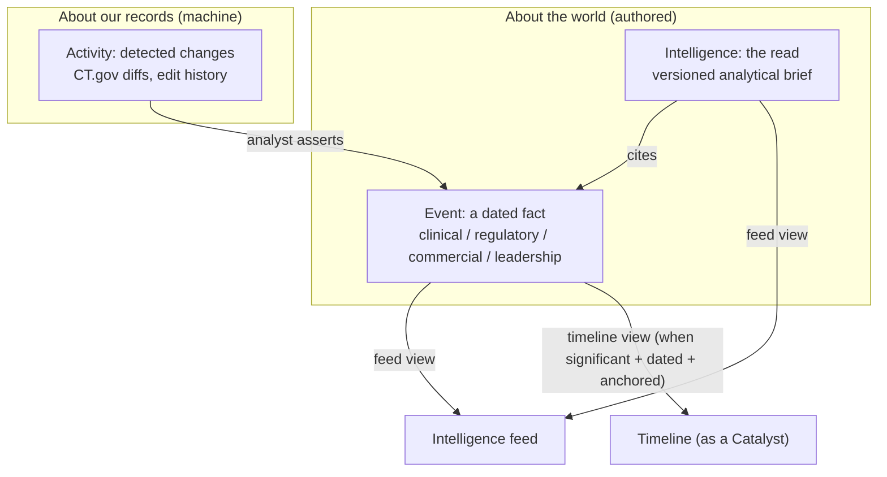
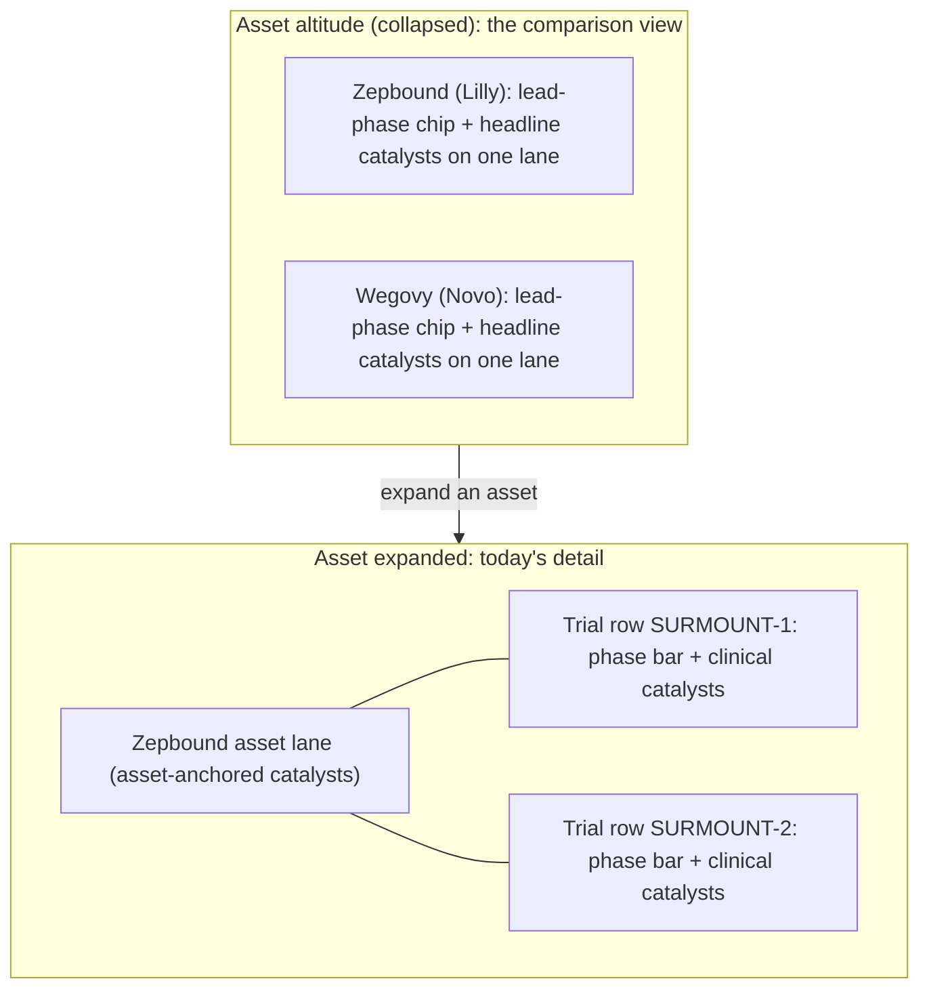

# Unified Event Model and Altitude Timeline: Design

Date: 2026-06-28
Status: Approved (design); implementation plan pending
Related: marker system (`20260412130100_marker_system_redesign.sql`), events system
(`20260413120000_events_system.sql`), primary intelligence anchors
(`20260627130050_intelligence_anchors_schema.sql`), multilevel landscape
(`docs/superpowers/specs/2026-06-27-multilevel-intelligence-landscape-design.md`)

## Problem

The product has three concepts that should be two layers, and the boundaries
between them leak.

1. **Markers** are dated timeline glyphs attached to trials. They have a rich
   date model (point, range, fuzzy precision, ongoing) and a provenance
   (`projection`: actual / company / primary / stout). They derive the phase
   bars. They are clinical-flavored and can only attach to trials.

2. **Events** are an analyst-authored competitive-intelligence log (Leadership,
   Regulatory, Financial, Strategic, Clinical, **Commercial**) anchored to a
   company / asset / trial. They have a single exact date, no ranges, no
   precision. They never render on the timeline.

3. **Primary Intelligence** is the agency-authored analytical read (versioned
   markdown briefs).

Three concrete failures follow from this split:

- **Business facts cannot reach the timeline.** "Lilly shipped Zepbound to
  distributors, ~Q1 2024" is a Commercial *event* today. It is exactly the kind
  of fact an analyst wants on the timeline next to approval and launch, to read
  the gap ("approval to distribution took N months") and compare that gap across
  competitors. There is no path for it.

- **Events have no fuzzy dates.** A forward-looking, primary-sourced claim
  ("Lilly switches vials to pens for everyone, ~Q4 2026") cannot even be
  represented as an event, because events are exact-date only. Only markers carry
  the fuzzy/range model.

- **The vocabulary is overloaded and confuses users.** "Primary" means two
  unrelated things (`projection = primary` = a date came from a primary source,
  vs **Primary Intelligence** = the authored deliverable). "Feed" means two
  different streams (the Intelligence feed of briefs vs the Events/Activity feed
  of changes). Both feeds sit under one "Intelligence" sidebar group. Users
  (and we) trip on it constantly.

This is greenfield: there is no external commitment to the current table names,
routes, or labels, so we re-derive the model and vocabulary on merit.

## The core reframe: two layers and a change log

Stop modeling marker-vs-event as two things. They are the same layer split by
accident. The clean structure is two authored layers plus one machine layer:



- **Event** = something that happened in the *world* (Lilly shipped to
  distributors; FDA approved; a CEO resigned). Confirmed or projected. This is
  the merge of today's `events` and `markers`.
- **Intelligence** = the authored *read* on entities. Cites events. ("Primary"
  drops from the name; it survives only as event provenance.)
- **Activity** = a change in our *records* about the world (CT.gov moved a date;
  an event was edited). Machine-detected, high-volume, low-signal. A detected
  change can be *promoted* by an analyst into an Event.

## Vocabulary (locked)

| Term | Meaning |
| --- | --- |
| **Intelligence** (a *brief* / *entry*) | The authored analytical read. |
| **Event** | A dated fact about an entity. The merge of today's events + markers. |
| **Catalyst** | An Event currently rendered on a timeline. A runtime lens, **not** a stored type. ("Catalyst event" split into noun + role.) |
| **Marker** | The glyph that draws a catalyst (shape + fill + color + inner mark). Pure rendering. |
| **Activity** | System-detected record changes (CT.gov diffs, edit history). |

Why **Event** over the alternatives: "Signal" is intrinsically wrong (it
connotes an inferred indicator; a confirmed approval is a fact, not a signal).
"Development" collides with *drug development* (the R&D process, `development_status`)
in this domain. "Event" is the accurate, terse, industry-standard word (Bloomberg,
Citeline, Evaluate) and maps onto how analysts already speak ("catalyst event"),
making the Event -> Catalyst -> Marker trio self-explaining.

## The Event entity

One table, merging the marker date model with the event anchoring model:

```
event
  id, space_id
  type_id            -> event_types (category + default significance + marker visual)
  title, description, source_url
  event_date, date_precision, end_date, end_date_precision, is_ongoing   (marker date model)
  projection         actual | company | primary | stout                  (provenance)
  significance       null = inherit from type, or an explicit override
  anchor_type        space | company | asset | trial
  anchor_id
  visibility         null = use default | pinned | hidden                 (manual override)
  no_longer_expected, metadata, source_doc_id
  created_by, created_at, updated_by, updated_at                          (audit, server-side)
```

Notes:

- **No `on_timeline` column.** Timeline membership is computed (see below).
- **`projection` keeps the value `primary`** ("primary source estimate"). The
  collision is resolved by renaming the *deliverable* to "Intelligence," so no
  projection rename is needed.
- **`event_types`** unifies today's `marker_types` and `event_categories` into one
  type system. Each type carries its category, a default significance, and (for
  timeline-eligible types) a marker visual. Clinical / Regulatory / Approval /
  LOE / Commercial milestone types default to high significance; Leadership /
  Financial / Strategic default to low.
- **Single anchor in v1** (matches today's events). Today's `marker_assignments`
  many-to-many is a deliberate v1 simplification; multi-placement returns via the
  placement table (see the seam) rather than as a property of the fact.

## Derived timeline membership (no stored flag)

The feed and the timeline are two queries over the same rows. Whether an event
renders on a given entity's timeline is a function, never a stored property:

```
showsOnTimeline(event, timelineEntity) =
      hasResolvableDate(event)                 // event_date exists; fuzzy is fine
  AND anchorResolvesTo(event, timelineEntity)  // direct match or roll-up
  AND effectiveVisibility(event)

effectiveVisibility(e) =
      e.visibility == 'pinned' ? true
    : e.visibility == 'hidden' ? false
    : defaultSignificance(e) >= ALTITUDE_THRESHOLD   // from type, gated by altitude
```

- **Intelligence feed** (space): every event, ordered by recency, any
  significance, interleaved with briefs.
- **Timeline** (entity E): events whose anchor resolves to E and that pass
  `effectiveVisibility`.

"Promote an event onto the timeline" is no longer a data migration; it is
setting `visibility = pinned`.

The **phase bar derivation is unchanged in spirit**: today it reads Trial Start /
Trial End / PCD markers off a trial; tomorrow it reads the clinical-type *events*
anchored to that trial. Same logic, different source table.

## Catalyst lens and significance

- **Catalyst** is the runtime answer to "does `showsOnTimeline` return true here?"
  It is not a column.
- **Marker** is the visual primitive chosen by the event's type.
- **Significance** is the gate between feed-only and catalyst. It comes from the
  event's type by default, with a per-row override.

| Event | Type / category | Default significance | Result |
| --- | --- | --- | --- |
| "Zepbound topline data, ~Q3 '25" | Topline Data / Clinical | high | Catalyst on the trial row |
| "Lilly ships Zepbound to distributors, ~Q1 '24" | Distribution / Commercial | high | Catalyst on the asset lane |
| "Lilly CEO comments on supply, Jan '24" | Leadership | low | Feed-only, no glyph |
| (analyst pins the CEO comment) | Leadership, `visibility = pinned` | overridden | Catalyst in that view |

A leadership change is simply a low-significance Event that never gets a glyph
unless someone pins it. No subtype, no separate table, no inescapable rule.

## The fact / placement seam (design now, build later)

Keep two concerns from fusing:

- **Fact** = *what happened* (title, date, provenance, type, the entity it is
  about).
- **Placement** = *where and how it is drawn* (which lane, what visual,
  pinned/hidden, and later which scenario).

**In v1**, placement is denormalized onto the event row (`anchor_*`,
`visibility`). We do **not** build a placement table, scenarios, or spans. But we
build v1 with two disciplines that cost almost nothing now and avoid a rewrite
later:

1. **One source of truth for the fact.** Anchor/visibility are *about* the fact,
   never a copy of it. An event is never duplicated to appear in two places.
2. **The renderer asks "give me the placements for entity E in view V,"** through
   a resolver, not by hard-joining events to a row. In v1 that resolver just reads
   the inline `anchor_*` / `visibility` off the event and returns
   `{event, lane, visual, projection}`.

**Later (phase 2/3)** an `event_placements` table
`(event_id, lane_ref, visual, projection, scenario_id)` is introduced and the
resolver reads it instead. Fact rows never change. This unlocks:

- **Duration comparison (B):** a span is "from placement P1 to placement P2,"
  comparable across assets and scenarios.
- **Scenario overlays / templates (C):** the same fact placed on another asset's
  lane with a shifted date; a template is a reusable set of typed placements with
  relative offsets stamped onto any asset.

## Timeline altitude and lanes (the anchoring solution)

### Why a lane is required

The existing multilevel-intelligence principle ("intelligence renders on the
visual element that represents its entity; where a view has no element for that
entity, it does not render") works for *timeless* intelligence marks, which can
live in a left-rail label cell. It breaks for **dated events**, which need an
x-axis position. A left-rail cell has no horizontal axis, so it cannot host a
dated glyph. Therefore: to put asset/company events on the timeline, those
entities need a horizontal **track** of their own. Today the grid gives a track
only to trials (36px rows, single lane, phase bar at y=8, markers at y=4-22).

### The altitude model

Rows can render at trial, asset, or (later) company altitude. The same `events`
table and resolver feed all altitudes; **altitude is just a significance
threshold plus anchor roll-up**, which is what makes this tractable rather than a
phase-aggregation rewrite.



- **Trial altitude** is today's view and stays the **default**.
- **Asset altitude (collapsed)** is the comparison view: each asset is one row,
  a lead-phase chip plus its headline catalysts (asset-anchored events always;
  child-trial events only above the altitude threshold), rows stacked so gaps
  read at a glance.
- **Expanded asset** = the asset lane (asset-anchored catalysts) above its nested
  trial rows (today's view, full significance).
- **No aggregate phase bar** at asset altitude. Aggregating concurrent trials at
  different phases into one bar is lossy and discards the indication dimension, so
  we show a compact lead-phase chip and put phase detail one expand away.

## v1 scope

**In scope:**

- The Event entity: merge `events` + `markers`, marker date model, provenance,
  significance, pin/hide.
- Derived timeline membership through the placement resolver indirection.
- Terminology / IA cleanup: **Primary Intelligence -> Intelligence**; the
  **Events page -> Activity** (detected changes); a single **Intelligence feed**
  carrying briefs + events.
- **Asset rows with a collapse toggle and altitude-driven significance**: the
  collapse/comparison view, reached directly in v1.
- **Updating the data-producing paths that write markers/events today**, so they
  emit the unified Event model: the **`/seed-demo`** seed/demo data, and the **AI
  import / extraction** pipeline (`commit_source_import` and the extract worker)
  which currently creates markers and events separately.
- **Migrating the existing test suites** (unit / integration / e2e) that
  reference markers, `marker_assignments`, `marker_types`, the `events` table,
  `primary_intelligence`, the affected RPCs, or the renamed routes/labels, so the
  full suite and the drift gates stay green. This is in scope, not cleanup.
- **Updating user-facing reference material**: the in-app help pages, the runbook
  feature docs, and a single authoritative nomenclature/glossary, to the Event /
  Catalyst / Marker / Intelligence / Activity model.
- **Updating the internal demo deck** `src/client/public/internal/stout-intro.html`
  (copy + screenshots) for next week's demo.

**Deferred (behind the seam):**

- Time-normalized overlay (aligning assets at "approval = t0") and first-class
  span objects. v1 comparison is "collapse to asset altitude and read the gaps in
  stacked rows," not a normalized overlay.
- Scenario templates / overlays (C).
- Company altitude (phase 3; same mechanism one level up).

## Locked decisions

1. **Default altitude = trial.** Asset altitude is a toggle / "collapse all." The
   comparison view is one click from today's view.
2. **Collapsed asset phase representation = lead-phase chip + catalysts.** No
   aggregate phase bar. Phase detail lives one expand away on the trial rows.
3. **Roll-up onto a collapsed asset row** = asset-anchored events always; child
   trial events only above the altitude significance threshold. Full detail on
   expand.

## Surfaces after the change

| Surface | Shows |
| --- | --- |
| **Intelligence feed** (`/intelligence`) | Briefs + events, recency-ordered, filterable. The one curated stream. |
| **Timeline** | Catalysts (trial-anchored on trial rows; asset-anchored on asset lanes), phase bars derived from clinical events. Altitude toggle. |
| **Activity** (renamed from Events page) | Detected record changes (CT.gov diffs, event edit history). High-volume, low-signal. |
| **Profile pages** | Per-entity events + the entity's intelligence; trial pages keep an Activity (detected changes) card. |

## Testing and verification

Because this replaces a load-bearing part of the system late in the cycle,
testing is a first-class deliverable, not a trailing phase. Two rules:

1. Tests are paired with each behavior-bearing task, written with (ideally
   before) the implementation. There is no separate "tests" phase at the end.
2. The build is not "done" until the acceptance matrix below is green at all
   three layers, the **full pre-existing suite and the drift gates are also
   green** (the merge/rename will break many existing specs; migrating them is in
   scope), and the timeline surfaces are visually confirmed with screenshots.

### Three layers

- **Unit (Vitest, `npm run test:units`):** the pure logic. `showsOnTimeline`,
  `effectiveVisibility`, significance defaulting + override, altitude threshold
  gating, anchor roll-up, phase-bar derivation from clinical events,
  fuzzy-date / range rendering math, the placement resolver (inline v1).
- **Integration (local Supabase, service-role):** the `events` table +
  `event_types`, the backfill from markers + events, event create / edit RPCs,
  RLS / grants, the Activity wiring (event change goes to Activity, not the
  Intelligence feed), and the feed RPCs (Intelligence feed = briefs + events).
- **E2E + visual (Playwright + Chrome MCP against cloud dev, `dev.clintapp.com`):**
  each surface rendered and screenshotted on the deployed dev environment. Unit
  and integration stay local / CI; only the visual-confirmation layer targets dev.

### Acceptance matrix (behaviors to prove)

| # | Scenario | Expected | Layers |
| --- | --- | --- | --- |
| 1 | Clinical event (Topline Data) anchored to a trial | Catalyst glyph on the trial row; also in the Intelligence feed | unit + e2e |
| 2 | High-significance commercial event (Distribution) anchored to an asset | Catalyst on the asset lane; in the feed | e2e |
| 3 | Low-significance leadership event anchored to a company | Feed only, no glyph; after pin, glyph on the company band | unit + e2e |
| 4 | Fuzzy projected event (~Q4 2026), `projection = primary` | Period label + projected styling on the timeline | unit + e2e |
| 5 | An event is edited | Change appears in Activity; does NOT appear in the Intelligence feed | integration + e2e |
| 6 | An Intelligence brief that cites an event | Brief in the Intelligence feed; citation resolves | integration + e2e |
| 7 | Trial altitude (default) | Trial rows + phase bars render exactly as today (regression) | e2e |
| 8 | Asset altitude (collapsed) | Asset row shows lead-phase chip + headline catalysts; sub-threshold child events are hidden | unit (roll-up) + e2e |
| 9 | Asset expanded | Asset lane + nested trial rows at full significance | e2e |
| 10 | Comparison view | Two asset rows stacked; approval-to-distribution gap is visible | e2e (visual) |
| 11 | Phase-bar derivation post-merge | Bar derives from clinical events (regression) | unit + integration |
| 12 | `visibility = hidden` on a high-significance event | Not a catalyst on any altitude | unit |

(If company altitude is pulled into v1, add: company altitude renders company
rows with company-anchored catalysts.)

### Fixture

A deterministic seed (an "Events model QA" space) carrying every matrix
scenario: a trial with clinical events; an asset with an approval and a
high-significance commercial (distribution) event; a company with a
low-significance leadership event; a fuzzy-dated projected event; an Intelligence
brief citing an event; and a second company / asset so the comparison view has
two stacked rows. The same fixture seeds local (for unit/integration) and a dev
QA space (for visual confirmation), so screenshots are stable across runs.

### Visual confirmation artifact

Deploy to cloud dev, then drive `dev.clintapp.com` with Chrome MCP / Playwright,
capture a screenshot per scenario at each altitude (trial / asset collapsed /
asset expanded / comparison stack), and produce a verification report
(screenshots + pass/fail per matrix row) for review when you return.

### Known harness constraints (designed around)

- Pre-push e2e is flaky on cold start; CI is canonical. Verify the real suites,
  push with `--no-verify` if the hook flakes.
- The local Supabase DB is shared across worktrees; apply schema via `db reset`
  and run integration specs in isolation so a parallel reset cannot wipe
  functions mid-run.
- Cloud-dev visual confirmation must clear Cloudflare Turnstile and use an
  authenticated session: chrome-channel + automation-flag fingerprint, plus a
  persistent profile logged into dev once. Google OAuth cannot be automated and
  +aliases are rejected, so a pre-authenticated dev profile is a prerequisite for
  the unattended run.

## Blast radius (the execution checklist)

Every path that writes or reads markers/events today has to move to the Event
model. This inventory is the checklist for the unattended build; nothing here is
optional for v1.

**Producers (write markers/events):**

- `create_marker` and analyst manual creation -> a unified Event create RPC.
- CT.gov sync (`_seed_ctgov_markers`, `_sync_ctgov_trial`) -> emit clinical Events.
- **AI import / extraction**: `commit_source_import` and the extract worker, which
  today create markers and events on separate paths, collapse onto the Event
  create path (per the shared-RPC rule, no inline inserts).
- **`/seed-demo` and `supabase/seed.sql`**: demo/seed data must produce Events
  spanning the new surfaces (clinical + commercial + leadership + a brief).

**Consumers (read markers/events):**

- Timeline: dashboard grid, phase-bar, marker component, altitude rendering.
- Catalyst model + catalyst detail.
- Activity: `get_activity_feed`, the what-changed widget, the trial Activity card.
- Intelligence feed + `primary_intelligence_links` (a marker is a link target today).
- Landscape views (bullseye, heatmap) that read phase from markers.
- Engagement-landing widgets (hero catalyst band, next 90 days).
- Export (PNG / pptx) of the timeline.

**Change log:** `marker_changes` -> the Event change log; the analyst-source rows
of `trial_change_events` keep flowing to Activity.

**Drift gates:** `features:check` (map new/renamed RPCs to capabilities),
`migrations:check-redefs`, `grants:check` (new tables start dark; add matrix rows
+ in-migration grants), the Supabase advisors, and `npm run docs:arch` to
regenerate the runbook auto-gen blocks.

**Docs and demo (in scope):**

- **In-app help pages** (`src/client/src/app/features/help/`): markers-help,
  phases-help, and any FAQ describing markers / events / primary intelligence move
  to the new vocabulary. Extend the `runbook-review-guard` `helpRules` map for any
  new page.
- **Runbook** (`docs/runbook/features/`): the markers, events, and primary
  intelligence feature docs, plus a single authoritative **glossary** defining
  Event / Catalyst / Marker / Intelligence / Activity and their relationships, so
  the definitions have one home and the help pages and deck can point at it.
- **Internal demo deck** (`src/client/public/internal/stout-intro.html`): update
  copy to the new vocabulary and refresh screenshots. Edit the deployed copy in
  `src/client/public/internal/` directly (no `docs/notes` duplicate). Caveat:
  because the feature is verified on cloud dev (not prod), deck screenshots of the
  new timeline / altitude come from dev, so the deck previews functionality not
  yet in prod for next week's demo.

## Data migration and sequencing

This v1 is three large efforts: a data-model merge (events + markers -> events),
a terminology / IA overhaul, and a timeline altitude rewrite. This design
describes the **end state**. The implementation plan must **sequence** it so it
lands safely rather than as one big-bang migration. A likely ordering:

1. Introduce the unified `events` table and `event_types`; backfill from
   `markers` + `events`; keep phase-bar derivation reading the new table.
2. Repoint the resolver and timeline rendering at the new table (trial altitude
   unchanged), with the membership function replacing `marker_assignments`.
3. Terminology / IA: rename Primary Intelligence -> Intelligence, Events page ->
   Activity, merge the Intelligence feed.
4. Asset lanes, collapse toggle, altitude-gated significance.

## Risks and mitigations

- **Big-bang migration risk.** Mitigated by the sequencing above and by keeping
  phase-bar derivation behavior identical through the cutover.
- **Roll-up density at asset altitude.** Mitigated by significance gating (only
  headline catalysts collapse upward) and expand-for-detail.
- **Loss of marker many-to-many.** Single anchor in v1 is a conscious
  simplification; multi-placement returns via the placement table, not as a fact
  property.
- **Lossy asset phase representation.** Accepted: lead-phase chip, not a bar;
  detail one expand away.

## Open questions for the implementation plan

- The exact `event_types` taxonomy: the merged set, each type's default
  significance, and the marker visual for each timeline-eligible type (including
  new commercial glyphs such as Distribution).
- The numeric / enum significance scale and the altitude threshold values.
- Collapse-state persistence (per user? per space? not persisted?).
- Asset-row sort order in the comparison view (lead phase? earliest approval?).
- Reshaping of the affected RPCs (`get_events_page_data`, `get_activity_feed`,
  `list_primary_intelligence`, `create_marker` / event creation) and their RLS /
  grants.
- Audit / change-feed wiring for the unified `events` table (the `event_changes`
  successor to `marker_changes`, and how analyst-asserted events vs detected
  changes stay distinct in Activity).

## Goals traceability

| Goal | Served by |
| --- | --- |
| **A, business facts on the timeline** | Event entity + asset lane; "shipped to distributors" renders as a commercial catalyst on the asset lane. |
| **B, measure / compare durations** | v1: asset-altitude collapse view, gaps read in stacked rows. Later: span objects on placements for normalized overlay. |
| **C, scenario templates / overlays** | Later: the placement table the v1 seam is designed for; same fact placed on other lanes with shifted dates. |
