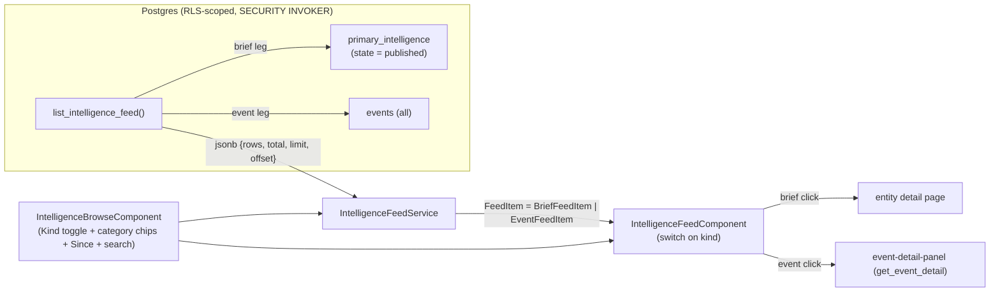

# Unified Intelligence Feed (briefs + events): Design

Date: 2026-06-29
Status: Approved (design); implementation in progress
Related:
- `docs/superpowers/specs/2026-06-28-unified-events-timeline-design.md` (parent design;
  the "Surfaces after the change" table and locked decision "Intelligence feed: briefs +
  events interleaved by recency with type filter chips")
- Event model: `20260628071042_events_table.sql`, `20260628071012_event_types.sql`,
  `20260628070943_event_type_categories.sql`
- Intelligence feed: `20260627130600_intelligence_feed_and_landscape_multi.sql`
  (`list_primary_intelligence`)
- `20260629020000_drop_dead_event_feed_fns.sql` ("the event-links / threads feature
  returns rebuilt in Stage 3")

## Problem

`/intelligence` is the product's one curated stream, but today it shows **briefs only**
(`list_primary_intelligence`, subtitle "All published intelligence in this space,
recency-ordered"). Events live on the timeline and the read-only `/activity` log. The
parent design locked `/intelligence` as "briefs + events interleaved by recency, any
significance" -- the one stream that is **not** significance-gated (unlike the timeline,
which gates on `effectiveVisibility` = pinned OR significance high). This spec builds that
merge.

This is a read-surface feature: a merged recency query over published briefs and all
events, plus the page wiring to render and filter both kinds. No schema change to
`primary_intelligence` or `events`; no change to how either is written.

## Vocabulary (inherited, locked)

Per the project terminology model and the parent design:

- **Intelligence** -- the authored analytical read (a versioned *brief*; count unit "entry").
- **Event** -- a dated fact about an entity (the merged marker+event model).
- The `/intelligence` page is the **Intelligence feed**.
- The landscape strip elsewhere is "At a glance" (not in scope here).
- "Analysis" / "read" (verb) are retired.

The merged feed's two row kinds are **brief** and **event** (the `kind` discriminator).

## "What's the latest": the ordering decision

The feed is recency-descending -- "what's the latest." The two kinds carry different dates,
so the spec pins the sort key explicitly:

| Kind | Sort key (`feed_ts`) | Why |
| --- | --- | --- |
| brief | `updated_at` | Editorial recency: a publish/republish is when the entry entered or changed the stream. Matches today's feed. |
| event | `created_at` | When the analyst **logged** the fact. This is when it entered the stream. |

**`event_date` is displayed on the event row but is never the sort key.** Two failures this
avoids:

- A forward-looking projection ("~Q4 2026", `projection = primary`) has a future
  `event_date`. Sorting by `event_date` would pin it to the very top of "what's the latest"
  though nothing new happened. Sorting by `created_at` places it where it was logged.
- A historical fact logged today ("2019 approval") would sink to the bottom under an
  `event_date` sort, though it is the newest thing we recorded.

Event **edits** do not re-bubble the row: the feed sorts events by `created_at`, not
`updated_at`. This honors the parent design's rule that an event edit surfaces in
**Activity**, not the Intelligence feed. (Briefs, by contrast, *do* re-bubble on
republish, because a republished brief is genuinely new editorial content and there is no
"Activity" entry for it.)

The merged sort key is therefore `feed_ts desc` where `feed_ts` is `updated_at` for briefs
and `created_at` for events. The sibling **Future Events** page keeps its distinct job:
events only, **future `event_date` ascending** ("what's coming, soonest first").

## No significance gating

The feed shows **every** event in the space regardless of significance or visibility -- a
low-significance leadership event and a hidden (`visibility = 'hidden'`) high-significance
event both appear. Gating is a timeline concept (`effectiveVisibility`), not a feed concept.
This is the defining difference from the timeline and is asserted directly in the
integration tests.

## Curated stream: exclude auto-derived CT.gov markers

The one exception to "every event" is provenance, not significance. CT.gov sync emits
structural clinical date markers (Trial Start / Primary Completion / Trial End,
`metadata.source = 'ctgov'`) that drive the phase bars and number in the hundreds per
space. They are not analyst-curated intelligence and would flood the feed. The event leg
excludes them by provenance (`coalesce(metadata->>'source','') <> 'ctgov'`), keeping
analyst-authored events (`source = 'analyst'` or null). The CT.gov markers still live on
the **Timeline** (phase derivation) and the **Activity** log (detected changes).

## Default Kind = Intelligence

The page lands on the **Intelligence** kind (briefs only) so the curated analytical read is
first; **All** (interleaved briefs + events) and **Events** are one click away on the Kind
toggle. This keeps the default surface the high-signal one while the merged stream stays
available on demand.

## Architecture



### 1. Data layer -- `list_intelligence_feed` RPC

A new function (no existing function is redefined; no function-ownership conflict on the
coordination board).

```sql
list_intelligence_feed(
  p_space_id   uuid,
  p_kinds      text[]      default null,  -- subset of {'brief','event'}; null = both
  p_categories text[]      default null,  -- event category NAMES; null = all; event leg only
  p_since      timestamptz default null,  -- on feed_ts
  p_query      text        default null,  -- brief headline/summary OR event title/description
  p_limit      int         default 25,
  p_offset     int         default 0
) returns jsonb
language plpgsql stable security invoker set search_path = ''
```

- **SECURITY INVOKER + RLS** (mirrors `list_primary_intelligence`): the `select` policies
  on `primary_intelligence` and `events` (`has_space_access(space_id)`) do the space
  scoping. No `has_space_access` call in the body, so the in-migration smoke is remote-safe
  (it reads as the migration role, RLS-bypassing, and never hits a `42501` access guard).
- Grant: `execute` to `authenticated`; revoke from `public`, `anon`.
- **Brief leg** -- the `list_primary_intelligence` base CTE (published rows joined to
  `primary_intelligence_anchors`), projected into the unified row with `kind='brief'`,
  `feed_ts = p.updated_at`. Honors `p_query` (headline/summary), `p_since`. Runs only when
  `p_kinds` is null or contains `'brief'`. Category filter does not apply to briefs.
- **Event leg** -- all `events` in the space, joined to `event_types` + `event_type_categories`
  (category name, glyph: `shape`/`color`/`inner_mark`/`fill_style`) and to
  `companies`/`products`/`trials` by `anchor_type` for the entity name + id. Projected with
  `kind='event'`, `feed_ts = e.created_at`. Honors `p_query` (title/description), `p_since`,
  `p_categories` (by `ec.name`). Runs only when `p_kinds` is null or contains `'event'`.
- `UNION ALL`, `order by feed_ts desc`, `limit`/`offset`. `total` = count over the union
  before paging. Output `{ rows, total, limit, offset }`, same envelope as
  `list_primary_intelligence`.

**Unified row shape (jsonb):**

Common: `kind` ('brief'|'event'), `id`, `space_id`, `feed_ts`, `title`, `entity_type`,
`entity_id`, `entity_name`.

Brief-only: `anchor_id`, `is_lead`, `summary_md`, `last_edited_by`, `contributors`,
`links`, `state`.

Event-only: `event_date`, `date_precision`, `end_date`, `end_date_precision`, `is_ongoing`,
`projection`, `is_projected`, `significance`, `category_name`, `marker_shape`,
`marker_color`, `marker_inner_mark`, `marker_fill_style`, `anchor_type`, `description`,
`no_longer_expected`, `registry_url`.

Filter composition (pinned to avoid ambiguity): the **Kind** dimension selects which legs
run; **category chips** filter the event leg only. With **Kind=All + a category selected**,
briefs still appear (they have no category) and the event subset is filtered. When
**Kind=Intelligence**, the category param is ignored and chips are hidden in the UI.

### 2. Client model + service

- `core/models/intelligence-feed-item.model.ts`: a discriminated union
  `FeedItem = BriefFeedItem | EventFeedItem` keyed on `kind`. `BriefFeedItem` carries the
  fields of today's `IntelligenceFeedRow`; `EventFeedItem` carries the event-only fields
  above. A `FeedResult = { rows: FeedItem[]; total; limit; offset }`. The jsonb cast is not
  runtime-checked, so the model field names match the RPC keys byte-for-byte (per the
  jsonb-cast-mismatch lesson) and a unit test guards the mapping.
- `core/services/intelligence-feed.service.ts`: `list(opts)` calls the RPC and returns
  `FeedResult`. Caching mirrors `PrimaryIntelligenceService` (tag
  `space:{id}:intelligence-feed`) so a publish/event-create can invalidate it.

### 3. Rendering -- `IntelligenceFeedComponent` switches on `kind`

The shared component (also used by the engagement landing's "Latest from Stout") takes
`FeedItem[]` and renders per kind:

- **brief** -- byte-identical to today (colored spine, entity chip, `updated_at` date,
  headline, 2-line summary clamp, agency byline, "Open intelligence ->"). Click -> entity
  link via `buildEntityRouterLink`. The landing keeps passing brief rows only, so its
  appearance is unchanged.
- **event** -- a new row layout sharing the same density and spine: the shared
  `MarkerIconComponent` glyph (from `marker_shape`/`color`/`inner_mark`/`fill_style`) + a
  category chip in place of the entity chip, the event title as the lead line, the
  `event_date` rendered with its precision label ("Q3 2025", "~Q4 2026") and projected
  styling when `projection <> 'actual'`, the anchored entity name as the quiet byline.
  Click -> opens the existing `event-detail-panel` over the feed (via `get_event_detail`).

Significance is **not** shown as a gate (everything is in the feed); it is not surfaced as a
row affordance in v1.

### 4. `/intelligence` page (`IntelligenceBrowseComponent`)

- Published path swaps `PrimaryIntelligenceService.list()` -> `IntelligenceFeedService.list()`.
- Toolbar gains a **Kind** segmented control (All / Intelligence / Events). When Events are
  in view (Kind = All or Events), a row of **event-category chips** appears (chip-buttons,
  multi-select, none = all -- the small-fixed-enum filter idiom). Keep **Since** + **search**.
  **Drop** the entity-type multiselect (category is the more useful axis for a mixed stream;
  entity navigation is still one click away on each row).
- The existing **Status** (Published / Drafts) selectbutton stays. Drafts is briefs-only
  (events have no draft state), so selecting Drafts hides the Kind toggle + chips and keeps
  today's `listDraftsForSpace` path.
- Total label: "N entries" (the merged unit; "entry" remains the count unit).
- Empty states per `src/client/CLAUDE.md` §13: kind-aware copy
  (All / Intelligence-only / Events-only), role-appropriate (no author CTA for viewers).
- Event detail panel mounted on the page; opened from an event-row click, closed on dismiss.
- `since=Nd` deep-link behavior preserved.

The landing "Latest from Stout" surface is **untouched** (briefs only).

## Related capabilities

Run `npm run features:near -- --tables events,primary_intelligence --rpcs
list_intelligence_feed,list_primary_intelligence,get_event_detail` during implementation
and reference hits. Known adjacencies: `get_events_page_data` (Activity feed; different
job -- detected changes), `future-events` page (events, future-ascending), the timeline
read RPCs (`get_dashboard_data`) which gate on significance.

## Testing (paired per task; three layers)

- **Unit (Vitest, `npm run test:units`):** the jsonb -> `FeedItem` union mapping (both
  kinds); `event_date` precision-label formatting; `IntelligenceFeedComponent` renders the
  correct row per `kind` and routes brief vs event clicks correctly;
  `IntelligenceFeedService` passes params through.
- **Integration (local Supabase, service-role):** `list_intelligence_feed` --
  (a) a brief and an event with known timestamps interleave in `feed_ts desc` order;
  (b) a low-significance leadership event AND a `visibility='hidden'` event both appear
  (no gating); (c) `p_kinds` filters legs; (d) `p_categories` filters the event leg only and
  leaves briefs; (e) `p_since` and `p_query` across both kinds; (f) pagination + `total`;
  (g) RLS: a viewer reads, a non-member gets nothing, cross-space isolation; (h) the
  `authenticated` grant exists and `anon` does not.
- **E2E + visual (Playwright + Chrome MCP vs `dev.clintapp.com`):** `/intelligence` renders
  both kinds interleaved; Kind toggle + category chips filter; an event-row click opens the
  detail panel; the landing is unchanged. Visual layer targets dev per the parent design.

## Drift gates and docs

- `features:check`: map `list_intelligence_feed` to an Intelligence capability in the
  feature manifest (a new RPC that is unmapped is an ERROR).
- `grants:check`: RPC-only change; no new table, so no grant-matrix row -- but confirm the
  `authenticated` execute grant is present and `anon` is absent.
- `migrations:check-redefs`: new function, no redefinition of an owned function.
- Supabase advisors (`supabase db advisors --local --type all`) clean.
- `npm run docs:arch` to regenerate runbook auto-gen blocks (new RPC -> RPC matrix).
- Runbook: update the intelligence-feature doc + the surfaces table to "briefs + events,
  recency-descending, not significance-gated"; touch the glossary's feed definition. No new
  help page (no new editorial color/role convention).

## Execution constraints (shared environment)

- **Branch:** `feat/unified-intelligence-feed` off `origin/develop` in a worktree
  (`.worktrees/unified-intelligence-feed`); node_modules symlinked from the main checkout.
- **Shared local DB:** one Docker Postgres across worktrees. Serialize via the coordination
  inbox -- post `DB-TAKE` before any `db reset`/integration, `DB-RELEASE` after; if another
  session holds an open `DB-TAKE`, wait. (At spec time, `fix/event-edit-save-source-url`
  held the token through an integration run.)
- **Migration lane:** `20260629130000` is taken by an unmerged branch; this feature uses a
  later unused band (`20260629160000`).
- **Merge:** the coordinator is offline. When gate-green, post a `READY` block to the inbox
  AND ping the user to verify + merge; do not push to develop directly.
- **Pre-push e2e is flaky on cold start;** CI is canonical -- verify the real suites, push
  with `--no-verify` if the hook flakes.

## Out of scope (v1)

- Interleaving events into the landing "Latest from Stout" teaser (stays briefs-only).
- Surfacing significance as a feed-row affordance (everything is in the feed).
- Entity-type filtering on the merged feed (replaced by category chips + per-row navigation).
- Any change to event/brief write paths, the timeline, Activity, or Future Events.
- Per-view pinning, placement layer, scenario overlays (parent-design deferrals).
